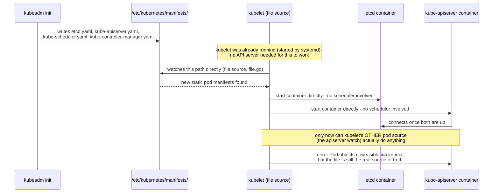
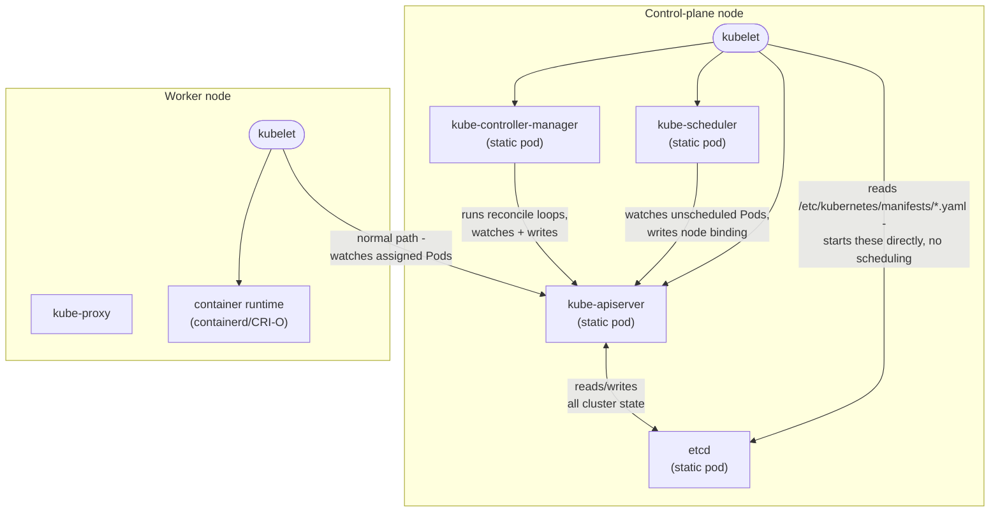

**TL;DR:** Why does a Kubernetes cluster need a "control plane" at all, and how does it even start if the thing that schedules Pods doesn't exist yet? Because something has to hold and reconcile the cluster's desired state — and it bootstraps through a kubelet mechanism called **static pods**, which starts the control plane's own components directly from local files, with no scheduler and no API server required to get them running.

**Real repo:** [`kubernetes/kubernetes`](https://github.com/kubernetes/kubernetes)

## 1. The Engineering Problem: someone has to hold desired state, and that someone has to start before anything else can

You could, in principle, `docker run` containers by hand across a dozen machines and call it a cluster. But nothing would be watching them: if a machine dies, nothing notices and nothing reschedules its workload elsewhere. If two people start the same port on the same machine, nothing prevented the conflict. There's no single answer anywhere to "what SHOULD be running right now, and is it actually running?"

Kubernetes' answer is to split a cluster into two kinds of machine: a **control plane**, which holds and continuously reconciles the cluster's desired state, and **worker nodes**, which just run whatever they're told to run. That immediately raises a bootstrapping problem, though: the control plane's own pieces — the API server everything else talks to, the scheduler that decides where Pods go, the datastore that holds cluster state — have to run *somewhere* too. If starting a container normally means "the scheduler picks a node and the API server records that decision," how does the very first control-plane container ever start, when the API server that would record that decision doesn't exist yet?

---

## 2. The Technical Solution: static pods — the kubelet starts them directly, with no scheduler or API server in the loop

A production Kubernetes cluster bootstrapped by `kubeadm` solves this by giving the four core control-plane components — **etcd** (the state store), **kube-apiserver** (the only thing anything else talks to), **kube-scheduler** (decides *where* a Pod goes), and **kube-controller-manager** (runs the reconcile loops) — each an ordinary Pod spec, then writing that spec as a YAML file directly onto the control-plane node's disk, at a well-known path (`/etc/kubernetes/manifests/` by default). The kubelet on that node has a second, completely separate way of learning about Pods to run, besides its normal API server watch: a **file source** that polls that exact directory and starts whatever Pod manifests it finds there — directly, with no scheduling decision and no API server round-trip.



Once etcd and kube-apiserver are up and healthy, the rest of the control plane (kube-scheduler, kube-controller-manager — also static pods) comes up the same way, and the cluster is finally able to do what everyone thinks of as "normal" Kubernetes: a Pod written through the API server, watched by the scheduler, bound to a node, and picked up by *that* node's kubelet through its other pod source.



Three things to hold onto:

1. **Static pods are not scheduled.** The kubelet starts them directly from local files — no scheduler decision, no API server write, ever, for the file to take effect. This is precisely how the control plane bootstraps itself: it sidesteps the chicken-and-egg problem where you'd otherwise need a running scheduler and API server to place the Pod that *is* the API server.
2. **The control plane isn't special infrastructure outside Kubernetes' own object model.** etcd, kube-apiserver, kube-scheduler, and kube-controller-manager are themselves just Pods — built from the exact same `v1.Pod`/`v1.Container` shape as anything a Deployment would template.
3. **Once the API server is up, every other Pod in the cluster — including on worker nodes — takes a totally different path** than the control plane's own components did: written to etcd through the API server, watched by the scheduler, bound to a node, and pulled by that node's kubelet through its API-server pod source, not its file source.

**Correcting a common assumption:** `kubeadm` is often assumed to be a separate tool from "real" Kubernetes. It isn't — it lives inside the main `kubernetes/kubernetes` repository, at `cmd/kubeadm/`, and its control-plane bootstrapping code calls the exact same static-pod utilities (`staticpodutil.ComponentPod`) that this lesson cites below.

---

## 3. The clean example (concept in isolation)

```yaml
# /etc/kubernetes/manifests/hello-static.yaml
apiVersion: v1
kind: Pod
metadata:
  name: hello-static
spec:
  containers:
  - name: hello
    image: nginx:1.27
    ports:
    - containerPort: 80

# Nothing about this YAML is special - it's an ordinary Pod spec, field for
# field identical to any Pod a Deployment would template.
#
# The ONLY thing that makes it a "static pod" is WHERE this file lives: the
# kubelet's configured staticPodPath (kubeadm sets this to
# /etc/kubernetes/manifests/ by default). Drop this file there and the
# kubelet starts it within seconds - no scheduler, no API server round-trip,
# no "kubectl apply" involved at all.
```

That's the entire mechanism in isolation: a Pod spec, and a directory. Production control planes use this exact trick to start themselves — the next section shows the real code that builds those Pod specs and the real code that watches that directory.

---

## 4. Production reality (from `kubernetes/kubernetes`)

```
kubernetes/kubernetes/
├── cmd/kubeadm/app/phases/
│   ├── controlplane/manifests.go   # builds kube-apiserver/scheduler/controller-manager as v1.Pod specs
│   └── etcd/local.go                # builds etcd's static pod spec the same way
└── pkg/kubelet/config/
    └── file.go                      # kubelet's file-based pod source - watches the manifest dir directly
```

```go
// cmd/kubeadm/app/phases/controlplane/manifests.go
func GetStaticPodSpecs(cfg *kubeadmapi.ClusterConfiguration, endpoint *kubeadmapi.APIEndpoint, proxyEnvs []kubeadmapi.EnvVar) map[string]v1.Pod {
	mounts := getHostPathVolumesForTheControlPlane(cfg)
	// ... proxyEnvs/health-check-timeout setup elided ...

	staticPodSpecs := map[string]v1.Pod{
		kubeadmconstants.KubeAPIServer: staticpodutil.ComponentPod(v1.Container{
			Name:            kubeadmconstants.KubeAPIServer,
			Image:           images.GetKubernetesImage(kubeadmconstants.KubeAPIServer, cfg),
			ImagePullPolicy: v1.PullIfNotPresent,
			Command:         getAPIServerCommand(cfg, endpoint),
			VolumeMounts:    staticpodutil.VolumeMountMapToSlice(mounts.GetVolumeMounts(kubeadmconstants.KubeAPIServer)),
			LivenessProbe:   staticpodutil.LivenessProbe(staticpodutil.GetAPIServerProbeAddress(endpoint), "/livez", kubeadmconstants.ProbePort, v1.URISchemeHTTPS),
			ReadinessProbe:  staticpodutil.ReadinessProbe(staticpodutil.GetAPIServerProbeAddress(endpoint), "/readyz", kubeadmconstants.ProbePort, v1.URISchemeHTTPS),
			Resources:       staticpodutil.ComponentResources("250m"),
			// ... StartupProbe, Env, Ports elided - same shape as any container spec ...
		}, mounts.GetVolumes(kubeadmconstants.KubeAPIServer),
			map[string]string{kubeadmconstants.KubeAPIServerAdvertiseAddressEndpointAnnotationKey: endpoint.String()}),
		// ... kube-controller-manager and kube-scheduler entries elided - identical shape ...
	}
	return staticPodSpecs
}
```

```go
// pkg/kubelet/config/file.go
type sourceFile struct {
	path           string
	nodeName       types.NodeName
	period         time.Duration
	store          cache.Store
	updates        chan<- sourceUpdate
}

// NewSourceFile watches a config file/directory for changes.
func NewSourceFile(logger klog.Logger, path string, nodeName types.NodeName, period time.Duration, updates chan<- sourceUpdate) {
	path = strings.TrimRight(path, string(os.PathSeparator))
	config := newSourceFile(path, nodeName, period, updates)
	logger.V(1).Info("Watching path", "path", path)
	config.run(logger)
}

func newSourceFile(path string, nodeName types.NodeName, period time.Duration, updates chan<- sourceUpdate) *sourceFile {
	send := func(objs []interface{}) {
		var pods []*v1.Pod
		for _, o := range objs {
			pods = append(pods, o.(*v1.Pod))
		}
		updates <- sourceUpdate{Pods: pods}   // fed straight into kubelet's pod list - no API server involved
	}
	store := cache.NewUndeltaStore(send, cache.MetaNamespaceKeyFunc)
	return &sourceFile{path: path, nodeName: nodeName, period: period, store: store, updates: updates}
}
```

**What this teaches that a hello-world can't:**

- **Even the control plane is bootstrapped through the same Pod primitive the rest of the cluster uses.** `ComponentPod` builds an ordinary `v1.Pod`/`v1.Container` with a `Command`, health probes, and resource requests — the exact same fields any Deployment's Pod template has. There's no separately-privileged "system pod" YAML dialect hiding underneath `kubectl get pods -n kube-system`.
- **`sourceFile` feeds Pod objects straight into a Go channel (`updates chan<- sourceUpdate`), bypassing the informer/watch machinery that talks to the API server entirely.** This is a structurally different code path from how every other Pod reaches a kubelet — not a special case bolted onto the normal one, a genuinely separate "pod source" the kubelet was built to support.
- **The map key in `GetStaticPodSpecs` (`kubeadmconstants.KubeAPIServer`, etc.) is the same constant later used to name the manifest file on disk** (`GetStaticPodFilepath` joins it with `.yaml`) — which is exactly why the mirror Pod object you eventually see via `kubectl get pods -n kube-system` is named `kube-apiserver-<node-name>`: the file name and the Pod's identity trace back to one shared constant, not two independently-chosen names that happen to match.

**When reviewing a control-plane issue, check:**

1. **`/etc/kubernetes/manifests/` on the affected node** — that file is the real source of truth for a static pod's definition, not `kubectl edit`, which only shows you a read-only mirror.
2. **Which kubelet pod source you're actually reasoning about** (file vs. API server) before assuming normal scheduling, eviction, or `kubectl delete` semantics apply to a control-plane component.
3. **etcd's health first.** kube-apiserver depends on it — a perfectly healthy-looking `kube-apiserver.yaml` file doesn't mean a healthy API server if etcd's static pod is down.
4. **The "mirror Pod" you see in `kubectl get pods -n kube-system`** for a static pod is read-only via the API — editing or deleting it there doesn't touch the real static pod definition on disk, and the kubelet will just recreate it.

---

## FAQ

### What is a "static pod" in Kubernetes?
A Pod whose definition comes from a file on a specific node's disk (or a URL) rather than from the API server. The kubelet on that node watches the configured path directly and starts/stops containers to match, completely independent of the scheduler or any API server write.

### Why can't the control plane just be scheduled like a normal Pod?
Scheduling a Pod normally requires a running API server (to record the decision) and a running scheduler (to make it). The control plane's own components — including the API server itself — can't depend on a working control plane to start, so kubeadm uses static pods specifically to break that circular dependency.

### What is a "mirror pod," and why doesn't `kubectl edit` actually change it?
Once the API server is up, the kubelet registers a read-only "mirror" of each static pod it's running so tools like `kubectl get pods` can see it. Editing or deleting that mirror through the API doesn't change the real definition — the kubelet just recreates the mirror from the file again, because the file (not etcd) is the source of truth for that Pod.

### Where does the cluster's actual state live?
In etcd, and only etcd — the API server is a validating, authenticating front door onto it, not a separate store. Every other control-plane component (scheduler, controller-manager) reaches cluster state exclusively by talking to the API server, never by touching etcd directly.

### What happens if etcd's static pod goes down?
The API server loses its backing store and starts failing reads/writes, which cascades to the scheduler and controller-manager (both of which depend on the API server) — even though their own static pod files never changed. A single unhealthy etcd static pod can make the whole control plane appear broken.

---

## Source

- **Concept:** Kubernetes control plane architecture & the static pod bootstrap mechanism
- **Domain:** kubernetes
- **Repo:** [kubernetes/kubernetes](https://github.com/kubernetes/kubernetes) → [`cmd/kubeadm/app/phases/controlplane/manifests.go`](https://github.com/kubernetes/kubernetes/blob/master/cmd/kubeadm/app/phases/controlplane/manifests.go), [`cmd/kubeadm/app/phases/etcd/local.go`](https://github.com/kubernetes/kubernetes/blob/master/cmd/kubeadm/app/phases/etcd/local.go), [`pkg/kubelet/config/file.go`](https://github.com/kubernetes/kubernetes/blob/master/pkg/kubelet/config/file.go) — Kubernetes' own source, the authoritative implementation of the concept itself.

---

**Next in the Kubernetes series:** [Kubernetes Pods: Why Kubernetes Schedules Pods, Not Bare Containers →]({{ '/kubernetes/pods-the-atomic-scheduling-unit/' | relative_url }})


