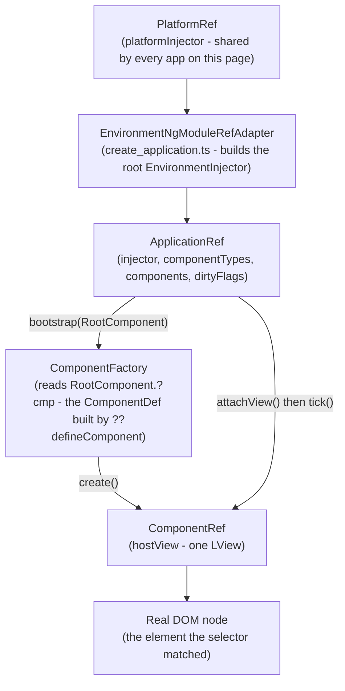
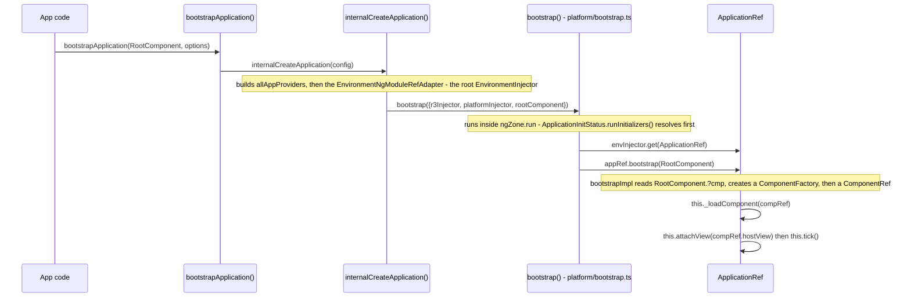
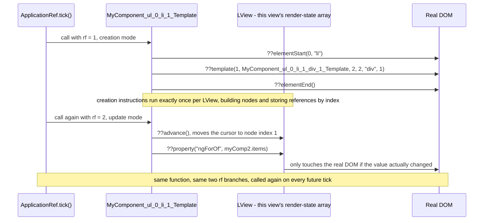



**TL;DR:** When you call `bootstrapApplication(AppComponent)`, what actually turns that one function call into a rendered page? Angular builds a root `EnvironmentInjector` and an `ApplicationRef` first  with no `NgModule` anywhere in the path  then calls `ApplicationRef.bootstrap()`, which creates the root component's view by invoking its Ivy-compiled template function: a plain JavaScript function full of `??elementStart`/`??advance`/`??property` instruction calls, not a virtual-DOM diff.

## 1. The Engineering Problem: a component class and a template string aren't runnable code

Before you call `bootstrapApplication`, all you actually have is a TypeScript class decorated with `@Component({selector, template})`  a description, not a running program. Two separate problems have to be solved before a single real DOM node exists on the page.

First: where do this component's dependencies come from? Something has to build an actual dependency-injection tree  a root injector holding app-wide providers  before any constructor asking for an injected service can run. In legacy Angular this root injector came from resolving an `NgModule` graph (`@NgModule({providers, bootstrap})`). Standalone components  the default for new code since Angular 14, and the only kind `bootstrapApplication` accepts  don't have a bootstrap `NgModule` to resolve at all. So the root injector has to get assembled a completely different way, directly from a flat `providers` array passed as an options object.

Second: how does the string `'<h1>{{ title }}</h1>'` ever become a real `createElement`/`setAttribute` call sequence? Angular can't re-parse and interpret that template string on every change-detection tick  that's slow, and a generic AST interpreter can't be tree-shaken the way a plain function call can. Ivy's answer, stable since Angular 9, is to compile each component's template into a real, ahead-of-time-generated JavaScript function at build time. But that only moves the question one level down: how does the framework actually invoke that generated function, when, and with what state backing it, so that re-running it on every tick doesn't just recreate the DOM from scratch?

**Correcting a common assumption:** a lot of "how Angular works" explanations still describe change detection as walking a virtual DOM tree and diffing it against the real one. Angular's Ivy-compiled template functions never build a virtual DOM at all  they call low-level instructions (`??elementStart`, `??property`, ) that read and write real DOM nodes directly, using a per-view array called an `LView` to remember which real node lives at which numeric slot.

---

## 2. The Technical Solution: a root injector built without an NgModule, then a two-pass instruction function per component

`bootstrapApplication(RootComponent, options)` (in `platform-browser`) hands off almost immediately to `internalCreateApplication()` (in `@angular/core`), which builds the root `EnvironmentInjector` directly from `options.providers` via an `EnvironmentNgModuleRefAdapter`  no `NgModule` class is ever instantiated or resolved. That injector is then handed to `bootstrap()`, which runs everything inside `NgZone.run()`, waits for `ApplicationInitStatus` to resolve any app initializers, pulls `ApplicationRef` out of the injector, and calls `appRef.bootstrap(RootComponent)`.



Zoomed into the actual call chain, here's what runs between the function call in your `main.ts` and the first paint:



`RootComponent.?cmp` is the payload the Ivy compiler generated for that class: a `ComponentDef` object built by calling `??defineComponent({decls, vars, consts, template, ...})`, assigned as a static property named `?cmp`  the `?` prefix is Angular's own convention (confirmed by the `@codeGenApi` tag on the function itself) for APIs that must be publicly emitted into your compiled output but aren't meant to be called by application code. `decls` and `vars` are plain numbers used to pre-size that component's `LView` array; `template` is the actual compiled function.

That template function has a signature every Ivy-compiled component shares: `function Template(rf, ctx)`, where `rf` (render flags) is a bitmask deciding which half of the function body runs.



Three things to hold onto:

1. **There is no NgModule anywhere in the standalone bootstrap path.** `internalCreateApplication()` builds the root `EnvironmentInjector` straight from a providers array via `EnvironmentNgModuleRefAdapter`  the `ModuleBootstrapConfig` branch inside `bootstrap()` still exists in the same file for the legacy `@NgModule`-based path, but the standalone path never touches it.
2. **`decls`/`vars`/`consts`/`template` on a `ComponentDef` aren't metadata for a runtime interpreter to read  `template` is a real, directly-callable JavaScript function**, and `decls`/`vars` exist purely to size the `LView` array before that function ever runs, not to describe the component for tooling.
3. **The exact same template function runs on every single change-detection pass for that view  it isn't regenerated or re-diffed.** `rf & 1` (creation) instructions run once per `LView`, ever; `rf & 2` (update) instructions run again every tick, and `??advance()` is what moves the binding cursor to the next node's slot so `??property()` knows which `LView` slot to compare against.

---

## 3. The clean example (concept in isolation)

```ts
// main.ts - the entire entry point for a standalone Angular app
import { Component } from '@angular/core';
import { bootstrapApplication } from '@angular/platform-browser';

@Component({
  selector: 'app-root',
  standalone: true,
  template: `<h1>{{ title }}</h1>`,
})
export class AppComponent {
  title = 'hello-ivy';
}

// bootstrapApplication() does NOT resolve an NgModule graph - it builds the
// root EnvironmentInjector directly from the `providers` array below, then
// walks straight to ApplicationRef.bootstrap(AppComponent). The Ivy compiler
// has already, at BUILD time, turned AppComponent's template string into a
// real function assigned to AppComponent.?cmp.template - nothing in this
// file re-parses '<h1>{{ title }}</h1>' at runtime.
bootstrapApplication(AppComponent, {
  providers: [],
}).catch((err) => console.error(err));

// If this rejects (a provider throws, a component fails an assertion),
// internalCreateApplication's try/catch turns it into a rejected Promise
// rather than a synchronous throw - the .catch() above is not optional
// decoration, it's the only place a bootstrap failure surfaces.
```

That's the entire concept in isolation: one class the Ivy compiler turns into a `ComponentDef`, and one function call that builds a root injector and mounts it. Production apps use this exact same two-step mechanism  the next section shows the real framework code that does it and the real compiler output it produces.

---

## 4. Production reality (from `angular/angular`)

```
angular/angular/
+-- packages/platform-browser/src/
   +-- browser.ts                      # bootstrapApplication() - the public entry point
+-- packages/core/src/
   +-- application/
      +-- create_application.ts       # internalCreateApplication() - builds the root EnvironmentInjector
      +-- application_ref.ts          # ApplicationRef - bootstrap(), tick(), _loadComponent()
   +-- platform/
      +-- bootstrap.ts                # bootstrap() - runs inside NgZone, resolves ApplicationInitStatus
   +-- render3/
       +-- definition.ts               # ??defineComponent() - builds the runtime ComponentDef
+-- packages/compiler-cli/test/compliance/test_cases/r3_view_compiler_template/
    +-- nested_template_context.ts      # real component source, compiled below
    +-- nested_template_context.js      # the compiler's real instruction-based output (golden test file)
```

### From `bootstrapApplication()` to a mounted root component

```ts
// packages/platform-browser/src/browser.ts
export async function bootstrapApplication(
  rootComponent: Type<unknown>,
  options?: ApplicationConfig,
  context?: BootstrapContext,
): Promise<ApplicationRef> {
  const config = {
    rootComponent,
    ...createProvidersConfig(options, context),
  };

  if ((typeof ngJitMode === 'undefined' || ngJitMode) && typeof fetch === 'function') {
    await resolveJitResources();
  }

  return internalCreateApplication(config);
}
```

```ts
// packages/core/src/application/create_application.ts
export function internalCreateApplication(config: {
  rootComponent?: Type<unknown>;
  appProviders?: Array<Provider | EnvironmentProviders>;
  platformProviders?: Provider[];
  platformRef?: PlatformRef;
}): Promise<ApplicationRef> {
  const {rootComponent, appProviders, platformProviders, platformRef} = config;
  profiler(ProfilerEvent.BootstrapApplicationStart);

  // ... server-mode platform guard elided ...

  try {
    const platformInjector =
      platformRef?.injector ?? createOrReusePlatformInjector(platformProviders as StaticProvider[]);

    if ((typeof ngDevMode === 'undefined' || ngDevMode) && rootComponent !== undefined) {
      assertStandaloneComponentType(rootComponent);
    }

    // Create root application injector based on a set of providers configured at the platform
    // bootstrap level as well as providers passed to the bootstrap call by a user.
    const allAppProviders = [
      provideZonelessChangeDetectionInternal(),
      errorHandlerEnvironmentInitializer,
      ...(ngDevMode ? [validAppIdInitializer] : []),
      ...(appProviders || []),
    ];
    const adapter = new EnvironmentNgModuleRefAdapter({
      providers: allAppProviders,
      parent: platformInjector as EnvironmentInjector,
      debugName: typeof ngDevMode === 'undefined' || ngDevMode ? 'Environment Injector' : '',
      // We skip environment initializers because we need to run them inside the NgZone, which
      // happens after we get the NgZone instance from the Injector.
      runEnvironmentInitializers: false,
    });

    return bootstrap({
      r3Injector: adapter.injector,
      platformInjector,
      rootComponent,
    });
  } catch (e) {
    return Promise.reject(e);
  } finally {
    profiler(ProfilerEvent.BootstrapApplicationEnd);
  }
}
```

```ts
// packages/core/src/platform/bootstrap.ts
export function bootstrap<M>(
  config: ModuleBootstrapConfig<M> | ApplicationBootstrapConfig,
): Promise<ApplicationRef> | Promise<NgModuleRef<M>> {
  const envInjector = isApplicationBootstrapConfig(config)
    ? config.r3Injector
    : config.moduleRef.injector;
  const ngZone = envInjector.get(NgZone);
  return ngZone.run(() => {
    if (isApplicationBootstrapConfig(config)) {
      config.r3Injector.resolveInjectorInitializers();
    } else {
      config.moduleRef.resolveInjectorInitializers();
    }
    const exceptionHandler = envInjector.get(INTERNAL_APPLICATION_ERROR_HANDLER);
    // ... zone/zoneless warning check, onError subscription, and
    // platform-destroy listener wiring elided ...

    return _callAndReportToErrorHandler(exceptionHandler, ngZone, () => {
      const pendingTasks = envInjector.get(PendingTasksInternal);
      const taskId = pendingTasks.add();
      const initStatus = envInjector.get(ApplicationInitStatus);
      initStatus.runInitializers();

      return initStatus.donePromise
        .then(() => {
          // ... LOCALE_ID, ENABLE_ROOT_COMPONENT_BOOTSTRAP, and image-performance
          // warning setup elided ...
          if (isApplicationBootstrapConfig(config)) {
            const appRef = envInjector.get(ApplicationRef);
            if (config.rootComponent !== undefined) {
              appRef.bootstrap(config.rootComponent);
            }
            return appRef;
          } else {
            moduleBootstrapImpl?.(config.moduleRef, config.allPlatformModules);
            return config.moduleRef;
          }
        })
        .finally(() => void pendingTasks.remove(taskId));
    });
  });
}
```

```ts
// packages/core/src/application/application_ref.ts
private bootstrapImpl<C>(
  component: Type<C>,
  hostElementOrOptions?: /* Element | string | { hostElement?, directives?, bindings? } */ any,
  injector: Injector = Injector.NULL,
): ComponentRef<C> {
  const ngZone = this._injector.get(NgZone);
  return ngZone.run(() => {
    // ... profiler event and ApplicationInitStatus.done guard elided ...

    const componentDef = getComponentDef(component)!;
    const ngModule = this._injector.get(NgModuleRef);
    const componentFactory = new ComponentFactory<C>(componentDef, ngModule);
    this.componentTypes.push(component);

    const {hostElement, directives, bindings} = normalizeBootstrapOptions(hostElementOrOptions);
    const selectorOrNode = hostElement || componentFactory.selector;
    const compRef = componentFactory.create(
      injector, [], selectorOrNode, ngModule.injector, directives, bindings,
    );
    // ... testability registration and onDestroy cleanup elided ...

    this._loadComponent(compRef);
    return compRef;
  });
}

private _loadComponent(componentRef: ComponentRef<any>): void {
  this.attachView(componentRef.hostView);
  try {
    this.tick();
  } catch (e) {
    this.internalErrorHandler(e);
  }
  this.components.push(componentRef);
  // ... APP_BOOTSTRAP_LISTENER invocation elided ...
}
```

**What this teaches that a hello-world can't:**

- **`getComponentDef(component)` is the actual read of `RootComponent.?cmp`.** Nothing in `bootstrapImpl` parses a decorator or reflects over the class at runtime  the compiler already did that work at build time, and `bootstrapImpl` just reads the static property it left behind.
- **`this.tick()` inside `_loadComponent()` is the very first change-detection pass  not a separate "initial render" code path.** A newly bootstrapped app's first paint and its 500th update both go through the exact same `tick()` ? `synchronize()` ? `synchronizeOnce()` loop in `application_ref.ts`; there's no special-cased "mount" render distinct from a later "update" render.
- **`bootstrap()` in `platform/bootstrap.ts` deliberately waits on `ApplicationInitStatus.donePromise` before ever calling `appRef.bootstrap()`.** Any `provideAppInitializer`/`APP_INITIALIZER` your app registers is guaranteed to have resolved before a single Ivy instruction for the root component runs.

### From `??defineComponent` to real DOM nodes

```ts
// packages/core/src/render3/definition.ts
interface ComponentDefinition<T> extends Omit<DirectiveDefinition<T>, 'features'> {
  /**
   * The number of nodes, local refs, and pipes in this component template.
   * Used to calculate the length of this component's LView array...
   */
  decls: number;

  /**
   * The number of bindings in this component template (including pure fn bindings).
   */
  vars: number;

  /**
   * Template function use for rendering DOM.
   *
   * Common instructions are:
   * Creation mode instructions:
   *  - `elementStart`, `elementEnd`
   *  - `text`
   *  - `container`
   *  - `listener`
   *
   * Binding update instructions:
   * - `bind`
   * - `elementAttribute`
   * - `elementProperty`
   */
  template: ComponentTemplate<T>;

  /** Constants for the nodes in the component's view. */
  consts?: any[] | (() => any[]);
  // ... styles, encapsulation, dependencies, schemas elided ...
}

/**
 * # Example
 * ```ts
 * class MyComponent {
 *   static ?cmp = defineComponent({ ... });
 * }
 * ```
 * @codeGenApi
 */
export function ??defineComponent<T>(
  componentDefinition: ComponentDefinition<T>,
): ComponentDef<any> {
  return noSideEffects(() => {
    const baseDef = getNgDirectiveDef(componentDefinition as DirectiveDefinition<T>);
    const def: Writable<ComponentDef<T>> = {
      ...baseDef,
      decls: componentDefinition.decls,
      vars: componentDefinition.vars,
      template: componentDefinition.template,
      consts: componentDefinition.consts || null,
      // ... onPush, directiveDefs, pipeDefs, encapsulation, styles, schemas elided ...
    };
    initFeatures(def);
    return def;
  });
}
```

That's the wrapper. Here's what the compiler actually generates as the `template` value it gets handed  a real golden-test fixture from Angular's own compiler compliance suite, compiled from a component with three levels of nested `*ngFor`:

```ts
// packages/compiler-cli/test/compliance/test_cases/r3_view_compiler_template/nested_template_context.ts (input)
@Component({
  selector: 'my-component',
  template: `
    <ul *ngFor="let outer of items">
      <li *ngFor="let middle of outer.items">
        <div *ngFor="let inner of items" (click)="onClick(outer, middle, inner)">
          {{format(outer, middle, inner, component)}}
        </div>
      </li>
    </ul>`,
})
export class MyComponent { /* ... */ }
```

```js
// packages/compiler-cli/test/compliance/test_cases/r3_view_compiler_template/nested_template_context.js (real compiler output)
// MyComponent_ul_0_li_1_div_1_Template - the innermost *ngFor, with the
// (click) listener - elided here, same elementStart/listener/elementEnd
// shape as the deeper example in section 2's sequence diagram.

function MyComponent_ul_0_li_1_Template(rf, ctx) {
  if (rf & 1) {
    $i0$.??elementStart(0, "li");
    $i0$.??template(1, MyComponent_ul_0_li_1_div_1_Template, 2, 2, "div", 1);
    $i0$.??elementEnd();
  }
  if (rf & 2) {
    const $myComp2$ = $i0$.??nextContext(2);
    $r3$.??advance();
    $i0$.??property("ngForOf", $myComp2$.items);
  }
}

function MyComponent_ul_0_Template(rf, ctx) {
  if (rf & 1) {
    $i0$.??elementStart(0, "ul");
    $i0$.??template(1, MyComponent_ul_0_li_1_Template, 2, 1, "li", 0);
    $i0$.??elementEnd();
  }
  if (rf & 2) {
    const $outer2$ = ctx.$implicit;
    $r3$.??advance();
    $i0$.??property("ngForOf", $outer2$.items);
  }
}

// MyComponent's own top-level template function - the value assigned to
// MyComponent.?cmp.template, and what ApplicationRef.tick() ultimately
// invokes (via refreshView) on every change-detection pass:
template: function MyComponent_Template(rf, ctx) {
  if (rf & 1) {
    $i0$.??template(0, MyComponent_ul_0_Template, 2, 1, "ul", 0);
  }
  if (rf & 2) {
    $i0$.??property("ngForOf", ctx.items);
  }
}
```

**What this teaches that a hello-world can't:**

- **`??template` is how one component's compiled output stays composable across nesting levels.** Each `*ngFor` level gets its own numbered, independently-callable template function (`MyComponent_ul_0_Template`, `MyComponent_ul_0_li_1_Template`, )  Ivy doesn't inline nested structural directives into one giant function, it wires them together by reference, the same instruction (`??template`) at every level.
- **`??advance()` takes no index argument in this output**  it always moves the binding cursor forward by exactly one slot from wherever it currently is, which is why every `if (rf & 2)` block calls it exactly once before its one `??property()` call: the cursor and the property both target node index 1 in each function, by construction, not by an explicit number passed at the call site.
- **The real file mixes `$i0$` and `$r3$` as two different aliases for the same `@angular/core` import** (`$i0$.??elementStart` vs `$r3$.??advance` in the very same function)  an artifact of how the compiler's import-alias generator names things per compilation unit, not a typo; it's a useful reminder that instruction *names* are the stable contract here, not the local alias a given build happens to pick.

---

## 5. Review checklist

1. **If a component's dependencies behave differently than expected, check whether they came from `bootstrapApplication`'s root `providers` array (one instance, app-wide, resolved by `EnvironmentNgModuleRefAdapter`) or a component-level `providers:` array (a new child injector per component instance)**  this lesson's root-injector mechanism is exactly why the two have different lifetimes, and a provider silently "shared" across features that shouldn't share it is almost always this distinction being missed.
2. **Don't assume `ApplicationRef.tick()` (or `ChangeDetectorRef.detectChanges()`) is safe to call reentrantly.** `tick()` throws `RECURSIVE_APPLICATION_REF_TICK` if invoked while already running  if a bug report says change detection is "called recursively," look for a service or effect calling `tick()`/`detectChanges()` from inside a callback that's already mid-tick.
3. **A missing `.catch()` on `bootstrapApplication(...)` is a real, silent failure mode**, not defensive boilerplate: `internalCreateApplication`'s `try`/`catch` converts a synchronous bootstrap error into a rejected `Promise`, so an unhandled rejection is the only place that error surfaces.
4. **If a template isn't updating a binding you expect it to, check whether the surrounding `*ngFor`/`*ngIf`/nested-template structure actually reaches that node's `??advance()` call at all**  a conditionally-skipped branch in generated code (or a hand-written custom structural directive that miscounts `decls`) can leave the binding cursor short of the slot the update instruction expects.

## 6. FAQ

### Why doesn't `bootstrapApplication()` need an `NgModule`?
Because `internalCreateApplication()` builds the root `EnvironmentInjector` directly, via `EnvironmentNgModuleRefAdapter`, from the flat `providers` array passed in `options`  there's no `NgModule` class instantiated or resolved anywhere in that path. The legacy `@NgModule`-based bootstrap still exists (the `ModuleBootstrapConfig` branch inside `bootstrap()`), but standalone apps never touch it.

### What's the actual difference between `decls` and `vars` on a `ComponentDef`?
`decls` is the count of nodes, local refs, and pipes in the template  it sizes the "creation" section of the component's `LView` array, one slot per element/template/pipe. `vars` is the count of bindings (including pure-function bindings)  it sizes the space the update-pass instructions walk through via repeated `??advance()` calls. Both are just numbers passed straight into `??defineComponent({decls, vars, ...})`, defined in `packages/core/src/render3/definition.ts`.

### Why does the same template function run twice per change-detection pass?
Because Ivy's compiled `Template(rf, ctx)` function has two branches gated on the `rf` bitmask  `rf & 1` (creation instructions like `??elementStart`, run exactly once per `LView`) and `rf & 2` (update instructions like `??property`, run again on every future tick)  both living in the same function body, exactly as documented on `ComponentDefinition.template` in `definition.ts`.

### What actually triggers `ApplicationRef.tick()` after the initial bootstrap?
Not a fresh call to `ComponentFactory.create()`  that only happens once, at bootstrap. Later ticks come from `NgZone`'s patched async APIs (in a zone-based app) or explicit signal writes / `markForCheck()` calls (zoneless), both of which flow into the same `dirtyFlags`-driven `synchronize()`/`synchronizeOnce()` loop inside `application_ref.ts`.

### Does calling `ApplicationRef.bootstrap()` a second time create a second app?
No  it mounts an additional root component under the *same* `ApplicationRef` and the *same* root `EnvironmentInjector`. `this.componentTypes` and `this.components` both grow by one entry, and `_loadComponent()` attaches the new component's view via `attachView()` so it's checked by the same shared `tick()` loop as everything else  there's still exactly one `ApplicationRef`, one injector tree, one change-detection loop.

---

## Source

- **Concept:** Angular's `bootstrapApplication()`/`ApplicationRef` bootstrap sequence and the Ivy compiler's instruction-based render functions
- **Domain:** angular
- **Repo:** [angular/angular](https://github.com/angular/angular) ? [`packages/platform-browser/src/browser.ts`](https://github.com/angular/angular/blob/main/packages/platform-browser/src/browser.ts), [`packages/core/src/application/create_application.ts`](https://github.com/angular/angular/blob/main/packages/core/src/application/create_application.ts), [`packages/core/src/application/application_ref.ts`](https://github.com/angular/angular/blob/main/packages/core/src/application/application_ref.ts), [`packages/core/src/platform/bootstrap.ts`](https://github.com/angular/angular/blob/main/packages/core/src/platform/bootstrap.ts), [`packages/core/src/render3/definition.ts`](https://github.com/angular/angular/blob/main/packages/core/src/render3/definition.ts), [`packages/compiler-cli/test/compliance/test_cases/r3_view_compiler_template/nested_template_context.ts`](https://github.com/angular/angular/blob/main/packages/compiler-cli/test/compliance/test_cases/r3_view_compiler_template/nested_template_context.ts) and [`nested_template_context.js`](https://github.com/angular/angular/blob/main/packages/compiler-cli/test/compliance/test_cases/r3_view_compiler_template/nested_template_context.js)  the Angular framework's own source, and its own compiler compliance golden-test suite.



