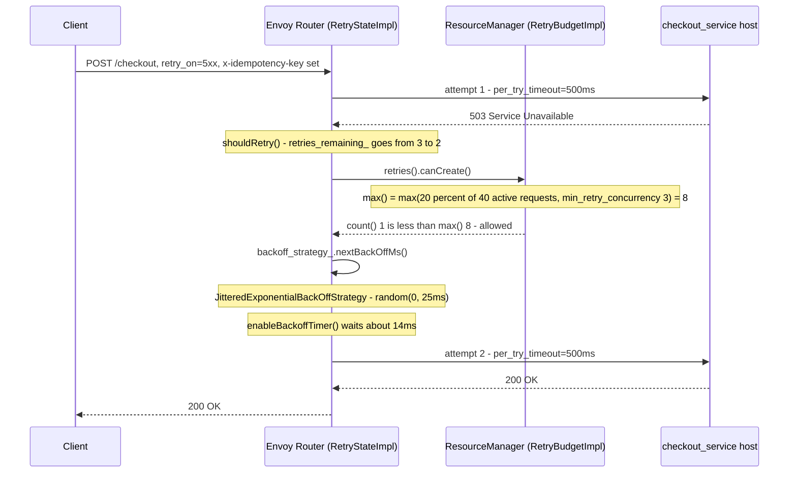
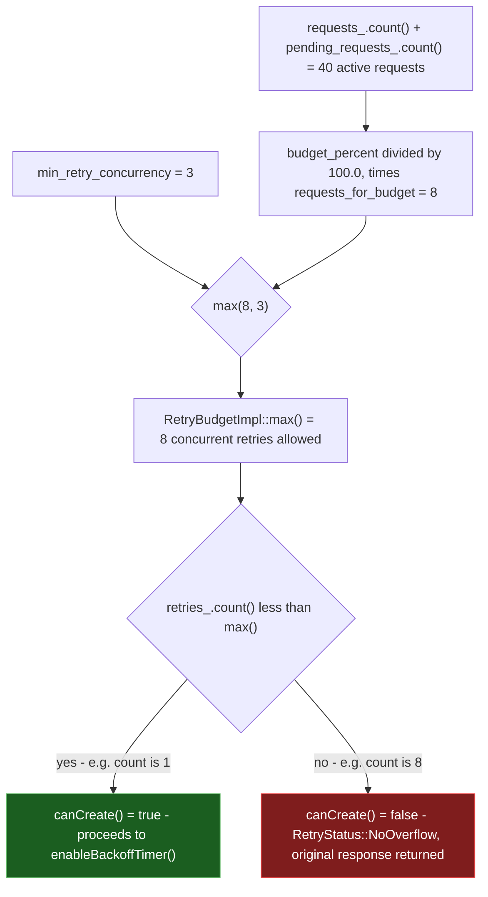

**TL;DR:** What makes calling a remote service fundamentally riskier than calling a local function, and how do production systems make retrying that call safe instead of dangerous? Because a network call has a failure mode a function call doesn't have at all — the request can be lost, the response can be lost, or the call can simply run out of time, and in every one of those cases the caller cannot tell whether the callee actually did the work. Envoy's `RetryPolicy` answers this with three coordinated mechanisms: a **per-try timeout** that bounds how long any one attempt is allowed to run, a **retriable-request gate** that only reissues requests the caller has marked safe to repeat, and a **retry budget** — a percentage cap on concurrent retries relative to active traffic, not just a flat retry count — that stops a wave of retries from amplifying the exact overload that triggered them.

## 1. The Engineering Problem: a network call can fail in a way a function call structurally cannot

Call a function in-process and there are exactly two outcomes: it returns a value, or it throws. Either way, by the time control returns to you, you know what happened. Call a service over the network and there's a third outcome neither of those cases prepares you for: **you don't know**. The request could have never reached the server. It could have reached the server, been fully processed — the row inserted, the card charged — and then the response could have been lost on the way back, a dropped TCP segment, a proxy that restarted, a client that timed out one second before the server would have replied. From the caller's side, "no response" and "the work happened but I never heard back" look identical.

This is why the naive fix — "if a call fails, just retry it" — breaks in two distinct ways in production:

1. **Retrying blindly can duplicate the effect.** If the first attempt's response was lost but the write actually happened, retrying a non-idempotent operation (charge a card, append to a queue, increment a counter) does it again. The caller has no way to tell "definitely failed" from "succeeded, but I never found out" without some extra signal.
2. **Retrying without a shared sense of scale turns a partial outage into a total one.** If a downstream service is degraded and returning errors under load, and every one of its callers independently retries every failed request 2-3 times, the retry traffic can be 2-3x the original load — arriving exactly when the callee is least able to absorb it. This is a **retry storm**: the recovery mechanism becomes the thing that prevents recovery. A flat "retry up to N times" setting on each individual caller has no way to see or limit this system-wide effect, because each caller is only ever reasoning about its own one request.

Every other topic in this domain — load balancing, caching, replication, rate limiting — is really a response to this same underlying fact: there's no shared clock between a caller and a callee, so nothing about a network call's outcome is ever fully knowable from one side alone. RPC failure semantics is the base case that makes those other topics necessary in the first place.

---

## 2. The Technical Solution: bound the time, gate the retry on idempotency, cap the concurrency

Envoy — the L4/L7 proxy already covered in this domain for load-balancer algorithms — implements the fix as three separate, composable settings, each closing one of the gaps above:

- **`per_try_timeout`** bounds a single attempt, separately from the overall route `timeout`. Without it, a request that hangs consumes the *entire* timeout budget on one try, leaving nothing for a retry — Envoy's own proto comment for this field says exactly that: a 5xx-based retry policy with no `per_try_timeout` set means a request that times out "will not be retried as the total timeout budget would have been exhausted."
- **`retriable_request_headers`** (plus Envoy's built-in `isSafeRequest()` check for GET/HEAD/OPTIONS/TRACE) is the idempotency gate: Envoy will only automatically retry a request if the route's retry policy is scoped to a header the caller set (commonly an idempotency-key header the caller controls) or if the HTTP method is inherently safe to repeat. A retry policy attached to a route serving `POST /charge` with no such gate will happily double-charge a card on a lost response.
- **`CircuitBreakers.Thresholds.RetryBudget`**, configured on the *cluster* (not the route), caps concurrent retries as a **percentage of currently active + pending requests** — not a fixed number. This is the retry-storm fix: as real traffic to a struggling service grows, the retry ceiling grows proportionally, but it can never let retries become an unbounded multiplier of load.



That diagram shows one request succeeding on retry. The interesting part — the part that actually prevents a storm — is what `Budget` computes when it decides `canCreate()`:



Three things to hold onto:

1. **A timeout answers "how long," an idempotency gate answers "is it safe to repeat," and a retry budget answers "how many at once" — these are three independent questions, and a production retry policy has to answer all three.** Configuring only `num_retries` (how many times) answers none of them: it says nothing about how long an attempt may run, nothing about whether the operation is safe to repeat, and nothing about the system-wide effect of every caller retrying at once.
2. **The retry budget lives on the cluster's circuit breaker, not on the route's retry policy — because it has to see traffic Envoy's own retry policy alone can't.** `num_retries` is scoped to one logical request; `RetryBudget` is scoped to the whole cluster's currently active and pending requests, which is the only place "is this many retries a dangerous share of current load" can actually be answered.
3. **Backoff is deliberately randomized, not just increasing.** `JitteredExponentialBackOffStrategy::nextBackOffMs()` returns `random_.random() % backoff` — a uniformly random value between 0 and the current interval, not the interval itself ("full jitter"). Retries that are exponential but *not* randomized still synchronize: every caller that failed at the same moment retries at the same moment again, one interval later. Full jitter breaks that synchronization.

**Correcting a common assumption:** it's tempting to think a "retry policy" is fully described by "how many times." Envoy's own default values already show this is incomplete — `num_retries` defaults to 1, but a route with `num_retries: 3` and no `per_try_timeout` or `RetryBudget` configured is still exposed to both an unbounded per-attempt hang and an unbounded cluster-wide retry storm; the retry *count* was never the part doing the protective work.

---

## 3. The clean example (concept in isolation)

```yaml
# minimal-retry-route.yaml — an isolated Envoy route retry policy

routes:
- match:
    prefix: "/checkout"
  route:
    cluster: checkout_service
    # Overall budget for the logical request, including every retry attempt.
    timeout: 2s
    retry_policy:
      # Only retry on 5xx responses, connection resets, or failed connections -
      # never on a plain 4xx, which usually means the request itself was bad.
      retry_on: "5xx,reset,connect-failure"

      # How many times this ONE logical request may retry. This is the smallest
      # of the three protections - see section 2 for why it's not enough alone.
      num_retries: 3

      # Bounds a SINGLE attempt. Without this, one hung attempt can consume the
      # entire 2s route timeout above, leaving no time left for any retry at all.
      per_try_timeout: 0.5s

      # The idempotency gate: only retry if the caller set this header, which by
      # convention means "safe to run this exact request body more than once."
      retriable_request_headers:
      - name: "x-idempotency-key"
        present_match: true

      # Full-jitter exponential backoff between attempts - see section 4 for the
      # real algorithm this maps to (JitteredExponentialBackOffStrategy).
      retry_back_off:
        base_interval: 0.025s
        max_interval: 0.25s

# NOT shown here (it lives on the cluster, not the route) is the retry BUDGET -
# CircuitBreakers.Thresholds.RetryBudget - which is what actually caps how many
# of these retries can be in flight across the whole cluster at once. See the
# production reality section below for that message and the code that reads it.
```

This route config answers "how long," "is it safe," and "how many for this one request" — but not yet "how many across the whole cluster." That fourth piece only exists at the cluster level, which is exactly where production Envoy configs put it.

---

## 4. Production reality (from `envoyproxy/envoy`)

```
envoyproxy/envoy/
├── api/envoy/config/
│   ├── route/v3/route_components.proto      # RetryPolicy + RetryBackOff - the config surface
│   └── cluster/v3/circuit_breaker.proto      # CircuitBreakers.Thresholds.RetryBudget - the budget config
└── source/common/
    ├── router/retry_state_impl.cc            # decides IF/WHEN to retry - remaining count + budget check
    ├── upstream/resource_manager_impl.h      # RetryBudgetImpl - the percentage-cap math itself
    └── common/backoff_strategy.cc            # JitteredExponentialBackOffStrategy - the full-jitter algorithm
```

**The config surface — `RetryPolicy` and its backoff sub-message:**

```protobuf
# api/envoy/config/route/v3/route_components.proto (message RetryPolicy, elided)

  message RetryBackOff {
    // Specifies the base interval between retries. This parameter is required and must be greater
    // than zero. Values less than 1 ms are rounded up to 1 ms.
    google.protobuf.Duration base_interval = 1 [(validate.rules).duration = {
      required: true
      gt {}
    }];

    // Specifies the maximum interval between retries. This parameter is optional, but must be
    // greater than or equal to the ``base_interval`` if set. The default is 10 times the
    // ``base_interval``.
    google.protobuf.Duration max_interval = 2 [(validate.rules).duration = {gt {}}];
  }

  // ... RetryPriority, RetryHostPredicate, ResetHeader, RateLimitedRetryBackOff elided ...

  // Specifies the allowed number of retries. This parameter is optional and
  // defaults to 1.
  google.protobuf.UInt32Value num_retries = 2
      [(udpa.annotations.field_migrate).rename = "max_retries"];

  // Specifies a non-zero upstream timeout per retry attempt (including the initial attempt).
  //
  // .. note::
  //   If left unspecified, Envoy will use the global route timeout for the request.
  //   Consequently, when using a 5xx based retry policy, a request that times out will not
  //   be retried as the total timeout budget would have been exhausted.
  google.protobuf.Duration per_try_timeout = 3;

  // Specifies parameters that control exponential retry back off. This parameter is optional, in
  // which case the default base interval is 25 milliseconds. The default maximum interval is 10
  // times the base interval.
  RetryBackOff retry_back_off = 8;
```

**The budget surface — `CircuitBreakers.Thresholds.RetryBudget`, verbatim:**

```protobuf
# api/envoy/config/cluster/v3/circuit_breaker.proto

    message RetryBudget {
      option (udpa.annotations.versioning).previous_message_type =
          "envoy.api.v2.cluster.CircuitBreakers.Thresholds.RetryBudget";

      // Specifies the limit on concurrent retries as a percentage of the sum of active requests and
      // active pending requests. For example, if there are 100 active requests and the
      // budget_percent is set to 25, there may be 25 active retries.
      //
      // This parameter is optional. Defaults to 20%.
      type.v3.Percent budget_percent = 1;

      // An optional duration in which requests will be considered when calculating
      // the budget for retries. This parameter alters the way in which the retry budget
      // is calculated, overriding the default behavior when specified.
      //
      // By default, when budget_interval is set to 0ms, only presently active
      // and pending requests are considered when calculating the retry budget.
      //
      // This parameter is optional. Defaults to 0ms.
      google.protobuf.Duration budget_interval = 3;

      // Specifies the minimum retry concurrency allowed for the retry budget. The limit on the
      // number of active retries may never go below this number.
      //
      // This parameter is optional. Defaults to 3.
      google.protobuf.UInt32Value min_retry_concurrency = 2;
    }
```

**The decision logic — `RetryStateImpl` building the backoff strategy, then deciding whether to retry at all:**

```cpp
// source/common/router/retry_state_impl.cc (constructor, elided)

  std::chrono::milliseconds base_interval(
      runtime_.snapshot().getInteger("upstream.base_retry_backoff_ms", 25));
  if (route_policy.baseInterval()) {
    base_interval = *route_policy.baseInterval();
  }

  // By default, cap the max interval to 10 times the base interval to ensure reasonable back-off
  // intervals.
  std::chrono::milliseconds max_interval = base_interval * 10;
  if (route_policy.maxInterval()) {
    max_interval = *route_policy.maxInterval();
  }

  backoff_strategy_ = std::make_unique<JitteredExponentialBackOffStrategy>(
      base_interval.count(), max_interval.count(), random_);
```

```cpp
// source/common/router/retry_state_impl.cc (RetryStateImpl::shouldRetry, elided)

RetryStatus RetryStateImpl::shouldRetry(RetryDecision would_retry, DoRetryCallback callback) {
  resetRetry();

  if (would_retry == RetryDecision::NoRetry) {
    return RetryStatus::No;
  }

  // The request has exhausted the number of retries allotted to it by the retry policy configured
  // (or the x-envoy-max-retries header).
  if (retries_remaining_ == 0) {
    return RetryStatus::NoRetryLimitExceeded;
  }

  retries_remaining_--;

  if (!cluster_.resourceManager(priority_).retries().canCreate()) {
    return RetryStatus::NoOverflow;
  }

  // ... runtime-flag check and enableBackoffTimer() call elided ...
}
```

**The percentage-cap math itself — `RetryBudgetImpl::max()`, the function the diagram's `Budget` participant runs:**

```cpp
// source/common/upstream/resource_manager_impl.h (RetryBudgetImpl, elided)

    uint64_t max() override {
      if (!useRetryBudget()) {
        return max_retry_resource_.max();
      }

      const double budget_percent = runtime_.snapshot().getDouble(
          budget_percent_key_, budget_percent_ ? *budget_percent_ : 20.0);
      const uint32_t min_retry_concurrency = runtime_.snapshot().getInteger(
          min_retry_concurrency_key_, min_retry_concurrency_ ? *min_retry_concurrency_ : 3);

      clearRemainingGauge();

      // Use the in-flight request count when budget_interval is not present.
      uint64_t requests_for_budget = requests_.count() + pending_requests_.count();

      // ... budget_interval fixed-window branch elided ...

      // We enforce that the retry concurrency is never allowed to go below the
      // min_retry_concurrency, even if the configured percent of the current active requests yields
      // a value that is smaller.
      return std::max<uint64_t>(budget_percent / 100.0 * requests_for_budget,
                                min_retry_concurrency);
    }
```

**The full-jitter algorithm — `JitteredExponentialBackOffStrategy::nextBackOffMs()`, verbatim:**

```cpp
// source/common/common/backoff_strategy.cc

uint64_t JitteredExponentialBackOffStrategy::nextBackOffMs() {
  const uint64_t backoff = next_interval_;
  ASSERT(backoff > 0);
  // Set next_interval_ to max_interval_ if doubling the interval would exceed the max or overflow.
  next_interval_ = (next_interval_ < doubling_limit_) ? (next_interval_ * 2u) : max_interval_;
  return (random_.random() % backoff);
}
```

**What this teaches that a hello-world can't:**

- **The retry budget is computed live, every time `max()` is called — it's not a static number set once at startup.** `requests_.count() + pending_requests_.count()` reads the cluster's *current* in-flight traffic, so a cluster that's quiet allows very few concurrent retries (floored at `min_retry_concurrency`, default 3) while the same cluster under heavy real load allows proportionally more — the cap tracks load instead of guessing a fixed number up front.
- **`retries_remaining_--` and `canCreate()` are two separate gates, checked in sequence, and either one alone can stop a retry.** A request can still have retries left (`retries_remaining_ > 0`) and be refused anyway with `RetryStatus::NoOverflow` if the cluster-wide budget is exhausted — this is precisely how a per-request setting (`num_retries`) and a cluster-wide setting (`RetryBudget`) compose without either one having to know about the other.
- **`nextBackOffMs()` returns `random() % backoff`, not `backoff` itself.** This is the full-jitter algorithm: the returned delay is uniformly random between 0 and the current exponential interval, every single call. Two requests that failed in the same millisecond get two different, uncorrelated retry delays — which is what actually prevents their retries from re-synchronizing into another spike.

**When reviewing a PR that adds or changes a `retry_policy`, check:**

1. **Is `per_try_timeout` set, and is it meaningfully smaller than the route's `timeout`?** Per Envoy's own proto comment, an unset `per_try_timeout` means a timed-out request has already burned the whole route timeout and won't be retried at all — the field silently does nothing if it's missing.
2. **Is a `RetryBudget` configured on the cluster's `circuit_breakers.thresholds`, not just `num_retries` on the route?** Without it, Envoy falls back to a flat `max_retries` circuit breaker (default 3) that doesn't scale with traffic — exactly the retry-storm exposure this lesson opened with.
3. **Does `retry_on` include this route's actual failure modes, and is the request idempotency-gated if the method isn't inherently safe?** `retry_on: "5xx"` on a route serving `POST /charge` with no `retriable_request_headers` idempotency gate will retry a request whose side effect may have already happened.
4. **Are `retry_back_off.base_interval` / `max_interval` deliberately chosen, not left at the 25ms/250ms default?** The default may be far shorter than the callee's actual recovery time under real load; check it against the downstream service's own latency SLOs, not against Envoy's defaults.

---

## 5. FAQ

### What actually happens when a retry budget is exhausted?
`RetryBudgetImpl::canCreate()` returns `false`, `RetryStateImpl::shouldRetry()` returns `RetryStatus::NoOverflow`, and the retry is skipped — the *original* failed response is returned to the client immediately. The client's `num_retries` count is irrelevant at that point; the cluster-wide budget vetoed the retry regardless of how many attempts the individual request had left.

### Why does Envoy randomize the backoff interval instead of just using it directly?
Because a purely exponential (non-jittered) backoff still synchronizes: every request that failed at the same instant, under the same growing interval, retries at the same instant again. `JitteredExponentialBackOffStrategy::nextBackOffMs()` returns `random_.random() % backoff` — a value uniformly distributed between 0 and the current interval — so requests that failed together scatter instead of re-converging into a second, third, and fourth synchronized spike.

### How does Envoy avoid retrying a request that already had its side effect applied?
It doesn't have a way to *know* the side effect happened — no proxy can. Instead it shifts the responsibility to opt-in: `isSafeRequest()` auto-permits retries for methods that are safe by HTTP definition (GET, HEAD, OPTIONS, TRACE), and `retriable_request_headers` lets an operator scope retries to requests carrying a specific header, which by convention is how a caller signals "I've made this request idempotent, safe to repeat." A route with neither of those doesn't get automatic retry-on-failure protection against duplication — it gets none.

### What's the actual difference between `num_retries` and a retry budget?
`num_retries` is a per-request ceiling — how many times *this one logical call* may retry — enforced by decrementing `retries_remaining_` on each attempt. `RetryBudget` is a cluster-wide concurrency ceiling — how many retries, from *any* request to this cluster, may be in flight at once — enforced by `RetryBudgetImpl::canCreate()` reading the cluster's live active-request count. A generous `num_retries` with no budget configured still exposes the cluster to a storm, because nothing is limiting the aggregate.

### Why compute the budget as a percentage of active requests instead of a fixed number?
A fixed cap (Envoy's fallback `max_retries` circuit breaker, default 3) doesn't scale: it's needlessly restrictive on a quiet cluster and dangerously permissive relative to load on a busy one. `RetryBudgetImpl::max()` computes `budget_percent / 100.0 * (requests_.count() + pending_requests_.count())`, floored at `min_retry_concurrency` — so the retry ceiling tracks the cluster's actual current traffic instead of a number chosen once and never revisited.

---

## Source

- **Concept:** RPC failure semantics — timeouts, retry budgets, and idempotency-gated retries
- **Domain:** system-design
- **Repo:** [envoyproxy/envoy](https://github.com/envoyproxy/envoy) → [`api/envoy/config/route/v3/route_components.proto`](https://github.com/envoyproxy/envoy/blob/main/api/envoy/config/route/v3/route_components.proto), [`api/envoy/config/cluster/v3/circuit_breaker.proto`](https://github.com/envoyproxy/envoy/blob/main/api/envoy/config/cluster/v3/circuit_breaker.proto), [`source/common/router/retry_state_impl.cc`](https://github.com/envoyproxy/envoy/blob/main/source/common/router/retry_state_impl.cc), [`source/common/upstream/resource_manager_impl.h`](https://github.com/envoyproxy/envoy/blob/main/source/common/upstream/resource_manager_impl.h), [`source/common/common/backoff_strategy.cc`](https://github.com/envoyproxy/envoy/blob/main/source/common/common/backoff_strategy.cc) — Envoy's own source, the authoritative implementation of the concept itself.

---

**Next in the System Design series:** [Does adding a tenth server actually help, or does it just move the bottleneck? →]({{ '/system-design/scalability-vertical-vs-horizontal-scaling/' | relative_url }})
