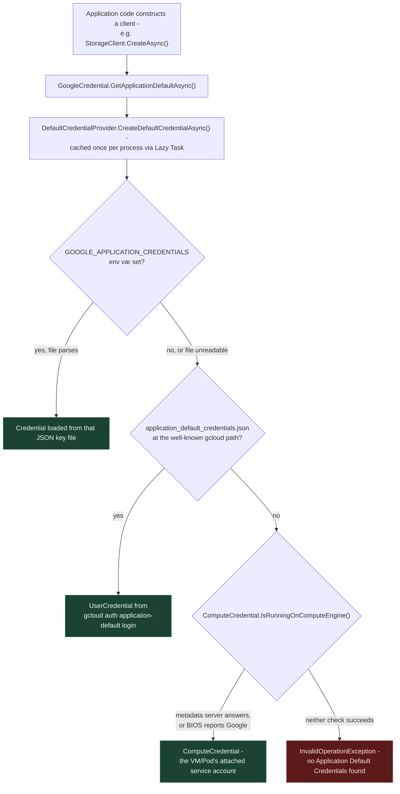
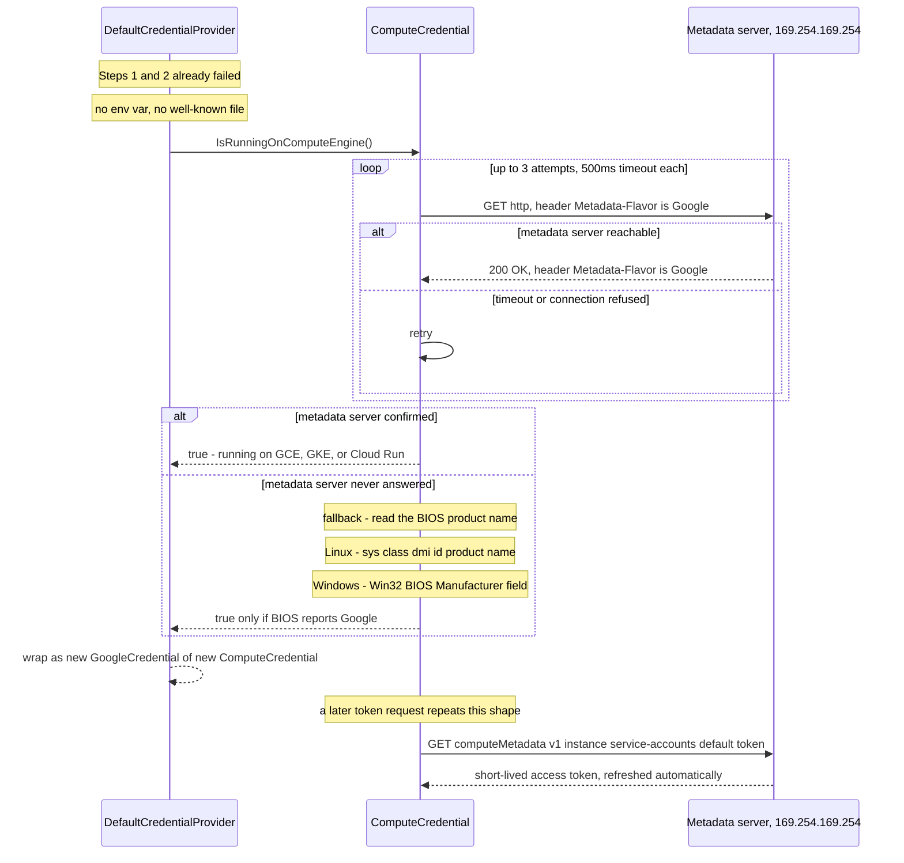

**TL;DR:** When a `gcloud` command, a Terraform run, or a freshly constructed `StorageClient` authenticates to Google Cloud, who told it *which* identity to use — when nothing in the code names one? **Application Default Credentials (ADC)** is a fixed, ordered fallback chain that runs before any API call or IAM check: an environment variable, then a well-known file on disk, then the GCE/GKE/Cloud Run metadata server at `169.254.169.254`. It's resolved once per process, cached, and it's the thing every other GCP auth topic — IAM, Workload Identity Federation — silently assumes already happened.
> **In plain English (30 sec):** Think of this like concepts you already use, but in a production system at scale.


**Real repo:** [`googleapis/google-api-dotnet-client`](https://github.com/googleapis/google-api-dotnet-client), [`googleapis/google-cloud-dotnet`](https://github.com/googleapis/google-cloud-dotnet), [`google-github-actions/auth`](https://github.com/google-github-actions/auth)

## 1. The Engineering Problem: the same code has to authenticate differently in every environment, without being told which one it's in

Say you write a service that calls Cloud Storage. The naive move is to hardcode it: load a service-account JSON key from a fixed path, build a credential from it, done. That works on your laptop. It breaks the moment the same binary runs somewhere else — a CI runner has no such file, and a GCE VM or GKE Pod *shouldn't* need one at all, because it already has a service account attached to it by the platform. If the code only knows how to authenticate one way, it has to branch on environment: `if (IsLocal) LoadKeyFile(); else if (IsGce) UseMetadata();` — logic that has nothing to do with what the service actually does, repeated in every service that talks to GCP.

The deeper problem: a piece of code that calls a GCP API needs *some* credential to attach to every request, but it can't know in advance whether it's running on a developer's machine, inside CI, or on a GCE instance, a GKE Pod, or Cloud Run — each of which has a completely different natural source of identity. Something has to sit between "I need to authenticate" and "here's how," and make that decision the same way, every time, regardless of caller.

---

## 2. The Technical Solution: a fixed, ordered fallback chain, resolved once and cached

Every official Google Cloud client library — and `gcloud` and Terraform's `google` provider underneath their own hoods — calls the same entry point to get a credential: `GoogleCredential.GetApplicationDefaultAsync()`. That method delegates to a private `DefaultCredentialProvider`, whose job is entirely mechanical: try three sources, in a fixed order, and use whichever one succeeds first.



The third branch — the metadata server check — is the one that makes GCE, GKE, and Cloud Run "just work" with zero credential files anywhere on disk. It's not a single request; it's a small, retried mechanism worth zooming into:



Three things to hold onto:

1. **ADC is a client-side fallback chain, not a server-side negotiation.** Nothing on Google's end decides which mechanism you used — the library on your machine or VM tries each source locally, in order, and stops at the first one that works. It's resolved exactly once per process (`Lazy<Task<GoogleCredential>>`) and reused for every subsequent call.
2. **ADC decides *which identity* gets attached to a request. IAM decides what that identity is *allowed to do*.** Every prior post in this domain — IAM bindings, Workload Identity, Workload Identity Federation — starts from an already-resolved credential. This is the step that produces it.
3. **Workload Identity Federation plugs into step 1, not around it.** `google-github-actions/auth` (the repo behind this domain's WIF post) doesn't invent a new resolution path — it writes a short-lived config file and calls `exportVariable('GOOGLE_APPLICATION_CREDENTIALS', credentialsPath)` (confirmed in its `src/main.ts`), so the *same* ADC chain above picks it up at the very first branch.

**Correcting a common assumption:** `GoogleCredential.GetApplicationDefaultAsync()`'s own XML doc comment describes step 2 loosely as "you have run `gcloud auth login`." That's not the command that actually produces the file `DefaultCredentialProvider` looks for. The well-known file is `application_default_credentials.json`, written by the separate `gcloud auth application-default login` command — plain `gcloud auth login` only authenticates the `gcloud` CLI itself, not ADC. This is a real, easy-to-repeat mixup even inside Google's own doc comments, not just in tutorials.

---

## 3. The clean example (concept in isolation)

```csharp
// Program.cs - the entire "authentication" logic for a GCP client, in production or on a laptop
using Google.Apis.Auth.OAuth2;
using Google.Cloud.Storage.V1;

// No file path, no environment check, no "if running on GCE" branch anywhere in this code.
// GetApplicationDefaultAsync() runs the full three-step chain (env var, well-known file,
// metadata server) and returns whichever credential resolved first.
GoogleCredential credential = await GoogleCredential.GetApplicationDefaultAsync();

// Every generated GCP client accepts a GoogleCredential the same way - the client itself
// has no idea whether that credential came from a JSON key file or a VM's metadata server.
StorageClient storage = await StorageClient.CreateAsync(credential);

// On a laptop: resolves from GOOGLE_APPLICATION_CREDENTIALS or `gcloud auth application-default login`.
// On a GCE VM, GKE Pod, or Cloud Run instance: resolves from the metadata server, with no
// key file involved at all. Same binary, same call, different resolution - that's the point.
await foreach (var obj in storage.ListObjectsAsync("my-bucket"))
{
    Console.WriteLine(obj.Name);
}
```

That's the entire contract from the caller's side: one call, three possible sources, zero environment-specific branches in application code. The next section shows the real fallback logic and the real metadata-server exchange behind that one call.

---

## 4. Production reality (from Google's own .NET auth source)

The `GoogleCredential`/`ComputeCredential` classes aren't vendored inside `googleapis/google-cloud-dotnet` itself — that repo's client libraries (Storage, Pub/Sub, Spanner, and the rest) consume them as a dependency. The actual ADC resolution chain lives in Google's sibling official repo, `googleapis/google-api-dotnet-client`; `google-cloud-dotnet`'s own client builders call straight into it without ever re-implementing credential resolution themselves — which is itself worth showing, since it proves ADC is a single shared mechanism, not something each client library reinvents.

```
googleapis/google-api-dotnet-client/
└── Src/Support/Google.Apis.Auth/OAuth2/
    ├── GoogleCredential.cs             # public entry point: GetApplicationDefaultAsync()
    ├── DefaultCredentialProvider.cs    # the actual 3-step fallback chain, cached via Lazy<Task<>>
    ├── ComputeCredential.cs            # GCE/GKE/Cloud Run metadata-server detection + token fetch
    └── GoogleAuthConsts.cs             # 169.254.169.254, GCE_METADATA_HOST override

googleapis/google-cloud-dotnet/
└── apis/Google.Cloud.Storage.V1/Google.Cloud.Storage.V1/
    ├── StorageClient.cs                # StorageClient.CreateAsync(credential) - no auth logic of its own
    └── StorageClientBuilder.cs         # GetScopedCredentialProvider() delegates to the same chain
```

```csharp
// Src/Support/Google.Apis.Auth/OAuth2/DefaultCredentialProvider.cs
public const string CredentialEnvironmentVariable = "GOOGLE_APPLICATION_CREDENTIALS";

private const string WellKnownCredentialsFile = "application_default_credentials.json";

/// <summary>Caches result from first call to <c>GetApplicationDefaultCredentialAsync</c></summary>
private readonly Lazy<Task<GoogleCredential>> cachedCredentialTask;

public DefaultCredentialProvider()
{
    cachedCredentialTask = new Lazy<Task<GoogleCredential>>(CreateDefaultCredentialAsync);
}

public Task<GoogleCredential> GetDefaultCredentialAsync() => cachedCredentialTask.Value;

private async Task<GoogleCredential> CreateDefaultCredentialAsync()
{
    GoogleCredential credential =
        // 1. First try the environment variable.
        await GetAdcFromEnvironmentVariableAsync().ConfigureAwait(false)
        // 2. Then try the well known file.
        ?? await GetAdcFromWellKnownFileAsync().ConfigureAwait(false)
        // 3. Then try the compute engine.
        ?? await GetAdcFromComputeAsync().ConfigureAwait(false)
        // If everything we tried has failed, throw an exception.
        ?? throw new InvalidOperationException(
            $"Your default credentials were not found. To set up Application Default " +
            $"Credentials, see {HelpPermalink}.");

    return credential.CreateWithEnvironmentQuotaProject();

    // ... GetAdcFromEnvironmentVariableAsync/GetAdcFromWellKnownFileAsync elided -
    // each reads its path, loads the file via CredentialFactory.FromStreamAsync, and
    // returns null (not throws) when the source simply isn't present, so the ?? chain
    // above can fall through to the next step ...
}
```

```csharp
// Src/Support/Google.Apis.Auth/OAuth2/ComputeCredential.cs (elided for length)
private static async Task<bool> IsMetadataServerAvailableAsync()
{
    using (var httpClient = new HttpClient())
    {
        for (int i = 0; i < MetadataServerPingAttempts; i++)          // 3 attempts
        {
            var cts = new CancellationTokenSource();
            cts.CancelAfter(MetadataServerPingTimeoutInMilliseconds); // 500ms each
            try
            {
                var httpRequest = new HttpRequestMessage(HttpMethod.Get, GoogleAuthConsts.EffectiveMetadataServerUrl);
                httpRequest.Headers.Add(MetadataFlavor, GoogleMetadataHeader); // "Metadata-Flavor: Google"
                var response = await httpClient.SendAsync(httpRequest, cts.Token).ConfigureAwait(false);
                if (response.Headers.TryGetValues(MetadataFlavor, out var headerValues)
                    && headerValues.Contains(GoogleMetadataHeader))
                {
                    return true;
                }
                return false; // responded, but not from the real metadata server
            }
            catch (Exception e) when (e is HttpRequestException || e is WebException || e is OperationCanceledException)
            {
                // retry - transient failure or timeout
            }
        }
    }
    return false;
}
```

```csharp
// Src/Support/Google.Apis.Auth/OAuth2/GoogleAuthConsts.cs
// IP address instead of name to avoid DNS resolution
private const string DefaultMetadataAddress = "169.254.169.254";
internal const string DefaultMetadataServerUrl = "http://" + DefaultMetadataAddress;
private const string ComputeTokenUrlSuffix = "/computeMetadata/v1/instance/service-accounts/default/token";

private static string GetEffectiveMetadataUrl(string suffix, string defaultValue)
{
    // GCE_METADATA_HOST lets the metadata endpoint be overridden - used by emulators/tests
    string env = Environment.GetEnvironmentVariable("GCE_METADATA_HOST");
    return string.IsNullOrEmpty(env) ? defaultValue : "http://" + env + suffix;
}
```

```csharp
// apis/Google.Cloud.Storage.V1/Google.Cloud.Storage.V1/StorageClient.cs (google-cloud-dotnet)
internal static ScopedCredentialProvider ScopedCredentialProvider { get; } =
    new ScopedCredentialProvider(s_scopes);

public static Task<StorageClient> CreateAsync(GoogleCredential credential = null, EncryptionKey encryptionKey = null) =>
    // ... builds a StorageClientBuilder and delegates credential resolution to it ...
```

**What this teaches that a hello-world can't:**

- **The retry/timeout numbers are real production tuning, not arbitrary.** `MetadataServerPingAttempts = 3` and `MetadataServerPingTimeoutInMilliseconds = 500` exist because a single short timeout without retry proved unreliable in practice — the surrounding comment in the real file notes that even 2000ms *without* a retry occasionally failed, while a retried attempt right after a timeout typically succeeds in under 50ms. That's an operational lesson (metadata-server latency is bursty, not a fixed cost), not something a hello-world credential check would ever surface.
- **The `?? ` (null-coalescing) chain in `CreateDefaultCredentialAsync` *is* the whole fallback mechanism.** Each `GetAdcFrom*Async` method returns `null` — never throws — when its source simply isn't present, which is what lets the next `??` fall through cleanly. A source only throws when it *is* present but corrupt (e.g. `GOOGLE_APPLICATION_CREDENTIALS` points at a file that fails to parse), which is a deliberate distinction: "not configured" and "misconfigured" get different failure behavior.
- **`google-cloud-dotnet`'s `StorageClient` never touches `GoogleCredential.GetApplicationDefaultAsync()` directly** — it delegates through `ScopedCredentialProvider`/`StorageClientBuilder`. Every Cloud client library in that repo (Pub/Sub, Spanner, BigQuery, Translation — all matched the same `GoogleCredential` reference in this domain's earlier search) shares this exact same indirection, confirming ADC is one mechanism reused everywhere, not something each client reimplements.
- **The BIOS fallback exists because the metadata server isn't always reachable the instant code asks.** `IsRunningOnComputeEngineUncachedAsync` doesn't just ping-and-give-up; it also checks `/sys/class/dmi/id/product_name` on Linux or the `Win32_BIOS` `Manufacturer` field on Windows for the literal string `"Google"` — a local, network-free way to detect "I'm on Google's hardware" for the narrow case where the metadata server check races application startup.

**When reviewing code or infra that touches ADC, check:**

1. **Is `GOOGLE_APPLICATION_CREDENTIALS` set in this environment, and does it point at a long-lived JSON key file?** If so, that key never expires on its own — the domain's known-stale-fact list flags long-lived keys as actively discouraged; Workload Identity Federation (step 1 of this same chain, via a short-lived config file) is the current recommendation.
2. **Does application code branch on environment to decide how to authenticate?** If it does, that logic almost always belongs in ADC's fallback chain instead — the whole point of `GetApplicationDefaultAsync()` is that the calling code never needs to know.
3. **On GCE/GKE/Cloud Run, which service account is actually attached?** `ComputeCredential` resolves to *whatever* identity the metadata server hands back — reviewing "which credential" on these platforms means reviewing the attached service account (or the GKE Workload Identity binding from this domain's earlier post), not application code.
4. **If ADC resolution is failing, which of the three steps is actually the problem?** The exception message only says "not found" — the fix differs completely depending on whether it's a missing env var, a stale/missing well-known file, or a genuinely unreachable metadata server (e.g. a firewall rule blocking `169.254.169.254`, which is otherwise unroutable and requires no explicit egress rule on GCP itself).

---

## FAQ

### What exactly is "Application Default Credentials"?
A fixed, three-step fallback chain — not a single credential type. `GoogleCredential.GetApplicationDefaultAsync()` tries the `GOOGLE_APPLICATION_CREDENTIALS` environment variable, then the well-known `application_default_credentials.json` file, then the GCE/GKE/Cloud Run metadata server, in that order, and returns whichever one resolves first. "ADC" names the chain, not any one of the three sources.

### Is ADC the same thing as a service account?
No — ADC is the *mechanism* that finds a credential; a service account is one possible *identity* that credential can represent. On a GCE VM, ADC resolves through `ComputeCredential` to whatever service account is attached to that VM. With a downloaded JSON key file, ADC resolves through the env-var or well-known-file path to that same service account's credentials, loaded a different way.

### Why does `gcloud auth login` not make ADC work?
Because it authenticates the `gcloud` CLI itself, not the well-known ADC file that `DefaultCredentialProvider` looks for. That file is written by the separate `gcloud auth application-default login` command — a mixup real enough that even `GoogleCredential.GetApplicationDefaultAsync()`'s own doc comment describes it loosely.

### How does Workload Identity Federation relate to this chain?
It doesn't bypass it — it feeds it. `google-github-actions/auth` (this domain's WIF post) writes a short-lived external-account config file and sets `GOOGLE_APPLICATION_CREDENTIALS` to point at it, so the exact same step-1 environment-variable check in the diagram above picks it up. WIF changes *what* ends up in that file, not *how* it gets discovered.

### What actually happens if none of the three steps succeed?
`CreateDefaultCredentialAsync` throws an `InvalidOperationException` with a link to Google's ADC setup docs — the null-coalescing chain in `DefaultCredentialProvider.cs` makes this the explicit last resort after the env var, the well-known file, and the metadata-server check (including its BIOS fallback) have all returned nothing.

---

## Source

- **Concept:** Application Default Credentials (ADC) — the GCP credential-resolution chain
- **Domain:** gcp
- **Repo:** [googleapis/google-api-dotnet-client](https://github.com/googleapis/google-api-dotnet-client) → [`Src/Support/Google.Apis.Auth/OAuth2/GoogleCredential.cs`](https://github.com/googleapis/google-api-dotnet-client/blob/main/Src/Support/Google.Apis.Auth/OAuth2/GoogleCredential.cs), [`DefaultCredentialProvider.cs`](https://github.com/googleapis/google-api-dotnet-client/blob/main/Src/Support/Google.Apis.Auth/OAuth2/DefaultCredentialProvider.cs), [`ComputeCredential.cs`](https://github.com/googleapis/google-api-dotnet-client/blob/main/Src/Support/Google.Apis.Auth/OAuth2/ComputeCredential.cs), [`GoogleAuthConsts.cs`](https://github.com/googleapis/google-api-dotnet-client/blob/main/Src/Support/Google.Apis.Auth/OAuth2/GoogleAuthConsts.cs) — the actual implementation of ADC for .NET.
- **Repo:** [googleapis/google-cloud-dotnet](https://github.com/googleapis/google-cloud-dotnet) → [`apis/Google.Cloud.Storage.V1/Google.Cloud.Storage.V1/StorageClient.cs`](https://github.com/googleapis/google-cloud-dotnet/blob/main/apis/Google.Cloud.Storage.V1/Google.Cloud.Storage.V1/StorageClient.cs), [`StorageClientBuilder.cs`](https://github.com/googleapis/google-cloud-dotnet/blob/main/apis/Google.Cloud.Storage.V1/Google.Cloud.Storage.V1/StorageClientBuilder.cs) — Google's official GCP client libraries for .NET, showing how a real client library consumes the chain above without reimplementing it.
- **Repo:** [google-github-actions/auth](https://github.com/google-github-actions/auth) → [`src/main.ts`](https://github.com/google-github-actions/auth/blob/main/src/main.ts) — confirms Workload Identity Federation plugs into ADC's environment-variable step, not a separate path.

---

**Next in the Google Cloud series:** [When does adding capacity mean provisioning a VM, and when does it mean nothing at all?]({{ '/gcp/compute-engine-vs-app-engine-vs-cloud-run/' | relative_url }})


