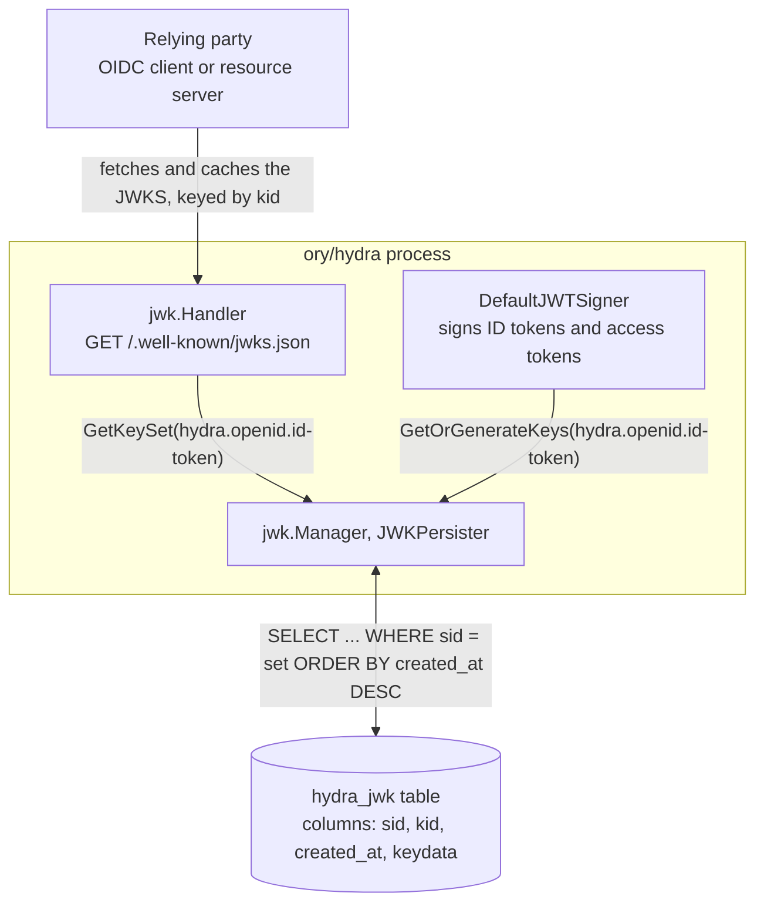
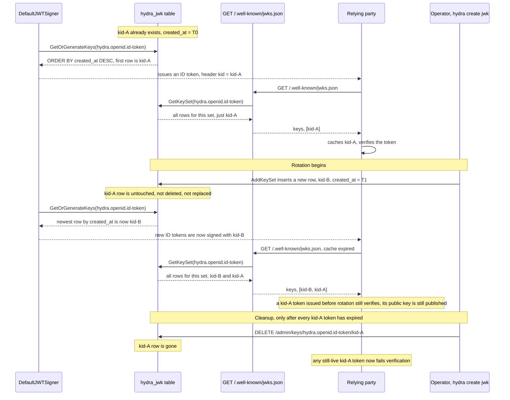
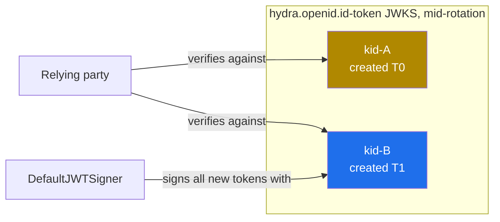

**TL;DR:** Every previous post in this series verifies a credential against a key that's simply assumed to already be correct — where does a verifier that has never talked to the issuer before actually get that key, and what happens to a million already-issued tokens the instant the issuer rotates it? A verifier fetches the issuer's public keys as a JSON Web Key Set (JWKS) from a well-known HTTP endpoint, matches each token to a key by its `kid`, and rotation works by *adding* a new key rather than replacing the old one — the old key's public half stays published until every token it signed has had time to expire.

> **In plain English (30 sec):** Code you already write — Map, function, API call, just bigger.

**Real repo:** [`ory/hydra`](https://github.com/ory/hydra)

## 1. The Engineering Problem: every signature-verifying scheme in this domain assumes the key is already right

Password hashing verifies a hash against a stored salt. JWT verification checks a signature against "the" key. OIDC verifies an ID token's signature. mTLS verifies a certificate against "a" trusted CA. Every one of those posts starts from the moment the verifier already possesses the correct key — none of them shows how the verifier got it in the first place, or what happens the moment that key needs to change.

That question is trivial when the issuer and verifier are the same process — a monolith checking its own signature against a key in its own memory never has this problem. It stops being trivial the instant the verifier is a *different* service that has never been manually configured with a key file: an OIDC relying party validating an ID token from an identity provider it doesn't operate, or a resource server checking a JWT access token signed by a separate authorization server. That verifier has to learn the key from *somewhere*, over the network, without a human copying a `.pem` file into its config at deploy time.

Baking the key into the verifier's config seems to solve discovery, but it creates a worse problem: rotating a compromised or simply aging signing key now means redeploying every independent verifier at the same instant, which is impossible to coordinate once there's more than a handful of them. And even a naive "publish the key at a URL, verifiers fetch it" fix doesn't survive rotation on its own — the moment the issuer swaps in a new key, every token issued seconds earlier with the old key becomes unverifiable, even though it's still well within its own expiry window and was never revoked.

## 2. The Technical Solution: a set of keys, matched by `kid`, rotated by addition not replacement

The fix has two parts that only work together. First, discovery: the issuer publishes its current public keys as a JSON Web Key Set — a JSON array, each entry tagged with a key ID (`kid`) — at a predictable URL, `/.well-known/jwks.json`. A verifier fetches and caches that array, and when it receives a token, reads the `kid` out of the token's header to pick which of the cached keys to verify against, rather than assuming there's only ever one.

Second, rotation: generating a new signing key doesn't remove the old one from that published set. It gets *added* alongside it. Newly issued tokens carry the new key's `kid`, but the old `kid`'s public key is still sitting in the JWKS response, so a token signed a minute before rotation with the old `kid` verifies exactly as before. Only later — once every token the old key could have signed has actually expired — does an operator explicitly delete that old key from the set. Rotation is a two-step, time-boxed process (add, then later delete), not an atomic swap.

`ory/hydra`, a real headless OAuth2/OIDC server, implements exactly this. It keeps two well-known key sets — `hydra.openid.id-token` (signs OIDC ID tokens) and `hydra.jwt.access-token` (signs JWT access tokens, when that mode is enabled) — both broadcast at the same public `/.well-known/jwks.json`. Which key signs a *new* token is decided by "the most recently inserted row for that set." Which keys are published for verification is decided by "every row for that set that hasn't been explicitly deleted."



The diagram above is the shape of the system at rest. The mechanism only becomes visible over time — this is what actually happens across a rotation, `kid` by `kid`:



Zoomed into the moment right after rotation, before cleanup, the set genuinely holds two simultaneously valid keys with two different jobs:



Three things to hold onto:

1. **The JWKS endpoint returns a set, not a key** — multiple `kid`s being simultaneously valid isn't an edge case or a bug window, it's the entire rotation mechanism. A verifier that assumes "one key at a time" will break the first time it's pointed at a real issuer mid-rotation.
2. **Rotating is an insert, not a replace.** Hydra's `AddKeySet` only ever adds rows for a given `set` name; nothing in the signing or discovery path ever deletes or overwrites an existing row. Removing an old key is a distinct, later, deliberate operation.
3. **A verifier must pin its own expected algorithm and match strictly on `kid` — never trust the token's own `alg` header.** This is the same class of bug behind the well-documented RS256→HS256 key-confusion CVEs: if a verifier blindly does whatever the token's header says, an attacker who controls the header controls how their forged token gets checked.

## 3. The clean example (concept in isolation)

```go
// clean_jwks.go - the entire rotation mechanism, stripped to essentials.
// Real ory/hydra stores this in a SQL table instead of a slice and wraps
// every call in tracing spans and encryption - neither changes the mechanism.

type SigningKey struct {
	KID       string
	Public    *rsa.PublicKey
	Private   *rsa.PrivateKey
	CreatedAt time.Time
}

// keys is ordered newest-first, exactly like hydra's
// "ORDER BY created_at DESC" query against hydra_jwk.
var keys []SigningKey

// CurrentSigningKey always returns the newest key, index 0. This is the
// ONLY place in the whole mechanism where a "current" key is chosen.
func CurrentSigningKey() SigningKey {
	return keys[0]
}

// Rotate ADDS a new key to the front. It never removes anything - every
// kid ever added stays valid for verification until Prune deletes it.
func Rotate() SigningKey {
	k := generateKey()
	keys = append([]SigningKey{k}, keys...)
	return k
}

// Prune is the ONLY function that removes a key. Call it only once every
// token signed with that kid is guaranteed to have expired.
func Prune(kid string) {
	for i, k := range keys {
		if k.KID == kid {
			keys = append(keys[:i], keys[i+1:]...)
			return
		}
	}
}

// JWKS is what a verifier fetches from /.well-known/jwks.json - every
// live key, not just the current signing key.
func JWKS() []PublicJWK {
	out := make([]PublicJWK, len(keys))
	for i, k := range keys {
		out[i] = PublicJWK{KID: k.KID, N: k.Public.N, E: k.Public.E}
	}
	return out
}

// Verify looks the token's kid up in the SAME set JWKS() returns - it
// never lets the token itself say which algorithm to check it with.
func Verify(token *jwt.Token) (bool, error) {
	kid, _ := token.Header["kid"].(string)
	for _, k := range keys {
		if k.KID == kid {
			return verifyRS256(token, k.Public) // alg pinned here, not read from the token
		}
	}
	return false, errors.New("kid not found in JWKS")
}
```

That's the whole mechanism: an append-only list, a "newest wins" rule for signing, a "return everything" rule for discovery, and an explicit, separate delete. Production `ory/hydra` implements the identical shape with a real database and real encryption at rest.

## 4. Production reality (from `ory/hydra`)

```
ory/hydra/
├── x/
│   └── const.go                   # the two well-known key set names
├── jwk/
│   ├── handler.go                 # GET /.well-known/jwks.json
│   └── helper.go                  # GetOrGenerateKeys - picks the signing key
├── persistence/sql/
│   └── persister_jwk.go           # AddKeySet / GetKeySet - the actual rotation mechanism
└── cmd/
    ├── cmd_create_jwks.go         # `hydra create jwk` - adds a key
    └── cmd_delete_jwks.go         # `hydra delete jwk` - deletes a WHOLE SET, not one key
```

The two set names aren't picked per-lesson — they're real constants, and `WellKnownKeys` always broadcasts both regardless of configuration:

```go
// x/const.go
const (
	OpenIDConnectKeyName = "hydra.openid.id-token"
	OAuth2JWTKeyName     = "hydra.jwt.access-token"
)
```

The rotation mechanism itself lives entirely in the SQL persister — one function that only ever inserts, and one that reads back ordered by insertion time:

```go
// persistence/sql/persister_jwk.go

// AddKeySet implements jwk.Manager. This is the entire "rotate" operation -
// every call inserts new rows, it never deletes or updates an existing one.
func (p *JWKPersister) AddKeySet(ctx context.Context, set string, keys *jose.JSONWebKeySet) (err error) {
	// ... tracing span setup elided ...
	return p.D.BasePersister().Transaction(ctx, func(ctx context.Context, c *pop.Connection) error {
		for _, key := range keys.Keys {
			out, err := json.Marshal(key)
			if err != nil {
				return errors.WithStack(err)
			}

			encrypted, err := aead.NewAESGCM(p.D.Config()).Encrypt(ctx, out, nil)
			if err != nil {
				return err
			}

			// CreateWithNetwork is a SQL INSERT - kid, the set name (sid),
			// and created_at are all this table needs to make rotation work
			if err := p.D.BasePersister().CreateWithNetwork(ctx, &jwk.SQLData{
				Set:     set,
				KID:     key.KeyID,
				Version: 0,
				Key:     encrypted,
			}); err != nil {
				return sqlcon.HandleError(err)
			}
		}
		return nil
	})
}

// GetKeySet implements jwk.Manager. Every row ever inserted for this set
// comes back, ordered newest first - that ordering is what "the current
// signing key" and "the set of keys a verifier should trust" both reduce to.
func (p *JWKPersister) GetKeySet(ctx context.Context, set string) (keys *jose.JSONWebKeySet, err error) {
	// ... tracing span setup elided ...
	var js jwk.SQLDataRows
	if err := p.D.BasePersister().QueryWithNetwork(ctx).
		Where("sid = ?", set).
		Order("created_at DESC").
		All(&js); err != nil {
		return nil, sqlcon.HandleError(err)
	}

	return js.ToJWK(ctx, aead.NewAESGCM(p.D.Config()))
}
```

Signing key *selection* is a separate, smaller piece of logic — it just picks the first (newest) private key out of whatever `GetKeySet` returns, generating one from scratch only if the set is empty:

```go
// jwk/helper.go
func GetOrGenerateKeys(ctx context.Context, r InternalRegistry, set, alg string) (private *jose.JSONWebKey, err error) {
	getLock(set).Lock()
	defer getLock(set).Unlock()

	keys, err := r.KeyManager().GetKeySet(ctx, set)
	if errors.Is(err, x.ErrNotFound) || err == nil && len(keys.Keys) == 0 {
		r.Logger().Warnf("JSON Web Key Set %q does not exist yet, generating new key pair...", set)
		keys, err = r.KeyManager().GenerateAndPersistKeySet(ctx, set, "", alg, "sig")
		if err != nil {
			return nil, err
		}
	} else if err != nil {
		return nil, err
	}

	// FindPrivateKey -> First() takes index 0 of the newest-first list
	// GetKeySet just returned - "current key" is never anything else
	privKey, privKeyErr := FindPrivateKey(keys)
	if privKeyErr == nil {
		return privKey, nil
	}
	r.Logger().WithField("jwks", set).Warnf("JSON Web Key not found in JSON Web Key Set %s, generating new key pair...", set)

	keys, err = r.KeyManager().GenerateAndPersistKeySet(ctx, set, "", alg, "sig")
	if err != nil {
		return nil, err
	}

	return FindPrivateKey(keys)
}
```

And the public discovery endpoint itself — the thing a verifier actually calls — fans out across every well-known set and flattens them into one array:

```go
// jwk/handler.go
const (
	KeyHandlerPath    = "/keys"
	WellKnownKeysPath = "/.well-known/jwks.json"
)

func (h *Handler) discoverJsonWebKeys(w http.ResponseWriter, r *http.Request) {
	eg, ctx := errgroup.WithContext(r.Context())
	wellKnownKeys := h.r.Config().WellKnownKeys(ctx)

	keys := make([]*jose.JSONWebKeySet, len(wellKnownKeys))
	nTotalKeys := atomic.Int64{}
	for i, set := range wellKnownKeys {
		eg.Go(func() error {
			k, err := h.r.KeyManager().GetKeySet(ctx, set)
			if errors.Is(err, x.ErrNotFound) {
				h.r.Logger().Warnf("JSON Web Key Set %q does not exist yet, generating new key pair...", set)
				k, err = h.r.KeyManager().GenerateAndPersistKeySet(ctx, set, "", string(jose.RS256), "sig")
				if err != nil {
					return err
				}
			} else if err != nil {
				return err
			}
			// public keys only - private key material never leaves this process
			keys[i] = ExcludePrivateKeys(k)
			nTotalKeys.Add(int64(len(keys[i].Keys)))
			return nil
		})
	}
	if err := eg.Wait(); err != nil {
		h.r.Writer().WriteError(w, r, err)
		return
	}

	jwks := jose.JSONWebKeySet{Keys: make([]jose.JSONWebKey, 0, nTotalKeys.Load())}
	for _, k := range keys {
		// hydra.openid.id-token, hydra.jwt.access-token, and any custom
		// sets are flattened into one array here - a verifier sees every
		// live kid across every set at once, with no way to tell them apart
		// except the kid itself
		jwks.Keys = append(jwks.Keys, k.Keys...)
	}

	h.r.Writer().Write(w, r, &jwks)
}
```

**What this teaches that a hello-world can't:**

- **"Rotate" is not a verb the schema has any concept of.** There is no `rotated_at` column, no `is_current` flag, no update statement anywhere in this path — `AddKeySet` is a pure insert, and `GetKeySet`'s `ORDER BY created_at DESC` is the *entire* mechanism by which "the current key" is defined. Rotation is an emergent property of insert-then-sort, not a first-class operation.
- **The CLI's delete command operates at a different granularity than the mechanism actually needs.** `cmd_delete_jwks.go`'s `hydra delete jwk <set>` calls `DeleteJsonWebKeySet`, which removes an entire set — every `kid` in it, including whichever one is currently signing tokens. Pruning a single retired `kid` (the operation the rotation model above actually calls for) only exists on the admin REST API, `DELETE /admin/keys/{set}/{kid}` (`adminDeleteJsonWebKey` in `handler.go`), which has no CLI wrapper at all.
- **Private key material is encrypted before it's ever written to a row**, via `aead.NewAESGCM(...).Encrypt` inside the same transaction as the insert — the "verify against a key" story earlier posts assumed and the "protect the key at rest" story this post adds are the same code path, not two separate concerns bolted together.
- **`discoverJsonWebKeys` fans out with an `errgroup` across every configured set** rather than looking one up — a verifier calling the public endpoint gets one flattened array covering ID-token keys and access-token keys together, and disambiguates purely by matching a token's `kid` against that array, never by knowing which "set" a given token came from.

## 5. Review checklist

- **Confirm rotation added a key rather than replaced one.** Immediately after rotating, `GET /.well-known/jwks.json` should show *more* `kid`s than before, not the same count — that's `AddKeySet`'s insert-only behavior showing up in the response. A rotation that leaves the key count unchanged rotated nothing.
- **Never reach for `hydra delete jwk <set>` to clean up a single old key.** That command deletes the whole set via `DeleteJsonWebKeySet`, including the current signing key — it's the CLI equivalent of dropping the table. Pruning one retired `kid` requires the admin REST endpoint, `DELETE /admin/keys/{set}/{kid}`.
- **Don't delete an old `kid` until every token it could have signed has actually expired.** The real safety margin is the access/ID token's configured `exp` lifetime, not a fixed calendar date picked at rotation time — delete too early and you invalidate live, unrevoked tokens.
- **Make sure the verifier pins its expected algorithm and matches strictly on `kid`, never trusting the token's own `alg` header.** The JWKS array can hold keys with different `use` and `alg` values side by side once custom keys are added via `setJsonWebKeySet` — a verifier that doesn't pin what it expects is exactly the shape of the RS256/HS256 key-confusion class of bug.

## 6. FAQ

### How does a verifier that has never talked to hydra before know which public key to trust?
It fetches `GET /.well-known/jwks.json`, handled by `jwk.Handler.discoverJsonWebKeys`, which returns the union of every public key currently stored for `hydra.openid.id-token` and `hydra.jwt.access-token` (plus any set added via `webfinger.jwks.broadcast_keys`). No separate key file and no pre-shared secret are ever involved — discovery is the mechanism, not a bootstrap workaround.

### What actually happens, mechanically, when you rotate hydra's signing key?
`AddKeySet` in `persister_jwk.go` inserts a new row into `hydra_jwk` with a new `kid`, under the same `sid` (set name). The old row is untouched. `GetOrGenerateKeys` in `helper.go` always signs with the newest row (`ORDER BY created_at DESC`), while `discoverJsonWebKeys` keeps publishing every row for that set until one is explicitly deleted.

### If I run `hydra delete jwk hydra.openid.id-token` right after rotating, does that clean up just the old key?
No — that command calls `DeleteJsonWebKeySet`, which drops the entire set, including the brand-new signing key you just created. Every currently valid token signed by hydra for that set would immediately stop verifying. Pruning a single old `kid` requires the admin REST endpoint, `DELETE /admin/keys/{set}/{kid}`, which the CLI doesn't expose.

### Why does hydra keep `hydra.openid.id-token` and `hydra.jwt.access-token` as two separate key sets instead of one?
They sign different token types that can be rotated on different cadences or with different algorithms (`x/const.go`); `WellKnownKeys` in `driver/config/provider.go` broadcasts both to the same public JWKS endpoint regardless, so a verifier never has to know which set signed a given token — only the `kid` matters for lookup.

### What stops an attacker who somehow gets a still-published old key from forging new tokens?
The public JWKS array only ever contains public keys (`ExcludePrivateKeys` in `discoverJsonWebKeys`); the private half is encrypted at rest with `aead.NewAESGCM` before `AddKeySet` ever writes it. If a *private* key is suspected compromised, the fix isn't the normal rotation schedule — it's deleting that `kid` immediately via the admin API rather than waiting for its tokens to naturally expire.

---

## Source

- **Concept:** JWKS discovery and key rotation
- **Domain:** security
- **Repo:** [ory/hydra](https://github.com/ory/hydra) → [`jwk/handler.go`](https://github.com/ory/hydra/blob/master/jwk/handler.go), [`jwk/helper.go`](https://github.com/ory/hydra/blob/master/jwk/helper.go), [`persistence/sql/persister_jwk.go`](https://github.com/ory/hydra/blob/master/persistence/sql/persister_jwk.go), [`x/const.go`](https://github.com/ory/hydra/blob/master/x/const.go), [`cmd/cmd_delete_jwks.go`](https://github.com/ory/hydra/blob/master/cmd/cmd_delete_jwks.go) — ory/hydra, a real headless OAuth2/OIDC server.

---

**Next in the Security series:** [What's actually inside that unreadable string ASP.NET Core stores instead of your password? →]({{ '/security/password-hashing-and-credential-storage/' | relative_url }})


