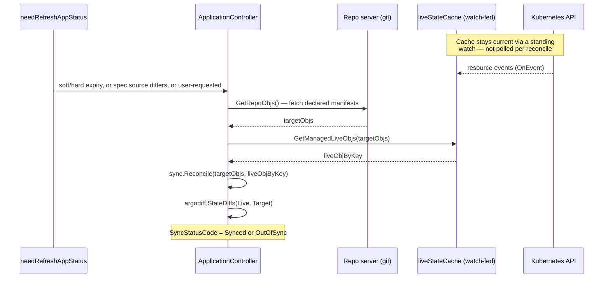

**TL;DR:** A traditional CD pipeline pushes changes into a cluster by handing a CI job cluster-admin credentials and running `kubectl apply` once, at the end of a build — after that, nothing is watching, so a manual `kubectl edit` or a half-applied rollout just sits there uncorrected until the next deploy. GitOps flips the direction: an in-cluster controller continuously fetches the declared state from git, diffs it against what's actually running, and re-converges the cluster toward git on its own — no pipeline holds a cluster credential, and drift gets caught, not just deploys.
> **In plain English (30 sec):** Think of this like concepts you already use, but in a production system at scale.


## 1. The Engineering Problem

Push-based CD looks simple on a diagram: code merges, CI builds it, CI runs `kubectl apply -f` (or `helm upgrade`) against the target cluster, done. Three things break once this runs for real:

- **The CI system needs a standing credential with write access to the cluster.** Every pipeline run, and every plugin or dependency that pipeline pulls in, now sits inside the cluster's trust boundary — a credential leak in CI is a credential leak into production, not a contained CI-only incident.
- **A deploy is a one-shot action, not an ongoing guarantee.** Once `kubectl apply` returns successfully, the pipeline's job is done — nothing about push-based CD keeps checking that the cluster still matches what was applied. A manual `kubectl edit` to "quickly patch prod," a controller mutating a resource in a way that later gets reverted, or a partially-failed apply all leave the cluster silently diverged from what git says should be running, and nothing notices until the next deploy happens to overwrite it.
- **There's no single place to answer "is the cluster in the state git says it should be, right now?"** The pipeline's logs show what was applied at deploy time; they don't show current, live drift.

## 2. The Technical Solution

A GitOps controller runs *inside* the cluster (or with cluster-scoped read/write access it manages itself) and does two things continuously, not once: it fetches the **target state** from git, and it watches the **live state** already running in the cluster — then it diffs the two and re-applies only what's actually different. `argoproj/argo-cd`, the dominant open-source GitOps controller, implements exactly this as its `ApplicationController`'s reconcile loop.

Two mechanisms make this different from a naive "poll everything on a timer" loop:

- **Reconciliation isn't purely time-based.** Argo CD's `needRefreshAppStatus` decides whether an `Application` needs re-comparing based on several independent triggers — a soft expiry timer, a longer hard-expiry fallback, an explicit user-requested refresh, or the app's `spec.source` no longer matching what was last synced — not just "N seconds have passed."
- **The live side of the diff is a watch-based cache, not a fresh API call per reconcile.** `GetManagedLiveObjs` reads from an in-memory `liveStateCache` that's kept current by a Kubernetes watch (`clusterCache.OnEvent`), so comparing target-vs-live doesn't mean hammering the API server on every reconcile — the controller already knows the live state because it's been streaming updates continuously.



Two core truths this diagram is showing:

- **Git is fetched, never pushed to.** Nothing in this loop accepts an inbound deploy request — the controller decides when to pull, based on its own refresh logic, not a webhook triggering an apply.
- **The diff runs against a resource the controller already has in memory.** The "live" side of the comparison isn't a fresh, per-reconcile round trip to the API server for every managed object — it's a lookup into a cache that a standing watch keeps synchronized.

## 3. The clean example (concept in isolation)

```go
// A minimal reconcile loop, isolated from Argo CD's full machinery.
// Real controller-runtime code follows this same shape: compare
// declared vs. observed, act only on the delta.
func reconcile(declared, observed map[string]Resource) (inSync bool) {
	for key, want := range declared {
		got, exists := observed[key]
		if !exists || !want.Equal(got) {
			apply(want) // only touches what actually differs
			return false
		}
	}
	return true // live state already matches git — nothing to do
}
```

Even at this scale, the shape is the whole point: `declared` always comes from git, `observed` always comes from the cluster, and `apply` only fires for the delta — never a blind full re-apply of everything on every tick.

## 4. Production reality (from the real repo)

```
argo-cd/
└── controller/
    ├── appcontroller.go   — needRefreshAppStatus: when to reconcile
    ├── state.go           — CompareAppState: fetch target, diff vs live
    └── cache/
        └── cache.go       — liveStateCache: watch-fed live-object cache
```

`needRefreshAppStatus` decides *when* an `Application` gets re-compared — not on a single fixed interval, but from several independent signals:

```go
func (ctrl *ApplicationController) needRefreshAppStatus(app *appv1.Application, statusRefreshTimeout, statusHardRefreshTimeout time.Duration) (bool, appv1.RefreshType, CompareWith) {
	compareWith := CompareWithLatest
	refreshType := appv1.RefreshTypeNormal

	softExpired := app.Status.ReconciledAt == nil || app.Status.ReconciledAt.Add(statusRefreshTimeout).Before(time.Now().UTC())
	hardExpired := (app.Status.ReconciledAt == nil || app.Status.ReconciledAt.Add(statusHardRefreshTimeout).Before(time.Now().UTC())) && statusHardRefreshTimeout.Seconds() != 0

	if requestedType, ok := app.IsRefreshRequested(); ok {
		compareWith = CompareWithLatestForceResolve
		refreshType = requestedType
		// user requested app refresh.
	} else {
		if !currentSourceEqualsSyncedSource(app) {
			// spec.source differs — re-resolve immediately, don't wait for expiry
			compareWith = CompareWithLatestForceResolve
		} else if hardExpired || softExpired {
			if hardExpired {
				refreshType = appv1.RefreshTypeHard
			}
			// comparison expired, requesting refresh
		}
		// ...additional triggers: destination changed, ignoreDifferences
		// changed, or an explicit controller-level refresh request
	}
	return /* whether a refresh is needed */, refreshType, compareWith
}
```

`CompareAppState` is where the actual pull-and-diff happens — target objects come from git, live objects come from the watch-fed cache, and only then does a diff run:

```go
// targetObjsForSync holds manifests rendered from the git-tracked source —
// fetched via GetRepoObjs earlier in this same function.
reconciliation := sync.Reconcile(targetObjsForSync, liveObjByKey, app.Spec.Destination.Namespace, infoProvider)

diffConfig, _ := diffConfigBuilder.Build()

diffResults, retErr = argodiff.StateDiffs(ctx, reconciliation.Live, reconciliation.Target, diffConfig)
```

And `liveObjByKey` — the "live" side of that diff — comes from `GetManagedLiveObjs`, which reads a cache kept current by a standing Kubernetes watch, not a fresh list call per reconcile:

```go
// controller/cache/cache.go
_ = clusterCache.OnEvent(func(_ watch.EventType, un *unstructured.Unstructured) {
	// updates the in-memory cache as the cluster changes,
	// independent of any Application's reconcile cycle
})

func (c *liveStateCache) GetManagedLiveObjs(destCluster *appv1.Cluster, a *appv1.Application, targetObjs []*unstructured.Unstructured) (map[kube.ResourceKey]*unstructured.Unstructured, error) {
	// looks up already-cached live objects — the watch above
	// is what keeps this cache accurate, not this call itself
	// ...
}
```

What this teaches that a hello-world can't:

- **Refresh timing is multi-signal, not a single poll interval.** A soft expiry, a longer hard-expiry fallback, and immediate re-resolution on `spec.source` drift are three different reasons to reconcile — collapsing them into "poll every 3 minutes" loses the fast-path for an actual git change.
- **The live side of the diff is decoupled from the reconcile trigger.** `GetManagedLiveObjs` doesn't talk to the Kubernetes API when a reconcile fires — it reads a cache a watch has already been keeping current, which is what lets Argo CD manage many applications without a live API round-trip per app per reconcile.
- **`sync.Reconcile` + `StateDiffs` is a two-step process, not one comparison.** Reconcile first pairs up target and live objects by resource key; only then does `StateDiffs` compute what's actually different between each pair — the pairing step is what makes "this target object has no live counterpart yet" (needs creating) distinguishable from "this pair differs" (needs patching).

## 5. Review checklist

- **Does anything outside the cluster hold a standing deploy credential?** If a CI pipeline still runs `kubectl apply`/`helm upgrade` directly against this cluster, the GitOps controller isn't actually the thing making changes — verify the controller's service account is what has write access, not CI's.
- **Is `spec.source` (repo/path/revision) the only thing that should trigger an out-of-cycle refresh, or is something else bypassing the normal soft/hard expiry timers?** `needRefreshAppStatus`'s drift-triggered `CompareWithLatestForceResolve` path exists specifically so a real git change doesn't wait for the next timer tick — a config that disables or works around this reintroduces the "stale until next deploy" problem GitOps is supposed to fix.
- **Does a manual, out-of-band cluster change (a `kubectl edit`, another controller mutating a resource) get caught as `OutOfSync`, or does something suppress the diff for that resource?** If not, check `spec.ignoreDifferences` isn't silently masking real drift rather than a deliberately-excluded, expected-to-differ field (e.g. a field a mutating webhook legitimately owns).
- **Is the live-state cache actually current for the resources this app manages?** A watch that's fallen behind or a cluster the controller lost connectivity to produces a diff against stale cached data — the reconcile loop's correctness depends on the watch, not just on the reconcile trigger firing.

## 6. FAQ

**Q: Doesn't watching every resource in a cluster for changes not scale to a very large cluster?**
A: The live-state cache is per registered cluster, not per `Application` — many `Application` resources managed by the same Argo CD instance against the same cluster share one watch-fed cache (`GetManagedLiveObjs` is a lookup, not a new watch each call), which is exactly what keeps this cheaper than a naive "list everything, for every app, on every reconcile" approach.

**Q: If `needRefreshAppStatus` has a hard-expiry fallback, doesn't that mean Argo CD is still just polling underneath the "event-driven" framing?**
A: Partially, and deliberately — the hard expiry is a safety net for changes the fast paths might miss (e.g. a webhook that failed to fire), not the primary mechanism. The `spec.source` drift check and explicit refresh requests are what make routine git changes get picked up quickly; the hard-expiry timer exists so the system is still eventually correct even if a faster trigger is missed, not because polling is the intended steady-state behavior.

**Q: What actually decides an app is `OutOfSync` versus `Synced`?**
A: `argodiff.StateDiffs`, called on the paired-up `reconciliation.Live` and `reconciliation.Target` objects — it compares the two states field-by-field (with configurable ignore rules via `diffConfig`) and the result of that comparison is what sets the app's `SyncStatusCode`, not a simpler "did `kubectl apply` report changes" heuristic.

**Q: Is `sync.Reconcile` here the same "reconciliation" concept as a generic Kubernetes controller's reconcile loop?**
A: Same underlying idea (observed state vs. desired state, converge the delta), but this is Argo CD's own pairing/diffing step for git-sourced manifests against a specific `Application`'s live objects — not the generic controller-runtime `Reconcile(ctx, req)` pattern a custom Kubernetes operator would implement, even though both are instances of the same observed-vs-desired principle.

---

## Source

- **Concept:** Pull-based GitOps deployment and the reconciliation loop
- **Domain:** gitops
- **Repo:** [argoproj/argo-cd](https://github.com/argoproj/argo-cd) → [`controller/appcontroller.go`](https://github.com/argoproj/argo-cd/blob/master/controller/appcontroller.go), [`controller/state.go`](https://github.com/argoproj/argo-cd/blob/master/controller/state.go), [`controller/cache/cache.go`](https://github.com/argoproj/argo-cd/blob/master/controller/cache/cache.go) — the dominant open-source GitOps continuous-delivery controller for Kubernetes


