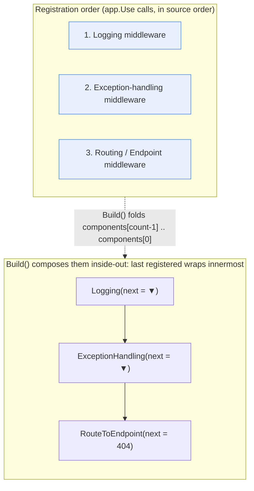

**TL;DR:** `app.Use(...)`/`app.MapGet(...)` calls in a Minimal API look like they're building a list the framework walks through per-request, checking "does this middleware apply?" one by one — but ASP.NET Core composes them once, at startup, into a single nested chain of function calls (`RequestDelegate`s wrapping `RequestDelegate`s), registered last-to-first so the *first* `app.Use(...)` call ends up as the *outermost* wrapper. There's no list being iterated at request time — just one function calling the next.

## 1. The Engineering Problem

A request-handling pipeline needs to run several independent concerns — logging, authentication, exception handling, routing, and finally the actual endpoint — in a fixed order, with each stage able to run code *both* before and after everything downstream of it (log the request, call onward, then log the response; catch an exception thrown by anything downstream). Two naive designs both fall short:

- **A single big function with `if` branches for each concern** doesn't compose — adding a new cross-cutting concern (say, response compression) means editing that one function again, and there's no way for one piece of logic to run code both before and after "everything downstream," which authentication and exception-handling middleware both need.
- **A list of independent handler objects the framework iterates and calls in a `for` loop** solves ordering, but not the "before *and* after downstream work" problem either — a plain iteration has no natural place for a handler to run cleanup code after everything later in the list has already finished.

What's actually needed is something more like nested function calls: each middleware wraps *everything after it*, so it can run code before calling into that wrapped continuation, and more code after that call returns.

## 2. The Technical Solution

ASP.NET Core's `IApplicationBuilder.Use(Func<RequestDelegate, RequestDelegate> middleware)` doesn't add to a list that gets iterated later — each registered middleware is itself a function that takes "the rest of the pipeline" (a `RequestDelegate`) and returns a new `RequestDelegate` that wraps it. `ApplicationBuilder.Build()` composes all of them into one final delegate by folding from the *last*-registered middleware inward to the *first*, so the first `app.Use(...)` call becomes the outermost function — the first thing that runs on the way in, and the last thing that runs on the way out.



Two core truths this diagram is showing:

- **Order of registration decides nesting, not list position checked per-request.** `Build()` starts from a default "404, nothing matched" `RequestDelegate` and wraps it with each middleware from last-registered to first — so the *first* `app.Use(...)` ends up as the outermost call, which is exactly why logging middleware registered first can see the response *after* everything else (including exception handling) has already run.
- **A middleware's `next` parameter isn't "the next item in a list" — it's the entire rest of the pipeline as one callable.** Calling `next(context)` from inside a middleware runs everything downstream (including, eventually, the endpoint itself); a middleware that never calls `next` short-circuits the whole rest of the pipeline.

## 3. The clean example (concept in isolation)

```csharp
// A minimal stand-in for ApplicationBuilder.Build() — same fold,
// same reverse-order composition, none of the real framework's
// diagnostics/debugger-view scaffolding around it.
Func<Task> BuildPipeline(List<Func<Func<Task>, Func<Task>>> middleware)
{
    Func<Task> app = () => Task.CompletedTask; // terminal: nothing matched
    for (int i = middleware.Count - 1; i >= 0; i--)
    {
        app = middleware[i](app); // each wraps everything built so far
    }
    return app;
}

// Registered in this order...
var pipeline = BuildPipeline(new()
{
    next => async () => { Console.WriteLine("-> logging in");  await next(); Console.WriteLine("<- logging out"); },
    next => async () => { Console.WriteLine("-> auth check");  await next(); },
});
// ...runs as: logging in -> auth check -> (terminal) -> logging out
```

Even at this scale, the shape is identical to the real framework: the *last* item in the list ends up as the *innermost* call, and the first item wraps everything — which is why it's the only one that gets to run code after the terminal delegate returns.

## 4. Production reality (from the real repo)

```
aspnetcore/
└── src/
    ├── Http/Http/src/Builder/
    │   └── ApplicationBuilder.cs         — Use()/Build(): the fold itself
    ├── DefaultBuilder/src/
    │   └── WebApplication.cs             — Minimal API's IApplicationBuilder + IEndpointRouteBuilder
    └── Http/Routing/src/Builder/
        └── EndpointRouteBuilderExtensions.cs  — MapGet/MapPost: how an endpoint joins the pipeline
```

`ApplicationBuilder.Use` just appends to a plain list — the actual composition happens entirely in `Build()`:

```csharp
public IApplicationBuilder Use(Func<RequestDelegate, RequestDelegate> middleware)
{
    _components.Add(middleware);
    _descriptions?.Add(CreateMiddlewareDescription(middleware));
    return this;
}

public RequestDelegate Build()
{
    RequestDelegate app = context =>
    {
        // If we reach the end of the pipeline, but we have an endpoint, then
        // something unexpected has happened...
        var endpoint = context.GetEndpoint();
        var endpointRequestDelegate = endpoint?.RequestDelegate;
        if (endpointRequestDelegate != null)
        {
            throw new InvalidOperationException(/* ...missing UseEndpoints()... */);
        }
        if (!context.Response.HasStarted)
        {
            context.Response.StatusCode = StatusCodes.Status404NotFound;
        }
        return Task.CompletedTask;
    };

    for (var c = _components.Count - 1; c >= 0; c--)
    {
        app = _components[c](app);
    }

    return app;
}
```

`Build()`'s loop runs from `_components.Count - 1` down to `0` — the *last* `app.Use(...)` call gets wrapped first (becoming the innermost function, closest to the terminal 404 delegate), and the *first* `app.Use(...)` call is wrapped last, making it the outermost function actually invoked per request.

`WebApplication` — what `var app = builder.Build()` returns in a Minimal API — implements `IApplicationBuilder` itself, holding one real `ApplicationBuilder` internally that every `app.Use(...)` call still goes through:

```csharp
public sealed class WebApplication : IHost, IApplicationBuilder, IEndpointRouteBuilder, IAsyncDisposable
{
    internal ApplicationBuilder ApplicationBuilder { get; }

    internal RequestDelegate BuildRequestDelegate() => ApplicationBuilder.Build();
    RequestDelegate IApplicationBuilder.Build() => BuildRequestDelegate();

    public IApplicationBuilder Use(Func<RequestDelegate, RequestDelegate> middleware)
    {
        ApplicationBuilder.Use(middleware);
        return this;
    }
}
```

`app.MapGet(...)` doesn't add a middleware to that same list at all — it registers a `RouteEndpoint` into a separate `EndpointDataSource`, which the routing middleware (already part of the pipeline) matches against and ultimately invokes as the terminal step:

```csharp
public static RouteHandlerBuilder MapGet(
    this IEndpointRouteBuilder endpoints,
    [StringSyntax("Route")] string pattern,
    Delegate handler)
{
    return MapMethods(endpoints, pattern, GetVerb, handler);
}

public static RouteHandlerBuilder MapMethods(
   this IEndpointRouteBuilder endpoints,
   [StringSyntax("Route")] string pattern,
   IEnumerable<string> httpMethods,
   Delegate handler)
{
    return endpoints.Map(RoutePatternFactory.Parse(pattern), handler, httpMethods, isFallback: false);
}
```

What this teaches that a hello-world can't:

- **`Use()` and `Build()` are two different moments — registration-time list append, then one startup-time fold.** Nothing about the per-request path re-checks or re-orders middleware; the entire pipeline shape is fixed the moment `Build()` runs.
- **The reverse-order loop (`Count - 1` down to `0`) is the entire mechanism behind "first registered = outermost."** There's no separate concept of before/after hooks — a middleware runs code before *and* after simply by writing code on both sides of its `await next(context)` call, because it *is* the outer function wrapping everything downstream.
- **A Minimal API endpoint isn't just another middleware in `_components`.** `MapGet` goes through an entirely separate `EndpointDataSource`/routing path — it becomes reachable only because routing middleware (itself registered via `Use`-based composition, typically implicitly by `WebApplication`) matches the request and invokes the matched endpoint's own delegate.
- **The default terminal delegate's 404 is a real fallback, not a framework nicety.** `Build()`'s starting `RequestDelegate` explicitly throws if an endpoint was matched but never invoked (a missing `UseEndpoints` wiring) and otherwise sets 404 — the "nothing handled this request" case is explicit code, not silent framework magic.

## 5. Review checklist

- **Does middleware registration order actually match the intended before/after behavior?** Since `Build()` makes the *first*-registered `Use()` the *outermost* wrapper, a logging or exception-handling middleware that needs to see everything downstream (including failures) must be registered before routing/endpoint middleware, not after.
- **Does every middleware that isn't meant to short-circuit actually call `next(context)`?** A middleware that returns without invoking its `next` delegate silently stops the entire rest of the pipeline — including the endpoint itself — with no exception to signal it.
- **Is a Minimal API endpoint's logic that needs to run for *every* request (e.g. auth) actually registered as pipeline middleware, or mistakenly assumed to run because it's "in the same file" as `app.MapGet(...)`?** Endpoint handlers only run after routing matches — they are not part of the `_components` chain and can't intercept requests that never reach routing.
- **Would this same before/after ordering still hold if two middlewares were reordered?** If reordering two `app.Use(...)` calls changes behavior in a way that isn't intended (e.g. authentication accidentally running after a middleware that already trusted `context.User`), that's a real bug this fold-based composition will faithfully reproduce, not paper over.

## 6. FAQ

**Q: If `Use()` just appends to `_components`, when does `Build()` actually run for a Minimal API app?**
A: `WebApplicationBuilder.Build()` (the one returning `WebApplication`) is a separate call from `ApplicationBuilder.Build()` (the one producing the final `RequestDelegate`) — the latter runs when the host starts processing requests, via `WebApplication.BuildRequestDelegate()`, after all `app.Use(...)`/`app.Map...(...)` calls in `Program.cs` have already executed and populated `_components`/`DataSources`.

**Q: Does calling `app.Use(...)` twice with the same middleware type run it twice per request?**
A: Yes — `Use()` has no deduplication; each call appends another entry to `_components`, and `Build()` wraps each one as its own layer. Two identical `app.UseAuthentication()` calls genuinely produce two nested authentication-checking layers, not one deduplicated one.

**Q: Why does `Build()`'s default terminal delegate distinguish "an endpoint was matched but its delegate is null" from "nothing matched at all"?**
A: Because those are different failure modes with different fixes — a matched-but-unexecuted endpoint means routing found the right endpoint but nothing in the pipeline ever invoked it (almost always a missing `UseEndpoints`-equivalent wiring), while no match at all is a normal 404. Collapsing them into one generic 404 would hide a wiring bug behind an ordinary "route not found" response.

**Q: Is `IEndpointRouteBuilder.MapGet` part of the same `Func<RequestDelegate, RequestDelegate>` composition as `IApplicationBuilder.Use`?**
A: No — `MapGet`/`MapMethods`/`Map` add to `DataSources` (a separate `ICollection<EndpointDataSource>`), not to `_components`. The two composition mechanisms only connect at the point where routing middleware — itself added via the normal `Use`-based pipeline — matches a request against those data sources and invokes the winning endpoint's own delegate as the last step.

---

## Source

- **Concept:** Minimal APIs and the ASP.NET Core middleware pipeline
- **Domain:** dotnet
- **Repo:** [dotnet/aspnetcore](https://github.com/dotnet/aspnetcore) → [`src/Http/Http/src/Builder/ApplicationBuilder.cs`](https://github.com/dotnet/aspnetcore/blob/main/src/Http/Http/src/Builder/ApplicationBuilder.cs), [`src/DefaultBuilder/src/WebApplication.cs`](https://github.com/dotnet/aspnetcore/blob/main/src/DefaultBuilder/src/WebApplication.cs), [`src/Http/Routing/src/Builder/EndpointRouteBuilderExtensions.cs`](https://github.com/dotnet/aspnetcore/blob/main/src/Http/Routing/src/Builder/EndpointRouteBuilderExtensions.cs) — the real ASP.NET Core framework source


