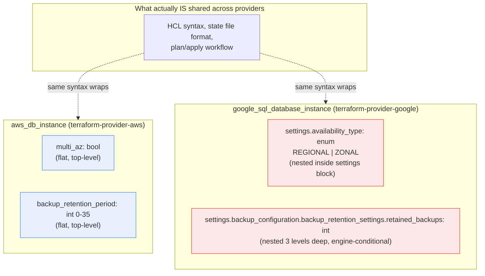

**TL;DR:** Is running the same managed-database concept on both AWS and GCP just a matter of writing the Terraform twice with a different provider block — same shape, different names? No: AWS RDS and GCP Cloud SQL model "highly available" and "backup retention" as structurally different kinds of fields (a flat boolean vs. a nested configuration block with its own enum), so multi-cloud isn't portability you get for free from Terraform's shared HCL syntax — it's real, ongoing dual-maintenance engineering work, which is exactly why it should be adopted for a specific driver (redundancy/DR, data residency, avoiding single-vendor leverage), not as a default "just in case" hedge.

## 1. The Engineering Problem

Multi-cloud is often pitched as low-cost insurance: "we use Terraform, so if we ever need to move off a provider, we just point the same config at a different one." That framing quietly assumes two clouds' resources for the same concept — "a managed, highly-available Postgres database" — are shaped the same way underneath one shared IaC syntax, and only the provider name changes.

That assumption is false in a way that's checkable, not a matter of opinion: the actual Terraform resource schemas for AWS RDS and GCP Cloud SQL don't just use different field *names* for the same concepts — they use different field *shapes*. One models high availability as a flat boolean on the resource; the other models it as an enum inside a nested settings block, with its own conditional requirements per database engine. A team that adopts multi-cloud for a vague "avoid lock-in" reason ends up paying to write, test, and keep in sync two structurally different configurations for every resource type it uses — real, continuous engineering cost, not a one-time provider swap. That cost is worth paying when there's a specific driver (a compliance requirement forcing data into a specific region a primary cloud doesn't serve, a real DR requirement, genuine negotiating leverage) — it's not worth paying by default.

## 2. The Technical Solution

Terraform's HCL syntax and workflow (`plan`/`apply`/state) genuinely are shared across providers — that part of the pitch is true. What's *not* shared is what sits inside a `resource` block: each provider's schema is independently defined Go code, written by that provider's own maintainers to match that cloud's actual API, with no requirement that two providers model the same real-world concept the same way.



Two core truths this diagram is showing:

- **"Highly available" isn't the same kind of field on both clouds.** AWS's `multi_az` is a single top-level boolean. GCP's equivalent, `availability_type`, is a string enum (`"REGIONAL"` vs `"ZONAL"`) nested inside a `settings` block — and GCP's own schema comments note it only takes effect correctly if the matching `backup_configuration` flags are also set for that database engine. A module that abstracts "make this database HA" into one shared variable still has to branch internally on provider to know which shape to write.
- **"Backup retention" isn't even at the same nesting depth.** AWS keeps it as one flat integer (`backup_retention_period`, 0–35). GCP nests it three levels deep (`settings.backup_configuration.backup_retention_settings.retained_backups`), with a separate `retention_unit` field and per-engine fields (`binary_log_enabled` for MySQL, `point_in_time_recovery_enabled` for Postgres) that don't exist on the AWS side at all.

## 3. The clean example (concept in isolation)

```hcl
# The same real-world intent — "HA Postgres, retain 7 days of backups" —
# written for two providers. Nothing here is abbreviated for the demo;
# this is the actual shape difference, just with a toy instance name.

resource "aws_db_instance" "example" {
  engine                  = "postgres"
  multi_az                = true   # flat boolean
  backup_retention_period = 7      # flat integer
}

resource "google_sql_database_instance" "example" {
  database_version = "POSTGRES_15"
  settings {
    availability_type = "REGIONAL"  # enum, nested inside settings
    backup_configuration {
      enabled                        = true
      point_in_time_recovery_enabled = true   # Postgres-specific; MySQL uses binary_log_enabled instead
      backup_retention_settings {
        retained_backups = 7
        retention_unit    = "COUNT"           # a unit AWS's flat integer has no equivalent for
      }
    }
  }
}
```

Same declared intent, two genuinely different tree shapes — a module trying to hide this behind one shared input variable still needs provider-specific branches internally; it can't just template the value into a differently-named field.

## 4. Production reality (from the real repo)

```
terraform-provider-aws/
└── internal/service/rds/
    └── instance.go                        — aws_db_instance schema

terraform-provider-google/
└── google/services/sql/
    └── resource_sql_database_instance.go   — google_sql_database_instance schema
```

AWS RDS's relevant fields sit flat on the resource, siblings of dozens of other top-level arguments:

```go
"backup_retention_period": {
    Type:         schema.TypeInt,
    Optional:     true,
    Computed:     true,
    ValidateFunc: validation.IntBetween(0, 35),
},
// ...
"multi_az": {
    Type:     schema.TypeBool,
    Optional: true,
    Computed: true,
},
```

GCP Cloud SQL's equivalents are nested inside `settings`, and backup retention specifically is nested a further two levels beyond that, with engine-conditional siblings AWS's schema has no equivalent for:

```go
"availability_type": {
    Type:         schema.TypeString,
    Optional:     true,
    Default:      "ZONAL",
    ValidateFunc: validation.StringInSlice([]string{"REGIONAL", "ZONAL"}, false),
    // For MySQL: settings.backup_configuration.binary_log_enabled must be true.
    // For Postgres: settings.backup_configuration.point_in_time_recovery_enabled must be true.
},
"backup_configuration": {
    Type:     schema.TypeList,
    Optional: true,
    MaxItems: 1,
    Elem: &schema.Resource{
        Schema: map[string]*schema.Schema{
            "binary_log_enabled": { /* MySQL-only */ },
            "point_in_time_recovery_enabled": { /* Postgres-only */ },
            "backup_retention_settings": {
                Type:     schema.TypeList,
                MaxItems: 1,
                Elem: &schema.Resource{
                    Schema: map[string]*schema.Schema{
                        "retained_backups": {
                            Type:        schema.TypeInt,
                            Required:    true,
                        },
                        "retention_unit": {
                            Type:    schema.TypeString,
                            Default: "COUNT",
                        },
                    },
                },
            },
        },
    },
},
```

What this teaches that a hello-world can't:

- **The divergence is structural, not cosmetic.** This isn't "AWS calls it `multi_az` and GCP calls it `ha_enabled`" — a rename a find-and-replace could fix. `multi_az` is a leaf boolean; `availability_type` is an enum three schema levels shallower than where its own conditional dependencies (`backup_configuration`'s engine-specific flags) live. No template variable substitution collapses that difference.
- **Engine-conditional fields mean the "same" resource schema isn't even self-consistent across database engines within one provider.** GCP's `binary_log_enabled` vs `point_in_time_recovery_enabled` split means a Cloud SQL module already has to branch on MySQL-vs-Postgres before it ever gets to the cross-cloud AWS-vs-GCP question.
- **`ValidateFunc: validation.IntBetween(0, 35)` vs a separate `retention_unit` field encodes different underlying product limits, not just different naming.** AWS caps retention at 35 days, full stop; GCP's `retained_backups` count is paired with a `retention_unit` that could (per its own schema) mean something other than days. A migration between the two isn't a value copy — it requires understanding what each provider's number actually represents.

## 5. Review checklist

- **Is this multi-cloud decision backed by a specific, named driver** (a compliance/data-residency requirement, a real DR/RTO-RPO target, documented negotiating leverage) **or is "avoid lock-in" doing the work by itself?** If nobody can name the specific requirement, the ongoing dual-schema maintenance cost this lesson demonstrates is being paid for a hedge, not a need.
- **Does a shared Terraform module for this resource type actually abstract the schema divergence, or does it just parameterize provider-specific field names and leave the shape mismatch (flat vs. nested, engine-conditional fields) for the caller to handle?** A module that only swaps names while still requiring the caller to know GCP's nesting and AWS's doesn't is providing less abstraction than its interface implies.
- **For any field with a numeric limit (retention days, IOPS, storage size), has the actual per-provider limit and unit been verified against that provider's schema/docs, not assumed to match the other provider's number?** `backup_retention_period`'s `IntBetween(0, 35)` and Cloud SQL's `retained_backups` + `retention_unit` pair are the concrete example — assuming they're interchangeable is exactly the kind of parity assumption that breaks silently.
- **If this is a genuinely asymmetric multi-cloud setup (per the "why multi-cloud, really" driver), does the IaC actually reflect that asymmetry, or is it forcing artificial parity between providers that don't need to match?** Real multi-cloud is usually deliberately asymmetric, not a mirrored deployment on both sides — see the domain's known-stale-facts note on this.

## 6. FAQ

**Q: Doesn't a tool like Crossplane or a well-written Terraform module solve this by abstracting the schema difference away?**
A: It can reduce the *authoring* cost — a Crossplane Composition or a shared module can hide the AWS/GCP schema shape behind one input interface — but the underlying divergence (what `retained_backups` + `retention_unit` actually mean vs. a flat `backup_retention_period` day count) still has to be handled *somewhere* in that abstraction's own code. The engineering cost doesn't disappear; it moves from "every caller handles it" to "the abstraction's maintainer handles it once" — which is a real improvement, but not the same as the difference not existing.

**Q: If the syntax and workflow are shared, isn't switching providers still easier with Terraform than without it?**
A: Yes — Terraform genuinely removes the *tooling* difference (a different CLI, a different state model, a different plan/apply flow per cloud). This lesson's point is narrower: it removes the tooling difference, not the resource-schema difference. Conflating "same IaC tool" with "same resource shape" is exactly the assumption that turns an underestimated multi-cloud migration into a surprise.

**Q: Is this schema divergence specific to managed databases, or does it show up elsewhere?**
A: It's general — RDS vs. Cloud SQL is just a concrete, easily-inspected example. The same pattern (a concept both clouds support, modeled with genuinely different field shapes and nesting) recurs in load balancers, IAM binding models, and storage lifecycle rules; later posts in this domain's curriculum cover several of those directly (multi-cloud networking, identity federation, storage abstractions).

**Q: Does this mean "avoid vendor lock-in" is always the wrong reason to go multi-cloud?**
A: Not always wrong — but it needs to be a real, specific requirement (contractual leverage a business genuinely needs, a documented compliance constraint) to be worth this lesson's demonstrated ongoing cost. "Lock-in sounds bad in the abstract" isn't the same as a requirement, and that distinction is the domain's very first curriculum topic for a reason.

---

## Source

- **Concept:** The real engineering cost behind multi-cloud portability claims
- **Domain:** multicloud
- **Repo:** [hashicorp/terraform-provider-aws](https://github.com/hashicorp/terraform-provider-aws) → [`internal/service/rds/instance.go`](https://github.com/hashicorp/terraform-provider-aws/blob/main/internal/service/rds/instance.go); [hashicorp/terraform-provider-google](https://github.com/hashicorp/terraform-provider-google) → [`google/services/sql/resource_sql_database_instance.go`](https://github.com/hashicorp/terraform-provider-google/blob/main/google/services/sql/resource_sql_database_instance.go) — the real, independently-maintained Terraform provider schemas for AWS RDS and GCP Cloud SQL


