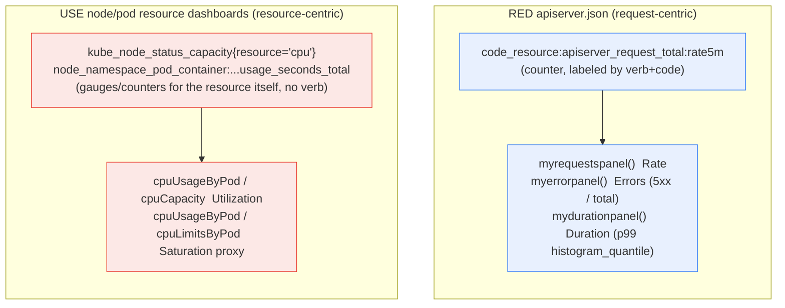



**TL;DR:** RED (Rate, Errors, Duration) and USE (Utilization, Saturation, Errors) both sound like "pick three metrics and put them on a dashboard"  but they're not the same three panels with different labels. RED is built from request counters and duration histograms, always scoped to an operation a caller performed; USE is built from capacity/usage/limit gauges, scoped to a resource that has no idea a "request" even happened. A real dashboard-as-code project, `kubernetes-monitoring/kubernetes-mixin`, implements them as genuinely different Grafana panel functions querying genuinely different Prometheus metric shapes.

> **In plain English (30 sec):** Logs with traceId that follows request across services.

## 1. The Engineering Problem

A dashboard built without a method turns into a scrapbook: whatever metric happened to already exist gets a panel, in whatever order someone added them, answering no particular question reliably. Two engineers each asked to "build a dashboard for this service" produce two different, incomparable layouts.

RED and USE exist to fix that by forcing a specific question per panel  but they're often taught as interchangeable "pick three things" checklists, which causes a real mistake: applying RED's question ("how is this service performing for its callers?") to a resource that has no callers (a node's CPU doesn't have a "request rate"), or applying USE's question ("how close to its ceiling is this resource?") to a service that has no fixed ceiling to be close to (an API endpoint doesn't have a "capacity" the way a disk does). The two methods aren't a menu of the same three ingredients  they're answers to two different questions, built from two different shapes of underlying metric.

## 2. The Technical Solution

**RED is request-centric.** It answers "is this service doing its job for the things calling it?"  Rate (how many requests/sec), Errors (what fraction failed), Duration (how long they took). Its source metrics are always counters/histograms keyed by an operation: a request-total counter, a request-duration histogram, both labeled by something like `verb` or `code`.

**USE is resource-centric.** It answers "is this resource about to become the bottleneck?"  Utilization (how much of its capacity is in use), Saturation (how much demand is queued waiting for it, or how close usage sits to a hard limit), Errors (resource-level errors, e.g. device errors, not request failures). Its source metrics are always capacity/usage/limit *gauges* for the resource itself  no "operation" or "verb" involved at all.

`kubernetes-monitoring/kubernetes-mixin`, a real, widely-deployed Jsonnet/Grafonnet project that generates actual Grafana dashboard JSON, implements both  as genuinely different panel-building functions over genuinely different query shapes, in the same repo.



Two core truths this diagram is showing:

- **RED's panels are always ratios or rates *of requests*; USE's panels are always ratios *of a resource's own usage to its own ceiling*.** `myerrorpanel` divides error-count-by-verb by total-count-by-verb; `cpuUsageVsLimits` divides one resource-usage gauge by another resource-limit gauge  structurally similar (both are ratios), but the numerator and denominator come from entirely different metric families.
- **Both methods repeat their pattern across scopes, but the scope means something different in each.** RED repeats per HTTP verb (read/write) because different operations genuinely behave differently. USE repeats per resource type (CPU, memory) because different resources genuinely saturate differently  neither repetition is arbitrary.

## 3. The clean example (concept in isolation)

```promql
# RED shape: everything keyed by an operation, from counters/histograms
sum by (code) (rate(http_requests_total{route="/checkout"}[5m]))              # Rate
sum(rate(http_requests_total{route="/checkout",code=~"5.."}[5m]))
  / sum(rate(http_requests_total{route="/checkout"}[5m]))                     # Errors
histogram_quantile(0.99, rate(http_request_duration_seconds_bucket{route="/checkout"}[5m]))  # Duration

# USE shape: everything keyed by a resource, from capacity/usage gauges
sum(container_cpu_usage_seconds_total{pod="checkout-abc"}) / sum(kube_node_status_capacity{resource="cpu"})  # Utilization
sum(container_cpu_usage_seconds_total{pod="checkout-abc"}) / sum(kube_pod_container_resource_limits{resource="cpu"})  # Saturation proxy
```

No `route`, `verb`, or "operation" concept appears anywhere in the USE queries  that absence is the whole point. A resource being 90% utilized doesn't know or care which endpoint's traffic put it there.

## 4. Production reality (from the real repo)

```
kubernetes-mixin/
+-- dashboards/
    +-- apiserver.libsonnet                   RED: myrequestspanel/myerrorpanel/mydurationpanel
    +-- resources/
        +-- node.libsonnet                    USE: CPU/Memory usage vs capacity/limits panels
        +-- queries/node.libsonnet            the actual PromQL behind those USE panels
```

The RED panel functions in `apiserver.libsonnet` are three separate, purpose-built panel builders  not one generic "metric panel" reused three times with different inputs:

```jsonnet
local myrequestspanel(title, description, query) =
  timeSeries.new(title)
  + timeSeries.standardOptions.withUnit('reqps')
  + timeSeries.queryOptions.withTargets([
    g.query.prometheus.new('${datasource}', query)
    + g.query.prometheus.withLegendFormat('{{ code }}'),
  ]),

local myerrorpanel(title, description, query) =
  timeSeries.new(title)
  + timeSeries.standardOptions.withUnit('percentunit')
  + timeSeries.standardOptions.withMin(0)
  + timeSeries.queryOptions.withTargets([
    g.query.prometheus.new('${datasource}', query)
    + g.query.prometheus.withLegendFormat('{{ resource }}'),
  ]),

local mydurationpanel(title, description, query) =
  timeSeries.new(title)
  + timeSeries.standardOptions.withUnit('s')
  + timeSeries.queryOptions.withTargets([
    g.query.prometheus.new('${datasource}', query)
    + g.query.prometheus.withLegendFormat('{{ resource }}'),
  ]),
```

...and they're called with real request-counter and duration-histogram queries, once per HTTP verb group:

```jsonnet
readRequests:
  myrequestspanel(
    'Read SLI - Requests',
    'How many read requests (LIST,GET) per second do the apiservers get by code?',
    'sum by (code) (code_resource:apiserver_request_total:rate5m{verb="read", %(clusterLabel)s="$cluster"})' % $._config,
  ),

readErrors:
  myerrorpanel(
    'Read SLI - Errors',
    'How many percent of read requests (LIST,GET) per second are returned with errors (5xx)?',
    'sum by (resource) (code_resource:apiserver_request_total:rate5m{verb="read",code=~"5..", %(clusterLabel)s="$cluster"})'
    + ' / sum by (resource) (code_resource:apiserver_request_total:rate5m{verb="read", %(clusterLabel)s="$cluster"})' % $._config
  ),

readDuration:
  mydurationpanel(
    'Read SLI - Duration',
    'How many seconds is the 99th percentile for reading (LIST|GET) a given resource?',
    'cluster_quantile:apiserver_request_sli_duration_seconds:histogram_quantile{verb="read", %(clusterLabel)s="$cluster"}' % $._config
  ),
```

The USE panels, in `resources/node.libsonnet`, are built from an entirely different query family  `resources/queries/node.libsonnet`'s capacity/usage/limit gauges, with no `verb` or `code` label anywhere:

```jsonnet
// resources/queries/node.libsonnet
cpuCapacity(config)::
  'sum(kube_node_status_capacity{%(clusterLabel)s="$cluster", %(kubeStateMetricsSelector)s, node=~"$node", resource="cpu"})' % config,

cpuUsageByPod(config)::
  'sum(max by (%(clusterLabel)s, %(namespaceLabel)s, pod, container)(node_namespace_pod_container:container_cpu_usage_seconds_total:sum_rate5m{...})) by (pod)' % config,

cpuLimitsByPod(config)::
  'sum(max by (%(clusterLabel)s, %(namespaceLabel)s, pod, container)(cluster:namespace:pod_cpu:active:kube_pod_container_resource_limits{...})) by (pod)' % config,

cpuUsageVsLimits(config)::
  '%s / %s' % [self.cpuUsageByPod(config), self.cpuLimitsByPod(config)],
```

What this teaches that a hello-world can't:

- **RED's three panel functions accept the same three parameters (`title`, `description`, `query`) but each locks in a different `standardOptions.withUnit`**  `'reqps'` for the rate panel, `'percentunit'` for the error ratio, `'s'` for duration. The unit isn't cosmetic; it's the panel function encoding, in code, which of the three RED questions it answers.
- **USE's "saturation proxy" (`cpuUsageVsLimits`) is a ratio of two independently-collected metrics, not one metric with two views.** `cpuUsageByPod` comes from cAdvisor's actual measured usage; `cpuLimitsByPod` comes from the pod spec's declared `resources.limits`. The ratio only means something because both sides are real, separately-sourced numbers  it's not derivable from either metric alone.
- **RED repeats per HTTP verb (`readRequests`/`writeRequests`) because read and write genuinely have different failure/latency profiles on a real API server; USE repeats per resource type (CPU, memory  see the sibling panels this same file defines) because CPU and memory genuinely saturate through different mechanisms.** Neither repetition is boilerplate to collapse into one generic panel  it's the method correctly refusing to average together things that behave differently.

## 5. Review checklist

- **Does a proposed "RED dashboard" for a resource (a node, a disk) actually have a meaningful `verb`/operation to key its panels on  or is it silently reusing USE's capacity/usage gauges under RED's naming?** If there's no real operation being measured, it's a USE dashboard that's mislabeled, not a RED dashboard for a resource.
- **Does a proposed "USE dashboard" for a service (an API, a queue consumer) have a real fixed capacity/ceiling to measure against  or is it repackaging RED's request-rate/error-rate under USE's naming?** A service without a hard capacity ceiling (most stateless HTTP services, scaled horizontally) doesn't have a meaningful Utilization metric in the USE sense.
- **Is the error panel's ratio using the same label/grouping as its own rate panel** (e.g. both `readErrors` and `readRequests` grouped consistently by `verb="read"`) **so the error percentage is actually comparable to the traffic it's a percentage of?** A mismatched grouping produces a technically-computable ratio that doesn't answer the intended question.
- **Is the saturation ratio's denominator the resource's actual configured limit/capacity** (`kube_pod_container_resource_limits`, `kube_node_status_capacity`) **rather than an assumed or hardcoded ceiling that can silently drift from the real config?** A saturation panel dividing by a stale hardcoded number stops reflecting reality the moment someone changes the pod's resource limits without updating the dashboard.

## 6. FAQ

**Q: Where does the "E" in USE (resource Errors) show up in `kubernetes-mixin`'s node/pod dashboards?**
A: Less directly than RED's  the CPU/memory panels shown here cover Utilization and Saturation explicitly; resource-level error signals (e.g. OOMKilled events, disk I/O errors) live in this same mixin's other panels/alerts rather than the usage-vs-limits panels covered here, which is itself a useful teaching point: real USE dashboards often split U/S (continuous gauges, natural for time-series panels) from E (discrete events, often better suited to an alert or a log-derived panel than a time-series graph).

**Q: Could the same underlying Prometheus metrics answer both a RED and a USE question?**
A: Rarely for the same metric  `apiserver_request_total` (RED's source) is a per-request counter with no notion of a resource ceiling; `kube_node_status_capacity` (USE's source) is a capacity gauge with no notion of an individual request. They could sit on the same dashboard (a service's RED panels next to the node it runs on's USE panels), but that's two methods side by side, not one metric serving two questions.

**Q: Why does `mydurationpanel` use `histogram_quantile` instead of an average duration?**
A: An average hides exactly the tail latency that usually matters operationally  a p99 spike can be invisible in an average while still meaning 1% of real users had a bad time. `histogram_quantile` over a real Prometheus histogram (bucketed duration observations) is what makes a specific percentile computable at all; an average duration gauge couldn't produce this even in principle, since it never had the distribution, only a running mean.

**Q: Is picking RED vs. USE a one-time decision per dashboard, or can one dashboard mix both?**
A: `kubernetes-mixin` itself mixes them at the *dashboard-set* level, not by blending the two inside one panel  `apiserver.json` is RED-focused, the node/pod resource dashboards are USE-focused, and a real on-call workflow moves between them (RED dashboard shows elevated error rate ? USE dashboard for the nodes running that service shows why, e.g. CPU saturation). Keeping them as separate, purpose-built dashboards  rather than one merged dashboard with panels of both kinds  is itself part of why this mixin's structure works.

---

## Source

- **Concept:** Structuring dashboards around the RED and USE methods
- **Domain:** observability
- **Repo:** [kubernetes-monitoring/kubernetes-mixin](https://github.com/kubernetes-monitoring/kubernetes-mixin) ? [`dashboards/apiserver.libsonnet`](https://github.com/kubernetes-monitoring/kubernetes-mixin/blob/master/dashboards/apiserver.libsonnet), [`dashboards/resources/node.libsonnet`](https://github.com/kubernetes-monitoring/kubernetes-mixin/blob/master/dashboards/resources/node.libsonnet), [`dashboards/resources/queries/node.libsonnet`](https://github.com/kubernetes-monitoring/kubernetes-mixin/blob/master/dashboards/resources/queries/node.libsonnet)  the real, widely-deployed Kubernetes Grafana dashboard-as-code mixin



