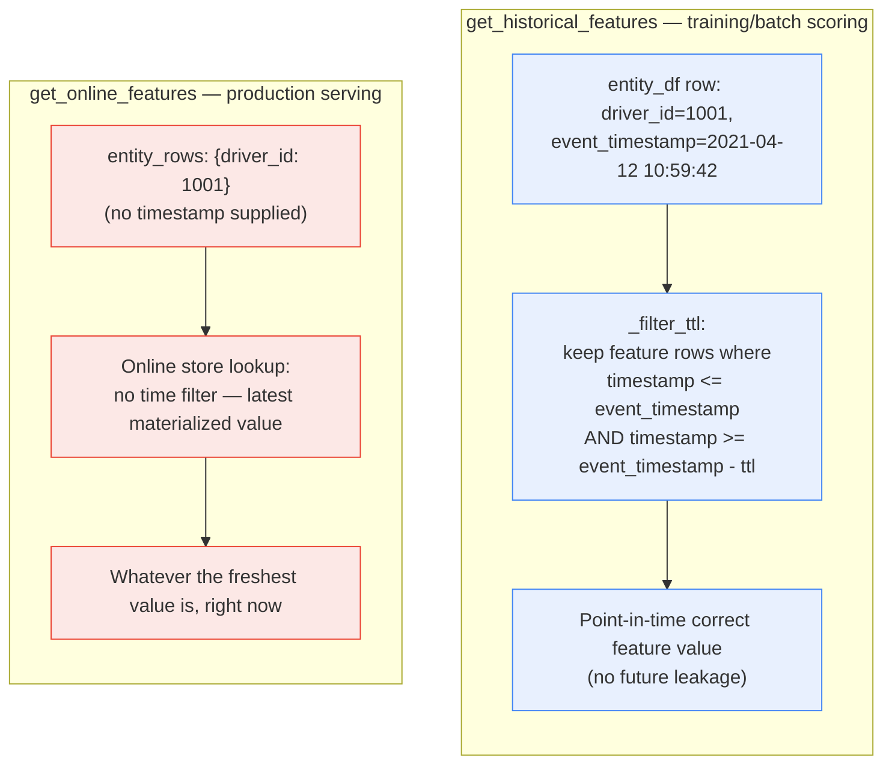

**TL;DR:** Shouldn't "the feature value at prediction time" for training and "the feature value right now" for serving just be the same lookup, evaluated at different moments? No — because a training example's "prediction time" is a specific historical timestamp already baked into the training data, and naively joining a feature's *latest* value onto that historical example lets the model see data from *after* the label happened (a leak, not a feature). Feast implements this as two genuinely different queries: `get_historical_features` does a point-in-time join that explicitly excludes anything newer than each example's own timestamp; `get_online_features` has no such constraint at all — it just returns whatever the latest value is right now, because production serving only ever has "now."
> **In plain English (30 sec):** Think of this like concepts you already use, but in a production system at scale.


**Real repo:** [`feast-dev/feast`](https://github.com/feast-dev/feast)

## 1. The Engineering Problem

"Training-serving skew" is usually described as: the training pipeline computes a feature one way, the serving path computes it a different way, and the model silently degrades because it's now seeing feature values it was never trained on. The standard fix — one shared feature definition, used by both training and serving — sounds like it fully solves the problem. It doesn't, on its own.

Even with a *single* feature definition, there's a second, subtler failure mode: if a training dataset is built by joining "the current value of each feature" onto historical training examples, the model gets to see feature values that didn't exist yet at the moment each example's label was recorded. A `user_ltv_score` feature updated last week gets joined onto a training example from six months ago — the model quietly learns from information that would have been impossible to know at prediction time. This is leakage, and it inflates offline accuracy in a way that never survives contact with real serving traffic, precisely because production serving can never look into its own future.

Solving both problems at once needs more than "reuse the same feature code" — it needs the retrieval query itself to enforce different time semantics depending on whether the request is "what would this feature have been, as of this historical timestamp" or "what is this feature right now."

## 2. The Technical Solution

`feast-dev/feast`, a real, widely-used open-source feature store, defines a feature exactly once (a `FeatureView`, backed by one batch/stream source) but exposes two retrieval methods built on genuinely different queries against that same definition:

- **`get_historical_features`** takes an entity dataframe where each row already carries its own `event_timestamp`, and performs a **point-in-time join**: for each training example, it looks up the feature's value as of that example's own timestamp — explicitly filtering out any feature row with a timestamp *after* the example's timestamp, and (via each feature view's configured TTL) also excluding feature rows too far *before* it.
- **`get_online_features`** takes entity keys with no timestamp at all, and returns "the latest online feature data" — full stop, no time-window logic, because production inference only ever has one meaningful timestamp: right now.



Two core truths this diagram is showing:

- **Only the historical path has a leakage guard, because only the historical path has historical examples that could leak from the future.** Online serving's "now" is definitionally the latest available instant — there's no future value to accidentally leak, so `get_online_features` doesn't need (and doesn't have) `_filter_ttl`'s comparison logic at all.
- **The TTL window bounds staleness in both directions.** `_filter_ttl` isn't just "no future data" — it also drops feature rows *older* than the feature view's configured TTL, so a training example doesn't get matched against a feature value so old it no longer reflects anything real about that entity at that time either.

## 3. The clean example (concept in isolation)

```python
# Point-in-time join: only accept a feature row within [event_time - ttl, event_time]
def point_in_time_lookup(feature_rows, event_time, ttl):
    candidates = [
        r for r in feature_rows
        if event_time - ttl <= r.timestamp <= event_time   # no future, not too stale
    ]
    return max(candidates, key=lambda r: r.timestamp, default=None)  # most recent qualifying row

# Online lookup: no time window at all — just whatever is freshest
def latest_lookup(feature_rows):
    return max(feature_rows, key=lambda r: r.timestamp)  # "now" is implicit
```

Same underlying data (a list of timestamped feature rows for one entity), two different queries — the first has a filter step the second doesn't need, because the first is answering "what did we know back then," and the second is answering "what do we know right now."

## 4. Production reality (from the real repo)

```
feast/sdk/python/feast/
├── feature_store.py                         — get_historical_features / get_online_features entry points
└── infra/offline_stores/
    └── dask.py                               — the point-in-time join implementation (_filter_ttl, _merge)
```

`get_historical_features`'s own docstring names the mechanism directly — "time travel," bounded by each feature view's TTL:

```python
def get_historical_features(
    self,
    entity_df: Optional[Union[pd.DataFrame, str]] = None,
    features: Union[List[str], FeatureService] = [],
    full_feature_names: bool = False,
    start_date: Optional[datetime] = None,
    end_date: Optional[datetime] = None,
) -> RetrievalJob:
    """Enrich an entity dataframe with historical feature values for either training or batch scoring.

    This method joins historical feature data from one or more feature views to an entity dataframe by
    using a time travel join...

    Time travel is based on the configured TTL for each feature view. A shorter TTL will limit the
    amount of scanning that will be done in order to find feature data for a specific entity key.
    """
```

The actual join, in the Dask-backed offline store, is a plain left join followed by an explicit TTL filter — the filter is what makes it point-in-time-*correct*, not just a join:

```python
def _filter_ttl(
    df_to_join: dd.DataFrame,
    feature_view: FeatureView,
    entity_df_event_timestamp_col: str,
    timestamp_field: str,
) -> dd.DataFrame:
    # Filter rows by defined timestamp tolerance
    if feature_view.ttl and feature_view.ttl.total_seconds() != 0:
        df_to_join = df_to_join[
            # do not drop entity rows if one of the sources returns NaNs
            df_to_join[timestamp_field].isna()
            | (
                (
                    df_to_join[timestamp_field]
                    >= df_to_join[entity_df_event_timestamp_col] - feature_view.ttl
                )
                & (
                    df_to_join[timestamp_field]
                    <= df_to_join[entity_df_event_timestamp_col]
                )
            )
        ]
    return df_to_join
```

`get_online_features`'s own docstring, by contrast, names no time window at all — "the latest," with no upper or lower bound to compute:

```python
def get_online_features(
    self,
    features: Union[List[str], FeatureService],
    entity_rows: Union[List[Dict[str, Any]], ...],
    full_feature_names: bool = False,
    include_feature_view_version_metadata: bool = False,
) -> OnlineResponse:
    """
    Retrieves the latest online feature data.
    ...
    """
    provider = self._get_provider()
    response = provider.get_online_features(
        config=self.config,
        features=features,
        entity_rows=entity_rows,   # note: no timestamp argument anywhere in this call
        registry=self.registry,
        project=self.project,
        full_feature_names=full_feature_names,
    )
    return response
```

What this teaches that a hello-world can't:

- **The leakage guard is a real boolean filter condition, not a policy or a convention.** `_filter_ttl`'s `<= entity_df_event_timestamp_col` comparison is what makes "no future data in training" a property the code enforces, not a discipline engineers have to remember to uphold by hand when writing training pipelines.
- **`entity_rows` in `get_online_features` structurally has no timestamp field at all — the API shape itself makes "point-in-time online lookup" inexpressible.** This isn't an oversight; it's the correct design, since production serving never has a meaningful "as of when" other than now.
- **The same `FeatureView`/TTL configuration governs both the staleness bound in training joins and (via materialization) what's freshly available online** — one piece of configuration, two different consumers of it, rather than a TTL hand-copied into two separate systems that could drift apart.

## 5. Review checklist

- **Does every feature view used for training have a TTL that's actually meaningful for that feature's real update cadence** — not a default copy-pasted across every feature view regardless of how often the underlying data actually changes? A TTL far longer than a feature's real refresh interval quietly widens the join window to match stale values a naive "latest reasonable" reading would have rejected.
- **Is the entity dataframe's `event_timestamp` actually the true label/prediction time for that example** — not the time the training dataset was *assembled*, which could be much later than when each example's outcome was actually observed? `_filter_ttl`'s guarantee is only as correct as that timestamp is.
- **Does any part of the training pipeline bypass `get_historical_features` and instead pull "current" feature values directly** (e.g. querying the online store, or the raw source table, for convenience)? That reintroduces exactly the leakage this mechanism exists to prevent, even with the "right" feature store in place.
- **For a feature that changes very infrequently, does its TTL correctly reflect that** — a too-short TTL for a slow-changing feature produces unnecessary `NaN`s in training data (the join finds nothing within the narrow window) rather than the correct, slightly-older value.

## 6. FAQ

**Q: If `get_online_features` has no timestamp, how does Feast avoid serving a stale value that hasn't been refreshed in a long time?**
A: That's a materialization/freshness concern, not a point-in-time-join concern — Feast's online store is kept current by a separate materialization process that writes the latest computed feature values into it on a schedule. `get_online_features` trusts whatever is currently in the online store to be "the latest we have"; keeping that store actually fresh is a different mechanism (feature view materialization cadence), not something this retrieval call itself controls.

**Q: Could a naive "join the current online value onto every training row" approach ever be correct?**
A: Only if the feature genuinely never changes over the training window — for any feature that updates over time, it silently converts every training example's "what did we know back then" into "what do we know now," which is exactly the future-leakage bug this lesson describes. It would look correct (the join succeeds, the pipeline runs) while quietly training on information the model could never have had at real prediction time.

**Q: Why filter on a TTL lower bound at all — isn't "the most recent value before the event timestamp" always the right one to use, no matter how old it is?**
A: Not necessarily — a feature value from a year before the event timestamp usually no longer reflects anything true about that entity at that later moment (a `days_since_last_login` computed a year ago is simply wrong a year later, not just "old but still valid"). The TTL lower bound encodes "how long is this feature's value still considered representative," which is a real, feature-specific engineering judgment, not an arbitrary cutoff.

**Q: Is this point-in-time join concept specific to Feast, or is it a general feature-store pattern?**
A: General — it's the defining problem any feature store claiming to solve training-serving skew has to solve, and "as-of join" is the standard name for it across the ecosystem (Tecton, Databricks Feature Store, and others implement the same underlying concept). Feast's `_filter_ttl` is simply a concrete, readable, real implementation of a pattern that recurs industry-wide.

---

## Source

- **Concept:** Point-in-time correct feature joins vs. latest-value online lookups
- **Domain:** mlops
- **Repo:** [feast-dev/feast](https://github.com/feast-dev/feast) → [`sdk/python/feast/feature_store.py`](https://github.com/feast-dev/feast/blob/master/sdk/python/feast/feature_store.py), [`sdk/python/feast/infra/offline_stores/dask.py`](https://github.com/feast-dev/feast/blob/master/sdk/python/feast/infra/offline_stores/dask.py) — the canonical open-source feature store


