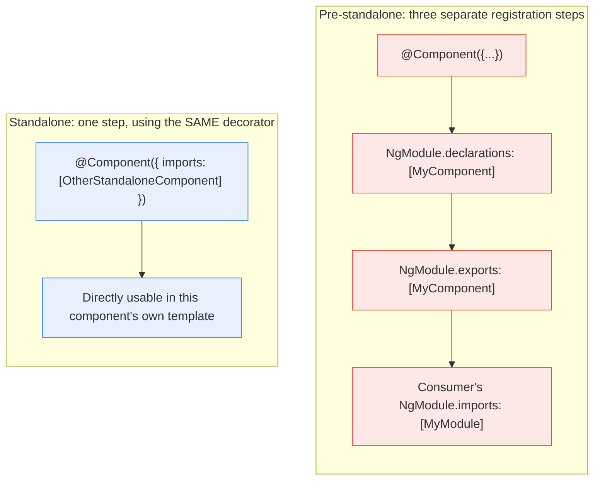

---
layout: post
title: "Angular Components: Why 'Standalone' Is the Default, Not a Flag"
description: "A new Angular component doesn't need an NgModule to exist - standalone is the compiler's default, not something you opt into. And the host object's key syntax (plain key, [key], (key), [attr.key]) is what tells Angular which of three different binding types to compile for that entry. From Angular's real @Component decorator source and Angular Material's real MatButtonBase host bindings."
date: 2026-06-19 09:00:00 +0530
categories: angular
order: 1
tags: [angular, components, templates, host-bindings, standalone]
excerpt: ""
---


**TL;DR:** Does a new Angular component need to be declared in an NgModule before anything else can use it, and is a component's `host` metadata just a plain object of string key-values? Neither — standalone is the compiler's *default* (an `@Component` needs `standalone: false` to opt *out*, not `standalone: true` to opt in), and `host`'s key syntax itself — a bare key, `[key]`, `(key)`, or `[attr.key]` — is what tells Angular which of three structurally different binding kinds (attribute, property, event) to compile for that one entry.

## 1. The Engineering Problem

Before standalone components, every Angular component, directive, and pipe had to be declared in exactly one `NgModule`'s `declarations` array, and any other module that wanted to use it had to import that whole module. For a single self-contained component with no real cross-cutting concerns, this indirection provided no design value — it was pure bookkeeping: create the component, then separately register it in a module, then separately export it if another module needed it, then separately import that module wherever it was consumed. Four steps to make one component usable, three of which had nothing to do with the component's own logic.

Host element behavior had a parallel problem: a component's interaction with its own host DOM element (a CSS class that should toggle based on component state, an ARIA attribute derived from an input, a click handler on the host itself) was expressed through separate `@HostBinding()`/`@HostListener()` property/method decorators scattered across the class body — disconnected from the single place (`@Component({...})`) that already described everything else about the component.

## 2. The Technical Solution

**Standalone is the compiler's default, not an opt-in.** An `@Component` (or `@Directive`) with no `standalone` field at all *is* standalone — importable directly into any other standalone component's own `imports` array, no `NgModule` required anywhere in the chain. Angular's own source states this as the default behavior, not a suggested best practice: opting *out* requires explicitly setting `standalone: false` and then declaring/exporting the directive through an `NgModule` the old way.

**The `host` object's key syntax dispatches to one of several binding kinds from a single field.** Angular's own documentation on the `host` metadata property is explicit about what the key syntax means: a bare key like `'class'` maps to a static DOM attribute; a bracketed key like `'[class]'` is a *property* binding, re-evaluated on every change-detection pass; a parenthesized key like `'(click)'` is an *event* binding; and namespaced forms like `'[attr.aria-disabled]'` or `'[class.mat-mdc-button-disabled]'` scope a property binding to one specific attribute or class. All of it lives in the one `host` object — no separate decorator per binding.



Two core truths this diagram is showing:

- **Standalone doesn't add a new registration mechanism — it removes the module-level indirection entirely.** A standalone component's own `imports` array plays the role `NgModule.declarations`/`exports`/another module's `imports` used to play together, collapsed into the one decorator that already describes the component.
- **The `host` object's binding-kind dispatch is purely syntactic — the compiler reads the key's punctuation, not a separate `type` field.** `'class'` vs `'[class]'` vs `'[class.foo]'` are three different compiled behaviors distinguished entirely by how the string is written.

## 3. The clean example (concept in isolation)

```typescript
// Standalone by default — no `standalone: true` needed, and no NgModule anywhere.
@Component({
  selector: 'app-badge',
  template: `<span>{{ label() }}</span>`,
  host: {
    'class': 'app-badge',                          // static attribute — always present
    '[class.app-badge--active]': 'active()',        // property binding, scoped to one class
    '[attr.aria-label]': 'label()',                  // property binding, scoped to one attribute
    '(click)': 'onClick($event)',                    // event binding
  },
})
export class BadgeComponent {
  label = input('');
  active = input(false);
  onClick(event: MouseEvent) { /* ... */ }
}

// Another standalone component uses it directly — no shared NgModule required.
@Component({
  selector: 'app-toolbar',
  imports: [BadgeComponent],   // this IS the registration step, nothing else needed
  template: `<app-badge [active]="isOnline()" label="Online" />`,
})
export class ToolbarComponent {
  isOnline = signal(true);
}
```

Four binding kinds (static attribute, scoped-class property, scoped-attribute property, event) in one `host` object, and one `imports` array replacing what used to be a four-step module dance — both collapses are the same underlying idea: metadata that used to be scattered is now co-located with the component it describes.

## 4. Production reality (from the real repo)

```
angular/
└── packages/core/src/metadata/
    └── directives.ts              — @Component decorator: standalone default, host binding-kind docs

material-components/  (angular/components)
└── src/material/button/
    └── button-base.ts             — MatButtonBase: real host object using all binding kinds
```

Angular's own source states standalone-by-default directly in the `Directive`/`Component` decorator's doc comment — not "you can mark a directive standalone," but "by default, directives are marked as standalone":

```typescript
/**
 * ### Declaring directives
 *
 * By default, directives are marked as standalone, which makes
 * them available to other components in your application.
 *
 * ```ts
 * @Directive({
 *   selector: 'my-directive',
 * })
 * ```
 *
 * ** Declaring a directive in an NgModule **
 * If you want to declare a directive in an ngModule, add the `standalone: false` flag to the
 * Directive decorator metadata and add the directive to the `declarations` and `exports`
 * fields of your ngModule.
 */
```

The `host` field's doc comment spells out exactly what each key syntax compiles to — property binding, attribute binding, and event binding, all through the same object:

```typescript
/**
 * Maps class properties to host element bindings for properties,
 * attributes, and events, using a set of key-value pairs.
 *
 * Angular automatically checks host property bindings during change detection.
 * If a binding changes, Angular updates the directive's host element.
 *
 * When the key is a property of the host element, the property value is
 * propagated to the specified DOM property.
 *
 * When the key is a static attribute in the DOM, the attribute value
 * is propagated to the specified property in the host element.
 *
 * For event handling:
 * - The key is the DOM event that the directive listens to...
 * - The value is the statement to execute when the event occurs.
 */
host?: {[key: string]: string};
```

Angular Material's real `MatButtonBase` directive is a production example using nearly every one of these forms in one `host` object — a static class, a computed property-bound class, several attribute bindings, and several class-scoped property bindings:

```typescript
@Directive({
  host: {
    // Static attribute — always present, regardless of component state
    'class': 'mat-mdc-button-base',
    // Property binding — re-evaluated on every change-detection pass
    '[class]': 'color ? "mat-" + color : ""',
    '[class.mat-mdc-button-progress-indicator-shown]': 'showProgress()',
    // Attribute bindings, scoped via [attr.*]
    '[attr.disabled]': '_getDisabledAttribute()',
    '[attr.aria-disabled]': '_getAriaDisabled()',
    '[attr.tabindex]': '_getTabIndex()',
    // More class-scoped property bindings
    '[class.mat-mdc-button-disabled]': 'disabled',
    '[class.mat-unthemed]': '!color',
  },
})
export class MatButtonBase implements AfterViewInit, OnDestroy { /* ... */ }
```

What this teaches that a hello-world can't:

- **"Standalone" isn't a separate component type — it's the same `@Component` decorator with one field defaulted differently than it used to be.** There's no new syntax to learn; the entire migration from NgModule-declared to standalone is `standalone: false` being removed (or never added).
- **`host`'s binding-kind dispatch has zero runtime cost to determine — it's resolved once, at compile time, from the key string itself.** The compiler doesn't inspect the *value* to guess whether it's an event handler or a property expression; the *key's punctuation* alone (`'x'` vs `'[x]'` vs `'(x)'`) fully determines which compiled instruction gets generated.
- **A real, mature component library's own base class (`MatButtonBase`) uses five of these binding forms in one object**, which is the concrete evidence that this isn't an edge-case feature — a genuinely production-grade component routinely needs static, property, attribute, and class-scoped bindings on its own host element simultaneously, and one `host` object is what makes that manageable in one place instead of five separate decorators.

## 5. Review checklist

- **Is a new component's `standalone` field left unset (correctly using the default) rather than explicitly set to `true`?** An explicit `standalone: true` isn't wrong, but it signals the author may not know it's already the default — worth normalizing across a codebase for consistency, one way or the other.
- **For any component still using `standalone: false`, is there a real reason it needs to live in an `NgModule`** (e.g. a legacy module boundary, a third-party integration that still expects module declarations) **rather than leftover code from before the standalone migration?**
- **In a component's `host` object, does every key's bracket/paren syntax match what it's actually meant to do** — a property binding written as a bare static key (or vice versa) either never updates when it should, or update-checks a value that was meant to be a one-time static attribute?
- **Are `[class.x]`/`[attr.x]`-scoped bindings preferred over manually concatenating class/attribute strings inside a single `[class]`/`[attr]` binding**, the way `MatButtonBase` does for `mat-mdc-button-progress-indicator-shown` and `mat-mdc-button-disabled` separately rather than building one combined class string by hand? The scoped form lets Angular's change detection track each toggle independently, which a single hand-built string can't do as cleanly.

## 6. FAQ

**Q: If standalone is the default, why do so many existing tutorials and codebases still show `standalone: true` explicitly?**
A: Historically, standalone components required the explicit flag when the feature was newly introduced (opt-in), before it became the compiler default in a later major version — a lot of documentation and existing code was written during that opt-in period and simply hasn't been updated. Current Angular treats the explicit `standalone: true` as redundant, not incorrect.

**Q: Can a standalone component still import an `NgModule`, or only other standalone things?**
A: A standalone component's `imports` array can include other standalone components/directives/pipes *and* existing `NgModule`s — this is what lets a codebase migrate incrementally, using standalone components inside a template that still also depends on some not-yet-migrated `NgModule`-declared library.

**Q: Does `[class.foo]` in `host` behave any differently from `[class.foo]` written directly in a component's own template on a child element?**
A: No — it's the same property-binding mechanism, just targeting the component's *own* host element (the element the component's selector matched) instead of an element inside its template. The binding-kind syntax rules (`[x]` = property, `(x)` = event, `[attr.x]` = attribute) are identical in both places.

**Q: Why does `MatButtonBase` bind `[attr.disabled]` through a method call (`_getDisabledAttribute()`) instead of directly binding to a `disabled` property?**
A: Because `disabled` here needs to become an actual DOM *attribute* (`disabled=""` or its absence) for native button semantics and accessibility tools to recognize it correctly — a plain `[disabled]` *property* binding on a native `<button>` would set the DOM property, which usually works, but going through `[attr.disabled]` with a method that returns `null` or a string gives the component precise control over whether the attribute is present at all, which native form-control semantics depend on more reliably than the property alone.

---

## Source

- **Concept:** Standalone-by-default components and the `host` binding-kind syntax
- **Domain:** angular
- **Repo:** [angular/angular](https://github.com/angular/angular) → [`packages/core/src/metadata/directives.ts`](https://github.com/angular/angular/blob/main/packages/core/src/metadata/directives.ts); [angular/components](https://github.com/angular/components) → [`src/material/button/button-base.ts`](https://github.com/angular/components/blob/main/src/material/button/button-base.ts) — the framework's own source and a real, production Material component

