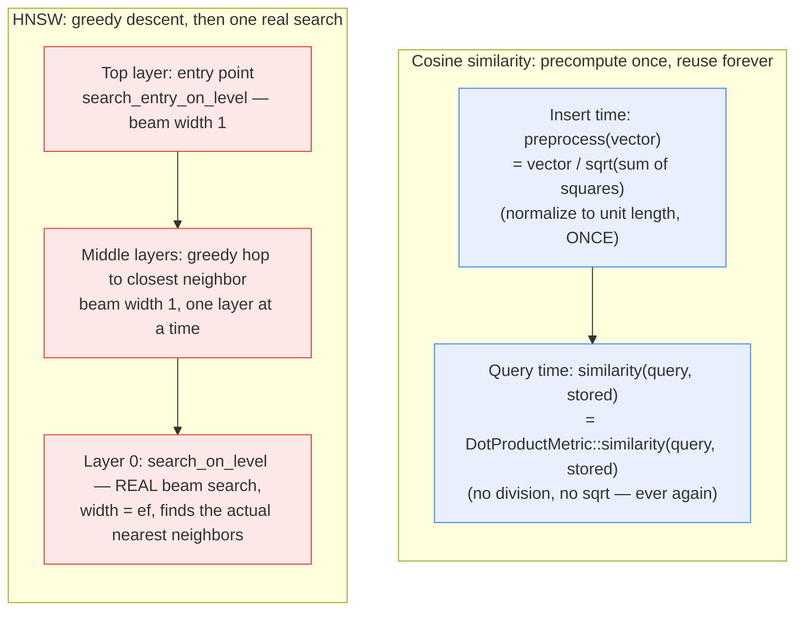

**TL;DR:** Does finding the "closest" embedding to a query really mean computing `dot(a,b) / (|a| * |b|)` fresh against every stored vector, and comparing the query to the entire index one by one? Neither, in a real production vector database: cosine similarity is normalized away into a plain dot product by pre-processing every vector to unit length *once*, at insert time — so there's no division or square root left to compute per comparison — and approximate nearest-neighbor search (HNSW) replaces a full linear scan with a greedy descent through a small, hierarchical graph, only doing a real wide search at the very end.

> **In plain English (30 sec):** Code you already write — Map, function, API call, just bigger.

## 1. The Engineering Problem

Semantic search needs to find, out of potentially millions of stored embeddings, the ones closest in meaning to a query embedding. The naive approach does two expensive things by default:

- **Recomputing the full cosine similarity formula on every single comparison.** `cos(θ) = (a · b) / (|a| |b|)` involves a dot product *and* two vector magnitudes (each a square root over every dimension) — computed fresh for every candidate vector, on every single query, even though a stored vector's own magnitude never changes between queries.
- **Comparing the query against every stored vector, one by one.** A linear scan is exact, but its cost grows directly with the size of the index — fine at a few thousand vectors, unworkable at the scale a real production semantic search system actually operates at.

Neither inefficiency is inherent to "finding similar embeddings" as a concept — they're both artifacts of computing the *textbook* formula and the *textbook* search procedure literally, instead of exploiting what a real system can precompute once and reuse many times.

## 2. The Technical Solution

**Cosine similarity becomes a dot product once every vector is pre-normalized to unit length.** If `a` and `b` are both already unit vectors (`|a| = |b| = 1`), the cosine formula's denominator is just `1`, so `cos(θ) = a · b` — the division and both square roots disappear entirely, *not* through an approximation, but through algebra: normalizing once at insert time makes the per-query formula exactly equal to a plain dot product, forever, for that vector.

**HNSW avoids a full linear scan by searching a multi-layer graph instead of the raw vector set.** The index is built as several stacked graph layers — the top layer is sparse (few nodes, long-range links, like a highway system), and each layer below is progressively denser, with layer 0 containing every vector. A search starts at a fixed entry point on the top layer and *greedily* walks to whichever neighbor is closest to the query, one hop at a time (beam width of exactly 1 — no backtracking, no exploring alternatives) — repeating this on each layer down. Only once it reaches layer 0 does it switch to a real, wider beam search, exploring `ef` candidates instead of just 1, to actually locate the true nearest neighbors rather than just a good starting point.



Two core truths this diagram is showing:

- **Normalization moves work from query time to insert time — a classic precompute-once-reuse-many-times tradeoff, not an approximation.** The similarity score computed after normalization is exactly the cosine similarity, not an estimate of it.
- **HNSW deliberately searches narrowly (beam=1) everywhere except the one layer where breadth actually matters.** The upper layers exist purely to get to *roughly* the right neighborhood fast; only layer 0's search is responsible for precision, which is why only it uses a real, adjustable-width beam.

## 3. The clean example (concept in isolation)

```python
import math

def normalize(v):
    length = math.sqrt(sum(x * x for x in v))
    return [x / length for x in v] if length > 0 else v

def dot(a, b):
    return sum(x * y for x, y in zip(a, b))

# At insert time: normalize once, store the normalized vector.
stored_vectors = [normalize(v) for v in raw_vectors]

# At query time: plain dot product is now exactly cosine similarity.
query = normalize(query_vector)
scores = [dot(query, v) for v in stored_vectors]  # no division, no sqrt here
```

```python
# Greedy descent (HNSW's upper layers): beam width 1, no backtracking.
def greedy_descend(graph, entry, query, top_level, bottom_level):
    current = entry
    for level in range(top_level, bottom_level, -1):
        current = min(graph.neighbors(current, level), key=lambda n: distance(n, query))
    return current  # a good entry point for the real search below
```

The normalization is a one-time cost paid once per vector, ever; the greedy descent is a one-time cost paid once per query, to avoid ever touching most of the index.

## 4. Production reality (from the real repo)

```
qdrant/lib/segment/src/
├── spaces/
│   └── simple.rs                      — CosineMetric: normalize-once, dot-product-after
└── index/hnsw_index/
    └── graph_layers.rs                — search_entry (greedy descent) + search_on_level (real beam search)
```

`CosineMetric`'s own doc comment states the mechanism directly — cosine similarity *is* dot product similarity, with normalization moved into `preprocess`:

```rust
/// Equivalent to DotProductMetric with normalization of the vectors in preprocessing.
impl Metric<VectorElementType> for CosineMetric {
    fn distance() -> Distance {
        Distance::Cosine
    }

    fn similarity(v1: &[VectorElementType], v2: &[VectorElementType]) -> ScoreType {
        DotProductMetric::similarity(v1, v2)   // literally just a dot product — no cosine math here
    }

    fn preprocess(vector: DenseVector) -> DenseVector {
        // ...dispatches to a normalization routine (SIMD-accelerated where available)
    }
}
```

And the normalization itself — the one place the square root and division actually happen, done once per vector rather than once per comparison:

```rust
pub fn cosine_preprocess(vector: DenseVector) -> DenseVector {
    let mut length: f32 = vector.iter().map(|x| x * x).sum();
    if is_length_zero_or_normalized(length) {
        return vector;
    }
    length = length.sqrt();
    vector.iter().map(|x| x / length).collect()
}

pub fn dot_similarity(v1: &[VectorElementType], v2: &[VectorElementType]) -> ScoreType {
    v1.iter().zip(v2).map(|(a, b)| a * b).sum()
}
```

HNSW's greedy descent through the upper layers — `search_entry` — walks from the fixed entry point down to layer 0, using a beam-width-1 search at every level above the bottom:

```rust
fn search_entry(
    &self,
    entry_point: PointOffsetType,
    top_level: usize,
    target_level: usize,
    points_scorer: &mut FilteredScorer,
    is_stopped: &AtomicBool,
) -> CancellableResult<ScoredPointOffset> {
    let mut level_entry = entry_point;
    for level in rev_range(top_level, target_level) {
        let search_result =
            self.search_entry_on_level(level_entry, level, points_scorer, &mut links_buffer);
        level_entry = search_result.idx;   // hop to the closest neighbor found, then descend
    }
    // ...returns the final entry point at target_level (usually layer 0)
}
```

Only once execution reaches layer 0 does the code switch to `search_on_level` — the module's own doc comment calls this "Regular search, as described in the original HNSW paper," explicitly contrasted with the beam-1 version used above it:

```rust
// ...from the module doc comment:
// - `search_on_level`: Regular search, as described in the original HNSW paper. Usually used on layer 0.
// - `search_entry_on_level`: Simplified version of `search_on_level` that uses beam size of 1.
//   Usually used on all levels above level 0.

pub fn search(&self, top: usize, ef: usize, /* ... */) -> CancellableResult<Vec<ScoredPointOffset>> {
    let entry_point = /* ... */;
    let zero_level_entry = self.search_entry(entry_point.point_id, entry_point.level, 0, /* ... */)?;
    let ef = max(ef, top);
    let nearest = self.search_on_level(zero_level_entry, 0, ef, /* ... */)?;  // real beam search, width ef
    Ok(nearest.into_iter_sorted().take(top).collect())
}
```

What this teaches that a hello-world can't:

- **`CosineMetric::similarity` contains zero cosine-specific code.** It's a one-line delegation to `DotProductMetric::similarity` — proof that, after preprocessing, there is no meaningful difference left between "cosine similarity" and "dot product" as far as the query-time code is concerned.
- **The upper HNSW layers never claim to find the *nearest* neighbor — only a *good enough* one to hand off.** `search_entry_on_level`'s beam width of exactly 1 means it can't backtrack or reconsider; its entire job is getting close fast, not getting it exactly right, which is precisely why a real, wider search still has to run at layer 0.
- **The switch from approximate to exact happens at one specific, named boundary (`target_level = 0`), not gradually.** `search()`'s own code makes this explicit: `search_entry` down to level 0, *then* `search_on_level` with the real `ef` width — the algorithm's precision profile is a deliberate two-phase design, not a single uniform search strategy applied at every layer.

## 5. Review checklist

- **If a vector database is configured for cosine distance, are stored vectors actually being normalized before insertion — or is normalization happening twice (once by the application, once by the database) or not at all?** Since `CosineMetric::similarity` is just a dot product, skipping normalization silently turns "cosine similarity" into "dot product weighted by magnitude" — a different, usually wrong, ranking.
- **Is `ef` (the layer-0 beam width) tuned for the actual recall/latency tradeoff this application needs**, rather than left at a default that was never validated for this dataset's size and dimensionality? A too-small `ef` returns approximate results the greedy upper-layer descent didn't have the width to correct at layer 0.
- **Does anything in the surrounding application code assume vector search is exact** (e.g. treating "top-k nearest" as guaranteed-correct for downstream deduplication or exact-match logic) **when HNSW is, by construction, approximate?** The greedy beam-1 descent through upper layers means a true nearest neighbor can occasionally be missed — a real, accepted tradeoff, not a bug, but one calling code needs to be aware of.
- **For a distance metric other than cosine (Euclidean, dot product), is the corresponding `preprocess` step (or lack of one) actually correct for that metric** — e.g. `EuclidMetric::preprocess` in this same file is a no-op, which is correct for Euclidean distance but would be wrong if accidentally applied to cosine-distance data?

## 6. FAQ

**Q: If normalization happens at insert time, what happens to the query vector — does it need normalizing too?**
A: Yes — the query vector goes through the same `preprocess` step before scoring, for the same algebraic reason: `cos(θ) = a · b` only equals a plain dot product when *both* vectors are unit-length, not just the stored one.

**Q: Does the greedy, beam-1 descent through upper HNSW layers risk getting permanently stuck in a bad neighborhood far from the true answer?**
A: It's a real, accepted risk inherent to the algorithm — this is exactly why HNSW is an *approximate* nearest-neighbor method, not exact. In practice, the graph's layered structure (long-range links concentrated in upper layers) makes this failure rare enough to be an acceptable tradeoff for the massive speedup over linear scan, but "acceptable tradeoff" is different from "impossible."

**Q: Why does `cosine_preprocess` check `is_length_zero_or_normalized(length)` before normalizing?**
A: Two edge cases: a zero vector can't be normalized (division by zero), and a vector that's already unit-length doesn't need the work redone — both are cheap short-circuits around the sqrt/divide that would otherwise run unconditionally on every insert.

**Q: Is HNSW the only approximate nearest-neighbor approach, or could a vector database use something else instead?**
A: HNSW is one real, widely-used approach (also used by this domain's curated `run-llama/llama_index` and others) alongside alternatives like IVF (inverted file index, clustering-based rather than graph-based) — this domain's later "Vector databases & indexing (HNSW vs IVF)" topic covers that specific tradeoff directly; this lesson focuses on HNSW's own mechanism, not a comparison across approaches.

---

## Source

- **Concept:** Cosine-similarity normalization and HNSW approximate nearest-neighbor search
- **Domain:** genai
- **Repo:** [qdrant/qdrant](https://github.com/qdrant/qdrant) → [`lib/segment/src/spaces/simple.rs`](https://github.com/qdrant/qdrant/blob/master/lib/segment/src/spaces/simple.rs), [`lib/segment/src/index/hnsw_index/graph_layers.rs`](https://github.com/qdrant/qdrant/blob/master/lib/segment/src/index/hnsw_index/graph_layers.rs) — a real, open-source vector database with genuine ANN index internals


