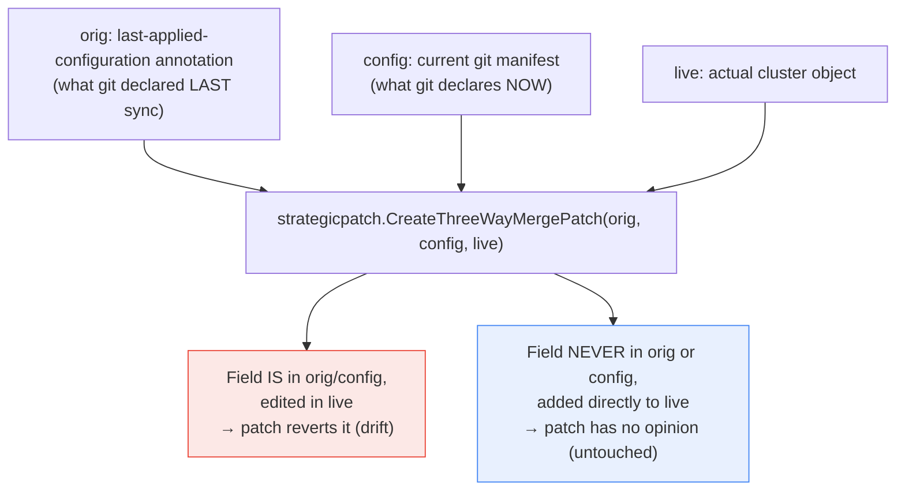

**TL;DR:** Does "declarative desired state as the single source of truth" mean a GitOps controller reverts *any* manual change to a resource it manages? No — editing a field the git manifest actually declares gets silently reverted, but adding a field git never mentioned (another controller's label, a manually-added annotation) is often left completely alone. That's not inconsistent behavior — it's the same three-way-merge mechanism `kubectl apply` has always used: a merge patch computed from what was *previously* declared, what's *currently* declared, and what's *live*, which structurally excludes anything that was never declared in the first place.

> **In plain English (30 sec):** Code you already write — Map, function, API call, just bigger.

## 1. The Engineering Problem

"The GitOps controller reverts manual changes" sounds like a simple, absolute rule — but it doesn't match what teams actually observe. A `kubectl edit` that changes a `replicas` field or a container image tag declared in the git manifest gets reverted within a sync cycle. A `kubectl edit` that adds a brand-new label, or an unrelated mutating webhook injecting a sidecar container into a Pod spec, often survives indefinitely without being flagged as drift at all.

Without understanding the actual mechanism, this looks like a bug, or an inconsistency a team has to work around with ad hoc `ignoreDifferences` rules for every field that "shouldn't" be reverted. The real explanation is more precise than "the controller owns this object": it owns exactly the fields git has, at some point, actually declared — nothing more — and that scope is enforced by a specific, well-established merge algorithm, not by a GitOps-specific policy layered on top.

## 2. The Technical Solution

`argoproj/gitops-engine` — the shared library Argo CD's own sync/diff logic is built on — computes drift using the **same three-way merge mechanism `kubectl apply` itself has always used**, not a GitOps-invented one. Three inputs go into the merge:

- **`orig`** — the *previously applied* configuration, read back from the live object's own `kubectl.kubernetes.io/last-applied-configuration` annotation (what git declared the *last* time this object was synced).
- **`config`** — the *current* desired configuration, freshly rendered from git right now.
- **`live`** — the object's actual current state in the cluster.

`strategicpatch.CreateThreeWayMergePatch(orig, config, live)` — literally the Kubernetes standard library function `kubectl apply` calls internally — produces a patch by comparing all three. Critically, a field that appears in `live` but was never present in `orig` *or* `config` simply isn't part of that comparison: the merge patch has nothing to say about a field it never owned in the first place.



Two core truths this diagram is showing:

- **"Ownership" is field-scoped, decided by presence in `orig`/`config`, not by object-level policy.** A GitOps controller doesn't need a special rule to "ignore fields it doesn't manage" — the three-way merge patch structurally can't produce a correction for a field it has no declared value for.
- **`orig` (the last-applied-configuration) is what makes this a *three*-way merge instead of a naive two-way diff.** Without it, the algorithm can't distinguish "git removed this field on purpose" from "someone else added this field on purpose" — both would just look like `live` differs from `config`. `orig` is what tells the merge which direction the earlier change came from.

## 3. The clean example (concept in isolation)

```json
// orig — what git declared last sync
{ "spec": { "replicas": 3 } }

// config — what git declares now (same field, git hasn't changed it)
{ "spec": { "replicas": 3 } }

// live — what's actually running (someone ran `kubectl scale --replicas=5`,
// AND a separate controller added a label git never mentioned)
{ "spec": { "replicas": 5 }, "metadata": { "labels": { "injected-by": "some-webhook" } } }
```

```
Three-way merge patch result:
  spec.replicas: revert to 3        (present in orig AND config → git owns this field)
  metadata.labels.injected-by: —    (absent from BOTH orig and config → not in the patch at all)
```

`replicas` was declared by git both before and now, so the merge patch actively corrects the drift. The `injected-by` label was never declared by git at any point the algorithm can see — there's no "before" and "after" from git to compare it against, so it's structurally invisible to this specific patch computation, not deliberately whitelisted.

## 4. Production reality (from the real repo)

The annotation that supplies `orig` is a Kubernetes-standard one, not a GitOps-specific invention — `argoproj/gitops-engine` reads the exact same annotation `kubectl apply` itself writes:

```go
const (
	AnnotationLastAppliedConfig = "kubectl.kubernetes.io/last-applied-configuration"
)
```

`Diff()` is the real entry point, and its comment states the mechanism plainly — read the annotation, then perform a three-way diff:

```go
// "kubectl.kubernetes.io/last-applied-configuration", then perform a three way diff.
func Diff(config, live *unstructured.Unstructured, opts ...Option) (*DiffResult, error) {
	// ...normalization steps omitted...

	orig, err := GetLastAppliedConfigAnnotation(live)
	if err != nil {
		o.log.V(1).Info(fmt.Sprintf("Failed to get last applied configuration: %v", err))
	} else if orig != nil && config != nil {
		Normalize(orig, opts...)
		dr, err := ThreeWayDiff(orig, config, live)
		if err == nil {
			return dr, nil
		}
		o.log.V(1).Info(fmt.Sprintf("three-way diff calculation failed: %v. Falling back to two-way diff", err))
	}
	return TwoWayDiff(config, live)
}
```

`ThreeWayDiff` delegates directly to Kubernetes' own `strategicpatch` package — the identical function `kubectl apply` calls internally, not a reimplementation:

```go
func ThreeWayDiff(orig, config, live *unstructured.Unstructured) (*DiffResult, error) {
	orig = removeNamespaceAnnotation(orig)
	config = removeNamespaceAnnotation(config)

	// 1. calculate a 3-way merge patch
	patchBytes, newVersionedObject, err := threeWayMergePatch(orig, config, live)
	// ...
}

// deep inside threeWayMergePatch:
patch, err := strategicpatch.CreateThreeWayMergePatch(origBytes, configBytes, liveBytes, lookupPatchMeta, true)
```

Notably, `TwoWayDiff` — the fallback used when there's no last-applied-configuration annotation to read (e.g. a resource never actually applied through this mechanism) — reuses the *same* `ThreeWayDiff` function, just with `config` standing in for `orig`:

```go
func TwoWayDiff(config, live *unstructured.Unstructured) (*DiffResult, error) {
	if live != nil && config != nil {
		return ThreeWayDiff(config, config.DeepCopy(), live)
	}
	return handleResourceCreateOrDeleteDiff(config, live)
}
```

What this teaches that a hello-world can't:

- **The "which manual edits get reverted" question has a precise, checkable answer: was this field ever present in a previously-applied git configuration?** It's not a heuristic or a fuzzy notion of "important fields" — it's exactly what `strategicpatch.CreateThreeWayMergePatch`'s three inputs structurally can and can't express.
- **GitOps controllers don't reimplement drift detection from scratch — they reuse Kubernetes' own decade-old `kubectl apply` merge algorithm.** `AnnotationLastAppliedConfig`'s literal value is `kubectl.kubernetes.io/last-applied-configuration`, the exact same annotation plain `kubectl apply` writes with no GitOps controller involved at all.
- **`TwoWayDiff` calling `ThreeWayDiff` with `config` as a stand-in `orig` shows the two-way case isn't a different algorithm — it's the three-way algorithm degrading gracefully when there's no real history to compare against**, treating "no known prior state" the same as "prior state equals current state."

## 5. Review checklist

- **For a field that's surprisingly *not* getting reverted, has it ever actually appeared in a git-applied manifest** — or was it always injected by something else (a mutating webhook, a manually-run `kubectl` command that predates this object's GitOps management)? If it's never been in `orig`/`config`, that's expected behavior, not a controller bug.
- **Is `ignoreDifferences` being used to work around fields that the three-way merge would already correctly exclude on its own** — a symptom of not knowing this mechanism exists, adding maintenance overhead for a problem that isn't actually happening?
- **Does a resource actually have a `last-applied-configuration` annotation at all** — if it was created outside any `kubectl apply`/GitOps-apply path (e.g. `kubectl create` or a raw API call), the controller falls back to `TwoWayDiff`, which has weaker drift-detection semantics than a true three-way comparison, since it has no real prior-state history to reason from.
- **When intentionally removing a field from a git manifest, is the expectation that it gets removed from the live object — and does the three-way merge actually support that** (a field present in `orig` but absent from `config` is a real signal to delete it, distinct from a field never in `orig` at all)? Confirm this against the actual sync result rather than assuming removal always propagates identically to a value change.

## 6. FAQ

**Q: Does Server-Side Apply (SSA) use the same last-applied-configuration mechanism?**
A: No — `gitops-engine`'s `Diff()` explicitly branches: when server-side diff or structured-merge-diff is enabled, it calls `ServerSideDiff`/`StructuredMergeDiff` instead, which use Kubernetes' `managedFields` (per-field-manager ownership tracking) rather than the `last-applied-configuration` annotation. Both approaches solve the same underlying problem — "which fields does this applier actually own" — but SSA's `managedFields` is the newer, more precise mechanism; the annotation-based three-way merge is the older, still-widely-used default this lesson focuses on.

**Q: What happens if the `last-applied-configuration` annotation itself gets manually deleted or corrupted?**
A: `GetLastAppliedConfigAnnotation` returns an error, which `Diff()` logs and then falls back to `TwoWayDiff` — the sync doesn't fail outright, but drift detection degrades to the weaker two-way comparison (effectively treating "no known history" as "assume nothing changed since git last matched live"), which can under-detect drift on fields that changed both in git and in the live object simultaneously.

**Q: Is the three-way merge patch what actually gets applied to fix drift, or just what's used to detect it?**
A: Both — `ThreeWayDiff`'s computed patch is the mechanism for detecting a difference (used to mark the app `OutOfSync`) *and*, when auto-sync/self-heal applies the correction, effectively the same kind of patch is what gets sent to the API server to bring `live` back in line with `config`. Detection and correction aren't two separate systems; they're the same merge computation used at two different moments.

**Q: Why does this matter more for GitOps specifically than for a one-off manual `kubectl apply`?**
A: A one-off `kubectl apply` computes this three-way merge once, at apply time, and then nothing checks it again until someone runs `kubectl apply` a second time. A GitOps controller re-runs this exact same computation on every reconcile cycle — the multi-signal refresh triggers covered in this domain's first lesson (soft/hard expiry timers, spec-drift detection) — turning a one-time merge computation into a continuously re-evaluated guarantee.

---

## Source

- **Concept:** Declarative desired state, drift detection, and the three-way merge patch mechanism
- **Domain:** gitops
- **Repo:** [argoproj/gitops-engine](https://github.com/argoproj/gitops-engine) → [`pkg/diff/diff.go`](https://github.com/argoproj/gitops-engine/blob/master/pkg/diff/diff.go) — the shared diff/sync library Argo CD's own controller is built on


