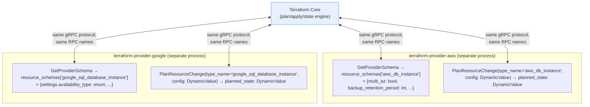

**TL;DR:** If Terraform "supports" AWS, GCP, Azure, and dozens of other providers, does that mean Terraform's own core codebase has grown a hardcoded, ever-expanding pile of provider-specific logic — one code path per cloud? No — Terraform core and every provider are separate operating-system processes talking over one fixed gRPC protocol, and a resource's actual field shape (exactly the AWS RDS-vs-GCP-Cloud-SQL divergence covered in this domain's first lesson) is never compiled into core at all. It travels as opaque bytes core doesn't parse, and core only learns what those bytes mean for a given resource type by calling one generic RPC — `GetProviderSchema` — at startup.
> **In plain English (30 sec):** Think of this like concepts you already use, but in a production system at scale.


## 1. The Engineering Problem

The previous lesson in this domain showed that AWS RDS and GCP Cloud SQL model "highly available" and "backup retention" with genuinely different field shapes under the same HCL syntax. That raises an obvious follow-up question: if Terraform core has to understand `aws_db_instance`'s flat `multi_az` boolean *and* `google_sql_database_instance`'s nested `settings.availability_type` enum well enough to plan and apply changes to both, doesn't that mean Terraform's own source code has separate, provider-specific logic baked in for each one?

If it did, "Terraform supports 3,000+ providers" would mean Terraform core is a 3,000-way branching monolith, permanently coupled to every cloud API it's ever integrated with, where adding one new provider (or a new resource type inside an existing provider) requires modifying and re-releasing Terraform itself. That's not how it actually works, and understanding why matters directly for the multi-cloud question this domain is about: the same mechanism that lets Terraform stay decoupled from AWS's and GCP's specific schemas is also what makes "multi-cloud with one tool" structurally possible in the first place.

## 2. The Technical Solution

Terraform core and every provider are **separate compiled binaries, running as separate OS processes**, communicating exclusively over a fixed gRPC service defined in `tfplugin6.proto`. That protocol defines a small, closed set of remote procedure calls — `GetProviderSchema`, `PlanResourceChange`, `ApplyResourceChange`, `ReadResource`, and a handful of others — that **every** provider must implement identically, whether it's `hashicorp/terraform-provider-aws`, `hashicorp/terraform-provider-google`, or an unrelated community provider Terraform's maintainers have never heard of.

The key design choice that makes this work: **a resource's actual field values travel as opaque bytes, not as a typed structure core understands.** The protocol's `DynamicValue` message is just `bytes msgpack` / `bytes json` — Terraform core passes it through without parsing what's inside. Core discovers what those bytes *mean* for a specific resource type (`aws_db_instance` vs `google_sql_database_instance`) only by calling `GetProviderSchema` once, which returns a `map<string, Schema>` — a runtime-discovered dictionary the *provider itself* populates, not something compiled into Terraform core.



Two core truths this diagram is showing:

- **Core issues the exact same RPC calls to both providers — the schema divergence lives entirely on the provider side of the wire.** `PlanResourceChange` is called identically whether `type_name` is `"aws_db_instance"` or `"google_sql_database_instance"`; core never branches on which provider it's talking to.
- **`GetProviderSchema` is what turns a compile-time coupling problem into a runtime discovery problem.** Core doesn't need to be rebuilt to support a new resource type or a new provider — it just calls this one RPC against whatever provider binary is configured, and adapts to whatever `Schema` comes back.

## 3. The clean example (concept in isolation)

```python
# A minimal stand-in for what Terraform core actually does with a provider —
# note it never inspects what's INSIDE config or planned_state.
def plan_resource(provider_rpc, type_name, config_bytes):
    response = provider_rpc.PlanResourceChange(
        type_name=type_name,       # an opaque string, e.g. "aws_db_instance"
        config=config_bytes,        # opaque bytes — core doesn't parse this
    )
    return response.planned_state   # also opaque bytes, passed straight into state

# Core calls this identically regardless of which provider process is on the other end:
plan_resource(aws_provider_rpc, "aws_db_instance", aws_config_bytes)
plan_resource(gcp_provider_rpc, "google_sql_database_instance", gcp_config_bytes)
```

Both calls are structurally identical from core's point of view — the only difference is which provider process is listening on the other end of the RPC connection, and what opaque bytes it happens to send back.

## 4. Production reality (from the real repo)

```
terraform/docs/plugin-protocol/
└── tfplugin6.proto            — the gRPC contract every provider implements
```

The `Provider` service is a small, fixed set of RPCs — the same interface for every provider that has ever existed:

```protobuf
service Provider {
    rpc GetProviderSchema(GetProviderSchema.Request) returns (GetProviderSchema.Response);
    rpc ValidateProviderConfig(ValidateProviderConfig.Request) returns (ValidateProviderConfig.Response);
    rpc ValidateResourceConfig(ValidateResourceConfig.Request) returns (ValidateResourceConfig.Response);
    rpc ConfigureProvider(ConfigureProvider.Request) returns (ConfigureProvider.Response);
    rpc ReadResource(ReadResource.Request) returns (ReadResource.Response);
    rpc PlanResourceChange(PlanResourceChange.Request) returns (PlanResourceChange.Response);
    rpc ApplyResourceChange(ApplyResourceChange.Request) returns (ApplyResourceChange.Response);
    rpc ImportResourceState(ImportResourceState.Request) returns (ImportResourceState.Response);
    // ...a handful more, but the count stays small and fixed
}
```

`DynamicValue` — the type carrying every resource's actual field data across this protocol — is deliberately opaque to core:

```protobuf
message DynamicValue {
    bytes msgpack = 1;
    bytes json = 2;
}
```

`PlanResourceChange`'s request/response shape confirms it: `type_name` is a bare string (no enum of "known" resource types anywhere in the protocol), and every field that actually carries resource data is a `DynamicValue`:

```protobuf
message PlanResourceChange {
    message Request {
        string type_name = 1;              // just a string — "aws_db_instance", or anything else
        DynamicValue prior_state = 2;       // opaque
        DynamicValue proposed_new_state = 3; // opaque
        DynamicValue config = 4;            // opaque
    }
    message Response {
        DynamicValue planned_state = 1;     // opaque
        repeated AttributePath requires_replace = 2;
        repeated Diagnostic diagnostics = 4;
    }
}
```

And `GetProviderSchema` is the one RPC that turns those opaque bytes into something meaningful — a runtime-supplied dictionary, not a compiled-in one:

```protobuf
message GetProviderSchema {
    message Request {}
    message Response {
        Schema provider = 1;
        map<string, Schema> resource_schemas = 2;   // "aws_db_instance" -> Schema,
                                                       // "google_sql_database_instance" -> Schema,
                                                       // populated by whichever provider answers
        map<string, Schema> data_source_schemas = 3;
        repeated Diagnostic diagnostics = 4;
    }
}
```

What this teaches that a hello-world can't:

- **The AWS-vs-GCP schema divergence from this domain's first lesson is fully explained by where `resource_schemas` comes from.** `aws_db_instance`'s flat `multi_az` boolean and `google_sql_database_instance`'s nested `settings.availability_type` enum are two different entries in two different providers' own `GetProviderSchema` responses — Terraform core's protocol doesn't take a side on shape at all; it just relays whatever each provider declares.
- **A provider is a separate process specifically so its schema can change independently of Terraform core's release cycle.** Since `resource_schemas` is populated at runtime, not compiled into core, a provider can add, remove, or reshape a resource type in its own release without needing a corresponding Terraform core release at all.
- **`type_name` being a bare string, not a fixed enum, is what makes "3,000+ providers" possible without an equally large `switch` statement somewhere in core.** There is structurally no list of "known" resource types inside Terraform's own source for the RPC layer to check against — any string a provider chooses to support is automatically something core can plan and apply, sight unseen, as long as the provider process answers on the other end of that string's `PlanResourceChange`/`ApplyResourceChange` calls.

## 5. Review checklist

- **When debugging a plan/apply discrepancy for a specific resource, is the actual bug in Terraform core, or in that resource's provider?** Given this protocol, the overwhelming majority of resource-shape bugs (a field behaving unexpectedly, a diff that shouldn't have appeared) live in the provider's own schema/plan logic, not in core's generic plan/apply engine — file issues and investigate accordingly.
- **Is a custom or in-house Terraform provider actually implementing the full required RPC surface**, or does it work only for the narrow set of operations exercised so far? A provider that's missing a required RPC (or returns malformed `DynamicValue` data) can pass basic testing while still breaking on `terraform import`, drift detection, or other less-exercised code paths.
- **For a multi-cloud module trying to abstract over two providers' resources, is the abstraction happening at the HCL/module layer** (the only place it realistically can) **rather than assuming Terraform core itself normalizes anything between providers?** Core's schema-agnostic protocol is exactly why it *can't* offer that normalization — it never sees enough of the resource's shape to normalize it.
- **When upgrading a provider version, is there a real chance `resource_schemas` changed in a way that breaks existing state** (a field renamed, restructured, or its type changed)? Since providers evolve independently of core, provider changelogs — not Terraform core release notes — are the authoritative source for this kind of breaking change.

## 6. FAQ

**Q: If core never parses `DynamicValue`, how does Terraform show a human-readable plan diff (`+ resource "aws_db_instance"` with field-by-field changes) in the CLI?**
A: The CLI does deserialize `DynamicValue` for *display* purposes, using the `Schema` the provider returned from `GetProviderSchema` to know how to interpret the msgpack/JSON bytes structurally (field names, types, nesting) — but that interpretation is driven entirely by data the provider supplied at runtime, not by any resource-specific code written into Terraform core itself.

**Q: Does this mean literally any process that speaks `tfplugin6`'s gRPC protocol could act as a Terraform provider, even outside HashiCorp's own provider ecosystem?**
A: Yes — this is exactly how the broader Terraform provider ecosystem (thousands of providers from many different maintainers, including community and third-party ones) is possible at all. Nothing in the protocol is HashiCorp-specific; any binary implementing the `Provider` gRPC service correctly is a valid Terraform provider from core's point of view.

**Q: Where does Terraform's *state file* format fit into this — is state also schema-agnostic the same way?**
A: State storage follows the same principle: Terraform core persists whatever `DynamicValue` bytes a provider returned, associated with a resource address and that provider's schema version, without needing to understand the contents. State *upgrades* (when a provider changes a resource's schema across versions) go through their own dedicated RPC (`UpgradeResourceState`) specifically because core can't perform that migration itself without understanding the old and new shapes — which, consistent with everything else here, is the provider's job, not core's.

**Q: Is `tfplugin6` the only version of this protocol that's ever existed?**
A: No — the "6" indicates this is the current major protocol version; earlier Terraform versions used `tfplugin5` (and before that, an even older `tfplugin4`-generation protocol), evolving as new capabilities (like the identity/state-store/action RPCs visible in the current `service Provider` definition) were added. The core architectural idea — a small fixed RPC surface, opaque resource data, runtime schema discovery — has remained stable across those version bumps.

---

## Source

- **Concept:** Terraform's provider RPC protocol as the mechanism behind schema-agnostic, multi-cloud infrastructure as code
- **Domain:** multicloud
- **Repo:** [hashicorp/terraform](https://github.com/hashicorp/terraform) → [`docs/plugin-protocol/tfplugin6.proto`](https://github.com/hashicorp/terraform/blob/main/docs/plugin-protocol/tfplugin6.proto) — the real gRPC contract every Terraform provider, for every cloud, implements


