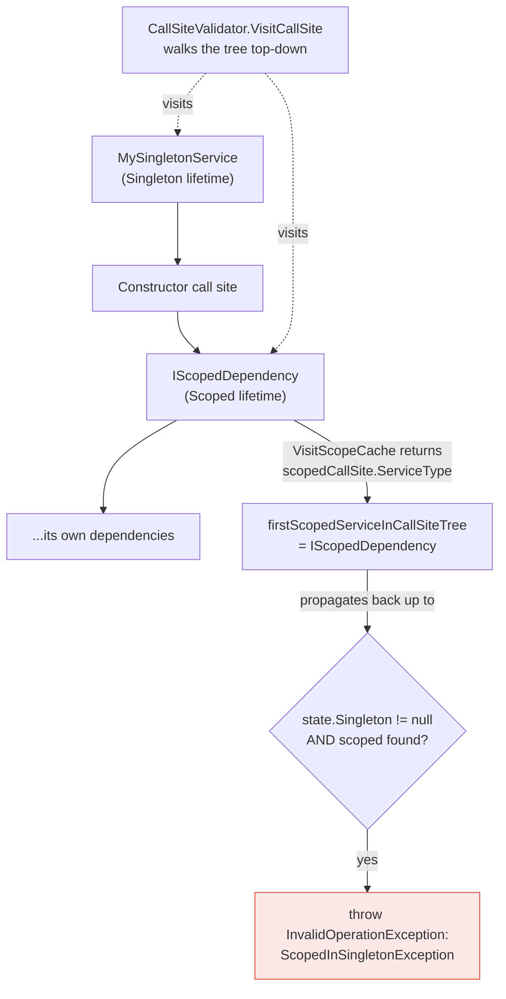

**TL;DR:** Does the built-in `Microsoft.Extensions.DependencyInjection` container just resolve constructor parameters and trust the developer got service lifetimes right? No — when scope validation is enabled, it walks the actual dependency graph (its internal "call site tree") for every service, remembers whether a scoped service appears anywhere inside it, and throws a real, specific exception the moment that tree shows a scoped service trapped inside a singleton — a bug class known as a **captive dependency**, one of the most common and hardest-to-spot lifetime mistakes in real .NET applications.

> **In plain English (30 sec):** Code you already write — Map, function, API call, just bigger.

## 1. The Engineering Problem

A **captive dependency** happens when a singleton service takes a scoped service as a constructor dependency. The container resolves that scoped instance once — the first time the singleton itself gets constructed — and the singleton then holds onto that *same* scoped instance for its entire lifetime, because a singleton is only ever constructed once. Every later request or scope that would normally get a fresh scoped instance instead silently reuses the one instance the singleton captured on day one.

This is dangerous specifically because nothing about it fails loudly by default. A scoped `DbContext` captured this way doesn't throw — it just becomes a de facto singleton `DbContext`, shared and mutated across concurrent requests, producing subtle data corruption or cross-request data leakage that's extremely hard to trace back to "a lifetime mismatch three constructor levels deep." A code reviewer would have to manually trace every constructor parameter of every singleton, transitively, through however many layers of injected dependencies exist, to catch this by inspection — not something that scales past a small codebase.

## 2. The Technical Solution

The container already builds an internal representation of *how* to construct each registered service — a tree of `ServiceCallSite` nodes describing "construct this by calling this constructor with these parameter call sites," recursively. `CallSiteValidator` walks that exact tree, not the developer's source code, looking for any node that's cached with **scoped** lifetime anywhere inside it. It remembers, per service, whether a scoped dependency was found anywhere in that service's own subtree — and the moment it finds a scoped node while walking *inside* a singleton's tree, it throws `InvalidOperationException` naming both services involved.

This check is memoized (a large real dependency graph isn't re-walked node by node every time), and it runs at two different moments: **`ValidateCallSite`**, when a service's call-site tree is first built, and **`ValidateResolution`**, when that service is actually resolved from the application's root scope. Both are gated behind one option, `ValidateScopes` — ASP.NET Core's default host enables this automatically in the Development environment, which is why this specific mistake so often surfaces immediately in local development but would otherwise have shipped silently.



Two core truths this diagram is showing:

- **The check operates on the container's own resolved graph, not on source code or attributes.** It doesn't matter how deeply nested the scoped dependency is, or through how many intermediate services — if it's anywhere in the singleton's call-site tree, the walk finds it, because the walk follows the exact same graph the container would actually use to construct the object.
- **The exception fires at the boundary where a singleton's tree contains a scoped node — not at the scoped service's own registration.** A scoped service is completely fine on its own; the violation only exists in the *relationship*, which is why the check has to walk trees rather than inspect any one registration in isolation.

## 3. The clean example (concept in isolation)

```csharp
// The bug: a singleton capturing a scoped dependency at construction time.
public interface IRequestContext { string RequestId { get; } }   // meant to be scoped: fresh per request

public class RequestContext : IRequestContext
{
    public string RequestId { get; } = Guid.NewGuid().ToString();
}

public class AuditLogger   // registered as Singleton — constructed exactly once
{
    private readonly IRequestContext _context;
    public AuditLogger(IRequestContext context) => _context = context;  // captured ONCE, forever
}

var services = new ServiceCollection();
services.AddScoped<IRequestContext, RequestContext>();
services.AddSingleton<AuditLogger>();

// Without validation, this silently builds a provider where AuditLogger's
// _context.RequestId never changes again after the first resolution.
using var provider = services.BuildServiceProvider(
    new ServiceProviderOptions { ValidateScopes = true }   // this line is what catches it
);
provider.GetService<AuditLogger>();  // throws InvalidOperationException here, not silently later
```

Turning on `ValidateScopes` doesn't change what the container *would* have built — it changes whether the container tells you, immediately and specifically, that what it's about to build is wrong.

## 4. Production reality (from the real repo)

```
runtime/src/libraries/Microsoft.Extensions.DependencyInjection/src/
├── ServiceProvider.cs                     — wires ValidateScopes/ValidateOnBuild, calls the validator
└── ServiceLookup/
    └── CallSiteValidator.cs               — the actual tree walk
```

`ServiceProvider`'s constructor only creates a validator if the option is on, and its `OnCreate`/`OnResolve` hooks are where the two checks actually fire during real resolution:

```csharp
if (options.ValidateScopes)
{
    _callSiteValidator = new CallSiteValidator();
}

private void OnCreate(ServiceCallSite callSite)
{
    _callSiteValidator?.ValidateCallSite(callSite);
}

private void OnResolve(ServiceCallSite? callSite, IServiceScope scope)
{
    if (callSite != null)
    {
        _callSiteValidator?.ValidateResolution(callSite, scope, Root);
    }
}
```

`CallSiteValidator`'s tree walk is a small, precise piece of logic: cache whether a subtree contains a scoped service, and raise the alarm the moment that fact meets a singleton context:

```csharp
protected override Type? VisitCallSite(ServiceCallSite callSite, CallSiteValidatorState argument)
{
    if (!_scopedServices.TryGetValue(callSite.Cache.Key, out Type? firstScopedServiceInCallSiteTree))
    {
        // This call site wasn't cached yet, walk the tree
        firstScopedServiceInCallSiteTree = base.VisitCallSite(callSite, argument);
        _scopedServices[callSite.Cache.Key] = firstScopedServiceInCallSiteTree;
    }

    // If there is a scoped service in the call site tree, make sure we are not resolving it from a singleton
    if (firstScopedServiceInCallSiteTree != null && argument.Singleton != null)
    {
        throw new InvalidOperationException(SR.Format(SR.ScopedInSingletonException,
            callSite.ServiceType,
            argument.Singleton.ServiceType,
            nameof(ServiceLifetime.Scoped).ToLowerInvariant(),
            nameof(ServiceLifetime.Singleton).ToLowerInvariant()
        ));
    }

    return firstScopedServiceInCallSiteTree;
}
```

`VisitRootCache` and `VisitScopeCache` are what actually mark "we're now inside a singleton's subtree" and "this node itself is scoped" as the walk descends:

```csharp
protected override Type? VisitRootCache(ServiceCallSite singletonCallSite, CallSiteValidatorState state)
{
    state.Singleton = singletonCallSite;      // everything visited below this point is "inside a singleton"
    return VisitCallSiteMain(singletonCallSite, state);
}

protected override Type? VisitScopeCache(ServiceCallSite scopedCallSite, CallSiteValidatorState state)
{
    // We are fine with having ServiceScopeService requested by singletons
    if (scopedCallSite.ServiceType == typeof(IServiceScopeFactory))
    {
        return null;
    }

    VisitCallSiteMain(scopedCallSite, state);
    return scopedCallSite.ServiceType;   // report this node as the scoped service found in the tree
}
```

What this teaches that a hello-world can't:

- **`state.Singleton` is only ever set by `VisitRootCache`, and only propagates downward through the recursive walk.** This is what makes the check specifically "a scoped service inside a singleton," rather than a blanket "scoped services shouldn't be resolved from the root" rule — the tree-position context is exactly what distinguishes a real captive dependency from a perfectly fine scoped-to-scoped or transient-to-scoped relationship elsewhere in the same graph.
- **`IServiceScopeFactory` is explicitly exempted inside `VisitScopeCache`**, because injecting a scope *factory* into a singleton (to manually create short-lived scopes on demand) is the *correct*, idiomatic way to consume scoped services from a singleton — the validator is precise enough to allow the sanctioned escape hatch while still catching the direct-capture mistake.
- **The memoization (`_scopedServices` dictionary) means this check scales with the size of the distinct service graph, not with how many times a given service gets resolved.** A deeply shared dependency doesn't get re-walked on every resolution — its scoped-or-not verdict, once computed, is cached by `Cache.Key` and reused.

## 5. Review checklist

- **Is `ValidateScopes` (and ideally `ValidateOnBuild`) actually enabled in every environment where this bug would matter to catch early** — not just relying on ASP.NET Core's Development-environment default, which won't run in a plain `ServiceCollection.BuildServiceProvider()` call outside the full web host? A test project or a background-service host built without the default web host wiring can silently skip this check entirely.
- **For any singleton that legitimately needs per-scope state, is it consuming that state via `IServiceScopeFactory.CreateScope()` inside a method** — the sanctioned pattern this validator explicitly permits — rather than capturing a scoped dependency through the constructor?
- **Does a factory-registered service (`AddSingleton<T>(sp => ...)`) manually resolve a scoped dependency from the passed-in `IServiceProvider` inside the factory delegate?** This bypasses the compile-time constructor-injection pattern the validator's tree-walk is built around examining and can reintroduce the same captive-dependency bug in a form the walk may not trace as directly — worth deliberately reviewing factory registrations by hand.
- **When this exception does fire, does the reported singleton/scoped pair match the actual intended lifetimes** — or does it reveal that one of the two services was registered with the wrong lifetime in the first place, rather than the consuming code being at fault?

## 6. FAQ

**Q: Why isn't `ValidateScopes` enabled by default everywhere, given how serious this bug class is?**
A: The tree walk (and the resolution-time check) has a real, if usually small, per-resolution cost — ASP.NET Core's own hosting defaults trade that cost off by enabling it in Development (where catching the bug early matters more than raw throughput) and leaving it off in Production by default (where the app has presumably already been through Development at least once). Enabling it in Production too is a legitimate choice for extra safety at a small performance cost, not something the framework prohibits.

**Q: Does `ValidateOnBuild` catch the exact same bug, or something different?**
A: Related but distinct — `ValidateOnBuild` eagerly attempts to build and validate the call site for every *registered* service at `BuildServiceProvider()` time, catching captive dependencies (and other resolution failures, like a missing registration) for services that might never actually get resolved during a given run. `ValidateScopes`'s `ValidateResolution` check, by contrast, only fires for services that are actually resolved — so a captive dependency in a rarely-used singleton could go undetected by `ValidateScopes` alone until that code path actually executes, which is exactly the gap `ValidateOnBuild` closes.

**Q: Could a transient service also become a captive dependency if a singleton injects it?**
A: No — a transient service is constructed fresh on every injection, including every time it's injected as a constructor parameter, so a singleton "capturing" a transient dependency just means the singleton holds one particular transient instance forever, which is usually still a mistake but a different, less severe one (no cross-request/cross-scope state sharing, since nothing else would have gotten a "fresher" transient instance anyway). `CallSiteValidator`'s check is specifically about scoped services, because only scoped services carry the "should be fresh per scope" guarantee a captive singleton actually violates.

**Q: Does the validator understand `IEnumerable<T>` injection (resolving all registered implementations of an interface)?**
A: Yes — `VisitIEnumerable` walks every call site in the collection the same way `VisitConstructor` walks every constructor parameter, so a scoped implementation hiding inside an injected `IEnumerable<IMyService>` consumed by a singleton is caught exactly the same way a scoped constructor parameter would be.

---

## Source

- **Concept:** Captive-dependency detection in the built-in .NET DI container
- **Domain:** dotnet
- **Repo:** [dotnet/runtime](https://github.com/dotnet/runtime) → [`src/libraries/Microsoft.Extensions.DependencyInjection/src/ServiceLookup/CallSiteValidator.cs`](https://github.com/dotnet/runtime/blob/main/src/libraries/Microsoft.Extensions.DependencyInjection/src/ServiceLookup/CallSiteValidator.cs), [`src/libraries/Microsoft.Extensions.DependencyInjection/src/ServiceProvider.cs`](https://github.com/dotnet/runtime/blob/main/src/libraries/Microsoft.Extensions.DependencyInjection/src/ServiceProvider.cs) — the real, first-party .NET DI container source


