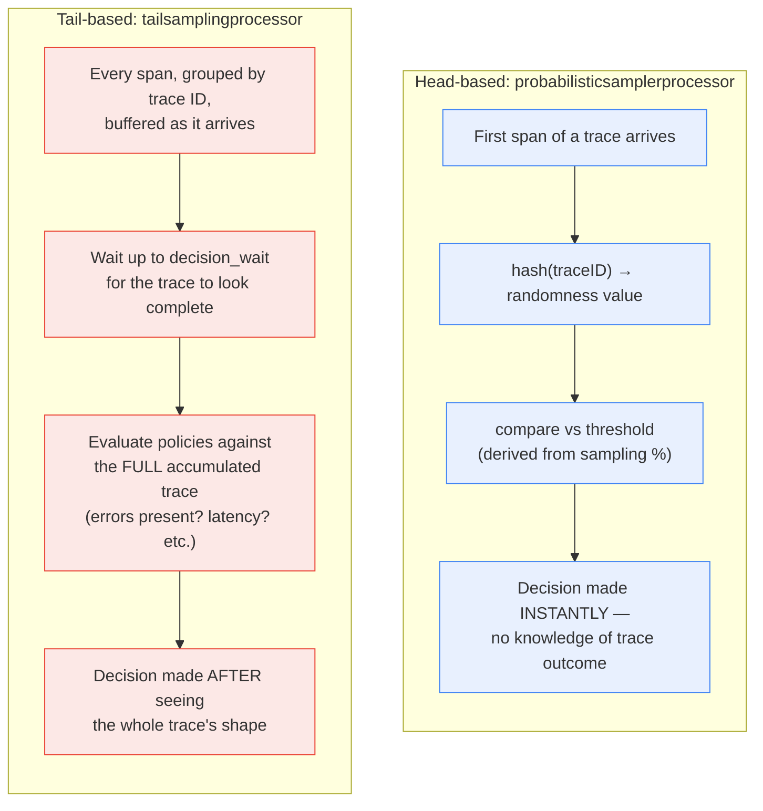

**TL;DR:** Can a trace-sampling decision always be made the instant a trace starts? Only for one of the two real approaches — head-based sampling decides immediately, from nothing but a hash of the trace ID, with zero knowledge of how the trace turns out; tail-based sampling can only guarantee "always keep errors and slow traces" by buffering every span belonging to a trace ID and waiting until the trace looks complete before evaluating anything. That buffering isn't an implementation detail — it's the entire reason tail-based sampling can do something head-based structurally cannot.

> **In plain English (30 sec):** Code you already write — Map, function, API call, just bigger.

## 1. The Engineering Problem

Uniform sampling — "keep 1% of all traces" — is cheap and easy to reason about, but it throws away exactly the traces an on-call engineer needs most. If errors and slow outliers are rare (they usually are), a flat 1% keep-rate drops roughly 99% of the error traces right along with 99% of the boring, healthy ones. The sample a team is left with doesn't correlate with the incidents that actually happened — a system could be having a real, isolated failure and the sampled trace set would show almost nothing wrong, purely because the interesting trace didn't win its 1% coin flip.

What's actually needed is a sampler that keeps error traces and slow traces at a much higher rate than routine ones — but that requirement runs into a hard timing problem: at the moment the *first* span of a trace is created, nothing is known yet about whether that trace will end in an error or take 8 seconds. A decision made that early is necessarily blind to the outcome it would ideally be conditioned on.

## 2. The Technical Solution

Two structurally different sampling approaches solve this timing problem in opposite ways, and OpenTelemetry Collector Contrib implements real, production versions of both.

**Head-based sampling decides immediately, using only information available at the start.** `probabilisticsamplerprocessor` hashes the trace ID into a deterministic "randomness" value and compares it against a threshold derived from the configured sampling percentage — a pure function of the trace ID, computed once, with no memory, no buffering, and no visibility into what any span in that trace will eventually contain.

**Tail-based sampling defers the decision until it can see the (nearly) complete trace.** `tailsamplingprocessor` groups every incoming span by trace ID and holds them in memory/storage, waiting up to a configured `decision_wait` duration. Only when that wait elapses (or an early-decision trigger fires) does it evaluate its configured policies — "sampled if any span had an error," "sampled if total latency exceeds a threshold" — against the *entire accumulated trace*, not a single early span.



Two core truths this diagram is showing:

- **Head-based sampling can't condition on outcome by construction — it has no outcome to look at yet.** The hash-vs-threshold comparison is the entire decision; there's no later step where it reconsiders based on what actually happened in the trace.
- **Tail-based sampling's buffering isn't overhead incidental to the feature — it *is* the feature.** The ability to say "always keep traces with an error" is only possible because the processor is holding the whole trace in memory long enough to check.

## 3. The clean example (concept in isolation)

```python
import hashlib

# Head-based: pure function of trace_id, decided instantly, no state.
def head_based_decision(trace_id: str, sample_rate: float) -> bool:
    h = int(hashlib.sha256(trace_id.encode()).hexdigest(), 16)
    randomness = h / (2**256)
    return randomness < sample_rate   # decided the moment the trace ID exists

# Tail-based: has to accumulate spans first, decide only once "complete."
trace_buffer = {}

def tail_based_ingest(trace_id, span):
    trace_buffer.setdefault(trace_id, []).append(span)

def tail_based_decide(trace_id) -> bool:
    spans = trace_buffer[trace_id]
    has_error = any(s.status == "ERROR" for s in spans)
    total_duration = max(s.end for s in spans) - min(s.start for s in spans)
    return has_error or total_duration > 1.0   # only answerable once spans exist
```

`head_based_decision` needs nothing but a string. `tail_based_decide` is structurally unable to run until spans have actually accumulated — there's no way to check `has_error` before any span with a status exists.

## 4. Production reality (from the real repo)

```
opentelemetry-collector-contrib/processor/
├── probabilisticsamplerprocessor/
│   └── tracesprocessor.go              — head-based: trace-ID hash vs threshold
└── tailsamplingprocessor/
    └── processor.go                    — tail-based: buffer, wait, evaluate
```

The probabilistic (head-based) sampler derives its decision from hashing the trace ID — no buffering type or accumulated state appears anywhere in this path:

```go
func (th *hashingSampler) randomnessFromSpan(s ptrace.Span) (randomnessNamer, samplingCarrier, error) {
    tid := s.TraceID()
    // ...
    rnd = newTraceIDHashingMethod(randomnessFromBytes(tid[:], th.hashSeed))
    // ...
}
```

The tail sampling processor's `ConsumeTraces` does the opposite — it groups every incoming span by trace ID and hands them off to be buffered, rather than deciding anything about them on the spot:

```go
func (tsp *tailSamplingSpanProcessor) ConsumeTraces(ctx context.Context, td ptrace.Traces) error {
    for _, rss := range td.ResourceSpans().All() {
        // First group all spans by trace.
        idToSpansAndScope := groupSpansByTraceKey(rss)

        batch := []traceBatch{}
        for traceID, spans := range idToSpansAndScope {
            newRSS, rootSpan := newResourceSpanFromSpanAndScopes(rss, spans)
            batch = append(batch, traceBatch{
                id:        traceID,
                rootSpan:  rootSpan,
                rss:       newRSS,
                spanCount: int64(len(spans)),
            })
        }
        if len(batch) > 0 {
            tsp.workChan <- batch   // handed off for buffering, not decided here
        }
    }
    return nil
}
```

The actual decision only happens later, on a periodic tick, once the configured `decision_wait` has elapsed — and it evaluates the *entire* accumulated trace, not the span that just arrived:

```go
func (tsp *tailSamplingSpanProcessor) samplingPolicyOnTick() bool {
    batch, hasMore := tsp.decisionBatcher.CloseCurrentAndTakeFirstBatch()

    for id := range batch {
        trace, ok := tsp.idToTrace[id]
        if !ok {
            continue
        }
        allSpans, err := tsp.tailStorage.Take(id)   // retrieve the FULL buffered trace
        // ...
        traceForDecision := samplingpolicy.TraceData{
            SpanCount:       trace.SpanCount,
            SizeBytes:       trace.SizeBytes,
            ReceivedBatches: allSpans,
        }
        decision, policyName := tsp.makeDecision(ctx, id, &traceForDecision, metrics)

        if decision == samplingpolicy.Sampled {
            tsp.releaseSampledTrace(ctx, id, trace)
        } else {
            tsp.releaseNotSampledTrace(id, trace)
        }
    }
    return hasMore
}
```

What this teaches that a hello-world can't:

- **`randomnessFromSpan` needs exactly one input — the trace ID — and nothing about the collector needs to remember anything between calls.** Head-based sampling's statelessness is what makes it trivially cheap at massive scale; there's no buffer to grow, no timer to manage, no risk of running out of memory holding incomplete traces.
- **`decisionBatcher.CloseCurrentAndTakeFirstBatch()` and the per-trace `idToTrace` map are real, bounded resources a tail-sampling deployment has to size for.** Every trace in flight occupies memory until its decision fires — this is the concrete operational cost of the capability head-based sampling can't offer at all.
- **`makeDecision` runs against `allSpans` — the complete buffered trace retrieved from storage — not the single span that triggered the tick.** This is the exact mechanism that makes "keep this trace because *any* span in it had an error" possible: the evaluation genuinely has the whole trace in hand, not a partial, streaming view of it.

## 5. Review checklist

- **Is `decision_wait` actually long enough for the slowest realistic trace in this system to complete before the tick evaluates it** — a trace still in flight when its decision batch is evaluated risks an incomplete-trace decision (missing the very span, e.g. a late error, that the policy was meant to catch)?
- **Does the deployment have enough memory headroom for the expected in-flight trace volume** — tail sampling's buffering cost scales with concurrent traces × `decision_wait`, not with output data volume, and a traffic spike can grow that buffer faster than expected?
- **For a multi-service trace, is tail sampling deployed with consistent trace-ID routing** (e.g. via a load-balancing exporter/collector tier) **so that all of a trace's spans, potentially arriving at different collector instances, actually land in the same buffer for the decision to see the complete picture?** A tail sampler that only sees a fraction of a trace's spans can't correctly evaluate a policy like "any span had an error."
- **Is head-based sampling being relied on anywhere it can't structurally deliver what's expected** — e.g. an assumption that a flat percentage sample will still reliably surface error traces? That expectation is exactly the gap tail-based sampling exists to close; head-based sampling was never going to meet it.

## 6. FAQ

**Q: Can head-based and tail-based sampling be used together in the same pipeline?**
A: Yes, and it's a common real pattern — a cheap head-based sampler can reduce raw span volume very early (e.g. at each service's own SDK, before spans even leave the process), while a downstream tail-sampling collector tier makes the outcome-aware "keep errors and slow traces" decision on whatever made it through. They solve different problems (raw volume reduction vs. outcome-aware retention) and aren't mutually exclusive.

**Q: What happens to a trace's spans in tail sampling if the decision comes back "not sampled"?**
A: They're dropped — `releaseNotSampledTrace` is the path taken instead of `releaseSampledTrace`, and the buffered spans for that trace ID are cleared from memory/storage without being forwarded to any exporter. The buffering was only ever temporary, held just long enough to make the keep/drop call.

**Q: Why does the processor use a "decision batcher" instead of just setting a timer per individual trace?**
A: A per-trace timer for potentially millions of concurrent traces would itself be a real scaling cost. Grouping trace IDs into `decision_wait`-sized batches (`numDecisionBatches := math.Max(1, tsp.cfg.DecisionWait.Seconds())`) lets the processor evaluate many traces' decisions together on a periodic tick, rather than managing one timer object per trace.

**Q: Is trace-ID hashing in `probabilisticsamplerprocessor` truly random, or could the same trace ID always get the same decision?**
A: It's deterministic by design, not truly random — the same trace ID with the same hash seed always produces the same randomness value and therefore the same keep/drop decision. This determinism is actually load-bearing: it's what allows independent collector instances (or a service's own SDK and a downstream collector) to make the *same* sampling decision for a given trace ID without coordinating, which is essential for keeping a trace's spans consistently sampled or consistently dropped across multiple hops.

---

## Source

- **Concept:** Head-based vs. tail-based trace sampling
- **Domain:** observability
- **Repo:** [open-telemetry/opentelemetry-collector-contrib](https://github.com/open-telemetry/opentelemetry-collector-contrib) → [`processor/probabilisticsamplerprocessor/tracesprocessor.go`](https://github.com/open-telemetry/opentelemetry-collector-contrib/blob/main/processor/probabilisticsamplerprocessor/tracesprocessor.go), [`processor/tailsamplingprocessor/processor.go`](https://github.com/open-telemetry/opentelemetry-collector-contrib/blob/main/processor/tailsamplingprocessor/processor.go) — the real, official OpenTelemetry Collector sampling processors


