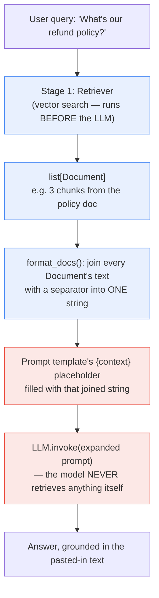

**TL;DR:** Does Retrieval-Augmented Generation mean the model itself somehow reaches out to a database partway through generating a response? No — retrieval happens entirely *before* generation, as a separate, earlier pipeline stage. A retriever fetches relevant documents for the query, their text gets joined into one string, and that string is substituted into the prompt's `{context}` placeholder — the expanded prompt (original question plus pasted-in document text) is the only thing the LLM ever actually sees. The model doesn't retrieve anything; it just receives a longer, more specific prompt than it otherwise would have.

## 1. The Engineering Problem

An LLM's knowledge is frozen at training time — it can't know about a document published yesterday, a company's internal wiki, or any fact that only exists in data it never trained on. Fine-tuning to inject new knowledge is slow, expensive, requires retraining for every update, and — as this domain's known-stale-facts note — doesn't reliably fix outdated facts the way people expect; it bakes in knowledge as of training time rather than making the model check anything at request time.

What's actually needed is a way to hand the model current, specific, possibly private information *at the moment of the request* — but token generation itself has no built-in "pause and look something up" capability. Whatever mechanism supplies that information has to work within the constraint that an LLM call is fundamentally: take a prompt, produce tokens. There's no live database connection inside that loop.

## 2. The Technical Solution

RAG resolves this by splitting into two structurally separate, sequential stages — not one integrated "the model looks things up" capability:

**Stage 1 — Retrieval, before the LLM runs at all.** A retriever (built on the embeddings and vector search from this domain's second lesson) takes the query and returns a list of relevant `Document` objects. This happens entirely outside the LLM, using ordinary vector-similarity search — the model hasn't been invoked yet.

**Stage 2 — Combination, which turns those documents into more prompt text.** The retrieved documents' text gets joined into a single string (with a separator between each), and that string is substituted into a prompt template's `{context}` placeholder, right alongside the original question. *That* expanded prompt — not the original short question — is what's actually sent to the LLM.

`langchain-ai/langchain`, the most widely used real RAG framework, implements exactly this split as two composable pipeline functions: `create_retrieval_chain` (stage 1, producing a `context` key) and `create_stuff_documents_chain` (stage 2, turning that `context` into an `answer`).



Two core truths this diagram is showing:

- **Retrieval fully completes before the LLM is ever called.** There's no interleaving, no mid-generation lookup — by the time `LLM.invoke()` runs, every retrieved document has already been fetched, formatted, and pasted into the prompt text.
- **"Augmentation" is literally string concatenation into a template variable.** The model isn't aware documents were "retrieved" as a distinct concept — from its point of view, it just received a prompt that happens to contain a large block of relevant text before the question.

## 3. The clean example (concept in isolation)

```python
def rag_pipeline(query, retriever, llm, prompt_template):
    # Stage 1: retrieval — happens entirely before the LLM runs
    docs = retriever.get_relevant_documents(query)

    # Stage 2: combination — join retrieved text, substitute into the prompt
    context = "\n\n".join(doc.page_content for doc in docs)
    full_prompt = prompt_template.format(context=context, input=query)

    # The LLM only ever sees the expanded prompt — never the retriever, never the docs directly
    return llm.invoke(full_prompt)
```

Nothing about `llm.invoke(full_prompt)` is different from any other LLM call — the "retrieval-augmented" part is entirely upstream of it, in how `full_prompt` got built.

## 4. Production reality (from the real repo)

```
langchain/libs/langchain/langchain_classic/chains/
├── retrieval.py                          — create_retrieval_chain: Stage 1 wrapper
└── combine_documents/
    └── stuff.py                          — create_stuff_documents_chain: Stage 2, the "stuffing"
```

`create_retrieval_chain` composes the two stages as an LCEL pipeline — `context` gets assigned from the retriever's output, then `answer` gets assigned from running the combine step on that context:

```python
def create_retrieval_chain(
    retriever: BaseRetriever | Runnable[dict, RetrieverOutput],
    combine_docs_chain: Runnable[dict[str, Any], str],
) -> Runnable:
    if not isinstance(retriever, BaseRetriever):
        retrieval_docs: Runnable[dict, RetrieverOutput] = retriever
    else:
        retrieval_docs = (lambda x: x["input"]) | retriever

    return (
        RunnablePassthrough.assign(
            context=retrieval_docs.with_config(run_name="retrieve_documents"),
        ).assign(answer=combine_docs_chain)
    ).with_config(run_name="retrieval_chain")
```

`create_stuff_documents_chain`'s `format_docs` is the exact mechanism that turns a list of retrieved `Document` objects into the single string that fills the prompt's `context` variable:

```python
def create_stuff_documents_chain(
    llm: LanguageModelLike,
    prompt: BasePromptTemplate,
    *,
    document_separator: str = DEFAULT_DOCUMENT_SEPARATOR,
    document_variable_name: str = DOCUMENTS_KEY,
) -> Runnable[dict[str, Any], Any]:
    _document_prompt = document_prompt or DEFAULT_DOCUMENT_PROMPT
    _output_parser = output_parser or StrOutputParser()

    def format_docs(inputs: dict) -> str:
        return document_separator.join(
            format_document(doc, _document_prompt)
            for doc in inputs[document_variable_name]
        )

    return (
        RunnablePassthrough.assign(**{document_variable_name: format_docs}).with_config(
            run_name="format_inputs",
        )
        | prompt      # {context} placeholder filled with the joined string here
        | llm          # the model receives the fully-expanded prompt — nothing else
        | _output_parser
    )
```

What this teaches that a hello-world can't:

- **`format_docs` is a plain string `.join()` over formatted documents — there is no special "document-aware" mechanism inside the LLM call that follows it.** By the time `| prompt | llm` runs, the retrieved content is indistinguishable, from the model's perspective, from any other text that happened to be in the prompt template.
- **The pipeline is two composed `Runnable`s, not one monolithic function** — `create_retrieval_chain` doesn't know or care how `combine_docs_chain` turns `context` into `answer`; `create_stuff_documents_chain` doesn't know or care where its input `context` list of documents came from. This separation is what lets a RAG pipeline swap its retriever (a different vector store, a hybrid search, a reranker) or its combination strategy (stuffing everything vs. map-reduce summarization for many documents) independently.
- **`document_variable_name` defaults to `"context"` and is validated against the prompt template (`_validate_prompt`).** The connection between "what the retriever produced" and "what the prompt template expects" is a named, checked contract — not an implicit convention that silently breaks if a prompt template uses a differently-named placeholder.

## 5. Review checklist

- **Does the prompt template actually instruct the model to answer *using* the provided context, rather than assuming the model will automatically prioritize pasted-in text over its own training knowledge?** Nothing about the stuffing mechanism itself makes the model trust or prefer the retrieved text — that instruction has to be explicit in the prompt's own wording.
- **Is `document_separator` sufficient to prevent one document's content from being misread as a continuation of the previous one** — especially for documents whose own text might resemble the separator or lack clear boundaries?
- **For a query that retrieves many/large documents, does the combined `context` string risk exceeding the model's context window** before this domain's later "Chunking strategies for RAG" and "Context window management" topics' concerns even come into play? Stuffing everything retrieved into one prompt has no built-in limit of its own.
- **Is the retriever's output actually relevant enough that "stuffing" (concatenating everything, unranked/unfiltered beyond top-k) is an appropriate combination strategy**, or does this use case need reranking, deduplication, or a non-stuff combination strategy (map-reduce, refine) that a naive "always use `create_stuff_documents_chain`" default would skip?

## 6. FAQ

**Q: Does the LLM ever see which documents its answer came from, structurally, or just one flattened block of text?**
A: As implemented here, just one flattened block — `format_docs`'s `.join()` produces a single string with no structural markers the LLM is guaranteed to preserve or reference precisely, beyond whatever `document_prompt` formatting includes (e.g. a source label per document, if configured). Attributing a specific claim in the answer back to a specific source document is a separate concern from basic RAG, often handled by asking the model to cite sources explicitly in the prompt instructions or by post-processing.

**Q: Is "stuffing" the only way to combine retrieved documents with a query?**
A: No — `create_stuff_documents_chain` is the simplest strategy (join everything into one prompt), and it's what this lesson focuses on as the foundational mechanism, but `langchain-ai/langchain`'s own `chains/combine_documents/` directory also implements `map_reduce.py` (summarize each document separately, then combine the summaries), `refine.py` (iteratively refine an answer document by document), and `map_rerank.py` (score each document's answer and pick the best) — different strategies for when "just concatenate everything" doesn't fit (too many documents, documents too large, or needing per-document scoring).

**Q: Where does the retriever itself come from — is it always a vector database?**
A: Not necessarily — `create_retrieval_chain`'s `retriever` parameter accepts any `BaseRetriever` or compatible `Runnable`, which could be backed by a vector store (the most common case, and what this domain's previous lesson covered), a keyword/full-text search index, a hybrid of both, or even a non-search source like a fixed document set. The retrieval-then-stuff mechanism this lesson describes is agnostic to how retrieval itself is implemented.

**Q: If the retrieved context is wrong or irrelevant, will the model notice and ignore it?**
A: Not reliably — an LLM given irrelevant or misleading pasted-in text will often still incorporate it into the answer, since nothing about the stuffing mechanism validates the retrieved content's actual relevance before it reaches the prompt. This is exactly why retrieval quality (this domain's embeddings/vector-search and chunking-strategy lessons) matters as much as the combination step covered here — a perfect prompt template can't compensate for genuinely bad retrieval.

---

## Source

- **Concept:** RAG's two-stage retrieval-then-combination pipeline
- **Domain:** genai
- **Repo:** [langchain-ai/langchain](https://github.com/langchain-ai/langchain) → [`libs/langchain/langchain_classic/chains/retrieval.py`](https://github.com/langchain-ai/langchain/blob/master/libs/langchain/langchain_classic/chains/retrieval.py), [`libs/langchain/langchain_classic/chains/combine_documents/stuff.py`](https://github.com/langchain-ai/langchain/blob/master/libs/langchain/langchain_classic/chains/combine_documents/stuff.py) — the most widely used real RAG/agent framework

---

**Next in the Generative AI series:** [Chunking Strategies for RAG: Why Fixed-Size Splitting Breaks Retrieval]({{ '/genai/chunking-strategies-for-rag-fixed-size-vs-semantic-splitting/' | relative_url }})
