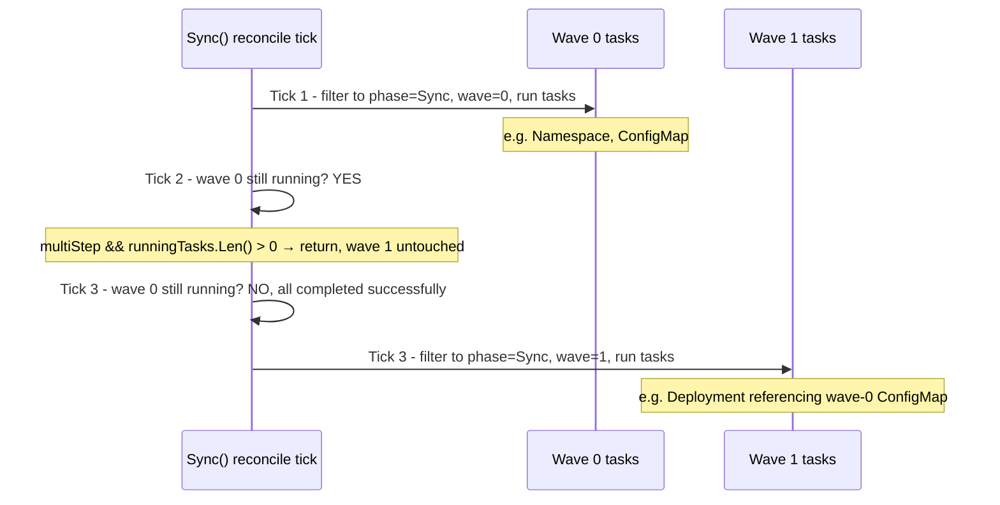

**TL;DR:** Is `argocd.argoproj.io/sync-wave: "5"` just a documentation hint, or does it actually gate when a resource gets applied? It genuinely gates execution — the wave number feeds directly into the strict sort order the sync engine applies resources in, and Argo CD's reconcile loop won't touch any resource in a later wave while anything in the current wave is still running. Ordering isn't a suggestion here; it's enforced by the loop's own control flow on every tick.

## 1. The Engineering Problem

A plain `kubectl apply -f manifests/` sends every resource in a directory to the API server in roughly whatever order the client happens to process files — Kubernetes itself doesn't understand or enforce any dependency ordering between them. Most of the time that's fine, because Kubernetes' own reconciliation (a Pod retrying a missing ConfigMap mount, for instance) eventually converges even if resources arrived "in the wrong order."

But some real dependencies genuinely aren't self-healing that way: a CustomResourceDefinition has to exist before a custom resource of that kind can even be accepted by the API server (not eventually — immediately, or the apply is flatly rejected); a database-migration `Job` needs to actually *complete* before the application `Deployment` that depends on the new schema should start receiving traffic; a `PreSync` cleanup step needs to finish before the main resources it prepares for get applied at all. "Apply everything, let Kubernetes sort it out" doesn't work for these — they need genuine, enforced sequencing, not eventual consistency.

## 2. The Technical Solution

Argo CD's sync engine (`argoproj/gitops-engine`, the shared library its own controller is built on) solves this with a strict, two-part mechanism: a **sort order** that determines what "next" means, and a **gate** in the reconcile loop that refuses to start the next group until the current one is actually done.

**The sort order is a four-key tuple: phase, then wave, then kind, then name.** Phase distinguishes `PreSync` (runs before the main sync), `Sync` (the main resource apply), `PostSync` (runs after), and `SyncFail` (runs only if something failed) — hooks are just resources tagged with one of these phases. Within a phase, `wave` is a plain integer read from the `argocd.argoproj.io/sync-wave` annotation (defaulting to a Helm hook weight if unset, and to `0` if neither is present). Within a wave, `kind` falls back to a sensible built-in Kubernetes ordering (`Namespace` before `ConfigMap` before `Deployment`, and so on) — so even a manifest set with no explicit waves at all still gets a reasonable default order.

**The gate is in the sync loop itself, re-evaluated on every tick.** On each pass, the loop isolates only the tasks belonging to the current lowest pending `(phase, wave)`, and if *any* task from the current group is still running, it returns immediately — without so much as looking at what's in the next wave. Only once every task in the current group has finished does the next tick's filtering step move on.



Two core truths this diagram is showing:

- **The gate check happens before the next wave's tasks are even selected.** `runningTasks.Len() > 0` short-circuits the tick with a plain `return` — wave 1's tasks aren't filtered, aren't examined, aren't started, because the code path never reaches that point while wave 0 has anything outstanding.
- **"Multi-step" is what makes waiting mandatory rather than optional.** A sync spanning more than one phase/wave (`tasks.multiStep()`) is treated differently from a simple, single-wave `kubectl apply`-equivalent sync — only the multi-step case needs this blocking behavior at all.

## 3. The clean example (concept in isolation)

```python
# The sort key: phase, then wave, then kind, then name.
def sort_key(task):
    return (PHASE_ORDER[task.phase], task.wave, KIND_ORDER.get(task.kind, 0), task.name)

tasks_by_wave = sorted(all_tasks, key=sort_key)

# The gate: don't touch the next wave while the current one has anything running.
def sync_tick(tasks):
    current_phase, current_wave = tasks[0].phase, tasks[0].wave
    current_group = [t for t in tasks if t.phase == current_phase and t.wave == current_wave]

    if any(t.running for t in current_group):
        return  # do NOT look at later waves at all this tick

    for t in current_group:
        if t.pending:
            t.start()
```

The sort produces a total order; the gate is what actually stops execution from racing ahead into that order — without it, a sorted list is just a sorted list, not an enforced sequence.

## 4. Production reality (from the real repo)

```
gitops-engine/pkg/sync/
├── syncwaves/waves.go       — Wave(): reads the sync-wave annotation
├── sync_tasks.go            — the (phase, wave, kind, name) sort comparator
└── sync_context.go          — Sync(): the tick-by-tick gate
```

`Wave()` is a small, direct annotation read, falling back to a Helm hook weight if the Argo-specific annotation isn't set:

```go
func Wave(obj *unstructured.Unstructured) int {
    text, ok := obj.GetAnnotations()[common.AnnotationSyncWave]
    if ok {
        val, err := strconv.Atoi(text)
        if err == nil {
            return val
        }
    }
    return helmhook.Weight(obj)
}
```

`syncTasks.Less()` is the actual comparator — phase first, wave second, kind third (via a fixed built-in ordering table), name last:

```go
var syncPhaseOrder = map[common.SyncPhase]int{
    common.SyncPhasePreSync:  -1,
    common.SyncPhaseSync:     0,
    common.SyncPhasePostSync: 1,
    common.SyncPhaseSyncFail: 2,
}

func (s syncTasks) Less(i, j int) bool {
    tA, tB := s[i], s[j]

    d := syncPhaseOrder[tA.phase] - syncPhaseOrder[tB.phase]
    if d != 0 {
        return d < 0
    }
    d = tA.wave() - tB.wave()
    if d != 0 {
        return d < 0
    }
    a, b := tA.obj(), tB.obj()
    d = kindOrder[a.GetKind()] - kindOrder[b.GetKind()]
    if d != 0 {
        return d < 0
    }
    return a.GetName() < b.GetName()
}
```

And `Sync()`'s gate is what turns that sort order into an actually-enforced sequence, checked fresh on every reconcile tick:

```go
multiStep := tasks.multiStep()
runningTasks := tasks.Filter(func(t *syncTask) bool { return (multiStep || t.isHook()) && t.running() })
if runningTasks.Len() > 0 {
    sc.setRunningPhase(runningTasks, false)
    return   // next wave is never even examined this tick
}

// ...only reached once nothing from an earlier phase/wave is still running...

phase := tasks.phase()
wave := tasks.wave()
tasks = tasks.Filter(func(t *syncTask) bool { return t.phase == phase && t.wave() == wave })

sc.setOperationPhase(common.OperationRunning, "one or more tasks are running")
runState := sc.runTasks(tasks, false)
```

What this teaches that a hello-world can't:

- **The `kindOrder` fallback means waves aren't required to get sensible ordering — they're required to get *custom* ordering beyond the built-in default.** `Namespace` sorts before every other listed kind regardless of wave annotations, which is why "no explicit waves" still doesn't create resources in an unsafe order for the common cases.
- **`runningTasks` checks `multiStep || t.isHook()` — meaning single-wave, non-hook syncs deliberately skip this blocking behavior entirely.** The gate exists specifically for sequences with real ordering dependencies; a plain one-wave manifest sync is allowed to behave like an ordinary, non-blocking apply, which is why sync waves have a real performance cost only when they're actually being used for multi-step orchestration.
- **The gate's `return` happens before task filtering for the next wave runs at all** — this isn't "start the next wave's tasks but pause them," it's "never construct the next wave's task list in the first place" until the current one has fully resolved.

## 5. Review checklist

- **Does a resource with a genuine startup dependency on another resource actually have a `sync-wave` annotation reflecting that** — or is the dependency assumed to "usually work" because Kubernetes' own retry behavior has papered over the ordering gap in testing so far?
- **Is a `PreSync`/`PostSync` hook's `hook-delete-policy` set deliberately** (e.g. `HookSucceeded` to clean it up only after success, leaving it for inspection on failure), rather than left at a default that might delete diagnostic evidence right when it's most needed after a failed sync?
- **For a multi-wave sync, does any wave's task fail in a way that should legitimately halt the whole sync** — since `Sync()`'s "one or more tasks completed unsuccessfully" check stops the operation and triggers `SyncFail`-phase tasks, is that failure-fail-fast behavior actually what this specific resource's failure mode should trigger, or would a partial/degraded state be preferable for it?
- **Are wave numbers assigned with enough headroom between them** for future insertions (e.g. `0, 10, 20` rather than `0, 1, 2`), so a newly-discovered ordering dependency doesn't require renumbering every existing wave annotation across the manifest set?

## 6. FAQ

**Q: If wave 0 has both a `Namespace` and a `ConfigMap` with no explicit wave annotations, which applies first?**
A: The `Namespace`, via the `kindOrder` tiebreaker — both default to wave `0` (no annotation, no Helm hook weight), so the comparator falls through to comparing `kindOrder["Namespace"]` against `kindOrder["ConfigMap"]`, and `Namespace` sorts first in the built-in table.

**Q: Does a hook (PreSync/PostSync/SyncFail) also respect wave ordering within its own phase?**
A: Yes — hooks are tasks like any other in this sort, just tagged with a non-`Sync` phase; multiple `PreSync` hooks with different `sync-wave` annotations are ordered relative to each other exactly the same way regular `Sync`-phase resources are, via the same wave/kind/name tiebreakers.

**Q: What happens if two resources in the same wave have a real dependency on each other?**
A: The wave-gating mechanism described here only enforces ordering *between* waves — resources within the same wave are all submitted together (subject to the kind/name tiebreak for submission order, but without waiting for one to become healthy before the next starts). A genuine same-wave dependency needs to be split into separate waves; this mechanism can't resolve an intra-wave ordering requirement on its own.

**Q: Does `multiStep()` mean the sync waits for resources to become *healthy*, or just for them to be *applied*?**
A: This mechanism, as shown here, waits for tasks to stop `running()` — which for hooks specifically ties to hook completion/success, and for regular resources ties to the sync operation's own apply-and-settle tracking rather than a full application-level health check. Health-based promotion gating (waiting for a rollout to actually be healthy, not just applied) is a related but distinct mechanism, covered by this domain's later progressive-delivery topic.

---

## Source

- **Concept:** Sync-wave ordering and hook phases in GitOps resource application
- **Domain:** gitops
- **Repo:** [argoproj/gitops-engine](https://github.com/argoproj/gitops-engine) → [`pkg/sync/syncwaves/waves.go`](https://github.com/argoproj/gitops-engine/blob/master/pkg/sync/syncwaves/waves.go), [`pkg/sync/sync_tasks.go`](https://github.com/argoproj/gitops-engine/blob/master/pkg/sync/sync_tasks.go), [`pkg/sync/sync_context.go`](https://github.com/argoproj/gitops-engine/blob/master/pkg/sync/sync_context.go) — the shared sync engine Argo CD's own controller is built on


