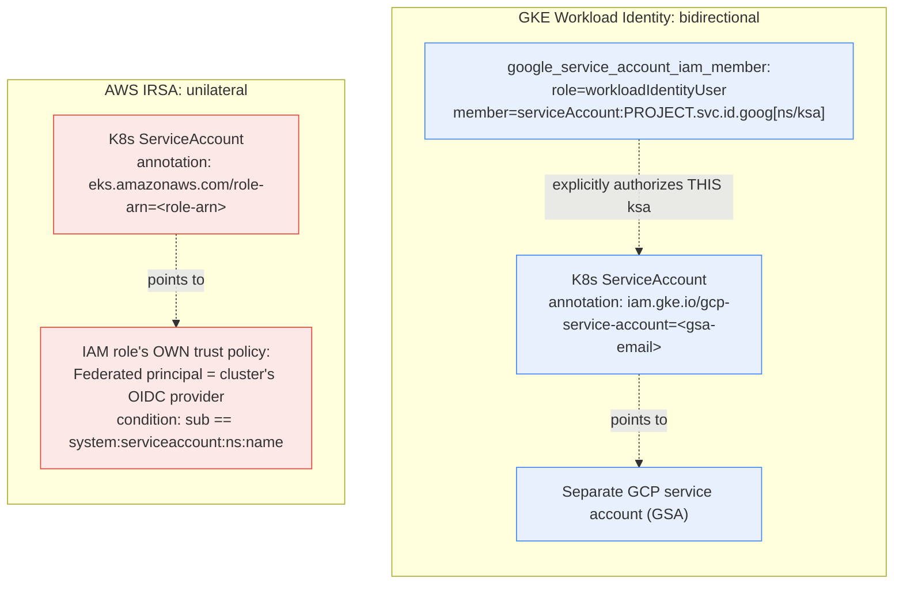

**TL;DR:** Does "Kubernetes is the multi-cloud abstraction layer" mean a ServiceAccount that grants a pod cloud IAM permissions works identically on GKE and EKS? The Kubernetes-side object is genuinely the same — a `ServiceAccount` with an annotation — but what happens on the cloud side of that annotation is structurally different. GKE's Workload Identity is a *bidirectional* binding: a separate GCP service account, plus an explicit IAM policy grant naming the exact Kubernetes ServiceAccount allowed to impersonate it. AWS's IRSA is a *unilateral* trust policy: the IAM role itself trusts any token whose subject claim matches a specific `namespace:name` string, issued by a per-cluster OIDC provider. Same Kubernetes API surface, genuinely different security architecture underneath.

## 1. The Engineering Problem

The pitch for Kubernetes as a multi-cloud abstraction layer is real as far as it goes: a `Deployment`, a `Service`, a `ServiceAccount` are the same API objects whether the cluster is GKE, EKS, or AKS. But a real workload usually needs more than compute — it needs to call cloud-native services (an object storage bucket, a managed database, a secrets manager) with real, scoped permissions. "How does a pod get cloud credentials" is exactly the kind of integration where a thin API-surface abstraction runs out fastest: a team that assumes "grant the ServiceAccount permissions" works the same way everywhere hits a wall the first time it tries to port that specific piece of config between clouds.

## 2. The Technical Solution

Both real, curated Terraform modules for this — GKE's `workload-identity` submodule and AWS's `iam-role-for-service-accounts` module — attach cloud identity to a Kubernetes `ServiceAccount` via an annotation. That's where the similarity ends; the actual binding mechanism underneath is architecturally different.

**GKE Workload Identity is bidirectional.** A separate GCP service account is created. The Kubernetes `ServiceAccount` gets annotated with that GCP service account's email (`iam.gke.io/gcp-service-account`). And — separately — a `google_service_account_iam_member` resource explicitly grants the `roles/iam.workloadIdentityUser` role to a synthetic principal string derived from the Kubernetes ServiceAccount's own namespace and name (`serviceAccount:PROJECT.svc.id.goog[namespace/ksa-name]`). GCP has to be told, from its own IAM side, exactly which Kubernetes ServiceAccount may impersonate this GCP service account — two separate, explicit steps, one on each side.

**AWS IRSA is unilateral.** The Kubernetes `ServiceAccount` gets annotated with an IAM role ARN. The trust relationship lives entirely inside that IAM role's own trust policy: a statement allowing `sts:AssumeRoleWithWebIdentity` from a *Federated* principal (the cluster's OIDC provider), gated by a condition matching the presented token's `sub` claim against the literal string `system:serviceaccount:<namespace>:<name>`. There's no separate "identity pool" grant call on the Kubernetes side — the entire security boundary is the IAM role's trust policy, and it depends on an OIDC provider resource that has to be registered once per cluster, pointing at that cluster's own OIDC issuer URL.



Two core truths this diagram is showing:

- **GKE needs an explicit grant naming the Kubernetes identity; AWS needs an explicit condition matching a token claim.** Both achieve the same end result (only this specific ServiceAccount can assume this specific cloud identity), but GKE does it via an IAM policy binding resource, while AWS does it via a string-match condition embedded in the role's trust policy document — genuinely different resource types, genuinely different Terraform shapes.
- **AWS's mechanism has an extra per-cluster prerequisite GKE's doesn't: the OIDC provider itself.** Workload Identity's `PROJECT.svc.id.goog` identity pool is implicit for every GKE cluster in a project; IRSA's OIDC provider is a real resource that has to be created and associated with each cluster's own issuer URL before any role trust policy referencing it can work.

## 3. The clean example (concept in isolation)

```hcl
# GKE: annotate the KSA, AND separately grant the binding on the GCP side.
resource "kubernetes_service_account_v1" "gke_example" {
  metadata {
    name      = "my-app"
    namespace = "default"
    annotations = { "iam.gke.io/gcp-service-account" = google_service_account.app.email }
  }
}
resource "google_service_account_iam_member" "binding" {
  service_account_id = google_service_account.app.name
  role                = "roles/iam.workloadIdentityUser"
  member              = "serviceAccount:my-project.svc.id.goog[default/my-app]"
}

# AWS: annotate the KSA; the trust lives entirely inside the role itself.
resource "kubernetes_service_account_v1" "eks_example" {
  metadata {
    name      = "my-app"
    namespace = "default"
    annotations = { "eks.amazonaws.com/role-arn" = aws_iam_role.app.arn }
  }
}
# aws_iam_role.app's own assume_role_policy already contains:
#   Federated principal = cluster's OIDC provider ARN
#   condition: "<oidc-provider>:sub" == "system:serviceaccount:default:my-app"
```

Same annotation-based entry point on the Kubernetes side; a two-resource explicit-grant shape on GKE versus a one-resource embedded-trust-policy shape on AWS.

## 4. Production reality (from the real repo)

```
terraform-google-kubernetes-engine/modules/workload-identity/
└── main.tf                — KSA annotation + explicit workloadIdentityUser binding

terraform-aws-iam/modules/iam-role-for-service-accounts/
└── main.tf                 — IAM role trust policy with sub-claim condition
```

GKE's module creates the Kubernetes `ServiceAccount` with the annotation, then separately grants the binding that authorizes it:

```hcl
resource "kubernetes_service_account_v1" "main" {
  metadata {
    name      = local.k8s_given_name
    namespace = var.namespace
    annotations = {
      "iam.gke.io/gcp-service-account" = local.gcp_sa_email
    }
  }
}

resource "google_service_account_iam_member" "main" {
  service_account_id = google_service_account.cluster_service_account[0].name
  role                = "roles/iam.workloadIdentityUser"
  member              = local.k8s_sa_gcp_derived_name  # serviceAccount:PROJECT.svc.id.goog[ns/ksa]
}
```

AWS's module builds the IAM role's trust policy directly, matching the OIDC token's subject claim against the Kubernetes ServiceAccount's own `namespace:name` identity:

```hcl
data "aws_iam_policy_document" "assume" {
  dynamic "statement" {
    for_each = var.oidc_providers

    content {
      effect  = "Allow"
      actions = ["sts:AssumeRoleWithWebIdentity"]

      principals {
        type        = "Federated"
        identifiers = [statement.value.provider_arn]
      }

      condition {
        test     = var.trust_condition_test
        variable = "${replace(statement.value.provider_arn, "/^(.*provider/)/", "")}:sub"
        values   = [for sa in statement.value.namespace_service_accounts : "system:serviceaccount:${sa}"]
      }

      condition {
        test     = var.trust_condition_test
        variable = "${replace(statement.value.provider_arn, "/^(.*provider/)/", "")}:aud"
        values   = ["sts.amazonaws.com"]
      }
    }
  }
}

resource "aws_iam_role" "this" {
  assume_role_policy = data.aws_iam_policy_document.assume[0].json
}
```

What this teaches that a hello-world can't:

- **GKE's `k8s_sa_gcp_derived_name` and AWS's `sub` condition value are both string-encoded Kubernetes identities — but they're consumed by completely different cloud primitives.** GKE's string is the *member* of an IAM policy binding; AWS's string is a *condition value* inside a trust policy statement. A migration script that tries to "just copy the identity string across" would be moving the right information into the wrong kind of resource entirely.
- **AWS's `aud` (audience) condition has no direct GKE equivalent in this module at all.** IRSA's federation model requires validating both *who* the token is for (`sub`) and *what it's valid for* (`aud`, pinned to `sts.amazonaws.com`) — a second, independent check GKE's binding-based model doesn't need, because Workload Identity's trust boundary is enforced by the IAM binding's own scoping rather than by validating claims inside a presented token.
- **The OIDC provider dependency (`var.oidc_providers`, `provider_arn`) is a real, per-cluster resource on the AWS side that has no parallel in the GKE module at all.** Porting a workload's cloud-IAM binding from EKS to GKE doesn't just mean changing a few field names — it means recognizing that an entire prerequisite resource (the OIDC provider registration) simply doesn't exist as a concept on the other cloud.

## 5. Review checklist

- **When migrating a workload's cloud-IAM binding between GKE and EKS, is the migration treating this as "swap the annotation value" or correctly recognizing it needs an entirely different Terraform resource shape** (an explicit IAM binding vs. an embedded trust policy condition)?
- **For an EKS cluster, does the referenced OIDC provider resource actually correspond to *this* cluster's own issuer URL** — a trust policy pointing at the wrong or a stale OIDC provider ARN fails IRSA silently from the pod's perspective (credentials just don't materialize), not with an obviously diagnostic error.
- **For a GKE Workload Identity binding, is the `google_service_account_iam_member`'s `member` string's namespace/ServiceAccount-name pair kept in sync with the actual Kubernetes `ServiceAccount`** — a manually-edited or copy-pasted binding with a stale namespace silently authorizes the wrong (or no) Kubernetes identity?
- **Is a multi-cloud abstraction layer (a shared Terraform module, an internal platform tool) attempting to unify these two mechanisms behind one interface** — and if so, does it correctly implement both underlying shapes, or does it only handle the simpler of the two and silently degrade for the other cloud?

## 6. FAQ

**Q: Is there an Azure AKS equivalent to Workload Identity/IRSA, and does it look like either of these?**
A: Yes — Azure AD Workload Identity for AKS also uses an OIDC federation model (closer in shape to AWS's IRSA than to GKE's binding-based approach), with a federated identity credential resource matching a Kubernetes ServiceAccount's issuer/subject, but its resource types and API details differ from both of the mechanisms shown here — a genuine third variation, not a repeat of either.

**Q: Does the annotation-based entry point on the Kubernetes side mean application code doesn't need to know which cloud it's running on?**
A: For credential *acquisition*, largely yes — cloud SDKs (the AWS SDK checking for IRSA's injected environment variables and mounted token, the GCP SDK checking for Workload Identity's metadata-server-shaped response) handle the cloud-specific protocol internally, so application code typically just asks its SDK for default credentials without hardcoding which mechanism is in play. This lesson's point is that the *infrastructure* config wiring up that credential path is not portable, even though the application code consuming the result often can be.

**Q: Why does GKE need a separate GCP service account at all — couldn't the Kubernetes ServiceAccount just be granted IAM roles directly?**
A: GCP's IAM model doesn't have a native concept of a Kubernetes ServiceAccount as a grantable identity — `roles/iam.workloadIdentityUser` is specifically what lets a Kubernetes ServiceAccount *impersonate* a real GCP service account, and it's that GCP service account which then holds the actual project-level IAM role grants (`google_project_iam_member` in the full module). The Kubernetes ServiceAccount is never itself a first-class GCP IAM principal — it borrows a GCP service account's identity through this binding.

**Q: Could a team avoid this divergence entirely by using Crossplane or another abstraction layer instead of hand-writing per-cloud Terraform?**
A: An abstraction can hide the *authoring* difference behind one interface, similar to the Crossplane Claims/Compositions pattern this domain's next topic covers — but whatever implements that abstraction still has to correctly generate both of these structurally different resource shapes underneath. The divergence documented in this lesson doesn't disappear; it just moves to wherever that abstraction's own implementation lives.

---

## Source

- **Concept:** Kubernetes ServiceAccount-to-cloud-IAM identity binding across providers
- **Domain:** multicloud
- **Repo:** [terraform-google-modules/terraform-google-kubernetes-engine](https://github.com/terraform-google-modules/terraform-google-kubernetes-engine) → [`modules/workload-identity/main.tf`](https://github.com/terraform-google-modules/terraform-google-kubernetes-engine/blob/master/modules/workload-identity/main.tf); [terraform-aws-modules/terraform-aws-iam](https://github.com/terraform-aws-modules/terraform-aws-iam) → [`modules/iam-role-for-service-accounts/main.tf`](https://github.com/terraform-aws-modules/terraform-aws-iam/blob/master/modules/iam-role-for-service-accounts/main.tf) — real, widely-used Terraform modules for GKE Workload Identity and AWS IRSA
