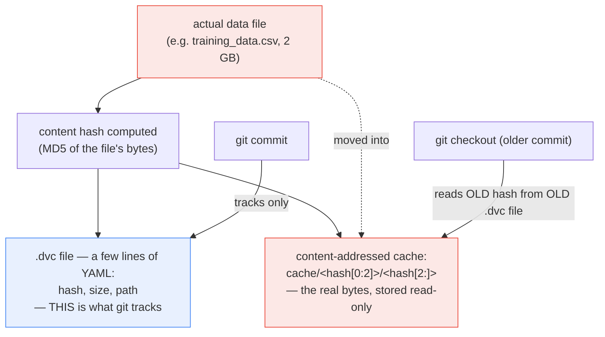

**TL;DR:** Does DVC, "Git for datasets," teach git to actually store large binary data files? No — it does the opposite: it keeps git doing exactly what git is already good at (tracking small text files efficiently) and never gives it the real data at all. A `.dvc` file — a few lines of plain YAML holding a content hash, a size, and a path — is what git actually commits. The real data lives in a completely separate, content-addressed cache, keyed by that same hash, using the identical two-level sharded-directory scheme git's own internal object store has always used.

## 1. The Engineering Problem

Git is genuinely bad at large or binary files. It stores full snapshots of blobs (binary diffs don't compress the way text diffs do), and every version of every large file committed directly stays in `.git` history forever, even for versions nobody needs anymore. A repository with training datasets committed directly balloons in size, clones get slow, and the problem only compounds as more dataset versions accumulate over a project's lifetime.

The naive fixes have real gaps. Bolting external large-file storage directly onto git (the Git LFS approach) still requires git-native smudge/clean filter plumbing and per-repo hook configuration. Just describing a dataset in a README ("v3 is the one with the deduplicated records, ask Alice for the file") isn't checkable or reproducible from git history alone — nothing enforces that the README's description still matches whatever file is actually sitting in some shared drive today.

## 2. The Technical Solution

DVC's real mechanism is to never let the actual data enter git at all. When a data file is tracked with DVC, it computes a content hash (typically MD5) of that file, and writes a small `.dvc` file — plain YAML containing that hash, the file's size, and its relative path — which git tracks completely normally, the same as any small text file. The real data bytes get moved into a separate cache directory, addressed purely by that same content hash.

That cache uses the *exact same* directory-sharding scheme git's own internal object store has always used: the first two characters of the hash become a subdirectory name, and the rest of the hash becomes the filename inside it (`cache/<hash[0:2]>/<hash[2:]>`). This isn't a coincidence or borrowed convention loosely inspired by git — it's the same practical solution to the same problem (avoiding one directory with millions of flat files) applied a second time, one layer below where git's own object store lives.



Two core truths this diagram is showing:

- **Git never sees the large file's bytes at any point.** Every operation git performs — diff, commit, clone, checkout — operates on the tiny `.dvc` file; the multi-gigabyte data never enters git's own object store at all.
- **Checking out an old commit doesn't re-download or re-copy anything already cached.** The old commit's `.dvc` file simply names a different hash — if that hash's content already exists in the local content-addressed cache (from any prior checkout, not necessarily the most recent one), DVC finds it immediately with no network or copy cost.

## 3. The clean example (concept in isolation)

```python
import hashlib, shutil, os

def track_with_dvc(data_path, cache_dir):
    content_hash = hashlib.md5(open(data_path, "rb").read()).hexdigest()

    # Content-addressed cache path — same two-level scheme git uses internally.
    cache_path = os.path.join(cache_dir, content_hash[:2], content_hash[2:])
    os.makedirs(os.path.dirname(cache_path), exist_ok=True)
    shutil.move(data_path, cache_path)
    os.chmod(cache_path, 0o444)  # read-only: content-addressed objects must never mutate in place

    # The ONLY thing that goes into git:
    dvc_file_content = {"md5": content_hash, "size": os.path.getsize(cache_path), "path": data_path}
    return dvc_file_content  # a few bytes of YAML, not the 2GB file
```

The multi-gigabyte file moves into the cache exactly once; every subsequent git operation touches only the small dictionary that describes it.

## 4. Production reality (from the real repo)

```
dvc/dvc/
└── output.py                    — Output.dumpd(): what a .dvc file actually contains

dvc-data/src/dvc_data/hashfile/db/
└── local.py                     — LocalHashFileDB.oid_to_path(): the sharded cache layout
```

`Output.dumpd()` is what actually gets serialized into a `.dvc` file — a hash, a size (as part of `meta`), and a path, nothing resembling the real data:

```python
def dumpd(self, **kwargs):
    ret: dict[str, Any] = {}
    # ...
    if self.hash_name in LEGACY_HASH_NAMES:
        name = "md5" if self.hash_name == "md5-dos2unix" else self.hash_name
        ret.update({name: self.hash_info.value})
    else:
        ret.update(self.hash_info.to_dict())
    ret.update(split_file_meta_from_cloud(meta_d))

    path = self.fs.as_posix(relpath(self.fs_path, self.stage.wdir))
    ret[self.PARAM_PATH] = path
    return ret
```

`oid_to_path` is the entire content-addressing mechanism — a hash in, a sharded filesystem path out, with the sharding depth (`oid[0:2]` / `oid[2:]`) hardcoded directly in the implementation:

```python
class LocalHashFileDB(HashFileDB):
    CACHE_MODE: ClassVar[int] = 0o444   # read-only — content-addressed objects are immutable

    def oid_to_path(self, oid):
        # NOTE: `self.path` is already normalized so we can simply use
        # `os.sep` instead of `os.path.join`. This results in this helper
        # being ~5.5 times faster.
        return f"{self.path}{os.sep}{oid[0:2]}{os.sep}{oid[2:]}"
```

What this teaches that a hello-world can't:

- **`CACHE_MODE = 0o444` is a real, load-bearing design constraint, not a permissions afterthought.** Content-addressing's entire correctness guarantee — "this hash always means this exact content" — depends on a cached object never being mutated after it's written; making the file read-only on disk enforces that invariant at the filesystem level rather than trusting application code to never overwrite it.
- **`oid_to_path` doesn't consult any database, index, or lookup table to find a hash's location — the path *is* derived directly from the hash itself.** Given any hash string, the cache location is computable in constant time with pure string slicing; there's no separate mapping to keep in sync or that could drift out of date.
- **`dumpd()`'s output is small enough that git handles it exactly as efficiently as any other small text file it was always good at.** DVC doesn't extend or modify git's own storage model at all — it simply never asks git to do the one thing git is bad at, and hands that job to a purpose-built, content-addressed store instead.

## 5. Review checklist

- **Is the actual data cache (not just the `.dvc` files) backed up or pushed to a real remote** (DVC's own `dvc push`/`dvc pull` to cloud storage, or an equivalent)? Git only ever tracks the small pointer files — losing the local cache with no remote copy of the underlying content means the `.dvc` files' hashes point at data that no longer exists anywhere.
- **Does CI/CD or a fresh clone's setup actually run `dvc pull` (or equivalent) before any pipeline step that needs the real data** — a plain `git clone` alone only retrieves the `.dvc` pointer files, never the underlying content?
- **Is a data file ever edited or replaced in place at its cache path**, bypassing DVC's normal hash-then-move flow? The read-only permission is a real safeguard, but any process running with sufficient privilege to override file permissions could still violate the content-addressing invariant this mechanism depends on.
- **When a `.dvc` file's hash changes between commits, is that actually reflecting an intentional new data version — or a non-deterministic data-generation process producing a different hash for what should have been identical content** (e.g. an unstable row order, embedded timestamps)? Content-addressing faithfully reports every byte-level difference, including ones that weren't meaningful.

## 6. FAQ

**Q: Does DVC compute a fresh hash of a large file on every single command, which would be slow for multi-gigabyte data?**
A: DVC maintains a local state cache keyed by file modification time and inode/size to avoid rehashing unchanged files on every operation — the full hash computation shown here is the ground-truth mechanism, but real usage short-circuits it when a file's metadata indicates it hasn't changed since it was last hashed.

**Q: If two different data files happen to produce the same MD5 hash (a hash collision), would DVC treat them as identical and silently lose data?**
A: In principle, yes — content-addressing's correctness assumption is that the hash function's collision probability is negligible in practice, which is a reasonable assumption for MD5 at realistic dataset-versioning scale even though MD5 is no longer considered cryptographically secure against deliberate collision attacks. This is a real, known tradeoff of content-addressed storage generally (git's own SHA-1-based object store shares the same category of assumption), not something specific to DVC's implementation.

**Q: Does the two-character sharding (`oid[0:2]`) matter for anything beyond avoiding one giant flat directory?**
A: That's the entire reason for it — most filesystems perform noticeably worse (directory listing, lookup) once a single directory contains a very large number of files. Splitting on the first two hex characters of the hash creates up to 256 subdirectories, keeping any one directory's file count roughly 256x smaller than a flat layout would, which is the same practical motivation behind git's own `.git/objects/xx/` sharding.

**Q: Is a `.dvc` file's `path` field ever a problem for reproducibility if a dataset is moved or renamed?**
A: It can be — the `.dvc` file's path is relative to where DVC expects that data to live in the working tree, so renaming or relocating a tracked file outside DVC's own commands (rather than `dvc move`, which updates both the file location and the `.dvc` file together) can desynchronize the pointer file's recorded path from the data's actual location, even though the content hash itself remains valid.

---

## Source

- **Concept:** Content-addressed data versioning, separate from git's own object store
- **Domain:** mlops
- **Repo:** [iterative/dvc](https://github.com/iterative/dvc) → [`dvc/output.py`](https://github.com/iterative/dvc/blob/main/dvc/output.py); [iterative/dvc-data](https://github.com/iterative/dvc-data) → [`src/dvc_data/hashfile/db/local.py`](https://github.com/iterative/dvc-data/blob/main/src/dvc_data/hashfile/db/local.py) — the real, canonical open-source "Git for datasets" tool
