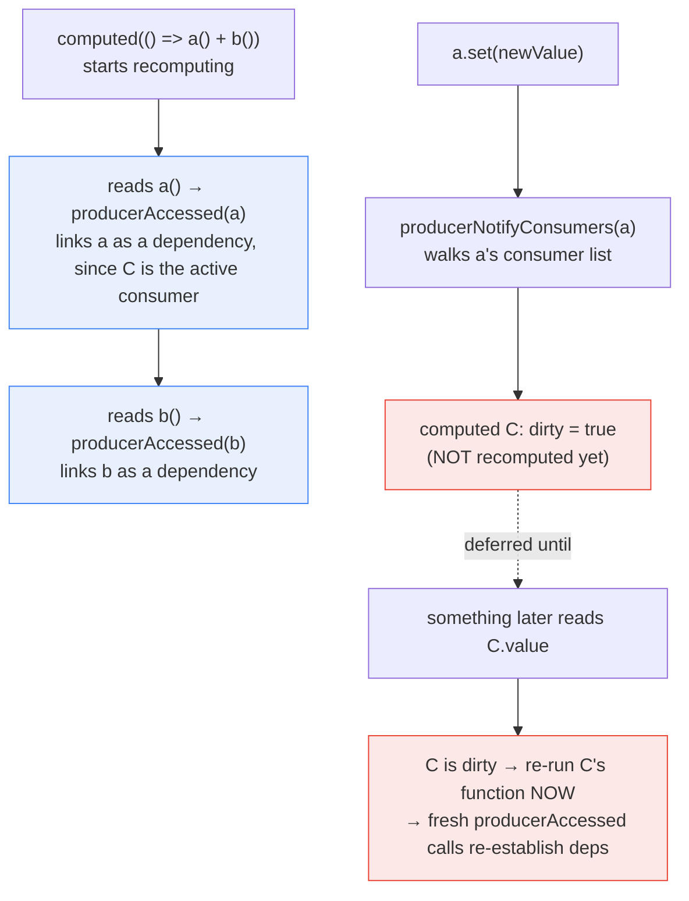

**TL;DR:** Does a `computed()` signal need an explicit list of the signals it depends on? No — there's no dependency array anywhere in Angular's signal implementation. Dependencies are discovered automatically: whenever any signal is read while a `computed()` is actively recomputing (or an `effect()` is actively running), that read itself records the link. And writing to a signal never eagerly recomputes anything downstream — it only marks dependents dirty, cascading that dirty flag through the graph, while the actual recomputation waits until something genuinely reads the stale value again.

> **In plain English (30 sec):** Code you already write — Map, function, API call, just bigger.

## 1. The Engineering Problem

Explicit dependency arrays — the pattern many reactive/memoization systems use, where a derived value's function is paired with a hand-written list of "these are the values I depend on" — are a well-known source of bugs. Forget to list a dependency the function actually reads, and the derived value goes stale, silently using an outdated closure. List one that isn't really needed, and the derived value recomputes wastefully on changes that were never relevant to it. Either way, the array has to be kept manually in sync with what the function body actually does, by a human, forever, as the function evolves.

The other naive alternative — treating every state change as a reason to re-check everything, the whole-tree approach this domain's previous lesson covered for Zone.js-based change detection — avoids the "forgot a dependency" bug entirely, but at the cost of doing unnecessary work: a computed value that couldn't possibly be affected by a given change gets re-evaluated (or at least re-checked) anyway, because nothing tracked which specific values it actually depends on.

## 2. The Technical Solution

Angular's signal graph solves both problems by discovering dependencies automatically, at read time, rather than requiring them declared upfront. Every signal read goes through `producerAccessed`, which checks whether there's a currently "active consumer" — a `computed()` in the middle of recomputing its value, or an `effect()` in the middle of running. If there is, the read itself creates a link between that signal (the producer) and the active consumer — no array, no manual registration, just an automatic side effect of the function actually executing and touching that signal's getter.

Writing a signal doesn't cascade eager recomputation through the graph either. `signalSetFn` updates the value and calls `producerNotifyConsumers`, which walks the linked list of everything that depends on this signal and marks each one `dirty = true` — recursively, so a dirty `computed()` that other things depend on propagates its own dirtiness further downstream. Nothing gets recomputed at this point. A dirty `computed()` only actually re-runs its function the next time something reads it — at which point dependency-tracking runs fresh for that specific execution, correctly capturing however many signals it reads *this* time (including the case where a conditional branch means fewer, more, or different signals get touched than the previous run).



Two core truths this diagram is showing:

- **Dependency links are a byproduct of execution, not a separate declaration step.** There's no moment where a developer (or Angular) writes down "`computed` C depends on `a` and `b`" — that fact is *entirely* derived from `producerAccessed` being called during C's own function body running.
- **A write is "notify," not "recompute."** `producerNotifyConsumers` only flips `dirty` flags and recurses through the dependency graph — the actual, potentially expensive recomputation work is deferred until something later genuinely asks for the value, which is what makes signals a lazy-pull system, not an eager-push one.

## 3. The clean example (concept in isolation)

```typescript
let activeConsumer: (() => void) | null = null;

function trackedSignal(initial) {
  let value = initial;
  const consumers = new Set<() => void>();

  const read = () => {
    if (activeConsumer) consumers.add(activeConsumer); // auto-link on read, no array
    return value;
  };
  const write = (next) => {
    value = next;
    for (const c of consumers) c(); // just notify — mark dirty / re-run, don't compute inline
  };
  return [read, write];
}

function computed(fn) {
  let cached, dirty = true;
  const recompute = () => { dirty = true; };  // notified consumers just flip a flag
  return () => {
    if (dirty) {
      const prev = activeConsumer;
      activeConsumer = recompute;   // THIS run's reads get auto-linked to `recompute`
      cached = fn();                // fn()'s signal reads discover dependencies live
      activeConsumer = prev;
      dirty = false;
    }
    return cached;
  };
}
```

No array anywhere — `fn()`'s own execution is what tells the system which signals it touched, every single time it runs.

## 4. Production reality (from the real repo)

```
angular/packages/core/primitives/signals/src/
├── signal.ts           — signalGetFn/signalSetFn: read tracks, write notifies (no recompute)
└── graph.ts            — producerAccessed (auto-linking), producerNotifyConsumers (dirty cascade)
```

`signalGetFn` and `signalSetFn` show the asymmetry directly — reading calls into the tracking mechanism, writing calls into the notification mechanism, and neither one performs any recomputation itself:

```typescript
export function signalGetFn<T>(node: SignalNode<T>): T {
  producerAccessed(node);   // records a dependency link IF a consumer is active
  return node.value;
}

export function signalSetFn<T>(node: SignalNode<T>, newValue: T) {
  if (!node.equal(node.value, newValue)) {
    node.value = newValue;
    signalValueChanged(node);   // notifies — does not recompute anything
  }
}

function signalValueChanged<T>(node: SignalNode<T>): void {
  node.version++;
  producerIncrementEpoch();
  producerNotifyConsumers(node);
  postSignalSetFn?.(node);
}
```

`producerAccessed` is the entire auto-tracking mechanism — it only does anything when there's an `activeConsumer`, and its job is purely to record a link:

```typescript
export function producerAccessed(node: ReactiveNode): void {
  if (activeConsumer === null) {
    // Accessed outside of a reactive context, so nothing to record.
    return;
  }

  activeConsumer.consumerOnSignalRead(node);
  // ...creates or reuses a link between `node` (producer) and `activeConsumer` (consumer)...
}
```

`producerNotifyConsumers` and `consumerMarkDirty` show the cascade is pure dirty-flag propagation — no function bodies are invoked here at all:

```typescript
export function producerNotifyConsumers(node: ReactiveNode): void {
  if (node.consumers === undefined) {
    return;
  }
  for (let link = node.consumers; link !== undefined; link = link.nextConsumer) {
    const consumer = link.consumer;
    if (!consumer.dirty) {
      consumerMarkDirty(consumer);
    }
  }
}

export function consumerMarkDirty(node: ReactiveNode): void {
  node.dirty = true;
  producerNotifyConsumers(node);   // recursively cascades dirtiness further downstream
  node.consumerMarkedDirty?.(node);
}
```

What this teaches that a hello-world can't:

- **`activeConsumer` is a single, module-level variable — the entire "who's currently tracking" state for the whole signal graph.** There's no per-computed configuration object listing what it watches; membership in a computed's dependency set is determined purely by whether `activeConsumer` happened to equal that computed while a given signal's `producerAccessed` ran.
- **`consumerMarkDirty`'s recursive call to `producerNotifyConsumers`** is what makes a chain of `computed → computed → computed` correctly propagate dirtiness end to end, without each intermediate `computed` needing to eagerly recompute just to figure out whether it changed — the dirty flag alone is sufficient information to propagate, deferring the actual work.
- **`node.equal(node.value, newValue)`'s check inside `signalSetFn` means writing the *same* value a signal already holds triggers no notification at all.** Dirtiness only cascades on an actual value change (by the configured equality function, defaulting to reference/`Object.is`-style equality) — writing `count.set(5)` when `count` is already `5` is a genuine no-op, not a wasted-but-harmless notification.

## 5. Review checklist

- **Does a `computed()`'s function body read every signal it conceptually depends on unconditionally on every path, or does a conditional branch mean some runs read fewer signals than others?** That's not a bug — automatic tracking correctly re-derives the dependency set on every recomputation — but it's worth understanding when reviewing why a `computed` didn't update after a write to a signal it "should" depend on: if a previous run's branch never read that signal, no link was ever created for it.
- **Is an `effect()`'s dependency set actually reflecting live application intent, or does it accidentally read a signal only during setup/first-run** (e.g. inside an `if` that's only true once), silently missing that dependency on every subsequent run once the condition no longer holds?
- **For a performance-sensitive `computed()`, is its recomputation actually deferred as expected** (lazy, only running when read) **or is something reading it eagerly and immediately on every write** (defeating the laziness this mechanism is built to provide)?
- **Does a custom equality function passed to a signal correctly distinguish "changed" from "unchanged" for that value's actual semantics** — an overly permissive equality function silently suppresses notifications for real changes, exactly the failure mode `signalSetFn`'s `node.equal` check exists to avoid causing accidentally.

## 6. FAQ

**Q: If dependency tracking happens via a single global `activeConsumer` variable, how does this stay correct with multiple computeds/effects potentially running concurrently?**
A: JavaScript's single-threaded execution model is exactly what makes this safe — `activeConsumer` is swapped to the current consumer, the tracked function runs synchronously to completion, and then it's restored to whatever it was before (as the clean example's `prev`/restore pattern shows). There's no concurrent execution within the signal graph itself to worry about; nested computeds save and restore the previous `activeConsumer` around their own recomputation.

**Q: Does `producerAccessed` add a new link every single time a signal is read, even if it was already read in a previous run of the same computed?**
A: No — the real `graph.ts` implementation includes explicit short-circuits for exactly this (visible in the fuller source as the `prevProducerLink`/`isRecomputing` checks) so that re-running a computed that reads the same signals in the same order reuses its existing links rather than rebuilding the dependency list from scratch every time, which matters for making frequent recomputation cheap.

**Q: Is this the same mechanism `effect()` uses, or does `effect()` have separate tracking logic?**
A: The same underlying `producerAccessed`/`consumerMarkDirty` graph — `effect()` and `computed()` are both "consumers" in this graph's terms, differing mainly in what happens when they're marked dirty (a dirty `computed` just waits to be read; a dirty `effect` schedules itself to actually re-run, since an effect's entire purpose is its side effects, not a value someone reads later).

**Q: Could this automatic tracking ever create a dependency a developer didn't intend, just because a signal happened to be read incidentally inside a computed's function?**
A: Yes, structurally — any signal read during a computed's execution becomes a real dependency, whether or not that read was "intentional" from the author's perspective (e.g. reading a signal only for a debug `console.log` inside the computed's body). This is a real tradeoff of automatic tracking versus explicit declaration: it eliminates the "forgot to declare a dependency" bug class entirely, at the cost of making "this read shouldn't count as a dependency" something that needs an explicit escape hatch (Angular provides `untracked()` for exactly this case) rather than simply omitting an entry from an array.

---

## Source

- **Concept:** Automatic dependency tracking and lazy dirty-propagation in Angular Signals
- **Domain:** angular
- **Repo:** [angular/angular](https://github.com/angular/angular) → [`packages/core/primitives/signals/src/signal.ts`](https://github.com/angular/angular/blob/main/packages/core/primitives/signals/src/signal.ts), [`packages/core/primitives/signals/src/graph.ts`](https://github.com/angular/angular/blob/main/packages/core/primitives/signals/src/graph.ts) — the Angular framework's own signals implementation


