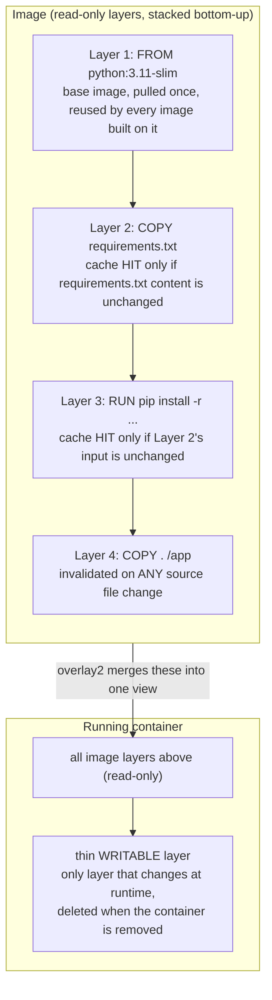

## 1. The Engineering Problem: rebuilding everything to change one line

You fix a one-line bug in `app.py`, run `docker build` again, and grab a coffee — because the build reinstalls every OS package and every dependency from scratch, exactly like it did the first time.

In the pre-container era this was just how it worked: a deployment artifact was a full VM image or a manually provisioned machine. Any change — one line of app code or a base OS patch — meant re-provisioning the *whole thing*, because there was no concept of reusing only the parts that hadn't changed.

Multiply that by every commit, every service, every CI run, and it stops being an annoyance and starts being your bottleneck. You need a way to rebuild **only what actually changed**, and reuse everything else — both on disk and across the network when images get pushed and pulled.

---

## 2. The Docker Solution: image layers

A Docker image isn't one big filesystem blob. It's a **stack of read-only layers**, and Docker uses a **union filesystem** (`overlay2` is the default storage driver on Linux) to merge them into a single filesystem view at runtime.

Every Dockerfile instruction that touches the filesystem — `RUN`, `COPY`, `ADD` — produces exactly one new layer: an immutable, content-addressed diff of what that instruction changed. Instructions that only touch image *metadata* (`ENV`, `CMD`, `LABEL`, `EXPOSE`) don't add a filesystem layer at all.



`dockerd` doesn't manage layers itself — it delegates to **containerd**, which owns the *content store* (the actual layer blobs, each addressed by a SHA-256 digest) and the *snapshotter* that mounts those layers into a live `overlay2` filesystem. When a container actually starts, containerd hands off to **runc**, the low-level OCI runtime that creates the Linux namespaces/cgroups and execs the process inside them. By the time `runc` runs, it doesn't know or care about layers — it just sees one merged root filesystem. Layers are purely a build-and-storage concern, handled below that.

Three things to hold onto:

1. **Layers are content-addressed and cached.** An unchanged instruction with unchanged inputs reuses a previously-built layer instead of re-executing.
2. **Cache invalidation cascades downward.** The moment one layer's cache misses, *every layer after it* must rebuild too — even if their own inputs are identical to last time.
3. **Layers are shared on disk and over the network.** Two images built from the same base share that base's layers exactly once — not duplicated per image, and not re-transferred on push/pull if the remote already has them.

---

## 3. The clean Dockerfile (the concept in isolation)

```dockerfile
FROM python:3.11-slim            # Layer 1: base OS + Python runtime -- pulled once, reused everywhere

WORKDIR /app                     # Layer 2: creates /app in the image filesystem

COPY requirements.txt .          # Layer 3: invalidated ONLY when requirements.txt's content changes
RUN pip install -r requirements.txt   # Layer 4: the expensive step -- stays cached as long as Layer 3 didn't change

COPY . .                         # Layer 5: invalidated on ANY source file change -- deliberately LAST

CMD ["python", "app.py"]         # metadata only -- no new filesystem layer, just image config
```

The ordering is the entire trick: dependencies are installed *before* the source code is copied in. Edit `app.py` a hundred times and Layers 1–4 keep hitting cache every single time — only Layer 5 rebuilds. Flip the order (`COPY . .` before `pip install`) and every code edit reinstalls every dependency from scratch, because the broken cache on the copy-everything layer cascades to the install layer right after it.

---

## 4. Production reality: the same pattern in a real repo

Here's the actual Dockerfile for the Flask example in Docker's own `awesome-compose` repo — a maintained reference for real Compose stacks. Verbatim, annotated.

```dockerfile
# syntax=docker/dockerfile:1.4
FROM --platform=$BUILDPLATFORM python:3.10-alpine AS builder

WORKDIR /app

COPY requirements.txt /app
RUN --mount=type=cache,target=/root/.cache/pip \
    pip3 install -r requirements.txt

COPY . /app

ENTRYPOINT ["python3"]
CMD ["app.py"]

FROM builder as dev-envs

RUN <<EOF
apk update
apk add git
EOF

RUN <<EOF
addgroup -S docker
adduser -S --shell /bin/bash --ingroup docker vscode
EOF
# install Docker tools (cli, buildx, compose)
COPY --from=gloursdocker/docker / /
```

**What this teaches that a hello-world can't:**

- **The exact same dependency-then-code ordering**, now in a repo Docker itself maintains — `COPY requirements.txt` → `pip3 install` → `COPY . /app`, not a toy simplification.
- **`# syntax=docker/dockerfile:1.4`** pins the Dockerfile *frontend* version. BuildKit-specific instructions like `RUN --mount` need a frontend that understands them — this line is what makes that syntax legal. (Stale-fact correction: BuildKit is the **default** builder in current Docker Engine, not an opt-in flag you set with `DOCKER_BUILDKIT=1` — older tutorials still teach it as opt-in.)
- **`RUN --mount=type=cache,target=/root/.cache/pip`** is a different kind of cache than layer caching. A *layer* cache skips re-running an instruction entirely. A *BuildKit cache mount* lets an instruction **re-run** but reuses a persistent directory (here, pip's download cache) across builds — so even when `requirements.txt` changes and Layer 3 *does* rebuild, pip doesn't re-download packages it already fetched last time. Layer caching and cache mounts solve overlapping but distinct problems.
- **`--platform=$BUILDPLATFORM`** is a cross-compilation hint for `buildx` multi-arch builds — a preview of a later topic in this curriculum, not something a single-architecture build ever needs to think about.
- **This file continues into a second stage** (`FROM builder as dev-envs`) — multi-stage builds are their own lesson later in this series. For now, the point is just that `builder`'s own instructions layer exactly like the clean example above; the second stage builds *on top of* that cached image rather than starting over.

---

## Source

- **Concept:** Docker image layers, the union filesystem (`overlay2`), and the `dockerd` → `containerd` → `runc` chain
- **Domain:** docker
- **Repo:** [docker/awesome-compose](https://github.com/docker/awesome-compose) → [`flask/app/Dockerfile`](https://github.com/docker/awesome-compose/blob/master/flask/app/Dockerfile) — Docker's official curated collection of real multi-service Compose stacks
