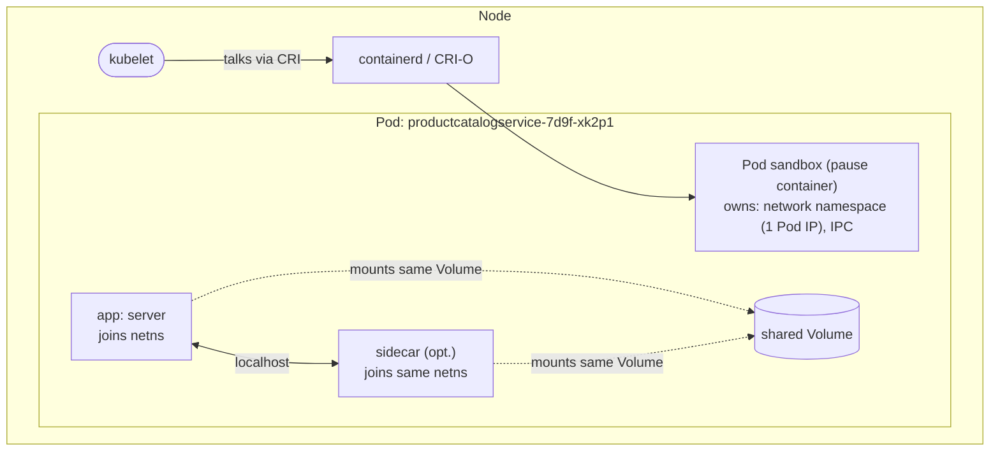

## 1. The Engineering Problem: containers that need to live together

Say you're running a gRPC service, and you also want a sidecar process next to it — a service-mesh proxy, a log shipper, or a init step that fetches a TLS cert before the app boots. On a single VM you'd probably just run both processes with `docker run`, give them a shared bind-mount for logs, and let them talk over `localhost`.

Try to do that with independent containers on a cluster and it falls apart immediately:

- **No atomic placement.** Nothing guarantees the app container and its sidecar land on the *same node*. You'd have to hand-write that constraint yourself, every time.
- **No shared network identity.** Two independently-scheduled containers get two different IPs. "Talk to your sidecar on `localhost`" simply doesn't work — you're back to service discovery for two processes that are supposed to be inseparable.
- **No single lifecycle.** If the app crashes but the sidecar doesn't (or vice versa), what's the unit of "healthy"? Who decides to restart what, and does the replacement land next to its partner again?

You need a boundary that is smaller than "a whole application" but bigger than "a single container" — a unit the scheduler places *once*, as a whole, and the per-node agent manages *together*.

---

## 2. The Technical Solution: the Pod

Kubernetes' scheduler never places a container. It places a **Pod** — one or more containers that share a network namespace (one IP, `localhost` between them), can share volumes, and share a lifecycle. The **kubelet** (the per-node agent) is the thing that actually keeps a Pod's containers running, restarting the ones that crash according to `restartPolicy`.



Three things to hold onto:

1. **The Pod IP is shared.** Every container in a Pod is reachable from the others over `localhost` — there's no per-container IP to route to.
2. **You never see the thing that makes this work.** The kubelet, talking to the container runtime over the **CRI (Container Runtime Interface)**, creates an infrastructure ("pause") container first — it's the one that actually holds the network namespace open. Your app container(s) then join *that* namespace. It never appears in your YAML.
3. **Pods are mortal, and never rescheduled in place.** If a Pod dies, nothing "restarts the Pod" onto a new node — a *controller* (Deployment, StatefulSet, DaemonSet...) creates a brand-new Pod object, with a new UID and usually a new IP. The Pod itself has no self-healing power across nodes; that's the controller's reconcile loop, not the Pod's.

**Correcting a stale fact:** if you learned Kubernetes before 2022, you may have learned "the kubelet talks to Docker." As of **Kubernetes v1.24, dockershim was removed from the kubelet entirely.** The kubelet now speaks CRI directly to a CRI-compliant runtime — almost always **containerd** or **CRI-O** today. Docker Engine, if present at all, is no longer in the loop.

---

## 3. The clean example (the concept in isolation)

```yaml
apiVersion: v1
kind: Pod
metadata:
  name: report-generator
spec:
  # Pod-level: applies to every container and every volume in this Pod
  restartPolicy: Always          # default; kubelet restarts crashed containers in place
  terminationGracePeriodSeconds: 10

  volumes:
  - name: shared-output           # a volume both containers below can mount
    emptyDir: {}

  containers:
  - name: app                     # generates a report file
    image: mycompany/report-app:v1
    volumeMounts:
    - name: shared-output
      mountPath: /output

  - name: shipper                 # sidecar: ships whatever "app" writes to /output
    image: mycompany/log-shipper:v1
    volumeMounts:
    - name: shared-output
      mountPath: /output
    env:
    - name: UPSTREAM
      value: "http://localhost:9000"   # <-- talks to "app" over localhost, same Pod
```

Two containers, one Pod: they share an IP (so `localhost` works), share a volume (so `/output` is the same directory in both), and share a lifecycle (kill the Pod, both containers go with it).

That's the isolated mechanism. Production Pods are almost always *authored indirectly* — as the `template:` inside a Deployment — so here's what that actually looks like.

---

## 4. Production reality (from the real repo)

Here is the **actual** manifest for the `productcatalogservice` in Google's Online Boutique (`microservices-demo`). License header trimmed; everything else verbatim, annotated for what's Pod-level vs container-level.

```yaml
apiVersion: apps/v1
kind: Deployment
metadata:
  name: productcatalogservice
  # ... labels and the selector are elided; unremarkable Deployment boilerplate ...
spec:
  template:                                # <-- THIS block is the actual Pod spec.
    # ... template metadata elided ...
    spec:
      serviceAccountName: productcatalogservice   # Pod-level identity: ALL containers
                                                     # in this Pod authenticate to the
                                                     # API server as this ServiceAccount.
      terminationGracePeriodSeconds: 5        # Pod-level. Default is 30s — this app
                                               # overrides it down to 5s because a
                                               # stateless gRPC service shuts down fast,
                                               # and a slow grace period means every
                                               # rollout/scale-down takes longer.
      securityContext:                        # Pod-level security fields: apply to
        fsGroup: 1000                         # every container AND every mounted
        runAsGroup: 1000                      # volume in this Pod (e.g. fsGroup sets
        runAsNonRoot: true                    # group ownership of volume contents).
        runAsUser: 1000
      containers:
      - name: server
        securityContext:                      # Container-level: these fields can only
          allowPrivilegeEscalation: false      # be set per-container, never at the Pod
          capabilities:                        # level — each container gets its own
            drop:                              # kernel capability set.
              - ALL
          privileged: false
          readOnlyRootFilesystem: true
        image: productcatalogservice
        # ... ports and env vars elided; not central to the Pod-vs-container scoping point ...
        readinessProbe:                       # Container-level, but the Pod's overall
          grpc:                               # "Ready" condition is the AND of every
            port: 3550                        # container's readiness.
        # ... livenessProbe elided; same shape as readinessProbe above ...
        resources:                            # Per-container. A Pod's total resource
          requests:                           # footprint is the SUM across containers —
            cpu: 100m                         # there's no single "Pod resources" field.
            memory: 64Mi
          limits:
            cpu: 200m
            memory: 128Mi
```

(Service and ServiceAccount objects follow in the same file — omitted here since this lesson is about the Pod, not the routing layer.)

**What this teaches that a hello-world can't:**

- **Two different `securityContext` blocks, two different scopes.** `fsGroup`/`runAsUser`/`runAsNonRoot` at the *Pod* level shape the whole sandbox (and volume ownership); `allowPrivilegeEscalation`/`capabilities`/`readOnlyRootFilesystem` at the *container* level are per-container hardening. Mixing these up is one of the most common manifest review mistakes.
- **A tuned `terminationGracePeriodSeconds`.** The 30-second default is a guess that fits nothing in particular. This team measured their shutdown path and cut it to 5s — a small production detail that never shows up in tutorials, because tutorials don't scale-down under load.
- **A single-container Pod is still "a Pod."** There's no special "simple mode" — this manifest goes through the exact same sandbox/network-namespace machinery as the two-container example above, just with one tenant instead of two.
- **`serviceAccountName` lives on the Pod, not the container.** In a multi-container Pod, every container shares that identity — you cannot give the sidecar a different API server identity than the app without a second Pod.

---

## Source

- **Concept:** Kubernetes `Pod` — the atomic scheduling and lifecycle unit
- **Domain:** kubernetes
- **Repo:** [GoogleCloudPlatform/microservices-demo](https://github.com/GoogleCloudPlatform/microservices-demo) → [`kubernetes-manifests/productcatalogservice.yaml`](https://github.com/GoogleCloudPlatform/microservices-demo/blob/main/kubernetes-manifests/productcatalogservice.yaml) — Google's "Online Boutique," an 11-microservice reference app
