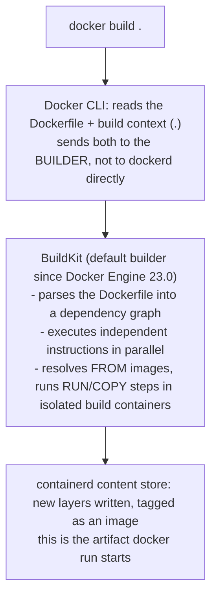

## 1. The Engineering Problem: turning "how I set this up" into something repeatable

Before Dockerfiles, "how to run this service" lived in a wiki page, a shell history file, or a senior engineer's memory: install this OS package, set that environment variable, open this port, run the process as this user. Every new machine — a teammate's laptop, a staging box, a production host — replayed that ritual by hand, and every replay was a chance to skip a step or hit a slightly different base OS.

Config management tools (Chef, Puppet, Ansible) fixed *provisioning* an existing machine, but they still assumed a long-lived server you mutated in place. They didn't give you a single, versionable artifact that says "this exact filesystem, these exact instructions, nothing else" — something you could hand to any Docker host and get byte-for-byte the same starting point.

You need the setup ritual itself to be a file: checked into git, diffable in a PR, and turned into a runnable artifact by one deterministic command.

---

## 2. The Technical Solution: the Dockerfile as a build recipe, executed by BuildKit

A Dockerfile is an ordered list of instructions. Each one is executed against the current image state and (for filesystem-touching instructions) produces a new layer on top of it — the layer mechanics themselves are their own lesson; this one is about the instruction set and how the build actually runs.



Three things to hold onto:

1. **The build context is everything, not just the Dockerfile.** `docker build .` sends the *entire directory* (minus `.dockerignore` exclusions) to the builder before a single instruction runs — a stray `node_modules/` or `.git/` in that directory slows every build and can leak secrets into layers.
2. **BuildKit is the default builder now, not an opt-in.** Docker Engine 23.0+ and current Docker Desktop use BuildKit by default; the classic builder is legacy. Older tutorials that say "set `DOCKER_BUILDKIT=1`" are describing a step you no longer need to take. BuildKit is also what makes `RUN --mount=type=cache` and `RUN --mount=type=secret` legal — the classic builder can't do either.
3. **Metadata instructions and filesystem instructions are different.** `ENV`, `ARG`, `LABEL`, `EXPOSE`, `CMD`, `ENTRYPOINT`, `USER`, `WORKDIR` change image *configuration* (recorded in the image manifest); `RUN`, `COPY`, `ADD` change the image *filesystem* (recorded as layer diffs). Both are part of the recipe, but only the second kind costs disk and cache.

---

## 3. The clean Dockerfile (the concept in isolation)

```dockerfile
# syntax=docker/dockerfile:1.7
FROM node:20-alpine              # base image: pulled once, layers reused across every build from it

ARG APP_ENV=production           # build-time only -- not present in the running container unless re-declared with ENV
ENV NODE_ENV=$APP_ENV            # runtime env var -- baked into the image config, visible to `docker inspect` and every process in the container

WORKDIR /app                     # sets the working dir for every instruction AFTER this line, and creates it if missing

COPY package.json package-lock.json ./   # copy dependency manifests first...
RUN npm ci --omit=dev                    # ...so this expensive step only reruns when THOSE files change

COPY . .                         # now copy the rest of the source

RUN addgroup -S app && adduser -S app -G app   # create a non-root user -- images run as root by default otherwise
USER app                         # every instruction (and the container process) after this line runs as `app`, not root

EXPOSE 3000                      # documentation + inter-container default -- does NOT publish the port to the host; that's `docker run -p`

CMD ["node", "server.js"]        # default command -- overridable at `docker run` time, unlike ENTRYPOINT
```

`ARG` vs `ENV` is the instruction pair people mix up most: `ARG` only exists during the build (pass it with `--build-arg`) and vanishes once the image is built, while `ENV` is baked into the final image and is visible at container runtime. Using `ENV NODE_ENV=$APP_ENV` here is the standard pattern for turning a build-time choice into a runtime-visible one.

---

## 4. Production reality: the same instruction set, under real constraints

Here's the actual backend Dockerfile from Docker's own `awesome-compose` repo — the nginx + Flask + MySQL reference stack. Verbatim, annotated.

```dockerfile
# syntax=docker/dockerfile:1.4
FROM --platform=$BUILDPLATFORM python:3.10-alpine AS builder

WORKDIR /code
COPY requirements.txt /code
RUN --mount=type=cache,target=/root/.cache/pip \
    pip3 install -r requirements.txt

COPY . .

ENV FLASK_APP hello.py
ENV FLASK_ENV development
ENV FLASK_RUN_PORT 8000
ENV FLASK_RUN_HOST 0.0.0.0

EXPOSE 8000

CMD ["flask", "run"]

FROM builder AS dev-envs

RUN <<EOF
apk update
apk add git
EOF

RUN <<EOF
addgroup -S docker
adduser -S --shell /bin/bash --ingroup docker vscode
EOF

# install Docker tools (cli, buildx, compose)
COPY --from=gloursdocker/docker / /

CMD ["flask", "run"]
```

**What this teaches that a hello-world can't:**

- **`--platform=$BUILDPLATFORM`** is a BuildKit-provided automatic build argument — no one declares it, the builder injects it. It tells the base image "build using the architecture of the machine doing the build," which matters for cross-compiling multi-arch images with `buildx` (a later topic in this curriculum).
- **`RUN --mount=type=cache,target=/root/.cache/pip`** is a BuildKit cache *mount*, not a layer cache. It persists pip's download cache across builds even when the `pip3 install` layer itself has to rerun (because `requirements.txt` changed) — a different caching axis than layer reuse, and one the classic builder never had.
- **Four separate `ENV` instructions** rather than one line — each becomes its own line in the image history, which is a deliberate readability trade-off real Dockerfiles make constantly: fewer instructions isn't always better if it hurts diffability.
- **`EXPOSE 8000`** documents the app's port for anyone reading the file or composing this service with others (Compose uses it for implicit inter-service defaults) — it is not what makes the port reachable from the host; that still requires `-p 8000:8000` at `docker run` time or a `ports:` entry in Compose.
- **`<<EOF ... EOF` heredoc syntax** in `RUN` is a BuildKit-only feature (needs `# syntax=docker/dockerfile:1.4`+) that lets a single instruction run a multi-line shell script without chaining `&&` across a wall of backslashes — cleaner than the classic-builder-compatible style still common in older Dockerfiles.
- **The file continues into a second stage** (`FROM builder AS dev-envs`). That's multi-stage build syntax — its own lesson next in this series. For this lesson, the point is that the `builder` stage above runs through the exact same instruction set as the clean example: base image, deps-before-code ordering, `ENV`, `EXPOSE`, `CMD`.

---

## Source

- **Concept:** Dockerfile instructions and the BuildKit-driven build process
- **Domain:** docker
- **Repo:** [docker/awesome-compose](https://github.com/docker/awesome-compose) → [`nginx-flask-mysql/backend/Dockerfile`](https://github.com/docker/awesome-compose/blob/master/nginx-flask-mysql/backend/Dockerfile) — Docker's official curated collection of real multi-service Compose stacks
