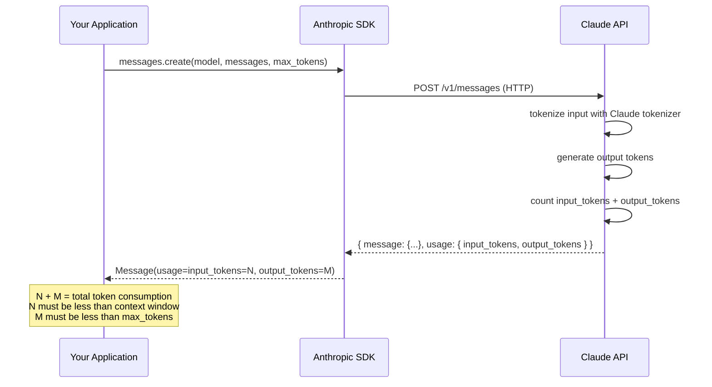
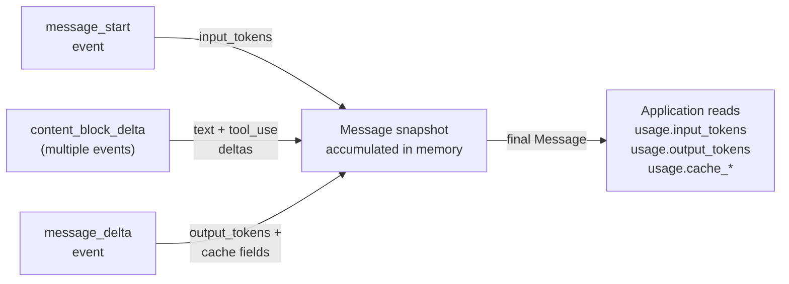

**TL;DR:** You cannot use tiktoken to count Claude's tokens -- tiktoken implements OpenAI's BPE tokenizer, which produces different token boundaries than Claude's. A character count divided by four is a rough English heuristic that breaks on code, multilingual text, and structured JSON. The only reliable source of token counts for Claude is the `Usage` object returned in every API response, which includes `input_tokens`, `output_tokens`, and -- if you use prompt caching -- `cache_creation_input_tokens` and `cache_read_input_tokens`. The Anthropic SDK accumulates these counts incrementally during streaming so you can monitor context window consumption in real time.

> **In plain English (30 sec):** Code you already write — Map, function, API call, just bigger.

## 1. The Engineering Problem

When building applications on top of Claude, context window management is not optional -- it is an architectural constraint. Every model has a fixed token budget (200k for Claude Sonnet, for example), and every request consumes a portion of that budget. Exceed the limit and the API rejects your call. But to stay within the limit, you first need to *measure* consumption accurately.

Three common approaches fail:

**Character count division.** A developer measures `len(text) / 4` to estimate tokens. This works tolerably for English prose at ~4 characters per token, but breaks badly on code (where identifiers and whitespace cluster differently), JSON (where structural characters like `{`, `"`, and `,` are each separate tokens), CJK text (where a single character can be one token or several), and any content that mixes formats. A 4,000-character code snippet might be 900 tokens or 1,800 -- the variance is too large to build reliable truncation logic on.

**tiktoken.** OpenAI's tiktoken library implements the BPE tokenizers used by GPT-3.5 and GPT-4. It is a fast, well-engineered library -- but it encodes using OpenAI's vocabulary, not Anthropic's. Running `tiktoken.encoding_for_model("gpt-4").encode(text)` on text you intend to send to Claude produces a token count that is systematically off, sometimes by 10-20% depending on content. Token boundaries are vocabulary-specific; two models with different vocabularies produce different token counts for the same text.

**Third-party token counters.** Libraries like `langchain`'s `get_num_tokens` methods often wrap tiktoken under the hood, inheriting its vocabulary mismatch. Others use their own BPE implementations trained on different corpora. None of these know Claude's tokenizer.

The consequence: developers who estimate token counts instead of measuring them hit the context window mid-conversation, get a 400 error, and scramble to implement emergency truncation. Or they over-truncate, wasting expensive context budget by throwing away content they could have included.

The engineering problem is not "how do I count tokens" -- it is "how do I get an accurate, real-time token count from the model that actually processed my input, broken down by category so I can make informed decisions about what to keep and what to truncate."

## 2. The Technical Solution

Anthropic's approach is simple: the model counts its own tokens. Every API response -- whether streaming or non-streaming -- includes a `Usage` object with the authoritative token counts for that request. No client-side tokenizer needed.

### 2.1 Response-Level Usage Tracking

The `Message` object returned by the API contains a `usage` field. This is not an estimate -- it is the actual count of tokens processed by the model, computed after the request is tokenized server-side using Claude's vocabulary:



The key insight: **token counting is a server-side operation**. You do not need to run any tokenizer on your machine. The API tells you exactly how many tokens it consumed, both for input and output. This count is what Anthropic bills against, so it is the only number that matters for cost and context window calculations.

### 2.2 Streaming Usage Accumulation

In streaming mode, usage data arrives in two places: the `message_start` event carries initial `input_tokens`, and the `message_delta` event (the final event) carries `output_tokens`. The SDK's accumulator stitches these into a single snapshot:



During streaming, each `content_block_delta` event appends text or tool input to the in-memory snapshot -- but does not carry usage data. Only the bookend events (`message_start` and `message_delta`) update the token counts. This means you cannot get a partial token count mid-stream; you get the full count when the stream completes.

### 2.3 Prompt Cache Token Breakdown

If you use prompt caching (by adding `cache_control` breakpoints to your messages), the `Usage` object expands to include cache-specific fields. These are the numbers you need to decide whether caching is actually saving you tokens:

- `cache_creation_input_tokens` -- tokens written into the cache on this request (billed at a higher rate, but amortized over subsequent cache hits)
- `cache_read_input_tokens` -- tokens read from an existing cache entry (billed at a lower rate)

Total input consumption is the sum of all three:

```
total_input = input_tokens + cache_creation_input_tokens + cache_read_input_tokens
```

The SDK tracks these fields explicitly during streaming accumulation. In the `message_delta` handler, each optional usage field is conditionally merged into the snapshot:

```python
# From anthropics/anthropic-sdk-python: lib/streaming/_messages.py
if event.usage.input_tokens is not None:
    current_snapshot.usage.input_tokens = event.usage.input_tokens
if event.usage.cache_creation_input_tokens is not None:
    current_snapshot.usage.cache_creation_input_tokens = event.usage.cache_creation_input_tokens
if event.usage.cache_read_input_tokens is not None:
    current_snapshot.usage.cache_read_input_tokens = event.usage.cache_read_input_tokens
```

This is not a client-side guess -- it is the API's own report of what it cached and what it read.

## 3. Clean Example

Counting tokens and managing context window budget in a multi-turn conversation:

```python
from anthropic import Anthropic

client = Anthropic()
CONTEXT_WINDOW = 200_000
MAX_OUTPUT = 4_096
SAFETY_MARGIN = 1_000

def count_message_tokens(messages: list[dict]) -> int:
    """Send a zero-max_tokens request just to get the input token count."""
    response = client.messages.create(
        model="claude-sonnet-4-20250514",
        max_tokens=1,
        messages=messages,
    )
    return response.usage.input_tokens

def trim_history(messages: list[dict], max_input_tokens: int) -> list[dict]:
    """Drop oldest messages until input fits within budget."""
    while messages:
        tokens = count_message_tokens(messages)
        if tokens <= max_input_tokens:
            return messages
        # Always keep the system message (index 0) and the latest user turn
        if len(messages) > 2:
            messages = [messages[0]] + messages[2:]
        else:
            break
    return messages

# Build conversation
conversation = [
    {"role": "user", "content": "Explain how BPE tokenization works."},
]

# Simulate multi-turn with context management
for question in questions:
    conversation.append({"role": "user", "content": question})

    budget = CONTEXT_WINDOW - MAX_OUTPUT - SAFETY_MARGIN
    conversation = trim_history(conversation, budget)

    response = client.messages.create(
        model="claude-sonnet-4-20250514",
        max_tokens=MAX_OUTPUT,
        messages=conversation,
    )

    # Log actual consumption
    print(f"Input: {response.usage.input_tokens} tokens")
    print(f"Output: {response.usage.output_tokens} tokens")
    print(f"Cache read: {response.usage.cache_read_input_tokens or 0}")

    conversation.append({
        "role": "assistant",
        "content": response.content[0].text,
    })
```

This pattern uses the API itself as the tokenizer -- no tiktoken, no character counting, no guessing.

## 4. Production Reality

Here is how the Anthropic SDK handles token counts internally, verbatim from `anthropics/anthropic-sdk-python`.

### 4.1 The Usage Model

The `Usage` class defines the exact fields the API returns. Every field except `input_tokens` and `output_tokens` is optional -- they appear only when relevant (prompt caching enabled, server tools used, etc.):

```python
# anthropics/anthropic-sdk-python: src/anthropic/types/usage.py
class Usage(BaseModel):
    cache_creation: Optional[CacheCreation] = None
    """Breakdown of cached tokens by TTL"""

    cache_creation_input_tokens: Optional[int] = None
    """The number of input tokens used to create the cache entry."""

    cache_read_input_tokens: Optional[int] = None
    """The number of input tokens read from the cache."""

    inference_geo: Optional[str] = None
    """The geographic region where inference was performed for this request."""

    input_tokens: int
    """The number of input tokens which were used."""

    output_tokens: int
    """The number of output tokens which were used."""

    output_tokens_details: Optional[OutputTokensDetails] = None
    """Breakdown of output tokens by category.

    `output_tokens` remains the inclusive, authoritative total used for billing.
    This object provides a read-only decomposition for observability -- for example,
    how many of the billed output tokens were spent on internal reasoning that may
    have been summarized before being returned to you.
    """

    server_tool_use: Optional[ServerToolUsage] = None
    """The number of server tool requests."""

    service_tier: Optional[Literal["standard", "priority", "batch"]] = None
    """If the request used the priority, standard, or batch tier."""
```

Two things to note: `input_tokens` is always present and always an `int` -- never optional, never estimated. And `output_tokens_details` breaks down output into categories (like reasoning tokens that were summarized), which matters when extended thinking is enabled and the model spends tokens internally before returning a final answer.

### 4.2 Streaming Accumulation

During streaming, the SDK maintains a `ParsedMessage` snapshot that gets updated event-by-event. The `accumulate_event` function handles the `message_delta` event -- the final event in the stream -- where usage counts arrive:

```python
# anthropics/anthropic-sdk-python: src/anthropic/lib/streaming/_messages.py
    elif event.type == "message_delta":
        current_snapshot.stop_reason = event.delta.stop_reason
        current_snapshot.stop_sequence = event.delta.stop_sequence
        if event.delta.stop_details is not None:
            current_snapshot.stop_details = event.delta.stop_details
        current_snapshot.usage.output_tokens = event.usage.output_tokens

        # Update other usage fields if they exist in the event
        if event.usage.input_tokens is not None:
            current_snapshot.usage.input_tokens = event.usage.input_tokens
        if event.usage.cache_creation_input_tokens is not None:
            current_snapshot.usage.cache_creation_input_tokens = event.usage.cache_creation_input_tokens
        if event.usage.cache_read_input_tokens is not None:
            current_snapshot.usage.cache_read_input_tokens = event.usage.cache_read_input_tokens
        if event.usage.server_tool_use is not None:
            current_snapshot.usage.server_tool_use = event.usage.server_tool_use
```

After `message_delta` is processed, `get_final_message()` returns the fully populated `Message` with complete `usage` data. The same fields are available whether you use streaming or non-streaming -- the SDK normalizes the experience.

### 4.3 The Message Object

The `Message` type's docstring explicitly states that token counts are authoritative and may not match visible content length:

```python
# anthropics/anthropic-sdk-python: src/anthropic/types/message.py
class Message(BaseModel):
    # ... other fields ...

    usage: Usage
    """Billing and rate-limit usage.

    Anthropic's API bills and rate-limits by token counts, as tokens represent the
    underlying cost to our systems.

    Under the hood, the API transforms requests into a format suitable for the
    model. The model's output then goes through a parsing stage before becoming an
    API response. As a result, the token counts in `usage` will not match one-to-one
    with the exact visible content of an API request or response.

    For example, `output_tokens` will be non-zero, even for an empty string response
    from Claude.

    Total input tokens in a request is the summation of `input_tokens`,
    `cache_creation_input_tokens`, and `cache_read_input_tokens`.
    """
```

The phrase "will not match one-to-one with the exact visible content" is the authoritative answer to "why can't I count characters instead?" -- the API's internal tokenization adds system tokens, formatting markers, and message structure tokens that have no visible representation in the text you send.

## 5. Review Checklist

- [ ] Do not use tiktoken or character-count heuristics to estimate Claude token counts -- the vocabulary mismatch produces errors of 10-20%
- [ ] Use the `usage` field from every API response as the authoritative token count
- [ ] Track `input_tokens + cache_creation_input_tokens + cache_read_input_tokens` for total input consumption against the context window
- [ ] In streaming mode, read token counts from the `Message` returned by `get_final_message()`, not from individual SSE events
- [ ] Set `max_tokens` explicitly -- the context window budget is `context_window - max_tokens` for input, and output cannot exceed `max_tokens`
- [ ] When using prompt caching, monitor `cache_creation_input_tokens` vs `cache_read_input_tokens` to verify the cache is being hit (high creation, low read means the cache is not warming effectively)
- [ ] Account for `output_tokens_details` when using extended thinking -- internal reasoning tokens count toward `max_tokens` even if not returned in `content`

## 6. FAQ

**Q: Can I use tiktoken to estimate Claude's token count as a rough proxy?**
A: No. Tiktoken implements OpenAI's BPE vocabulary. Claude uses a different tokenizer with different token boundaries. The same text can differ by 10-20% between the two, and the error is not predictable -- it depends on content type (code vs. prose vs. JSON). Use the API's `usage` field instead.

**Q: Why does the API return token counts that don't match my text length divided by 4?**
A: The API's `usage.input_tokens` includes tokens you cannot see: message structure delimiters, role markers, system prompt tokens, and any internal formatting applied during the tokenization pipeline. The docstring in `Message.usage` states explicitly that counts "will not match one-to-one with the exact visible content."

**Q: How do I get token counts during streaming?**
A: The `input_tokens` count is available in the `message_start` event (first event). The `output_tokens` count arrives in the `message_delta` event (last event). The SDK's `get_final_message()` method returns the complete `Message` with all usage fields populated after the stream ends.

**Q: What is the difference between `input_tokens` and `cache_creation_input_tokens`?**
A: `input_tokens` counts tokens that were not cached (processed normally). `cache_creation_input_tokens` counts tokens written to the cache on this request (the first request with a given cache breakpoint). `cache_read_input_tokens` counts tokens loaded from an existing cache entry. Total input is the sum of all three.

**Q: Does `output_tokens` include thinking tokens from extended thinking?**
A: Yes. `output_tokens` is the inclusive, authoritative total used for billing. When extended thinking is enabled, `output_tokens_details` provides a breakdown of how many of those tokens were spent on internal reasoning vs. the final response content.

## 7. Source

- [`anthropics/anthropic-sdk-python` -- `src/anthropic/types/usage.py`](https://github.com/anthropics/anthropic-sdk-python/blob/main/src/anthropic/types/usage.py) -- the `Usage` model with all token count fields
- [`anthropics/anthropic-sdk-python` -- `src/anthropic/types/message.py`](https://github.com/anthropics/anthropic-sdk-python/blob/main/src/anthropic/types/message.py) -- the `Message` type with usage documentation
- [`anthropics/anthropic-sdk-python` -- `src/anthropic/lib/streaming/_messages.py`](https://github.com/anthropics/anthropic-sdk-python/blob/main/src/anthropic/lib/streaming/_messages.py) -- streaming usage accumulation in `accumulate_event`
- [`anthropics/anthropic-sdk-python` -- `src/anthropic/_streaming.py`](https://github.com/anthropics/anthropic-sdk-python/blob/main/src/anthropic/_streaming.py) -- raw SSE event processing pipeline


