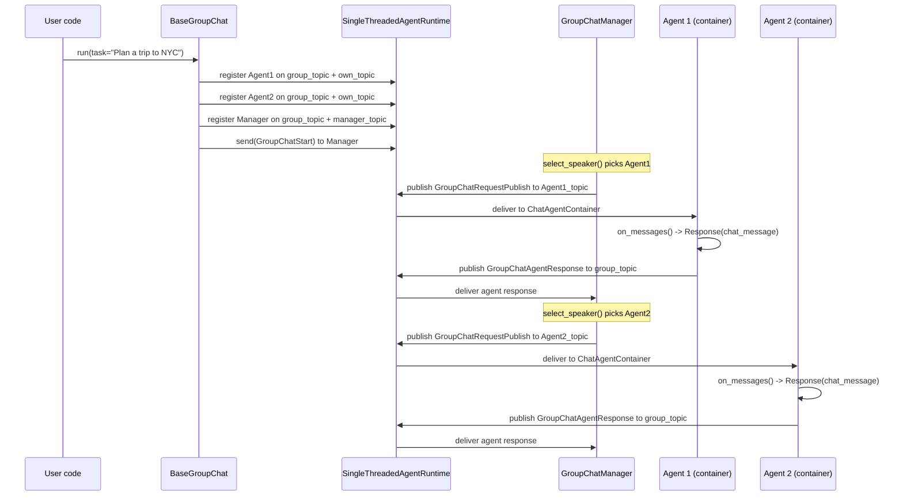
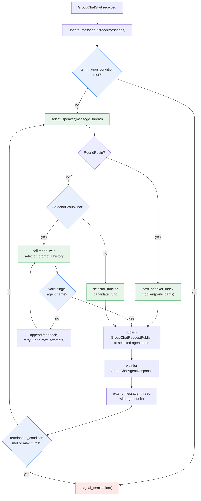

**TL;DR:** If you wire three LLM agents to a shared message bus so they can talk to each other freely, who decides which agent speaks next, when the conversation stops, and how context flows between turns? Without a coordinator, the answer is nobody -- the agents produce an unbounded loop until you hit a token limit or a timeout. AutoGen solves this with a `BaseGroupChatManager` that owns the message thread, selects speakers, and enforces termination conditions, while individual agents like `AssistantAgent` remain stateless workers that only respond when asked.

## 1. The Engineering Problem

The promise of multi-agent systems is task decomposition: break a complex problem into subtasks, assign each to a specialized agent, and let them collaborate. But "let them collaborate" hides the hard part -- coordination.

Consider a travel-planning scenario with three agents: a `Travel_Advisor` that plans itineraries, a `Hotel_Agent` that books rooms, and a `Flight_Agent` that searches flights. Without a coordinator, you face three concrete failures:

**Who speaks next?** After `Travel_Advisor` produces an itinerary plan, all three agents see the message. If all three respond simultaneously, you get three parallel answers with no synthesis. If only one responds, how do the others know their turn has come? There is no turn-taking protocol in a shared message bus.

**How does context accumulate?** Each agent needs to see the full conversation history to produce grounded responses -- `Hotel_Agent` must know what the `Travel_Advisor` recommended, not just the original user request. But who maintains the authoritative message thread? If every agent maintains its own copy, they diverge.

**When does it stop?** A naive implementation runs until a hardcoded turn count or an API timeout. Without a structured termination condition -- "stop when all bookings are confirmed" or "stop after 10 turns" -- the agents produce an infinite loop of suggestions and confirmations that never resolves.

These are not theoretical concerns. They are the engineering problems that `BaseGroupChatManager` exists to solve.

## 2. The Technical Solution

AutoGen's coordination model separates the *manager* (which controls flow) from the *participants* (which produce content). The manager owns the message thread, selects the next speaker, and enforces termination. Participants never talk directly to each other -- they publish messages to a shared group topic, and the manager routes the next turn.

The initialization sequence wires the pub-sub topology at runtime:



The key architectural insight: participants are wrapped in `ChatAgentContainer` agents inside the runtime, not used directly. The manager never calls `agent.on_messages()` directly -- it sends a `GroupChatRequestPublish` message through the runtime's pub-sub, and the container forwards it to the real agent. This decoupling means agents can run in separate processes or on remote machines without changing the manager's code.

The manager's turn-selection loop is where the actual coordination logic lives. It collects all responses from active speakers, checks termination conditions, then picks the next speaker:



Two concrete coordinator strategies exist in the codebase: `RoundRobinGroupChatManager` cycles through participants in a fixed order (index + 1 mod n), while `SelectorGroupChatManager` makes an LLM call to pick the most appropriate next speaker based on conversation context. Both inherit from `BaseGroupChatManager` and implement the same `select_speaker()` interface.

The `BaseGroupChatManager` also enforces termination. After every agent response, it calls `_apply_termination_condition()`, which runs the user-supplied `TerminationCondition` against the message delta. If the condition fires, or if `max_turns` is reached, the manager signals termination and stops the loop. Without this, there is no exit path.

## 3. The clean example (concept in isolation)

A `SelectorGroupChat` with three specialized agents, isolated from AutoGen's runtime wiring and streaming internals:

```python
import asyncio
from autogen_ext.models.openai import OpenAIChatCompletionClient
from autogen_agentchat.agents import AssistantAgent
from autogen_agentchat.teams import SelectorGroupChat
from autogen_agentchat.conditions import TextMentionTermination
from autogen_agentchat.ui import Console


async def main() -> None:
    model_client = OpenAIChatCompletionClient(model="gpt-4o")

    # Each agent has a description the selector model uses to pick the next speaker
    travel_advisor = AssistantAgent(
        "Travel_Advisor",
        model_client,
        tools=[book_trip],
        description="Helps with travel planning.",
    )
    hotel_agent = AssistantAgent(
        "Hotel_Agent",
        model_client,
        tools=[lookup_hotel],
        description="Helps with hotel booking.",
    )
    flight_agent = AssistantAgent(
        "Flight_Agent",
        model_client,
        tools=[lookup_flight],
        description="Helps with flight booking.",
    )

    # Terminate when any agent says "TERMINATE"
    termination = TextMentionTermination("TERMINATE")

    # SelectorGroupChat uses a second LLM call to decide who speaks next
    team = SelectorGroupChat(
        [travel_advisor, hotel_agent, flight_agent],
        model_client=model_client,
        termination_condition=termination,
    )

    await Console(team.run_stream(task="Book a 3-day trip to New York."))


asyncio.run(main())
```

The critical constraint this isolates: every participant's `description` field is passed to the selector prompt. The selector LLM reads the conversation history, sees the list of participants with their descriptions, and picks the one best suited to respond next. If you write a vague description like "An agent that helps" for every participant, the selector has no signal to differentiate them and will pick arbitrarily.

## 4. Production reality (from the real repo)

All files below live under `python/packages/autogen-agentchat/src/autogen_agentchat/` in the `microsoft/autogen` repo:

```
autogen-agentchat/src/autogen_agentchat/
├── teams/_group_chat/
│   ├── _base_group_chat.py                # BaseGroupChat — runtime wiring, run loop
│   ├── _base_group_chat_manager.py        # BaseGroupChatManager — message thread, termination
│   ├── _round_robin_group_chat.py         # RoundRobinGroupChatManager + RoundRobinGroupChat
│   └── _selector_group_chat.py            # SelectorGroupChatManager + SelectorGroupChat
├── agents/_assistant_agent.py             # AssistantAgent — the workhorse participant
└── conditions/                            # TerminationCondition variants
```

`SelectorGroupChatManager.select_speaker()` — the model-based coordinator. It builds a prompt from participant descriptions and conversation history, calls the selector LLM, and parses the response for agent names. If the model picks zero names, multiple names, or the previous speaker (when repeated speakers are disallowed), it appends a feedback message and retries up to `max_selector_attempts`:

```python
async def _select_speaker(self, roles: str, participants: List[str], max_attempts: int) -> str:
    model_context_messages = await self._model_context.get_messages()
    model_context_history = self.construct_message_history(model_context_messages)

    select_speaker_prompt = self._selector_prompt.format(
        roles=roles, participants=str(participants), history=model_context_history
    )

    select_speaker_messages: List[SystemMessage | UserMessage | AssistantMessage]
    if ModelFamily.is_openai(self._model_client.model_info["family"]):
        select_speaker_messages = [SystemMessage(content=select_speaker_prompt)]
    else:
        select_speaker_messages = [UserMessage(content=select_speaker_prompt, source="user")]

    num_attempts = 0
    while num_attempts < max_attempts:
        num_attempts += 1
        response = await self._model_client.create(messages=select_speaker_messages)
        select_speaker_messages.append(AssistantMessage(content=response.content, source="selector"))
        mentions = self._mentioned_agents(response.content, self._participant_names)
        if len(mentions) == 0:
            feedback = f"No valid name was mentioned. Please select from: {str(participants)}."
            select_speaker_messages.append(UserMessage(content=feedback, source="user"))
        elif len(mentions) > 1:
            feedback = (
                f"Expected exactly one name to be mentioned. Please select only one from: {str(participants)}."
            )
            select_speaker_messages.append(UserMessage(content=feedback, source="user"))
        else:
            agent_name = list(mentions.keys())[0]
            if (
                not self._allow_repeated_speaker
                and self._previous_speaker is not None
                and agent_name == self._previous_speaker
            ):
                feedback = (
                    f"Repeated speaker is not allowed, please select a different name from: {str(participants)}."
                )
                select_speaker_messages.append(UserMessage(content=feedback, source="user"))
            else:
                return agent_name

    # Fallback: use previous speaker or first participant
    if self._previous_speaker is not None:
        return self._previous_speaker
    return participants[0]
```

What these internals reveal that a tutorial won't:

- **The selector is a second LLM call on every turn.** Each speaker selection costs a full model inference -- system message, conversation history, and response parsing. In a 10-turn conversation with 3 agents, that is 10 additional LLM calls purely for coordination overhead, not content production. This is a real cost consideration for production deployments.
- **`_mentioned_agents` uses regex, not exact string matching.** Agent names are matched with word-boundary regex, and underscores are treated as interchangeable with spaces (`Story_writer` matches `Story writer`). This means a vague LLM response like "I think the Story writer should respond" is parsed correctly, but a hallucinated name like "the assistant" will fail the match and trigger a retry.
- **The fallback after exhausting `max_selector_attempts` silently degrades.** If the model repeatedly fails to pick a valid speaker, the manager falls back to the previous speaker or the first participant -- it does not raise an error. In production, this means a misconfigured agent description silently produces a stuck conversation where the same agent speaks repeatedly.
- **`RoundRobinGroupChatManager.select_speaker()` is 3 lines.** Round-robin is a simple index increment mod participant count. The complexity budget is entirely in `BaseGroupChatManager`'s message-thread maintenance and termination enforcement, not in speaker selection. This is why round-robin is often the right starting point -- the coordination overhead is minimal and deterministic.

`BaseGroupChatManager.handle_agent_response()` — the termination gate. After every agent response, the manager checks termination before selecting the next speaker. The `_apply_termination_condition` method increments the turn counter and evaluates the user-supplied condition:

```python
@event
async def handle_agent_response(
    self, message: GroupChatAgentResponse | GroupChatTeamResponse, ctx: MessageContext
) -> None:
    delta: List[BaseAgentEvent | BaseChatMessage] = []
    if isinstance(message, GroupChatAgentResponse):
        if message.response.inner_messages is not None:
            for inner_message in message.response.inner_messages:
                delta.append(inner_message)
        delta.append(message.response.chat_message)
    else:
        delta.extend(message.result.messages)

    await self.update_message_thread(delta)
    self._active_speakers.remove(message.name)
    if len(self._active_speakers) > 0:
        return  # still waiting for other parallel speakers

    if await self._apply_termination_condition(delta, increment_turn_count=True):
        return  # termination fired — loop stops

    await self._transition_to_next_speakers(ctx.cancellation_token)
```

What this reveals:

- **Parallel speakers are supported.** The `_active_speakers` list allows the manager to send requests to multiple agents simultaneously and wait for all of them before proceeding. The manager only advances to `_transition_to_next_speakers` when `_active_speakers` is empty.
- **`inner_messages` are included in the delta.** When an `AssistantAgent` makes tool calls, the tool-call events are `inner_messages` on the response. The manager appends these to the thread, so subsequent speakers can see what tools were called and what results were returned -- not just the final text response.
- **Termination is checked *after* every response, not before.** This means the last agent's message is always recorded in the thread before the loop stops, ensuring the final state is consistent.

## 5. Review checklist

- When defining agents for a `SelectorGroupChat`, confirm each agent's `description` is specific enough for the selector LLM to differentiate them -- a generic description like "A helpful assistant" produces random speaker selection because the selector has no signal.
- If using `RoundRobinGroupChat`, verify that agent order in the `participants` list matches your intended turn sequence -- round-robin cycles through the list in insertion order with no priority mechanism.
- Always set a `termination_condition` (or `max_turns`) on any group chat -- without one, the coordinator loop runs indefinitely until the runtime is killed or tokens are exhausted, and there is no default safety limit.
- When adding tools to agents in a multi-agent team, confirm that tool results are visible to other agents via the message thread -- `AssistantAgent`'s `inner_messages` (tool call events and results) are appended to the thread by `BaseGroupChatManager.handle_agent_response()`, but only when the agent's response flows through the manager, not when the agent is called directly.
- If using `SelectorGroupChat` with a model that is not OpenAI-family, verify the selector prompt works with `UserMessage` wrapping -- the manager falls back to `UserMessage` for non-OpenAI models because some models do not support system messages.

## 6. FAQ

**Q: What happens if the selector LLM picks an invalid agent name?**
A: `SelectorGroupChatManager._select_speaker()` retries up to `max_selector_attempts` (default 3), appending a feedback message like "No valid name was mentioned. Please select from: [list]." after each failure. If all attempts fail, it falls back to the previous speaker (or the first participant if there is no previous speaker). This fallback is silent -- no error is raised, which means a persistent misconfiguration can produce degraded behavior without obvious failure signals.

**Q: Can agents run in parallel within a single turn?**
A: Yes. `BaseGroupChatManager._transition_to_next_speakers()` can publish `GroupChatRequestPublish` to multiple agent topics in a single turn. The manager tracks active speakers in `_active_speakers` and only advances when all have responded. However, neither `RoundRobinGroupChat` nor `SelectorGroupChat` currently select multiple speakers by default -- `select_speaker()` returns a single agent name. Parallel turns require a custom team or manual runtime wiring.

**Q: Why does the selector need its own model client instead of reusing the participants' clients?**
A: Speaker selection is a classification task (pick one name from a list), not a content-generation task. Using a separate (potentially cheaper or faster) model for selection avoids paying the cost of a full generation model for what is essentially a routing decision. The `model_client` parameter on `SelectorGroupChat` is independent of the model clients on each `AssistantAgent`.

**Q: What is the difference between `selector_func` and `candidate_func`?**
A: A `selector_func` completely overrides the LLM-based selection -- if it returns a name, that agent speaks next, no model call is made. If it returns `None`, the LLM selects as usual. A `candidate_func` only filters the *candidate list* before the LLM makes its selection -- the model still picks from the filtered set. Use `selector_func` when you have deterministic routing rules; use `candidate_func` when you want to constrain but not eliminate the model's judgment.

**Q: How does the manager handle an agent that raises an exception?**
A: `BaseGroupChatManager.handle_agent_response()` wraps its logic in a try/except that calls `_signal_termination_with_error()`, which puts a `GroupChatTermination` event with the serialized exception into the output queue. The `BaseGroupChat.run_stream()` method checks for this error and raises a `RuntimeError`. The team stops immediately -- there is no retry or failover to another agent.

---

## Source

- **Concept:** Multi-agent orchestration -- how a group chat manager coordinates message routing, speaker selection, and termination in a multi-agent conversation
- **Domain:** genai
- **Repo:** [microsoft/autogen](https://github.com/microsoft/autogen) → [`python/packages/autogen-agentchat/src/autogen_agentchat/teams/_group_chat/_base_group_chat_manager.py`](https://github.com/microsoft/autogen/blob/main/python/packages/autogen-agentchat/src/autogen_agentchat/teams/_group_chat/_base_group_chat_manager.py) (message thread, termination), [`_selector_group_chat.py`](https://github.com/microsoft/autogen/blob/main/python/packages/autogen-agentchat/src/autogen_agentchat/teams/_group_chat/_selector_group_chat.py) (model-based speaker selection), [`_round_robin_group_chat.py`](https://github.com/microsoft/autogen/blob/main/python/packages/autogen-agentchat/src/autogen_agentchat/teams/_group_chat/_round_robin_group_chat.py) (round-robin speaker selection), and [`_base_group_chat.py`](https://github.com/microsoft/autogen/blob/main/python/packages/autogen-agentchat/src/autogen_agentchat/teams/_group_chat/_base_group_chat.py) (runtime wiring and run loop) — the official Microsoft AutoGen multi-agent framework.


