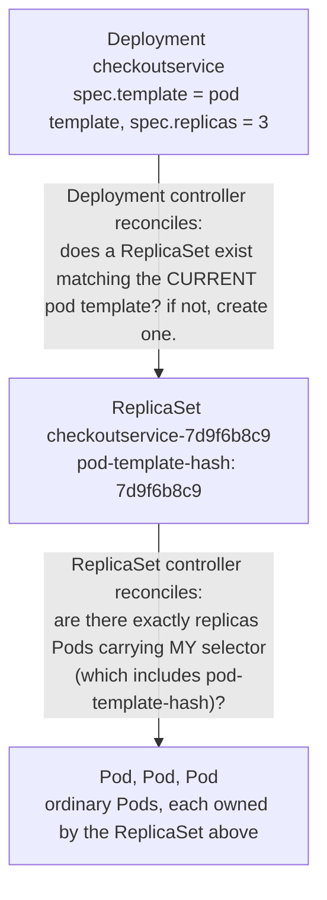
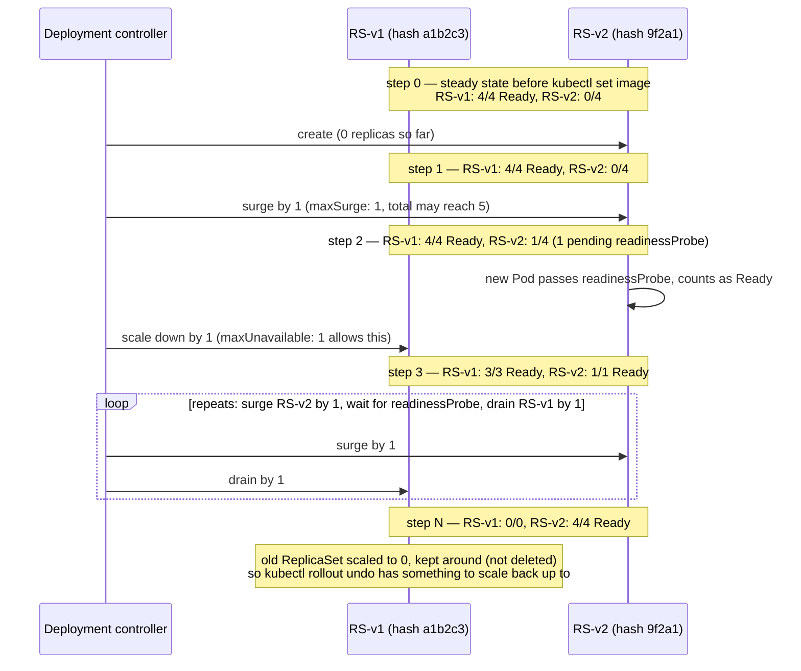

## 1. The Engineering Problem: Pods can't heal themselves, and can't be upgraded in place

A bare Pod, once created, is inert. If its node dies or the process inside crashes past its restart budget, **nothing recreates it** — a Pod has no memory of "I should have 3 siblings" and no mechanism to notice it's gone. You'd be back to writing a script that polls `kubectl get pods` and re-creates whatever's missing.

Now add a second problem: you need to ship v2 of the image. Deleting all the v1 Pods and creating v2 Pods in one shot means a window with **zero capacity** — every in-flight request during that window fails. Doing it by hand, one Pod at a time, while making sure you don't take out more capacity than your service can absorb, is exactly the kind of repetitive, error-prone bookkeeping a control loop should own instead of a human running commands.

You need something that (a) continuously enforces "N replicas of this Pod template should exist," and (b) knows how to transition from "N replicas of template A" to "N replicas of template B" without ever dropping below an acceptable count.

---

## 2. The Technical Solution: Deployment → ReplicaSet → Pods (two reconcile loops, not one)

Kubernetes splits this into two controllers, stacked:

**Macro view — the two stacked reconcile loops:**



**Zoom in — the rollout advancing step by step**, using this lesson's own
`report-generator` numbers from section 3 (`replicas: 4`, `maxUnavailable: 1`,
`maxSurge: 1`, so the reconcile loop must keep total Pods ≤ 5 and Ready Pods
≥ 3 at every step — never a single jump from all-v1 to all-v2):



The pace of every step above is gated by the readinessProbe on the *new*
Pod — a slow-starting v2 container stalls the loop at whichever step it's
on, it doesn't let the Deployment barrel ahead.

Three things to hold onto:

1. **You almost never author a ReplicaSet directly.** The Deployment generates it, names it by hashing the pod template (`pod-template-hash`), and owns it via `ownerReferences`. `kubectl get rs` after any Deployment change is the fastest way to *see* this reconcile loop working.
2. **`pod-template-hash` is what lets two generations coexist mid-rollout.** The old ReplicaSet's selector only matches Pods with the *old* hash; the new one only matches the *new* hash. That's how a rollout can have both v1 and v2 Pods alive at once without either ReplicaSet accidentally claiming the other's Pods.
3. **The rollout is bounded by two knobs**, `maxUnavailable` and `maxSurge`, and — verified against the current API reference — **both default to 25%** of desired replicas when `strategy.rollingUpdate` is left unset. That means an un-tuned Deployment can go up to 25% over capacity and down to 75% capacity simultaneously during a routine update.

---

## 3. The clean example (the concept in isolation)

```yaml
apiVersion: apps/v1
kind: Deployment
metadata:
  name: report-generator
spec:
  replicas: 4
  selector:
    matchLabels:
      app: report-generator      # IMMUTABLE once the Deployment is created —
                                  # apps/v1 forbids changing this later.
  strategy:
    type: RollingUpdate
    rollingUpdate:
      maxUnavailable: 1          # never drop below 3 healthy Pods during a rollout
      maxSurge: 1                # never run more than 5 Pods at once
  template:
    metadata:
      labels:
        app: report-generator    # MUST match spec.selector.matchLabels above —
                                  # this is the contract the ReplicaSet is built from.
    spec:
      containers:
      - name: app
        image: mycompany/report-app:v2
        readinessProbe:          # gates when a NEW Pod counts as "available" —
          httpGet:                # directly controls rollout pace.
            path: /healthz
            port: 8080
```

Now here's the same shape without any of those knobs made explicit — which is what most real Deployments actually look like.

---

## 4. Production reality (from the real repo)

The `checkoutservice` Deployment from Google's Online Boutique (`microservices-demo`). License header trimmed; everything else verbatim.

```yaml
apiVersion: apps/v1
kind: Deployment
metadata:
  name: checkoutservice
spec:
  selector:
    matchLabels:
      app: checkoutservice
  # NOTE: no `replicas:` field, and no `strategy:` block at all.
  # That is NOT an oversight — it's relying on Kubernetes' defaults:
  #   replicas:  1 (if unset, apps/v1 defaults to a single Pod)
  #   strategy:  RollingUpdate, maxUnavailable: 25%, maxSurge: 25%
  template:
    metadata:
      labels:
        app: checkoutservice     # must equal spec.selector.matchLabels — the
                                  # ReplicaSet's selector is derived from this pair
    spec:
      # ... serviceAccountName and securityContext elided — not central to
      # the rollout/replica-defaults point of this lesson ...
      containers:
        - name: server
          image: checkoutservice
          readinessProbe:                # gates rollout pace AND Service traffic
            grpc: { port: 5050 }
          livenessProbe:
            grpc: { port: 5050 }
          env:                           # six hardcoded dependency addresses —
          - name: PRODUCT_CATALOG_SERVICE_ADDR    # six edges this single-replica
            value: "productcatalogservice:3550"    # Pod fans out to on every request
          - name: SHIPPING_SERVICE_ADDR
            value: "shippingservice:50051"
          - name: PAYMENT_SERVICE_ADDR
            value: "paymentservice:50051"
          - name: EMAIL_SERVICE_ADDR
            value: "emailservice:5000"
          - name: CURRENCY_SERVICE_ADDR
            value: "currencyservice:7000"
          - name: CART_SERVICE_ADDR
            value: "cartservice:7070"
          # ... resources.requests/limits elided ...
```

**What this teaches that a hello-world can't:**

- **Omission is a decision, not a gap.** This Deployment runs a single replica of the service that literally calls six other services during checkout — a single point of failure by default, accepted deliberately for a demo app. In a real production fork of this, "add `replicas: 3` and a `podDisruptionBudget`" would be one of the first changes, precisely *because* the defaults are visible once you know to look for them.
- **`spec.selector` is load-bearing and frozen.** It's what the ReplicaSet controller uses to claim Pods as its own. Try to change `checkoutservice`'s selector after the fact and the API server rejects the update outright — the fix is to delete and recreate the Deployment, which is why selectors are chosen conservatively up front.
- **The readiness probe does double duty.** The same `grpc` readiness check that keeps unready Pods out of the Service's endpoint list (covered in the Service lesson) *also* paces the rollout — a new Pod isn't counted toward `maxSurge`'s "available" budget until it passes this probe, so a slow-to-start container automatically slows its own rollout instead of the Deployment barreling ahead.
- **Six hardcoded env-var addresses are six dependency edges**, each resolved by the Service/DNS layer at the destination, not by anything this Deployment controls. Watching how many services checkout fans out to is a quick way to see why this particular Pod is the one you'd scale and protect first in a real deployment of this app.

---

## Source

- **Concept:** Kubernetes `Deployment` and `ReplicaSet` — declarative scaling and rolling updates
- **Domain:** kubernetes
- **Repo:** [GoogleCloudPlatform/microservices-demo](https://github.com/GoogleCloudPlatform/microservices-demo) → [`kubernetes-manifests/checkoutservice.yaml`](https://github.com/GoogleCloudPlatform/microservices-demo/blob/main/kubernetes-manifests/checkoutservice.yaml) — Google's "Online Boutique," an 11-microservice reference app
