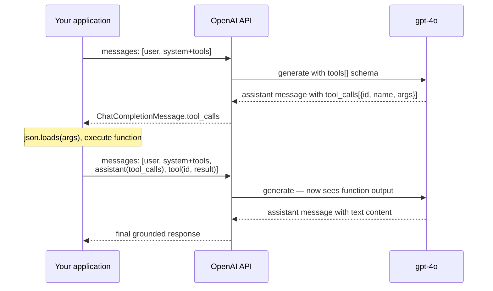
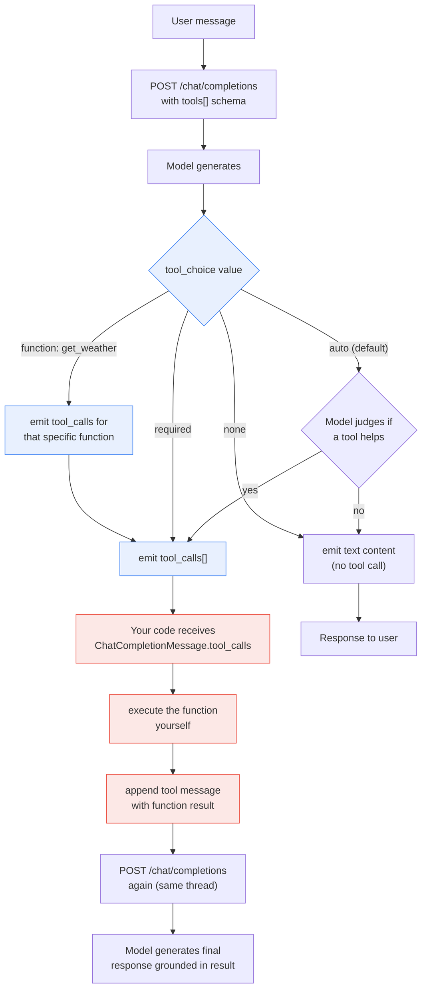

**TL;DR:** Does "function calling" mean the model executes your code when it decides a tool is needed? No — the model emits a structured JSON payload that *names* a function and *supplies* its arguments, and your application code receives that payload, decides whether to actually run the function, executes it separately, and sends the result back as a new message. The model never runs code; it only *requests* that code be run, and the `tool_choice` parameter on the API call controls how aggressively it does so — `"auto"` lets the model decide, `"required"` forces it to pick a tool even when it might prefer to answer directly, and a named choice forces a specific function regardless of the input.
> **In plain English (30 sec):** Think of this like concepts you already use, but in a production system at scale.


## 1. The Engineering Problem

An LLM's generation loop is stateless and side-effect-free by design: it receives a prompt, produces tokens, and stops. It has no runtime, no file system access, no network sockets, and no ability to call an API. This is a deliberate safety boundary — the model's output is text, not action — but it creates a concrete engineering gap when a real task requires the model to *do* something: look up a flight, query a database, send an email, or fetch live weather data.

Prompt engineering can teach the model *what* a function does by describing it in natural language, but there's no standard way for the model to signal "I want you to call this specific function with these specific arguments right now" that your code can parse programmatically. Without a structured contract between the model's intent and your runtime, every integration becomes a custom prompt-parsing exercise: hope the model outputs something parseable, regex it apart, hope it got the arguments right.

What's needed is a schema-level agreement: the model describes available functions *before* generating, the model outputs a well-typed call request *when* it determines a function is needed, and your code pattern-matches that request against the schema to execute it — all without the model ever leaving its text-generation boundary.

## 2. The Technical Solution

The message list accumulates across the loop — each tool call and its result are appended as real conversation turns so the model can see its own prior request and the actual function output when generating the final answer:



`tool_choice` controls the model's autonomy in Phase 2 — the protocol's critical control surface:

OpenAI's function calling protocol solves this as a three-phase loop, not a one-shot feature:

**Phase 1 — Schema registration.** You declare available functions as typed tool parameters on the API request, each with a `name`, a `description` the model uses to decide when the function applies, and a `parameters` field formatted as JSON Schema so the model knows the exact argument shape. The model sees these declarations as part of its context but cannot execute them.

**Phase 2 — Structured intent emission.** When the model determines a function would help answer the user's message, it returns an assistant message whose `tool_calls` array contains one or more `ChatCompletionMessageFunctionToolCall` objects — each carrying a unique `id`, a `function.name`, and a `function.arguments` string (JSON-encoded by the model). The model does not run the function; it emits a *request* for your code to run it. Your application receives this as a normal API response, inspects `message.tool_calls`, and decides whether to honor the request.

**Phase 3 — Result injection.** After your code executes the function and obtains a result, it appends two new messages to the conversation: an assistant message echoing the `tool_calls` (so the model sees its own prior request), and a tool message carrying the function's return value keyed by `tool_call_id`. The model then generates a final response grounded in the actual function result — closing the loop without ever having left the text-generation boundary.

`tool_choice` controls the model's autonomy in Phase 2 — the protocol's critical control surface:



The model's `tool_calls` array lives on the assistant message itself — it is not a separate API response shape but an optional field that appears *instead of or alongside* `content`:

```python
from openai.types.chat import (
    ChatCompletionMessageToolCall,   # alias for ChatCompletionMessageFunctionToolCall
    ChatCompletionMessage,
)

# What the API returns when the model wants to call a function:
msg: ChatCompletionMessage = response.choices[0].message
if msg.tool_calls:
    for call in msg.tool_calls:
        print(call.id)            # e.g. "call_abc123"  — unique per invocation
        print(call.type)          # always "function"
        print(call.function.name) # e.g. "get_weather"
        print(call.function.arguments)  # JSON string: '{"location": "Paris"}'
```

And `tool_choice` is a union type on the request side — three string literals plus two typed-dict shapes for named or restricted-set forcing:

```python
from openai.types.chat import (
    ChatCompletionToolChoiceOptionParam,
    ChatCompletionNamedToolChoiceParam,
    ChatCompletionAllowedToolChoiceParam,
)

# The five shapes tool_choice can take:
choice_auto: ChatCompletionToolChoiceOptionParam = "auto"       # model decides
choice_required: ChatCompletionToolChoiceOptionParam = "required"  # must call a tool
choice_none: ChatCompletionToolChoiceOptionParam = "none"       #禁止 tool calls

# Force a specific function:
choice_named: ChatCompletionNamedToolChoiceParam = {
    "type": "function",
    "function": {"name": "get_weather"},
}

# Restrict to a subset of declared tools:
choice_allowed: ChatCompletionAllowedToolChoiceParam = {
    "type": "allowed_tools",
    "allowed_tools": ["get_weather", "search_docs"],
}
```

## 3. The clean example (concept in isolation)

The full three-phase loop — tool definition, model selection, result injection — isolated from `openai`'s HTTP layer, retry logic, and streaming:

```python
import json

def agent_turn(user_message, tools, execute_fn):
    """One complete tool-calling turn: send the message, handle any
    tool calls the model requests, then return the final text response.
    `execute_fn(name, args)` is your application's function dispatcher."""
    messages = [{"role": "user", "content": user_message}]

    while True:
        response = openai.chat.completions.create(
            model="gpt-4o",
            messages=messages,
            tools=tools,
            tool_choice="auto",
        )
        msg = response.choices[0].message

        if not msg.tool_calls:
            return msg.content  # model answered directly — loop ends

        # Model requested tool calls — append its message, then
        # execute each call and append a tool result message.
        messages.append(msg)
        for call in msg.tool_calls:
            args = json.loads(call.function.arguments)
            result = execute_fn(call.function.name, args)
            messages.append({
                "role": "tool",
                "tool_call_id": call.id,
                "content": json.dumps(result),
            })
        # Loop continues — model now sees the tool results and generates
```

The critical constraint this isolates: `messages` accumulates the *entire* conversation — the model's tool-call request, every tool result, and the original user message — so the final LLM call in the loop sees the full history and can ground its response in the actual function output. Skipping the append or forgetting the `tool_call_id` match would leave the model with no basis for its final answer.

## 4. Production reality (from the real repo)

All type definitions below live under `openai/types/chat/` in the `openai-python` SDK:

```
openai-python/src/openai/types/chat/
├── chat_completion_message_tool_call.py         # ChatCompletionMessageFunctionToolCall
├── chat_completion_message.py                   # ChatCompletionMessage (response shape)
├── chat_completion_function_tool_param.py       # ChatCompletionFunctionToolParam (request input)
├── chat_completion_tool_choice_option_param.py  # tool_choice union type
├── chat_completion_tool_message_param.py        # ChatCompletionToolMessageParam (result you send back)
└── chat_completion_assistant_message_param.py   # ChatCompletionAssistantMessageParam (echo the tool_calls)
```

`ChatCompletionMessageFunctionToolCall` — what the model emits when it selects a function. Note `arguments` is a *string*, not a parsed dict — the model produces raw JSON text, and your code must `json.loads()` it:

```python
class Function(BaseModel):
    """The function that the model called."""

    arguments: str
    """
    The arguments to call the function with, as generated by the model in JSON
    format. Note that the model does not always generate valid JSON, and may
    hallucinate parameters not defined by your function schema. Validate the
    arguments in your code before calling your function.
    """

    name: str
    """The name of the function to call."""


class ChatCompletionMessageFunctionToolCall(BaseModel):
    """A call to a function tool created by the model."""

    id: str
    """The ID of the tool call."""

    function: Function
    """The function that the model called."""

    type: Literal["function"]
    """The type of the tool. Currently, only `function` is supported."""
```

`FunctionDefinition` — what you send on the *request* to register available tools. The `description` field is what the model reads to decide *when* to call the function; the `parameters` field is a JSON Schema object that constrains *what arguments* the model can emit:

```python
class FunctionDefinition(TypedDict, total=False):
    name: Required[str]
    """The name of the function to be called.

    Must be a-z, A-Z, 0-9, or contain underscores and dashes, with a maximum length
    of 64.
    """

    description: str
    """
    A description of what the function does, used by the model to choose when and
    how to call the function.
    """

    parameters: FunctionParameters
    """The parameters the functions accepts, described as a JSON Schema object."""

    strict: Optional[bool]
    """Whether to enable strict schema adherence when generating the function call.

    If set to true, the model will follow the exact schema defined in the
    `parameters` field. Only a subset of JSON Schema is supported when `strict` is
    `true`.
    """
```

`ChatCompletionToolMessageParam` — the message *your code* sends back after executing the function. The `tool_call_id` must match the `id` from the `ChatCompletionMessageFunctionToolCall` — this is how the model associates a result with its original request:

```python
class ChatCompletionToolMessageParam(TypedDict, total=False):
    content: Required[Union[str, Iterable[ChatCompletionContentPartTextParam]]]
    """The contents of the tool message."""

    role: Required[Literal["tool"]]
    """The role of the messages author, in this case `tool`."""

    tool_call_id: Required[str]
    """Tool call that this message is responding to."""
```

`ChatCompletionToolChoiceOptionParam` — the union that governs model autonomy. `"auto"` is the default and lets the model decide; `"required"` forces a tool call even when the model would prefer a direct answer; `"none"` forbids tool calls entirely despite tools being declared; and the typed-dict variants narrow the set further:

```python
ChatCompletionToolChoiceOptionParam: TypeAlias = Union[
    Literal["none", "auto", "required"],
    ChatCompletionAllowedToolChoiceParam,
    ChatCompletionNamedToolChoiceParam,
    ChatCompletionNamedToolChoiceCustomParam,
]
```

What these type definitions reveal that a tutorial won't:

- **`arguments` is a string, not a dict.** The model generates raw JSON text into that field — the SDK does not parse it for you. `json.loads(call.function.arguments)` can raise `JSONDecodeError` if the model hallucinated malformed JSON, so the docstring's "Note that the model does not always generate valid JSON" is a real production concern, not a theoretical footnote.
- **`tool_call_id` is the only link between a tool result and the model's request.** If you send a tool message with the wrong `tool_call_id`, the model sees a result it never asked for and produces incoherent output — there's no validation error, just a degraded response.
- **`strict: true` on `FunctionDefinition` enables Structured Outputs mode**, which constrains the model's argument generation to *exactly* the JSON Schema you provided — but only a subset of JSON Schema is supported in strict mode, and the SDK documents this as a constraint rather than a fallback.
- **`ChatCompletionNamedToolChoiceParam` forces a specific function name regardless of whether the model thinks it's the right tool.** This is useful for controlled testing or when your orchestration layer has already decided which tool should run, but it can produce bad arguments if the model is forced into a tool that doesn't apply to the current input.

## 5. Review checklist

- When defining a tool, confirm `description` explains *when* to call the function (not just what it does) — the model uses this field as its selection signal, and a vague description produces either missed calls or spurious ones.
- If using `strict: true`, verify your `parameters` JSON Schema against the [supported subset](https://platform.openai.com/docs/guides/function-calling) — unsupported keywords like `$ref` or `additionalProperties: false` in certain positions silently disable strict mode rather than raising an error.
- When handling tool calls, always `json.loads()` `call.function.arguments` inside a try/except and validate the result against your expected schema before executing — the model can and does hallucinate extra or misspelled parameter names.
- When sending tool result messages, confirm `tool_call_id` matches the `id` from the exact `ChatCompletionMessageFunctionToolCall` you're responding to — a mismatch produces silent degradation, not an API error.
- If using `tool_choice="required"`, account for the fact that the model *must* emit a tool call even when a direct answer would be more appropriate — add a "no-op" or "respond directly" tool to the tools list so the model has a valid escape hatch.

## 6. FAQ

**Q: Does the model actually execute my function when it emits a `tool_calls` entry?**
A: No. The model only generates a JSON payload naming the function and its arguments. Your application code receives that payload from the API response, decides whether to execute the function, runs it, and sends the result back as a separate `tool` message. The model never has runtime access to your code.

**Q: What's the difference between `tool_choice="required"` and `tool_choice="auto"`?**
A: `"auto"` lets the model decide — it may answer directly without calling any tool if it judges the input doesn't require one. `"required"` forces the model to emit at least one tool call on every response, even for straightforward questions. Use `"required"` when your orchestration layer expects to always execute a tool (e.g., routing logic), and `"auto"` when the model should have the option to skip tools entirely.

**Q: Can the model call multiple tools in one response?**
A: Yes — `tool_calls` is a list, and the model can populate multiple entries. Your code should iterate over all of them, execute each, and send a separate `tool` message for each `tool_call_id` before the next LLM call.

**Q: Why is `arguments` a string and not a parsed JSON object?**
A: The model generates raw tokens that happen to form valid JSON — the API doesn't parse them server-side. This means your code must call `json.loads()` on the string, which can fail if the model hallucinated malformed JSON. The SDK's docstring explicitly warns about this: "the model does not always generate valid JSON, and may hallucinate parameters not defined by your function schema."

**Q: What happens if I declare a tool but set `tool_choice="none"`?**
A: The model sees the tool definitions (they remain in its context) but is prohibited from emitting any `tool_calls`. It will answer using only its internal knowledge and the text prompt — useful when you want the model to be *aware* of available tools for reasoning purposes but not actually invoke them on a given turn.

---

## Source

- **Concept:** Function calling / tool use — how an LLM emits structured tool-call requests and how `tool_choice` controls model autonomy
- **Domain:** genai
- **Repo:** [openai/openai-python](https://github.com/openai/openai-python) → [`src/openai/types/chat/chat_completion_message_tool_call.py`](https://github.com/openai/openai-python/blob/main/src/openai/types/chat/chat_completion_message_tool_call.py), [`src/openai/types/shared_params/function_definition.py`](https://github.com/openai/openai-python/blob/main/src/openai/types/shared_params/function_definition.py), [`src/openai/types/chat/chat_completion_tool_choice_option_param.py`](https://github.com/openai/openai-python/blob/main/src/openai/types/chat/chat_completion_tool_choice_option_param.py), and [`src/openai/types/chat/chat_completion_tool_message_param.py`](https://github.com/openai/openai-python/blob/main/src/openai/types/chat/chat_completion_tool_message_param.py) — the official OpenAI Python SDK, auto-generated from their OpenAPI spec by Stainless.


