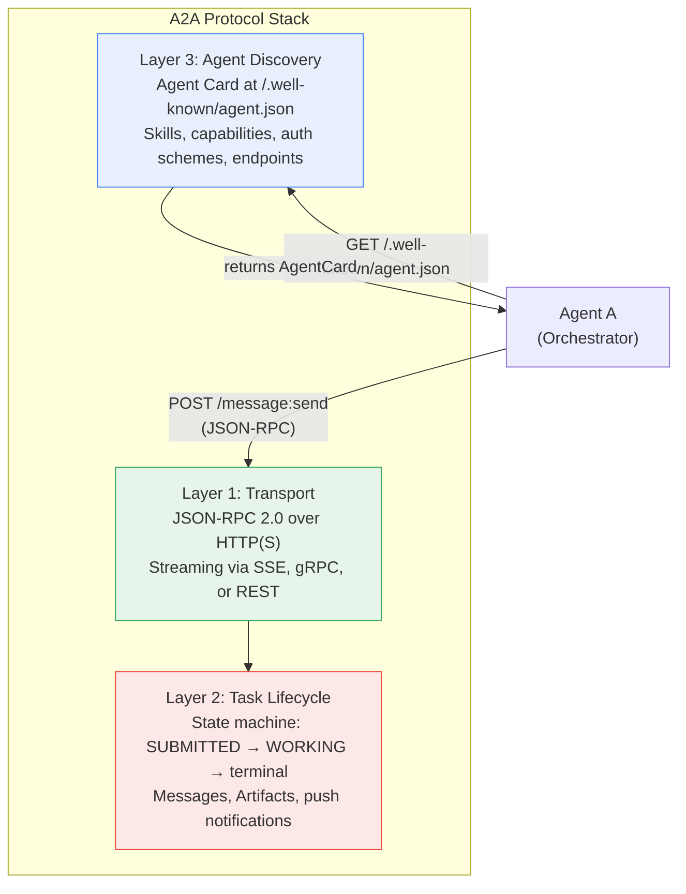
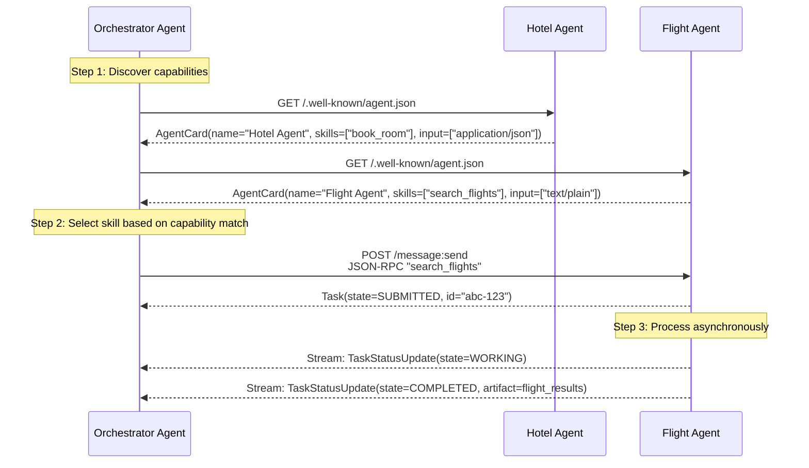
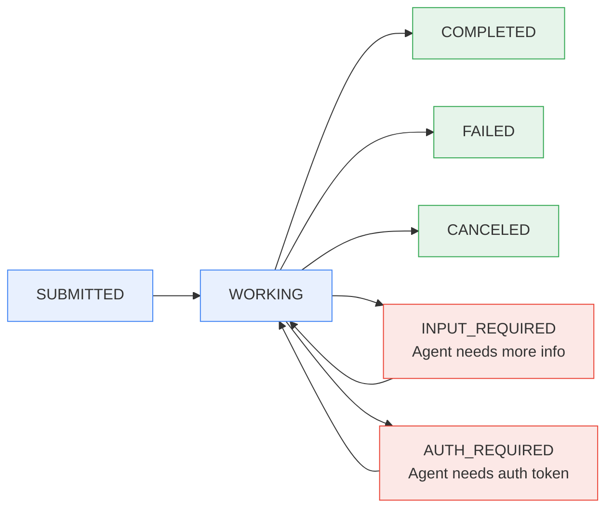

**TL;DR:** If you build two AI agents on different frameworks and want them to collaborate on a task, raw HTTP POST is not enough — Agent A does not know what Agent B can do, what input formats it accepts, how long it will take, or whether it supports streaming. The Google A2A (Agent-to-Agent) protocol solves this by defining three layers that raw HTTP skips entirely: an **Agent Card** (a self-describing manifest at a well-known URL), a **Task lifecycle** (SUBMITTED → WORKING → COMPLETED with state-machine semantics), and a **Message/Part protocol** (structured content containers with typed payloads). Without these, every agent pair requires a hand-written integration. With them, any A2A-compliant agent can discover, negotiate, and delegate to any other A2A-compliant agent — regardless of which framework built it.

> **In plain English (30 sec):** Code you already write — Map, function, API call, just bigger.

---

## 1. The Engineering Problem

MCP (Model Context Protocol) solved one problem: giving an agent access to tools. An LLM calls a tool via MCP and gets a structured result. But tool invocation is a **client-to-server** pattern — the agent is always the client, the tool is always the server. The tool never initiates a conversation, never delegates subtasks, never pushes status updates back asynchronously.

When you need **agent-to-agent** collaboration, the model breaks down completely. Consider a scenario where a Travel Orchestrator agent needs to delegate to a Hotel Booking agent and a Flight Search agent, each built by different teams on different frameworks:

**Capability discovery.** The Orchestrator cannot simply POST to `https://hotel-agent.internal/book` — it does not know that endpoint exists, what parameters the Hotel agent accepts, whether it supports streaming responses, or whether it requires OAuth. Every new agent requires writing a client adapter by hand.

**Input negotiation.** The Flight agent may accept `application/json` payloads with structured IATA codes. The Hotel agent may accept `text/plain` natural language descriptions. Without a negotiation step, the Orchestrator must encode its requests differently for each downstream agent, and any format change on the server side breaks the client.

**Long-running task coordination.** A flight search may return in 200ms. A hotel booking may take 30 seconds or require human confirmation mid-task. HTTP POST is synchronous — the client blocks until the server responds. There is no built-in mechanism for the server to say "I am still working" or "I need human input before continuing."

**Agent opacity.** The Hotel agent may use LangGraph internally. The Flight agent may use AutoGen. The Orchestrator does not need to know this, and the internal agents should not need to expose their memory, tool registry, or prompt chain to collaborate. MCP does not enforce this boundary — an MCP server exposes its tools, which leaks implementation structure.

The core problem is that HTTP POST is a transport, not a protocol. It says nothing about capability advertisement, task state management, content negotiation, or long-running async patterns. A2A defines all four.

## 2. The Technical Solution

A2A is built on three layers that sit above HTTP(S):



### Agent Card: The Handshake Before Any Message

Every A2A-compliant agent hosts an `AgentCard` at a well-known URL (`/.well-known/agent.json`). This is the agent's business card — it declares what the agent can do, how to reach it, and what security it requires, *before* any task is sent:

```protobuf
// From specification/a2a.proto — the self-describing manifest
message AgentCard {
  string name = 1;           // "Recipe Agent"
  string description = 2;    // "Helps users with recipes"
  repeated AgentInterface supported_interfaces = 3;
  AgentCapabilities capabilities = 7;
  repeated string default_input_modes = 10;   // ["text/plain"]
  repeated string default_output_modes = 11;  // ["text/plain"]
  repeated AgentSkill skills = 12;
  map<string, SecurityScheme> security_schemes = 8;
}

message AgentSkill {
  string id = 1;          // "echo_bot"
  string name = 2;        // "Echo Bot"
  string description = 3; // "Responds with Hello World"
  repeated string tags = 4;
  repeated string examples = 5;
}

message AgentInterface {
  string url = 1;                 // "http://127.0.0.1:9999"
  string protocol_binding = 2;    // "JSONRPC", "GRPC", or "HTTP+JSON"
  string protocol_version = 4;    // "1.0"
}
```

The discovery sequence lets any agent act as a client:



### Task Lifecycle: State Machine, Not Request-Response

The `Task` is A2A's core unit of work. Unlike a simple RPC request-response, a Task has an explicit state machine with seven states defined in the protocol specification:

```protobuf
enum TaskState {
  TASK_STATE_UNSPECIFIED = 0;
  TASK_STATE_SUBMITTED = 1;      // Acknowledged, queued
  TASK_STATE_WORKING = 2;        // Actively processing
  TASK_STATE_COMPLETED = 3;      // Terminal: success
  TASK_STATE_FAILED = 4;         // Terminal: error
  TASK_STATE_CANCELED = 5;       // Terminal: user canceled
  TASK_STATE_INPUT_REQUIRED = 6; // Interrupted: needs more info
  TASK_STATE_REJECTED = 7;       // Terminal: agent declined
  TASK_STATE_AUTH_REQUIRED = 8;  // Interrupted: needs auth
}
```

This state machine enables patterns that raw HTTP POST cannot express:



The critical states are `INPUT_REQUIRED` and `AUTH_REQUIRED` — these are **interrupted** states, not terminal ones. The agent can pause mid-task, return control to the client with a structured message explaining what it needs, and resume when the client sends a follow-up message in the same task context. This is the difference between A2A and a webhook: the agent keeps its internal task state across the interruption.

## 3. The Production Implementation

The helloworld sample from `a2aproject/a2a-samples` demonstrates the minimal wiring — a server that advertises its Agent Card and processes incoming tasks:

From `samples/python/agents/helloworld/__main__.py`:

```python
# An A2A server starts by defining skills and an Agent Card,
# then wiring a RequestHandler to a transport (Starlette here).
from a2a.types import (
    AgentCapabilities, AgentCard, AgentInterface, AgentSkill,
)
from a2a.server.request_handlers import DefaultRequestHandler
from a2a.server.tasks import InMemoryTaskStore

# Skills declare what the agent can do — clients discover these
# before sending any task messages.
skill = AgentSkill(
    id='echo_bot',
    name='Echo Bot',
    description='Responds with a Hello World message.',
    input_modes=['text/plain'],
    output_modes=['text/plain'],
    tags=['a2a', 'echo-example'],
    examples=['hi', 'how are you'],
)

# The Agent Card is served at /.well-known/agent.json.
# supported_interfaces tells clients which transport to use.
public_agent_card = AgentCard(
    name='Hello World Agent',
    description='Just a hello world agent',
    version='0.0.1',
    default_input_modes=['text/plain'],
    default_output_modes=['text/plain'],
    capabilities=AgentCapabilities(streaming=True, extended_agent_card=True),
    supported_interfaces=[
        AgentInterface(
            protocol_binding='JSONRPC',
            url='http://127.0.0.1:9999',
            protocol_version='1.0',
        )
    ],
    skills=[skill],
)

# RequestHandler routes JSON-RPC calls to the AgentExecutor.
request_handler = DefaultRequestHandler(
    agent_executor=HelloWorldAgentExecutor(),
    task_store=InMemoryTaskStore(),
    agent_card=public_agent_card,
)
```

The `AgentExecutor` subclass is where your actual agent logic lives. The SDK handles the A2A protocol layer — task creation, state transitions, artifact packaging — so your executor only implements `execute()` and `cancel()`:

From `samples/python/agents/helloworld/agent_executor.py`:

```python
from a2a.server.agent_execution import AgentExecutor, RequestContext
from a2a.server.events import EventQueue
from a2a.server.tasks import TaskUpdater
from a2a.types import TaskState


class HelloWorldAgentExecutor(AgentExecutor):
    """Processes incoming A2A task requests."""

    def __init__(self) -> None:
        self.agent = HelloWorldAgent()

    async def execute(
        self,
        context: RequestContext,
        event_queue: EventQueue,
    ) -> None:
        # 1. Reuse existing task or create a new one
        if context.current_task:
            task = context.current_task
        else:
            task = new_task_from_user_message(context.message)
            await event_queue.enqueue_event(task)

        # 2. Transition to WORKING state — clients see this via streaming
        task_updater = TaskUpdater(
            event_queue=event_queue, task_id=task.id,
            context_id=task.context_id,
        )
        await task_updater.update_status(
            state=TaskState.TASK_STATE_WORKING,
            message=new_text_message('Processing request...'),
        )

        # 3. Extract text from the A2A message and invoke agent logic
        query = get_message_text(context.message)
        result = await self.agent.invoke(user_request=query)

        # 4. Attach result as an artifact — typed content, not raw string
        await task_updater.add_artifact(
            parts=[new_text_part(text=result, media_type='text/plain')]
        )

        # 5. Transition to COMPLETED — terminal state
        await task_updater.update_status(
            state=TaskState.TASK_STATE_COMPLETED,
            message=new_text_message('Request is completed!'),
        )
```

What this reveals about the A2A contract:

- **Task state transitions are explicit and observable.** The executor calls `update_status(state=WORKING)` before doing work and `update_status(state=COMPLETED)` after. A client streaming the task sees each transition in real time — no polling required.
- **Artifacts are typed containers, not raw responses.** `add_artifact(parts=[new_text_part(...)])` wraps the result in a `Part` object with a `media_type`. This is how agents negotiate content formats — the Agent Card declares `output_modes`, and artifacts respect that contract.
- **The `TaskUpdater` decouples protocol from logic.** Your agent executor never touches JSON-RPC framing, HTTP headers, or SSE stream management. It publishes events to an `EventQueue`, and the SDK handles serialization and transport.

## 4. Production Reality: What the Specification Actually Says

The A2A protocol specification (under the Linux Foundation, contributed by Google) defines the contract precisely. From `a2aproject/A2A/specification/a2a.proto`:

```protobuf
// The service definition — all RPCs an A2A server must support
service A2AService {
  // Core message passing — the primary entry point
  rpc SendMessage(SendMessageRequest) returns (SendMessageResponse);
  rpc SendStreamingMessage(SendMessageRequest) returns (stream StreamResponse);

  // Task lifecycle management
  rpc GetTask(GetTaskRequest) returns (Task);
  rpc ListTasks(ListTasksRequest) returns (ListTasksResponse);
  rpc CancelTask(CancelTaskRequest) returns (Task);

  // Push notification config for async callbacks
  rpc CreateTaskPushNotificationConfig(TaskPushNotificationConfig)
      returns (TaskPushNotificationConfig);

  // Agent card endpoints
  rpc GetExtendedAgentCard(GetExtendedAgentCardRequest) returns (AgentCard);
}

// Messages carry typed Parts — text, files, or structured JSON
message Message {
  string message_id = 1;
  Role role = 4;       // ROLE_USER or ROLE_AGENT
  repeated Part parts = 5;
}

message Part {
  oneof content {
    string text = 1;
    bytes raw = 2;
    string url = 3;
    google.protobuf.Value data = 4;  // structured JSON
  }
  string media_type = 7;  // MIME type for all part kinds
}
```

These are the actual protocol constraints that differentiate A2A from "just call an HTTP endpoint":

- **`SendMessageRequest` includes a `SendMessageConfiguration`** where the client declares `accepted_output_modes`, `history_length`, and `return_immediately` — this is the negotiation step that raw HTTP lacks.
- **`StreamResponse` is a union of `Task`, `Message`, `TaskStatusUpdateEvent`, and `TaskArtifactUpdateEvent`** — a single SSE stream carries both task state transitions and partial artifact content, so the client does not need separate polling endpoints.
- **`TaskPushNotificationConfig`** lets the client register a webhook URL for async task updates — the server POSTs status changes to the client when the task completes, eliminating long-polling.
- **`GetExtendedAgentCard`** returns a different, richer Agent Card to authenticated users — the public card shows basic skills, while the extended card (returned only after auth) reveals additional capabilities.

## 5. Review Checklist

- **Agent Card is a well-known URL, not a registry.** Every A2A agent serves its card at `/.well-known/agent.json`. There is no central registry — discovery is peer-to-peer, which means no single point of failure but also no global search.

- **Task has seven states, two are interrupted.** `SUBMITTED → WORKING → terminal` is the happy path. `INPUT_REQUIRED` and `AUTH_REQUIRED` are interrupted states that pause the task, return control to the client, and resume when the client sends a follow-up.

- **Messages carry typed Parts, not raw strings.** A `Part` can be text, a file (bytes or URL), or structured JSON data — each with a `media_type`. This is how agents negotiate content formats without ad-hoc parsing.

- **JSON-RPC 2.0 is the primary transport.** The specification defines gRPC and HTTP+JSON as alternative bindings, but JSON-RPC over HTTP(S) is the baseline. All three must be supported by compliant servers.

- **Extended Agent Cards are auth-gated.** A public card shows basic skills. An authenticated request to `GetExtendedAgentCard` reveals additional skills and capabilities — useful for tiered access control.

- **`return_immediately` changes the blocking semantics.** By default, `SendMessage` blocks until the task reaches a terminal or interrupted state. Setting `return_immediately=true` returns immediately after creating the task, letting the client poll or subscribe for updates.

- **Push notifications replace long-polling.** `TaskPushNotificationConfig` lets the client register a callback URL. The server POSTs `TaskStatusUpdateEvent` payloads to that URL when the task state changes — no polling loop required.

## 6. FAQ

**Q: How does A2A relate to MCP?**
A: MCP (Model Context Protocol) defines how an agent calls a *tool* — a client-to-server pattern where the tool is stateless and returns a result. A2A defines how two *agents* collaborate — both sides have their own task state, memory, and decision-making. A2A complements MCP: an orchestrator agent might use MCP to call a database tool and A2A to delegate a complex subtask to a specialist agent.

**Q: Why JSON-RPC 2.0 and not just REST?**
A: JSON-RPC provides a uniform method dispatch (`method`, `params`, `id`) that maps cleanly to A2A's operation set (`SendMessage`, `GetTask`, `CancelTask`). REST would require different URL patterns and HTTP verbs for each operation, and the specification would need to define error formats, idempotency semantics, and streaming separately. JSON-RPC standardizes all of these.

**Q: Can two agents on different frameworks actually interoperate?**
A: That is the explicit goal. The A2A Python SDK (`a2aproject/a2a-python`), Go SDK, JS SDK, Java SDK, .NET SDK, and Rust SDK all implement the same wire protocol. An agent built with LangGraph and an agent built with AutoGen can communicate if both expose A2A-compliant servers — the Agent Card tells each side what the other supports.

**Q: What happens if an agent takes 10 minutes to respond?**
A: The client sets `return_immediately=true` in `SendMessageConfiguration`, gets back a `Task` with `state=SUBMITTED`, and then either polls via `GetTask` or subscribes via `SubscribeToTask` (SSE stream) or registers a `TaskPushNotificationConfig` for webhook callbacks. The agent transitions through `WORKING` and eventually `COMPLETED` — the client is never blocked.

**Q: Is there a central registry of A2A agents?**
A: No. Each agent serves its own `AgentCard` at `/.well-known/agent.json`. Discovery is peer-to-peer: if you know an agent's URL, you can fetch its card and start collaborating. For multi-agent deployments, an orchestrator agent can maintain its own registry of known agent URLs, but there is no protocol-level discovery service.

**Q: What security does A2A enforce?**
A: The Agent Card declares `security_schemes` (API key, HTTP Bearer, OAuth 2.0, OpenID Connect, or mTLS) and `security_requirements`. The client must satisfy these before sending tasks. The specification does not mandate a specific auth mechanism — it declares what the agent requires and lets the client comply.

---

## Source

This post examines the Agent2Agent protocol from the [a2aproject/A2A](https://github.com/a2aproject/A2A) repository and the [a2aproject/a2a-python](https://github.com/a2aproject/a2a-python) SDK. The primary files analyzed:

- [`specification/a2a.proto`](https://github.com/a2aproject/A2A/blob/main/specification/a2a.proto) — `A2AService` (RPC definitions), `AgentCard`, `AgentSkill`, `AgentInterface`, `Task`, `TaskState`, `Message`, `Part`, `SendMessageConfiguration`, `TaskPushNotificationConfig`
- [`samples/python/agents/helloworld/__main__.py`](https://github.com/a2aproject/a2a-samples/blob/main/samples/python/agents/helloworld/__main__.py) — `AgentSkill`, `AgentCard`, `AgentInterface`, `DefaultRequestHandler` wiring, `InMemoryTaskStore`
- [`samples/python/agents/helloworld/agent_executor.py`](https://github.com/a2aproject/a2a-samples/blob/main/samples/python/agents/helloworld/agent_executor.py) — `HelloWorldAgentExecutor.execute()`, `TaskUpdater` state transitions, artifact packaging


