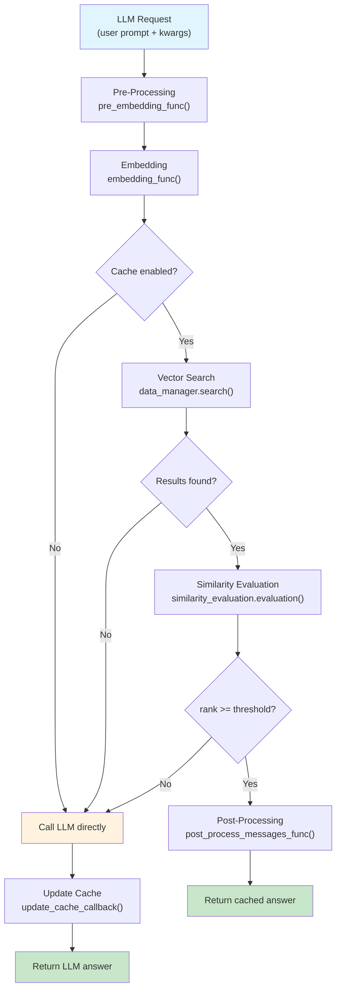
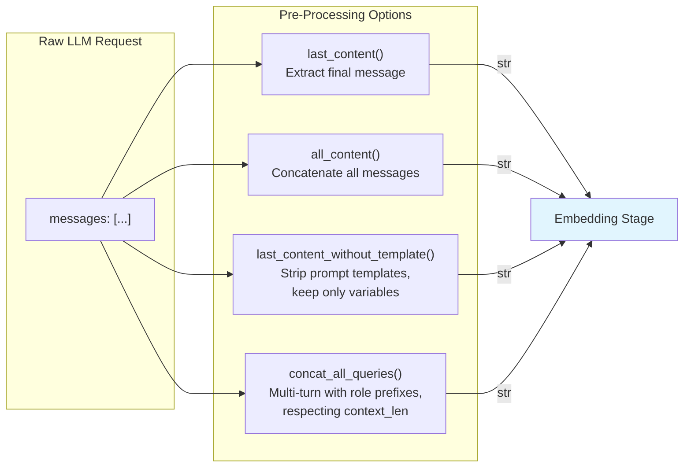

> **In plain English (30 sec):** Memoization you already do: check Map first, only call DB on miss.


## TL;DR

Exact prefix caching (like Anthropic's prompt caching) only matches when a prompt's leading tokens are byte-identical to a previous request. One extra whitespace character in the system prompt and the cache misses entirely. GPTCache takes the opposite approach: it converts prompts into dense embeddings, indexes them in a vector store, and returns a cached answer whenever a *semantically similar* prompt appears — even if the wording is completely different. The tradeoff is precision for recall. You pay for an embedding call on every request but recover that cost by avoiding the far more expensive LLM inference on cache hits. In production, this distinction matters: prefix caching helps with long, stable system prompts; semantic caching helps when users ask the same *intent* in a hundred different ways.

---

## The Engineering Problem

Every LLM call is a paid API call. For a production RAG chatbot serving 10k queries/day with an average 2k-token prompt, you burn through tokens fast. Two classes of caching exist, and they solve different halves of the problem:

| Approach | What it matches | Misses on |
|---|---|---|
| **Exact prefix caching** (Anthropic, OpenAI) | Identical leading token sequences | Synonyms, rewordings, prompt reordering |
| **Semantic caching** (GPTCache) | Embedding-space neighbors above a threshold | Ambiguous prompts, domain-specific jargon outside the embedding space |

Exact prefix caching is a zero-cost optimization when it hits — the provider applies it transparently. But it requires your prompts to be structurally stable. A user who types "How do I reset my password?" and "Tell me how to reset my password" are semantically identical but prefix-different. The prefix cache misses; a semantic cache would hit.

The engineering challenge is this: **semantic cache hits are approximate, not exact**. Two prompts can be close in embedding space but require fundamentally different answers. A threshold too low causes false hits; a threshold too high kills the hit rate. GPTCache addresses this with a multi-stage pipeline that separates storage, embedding, similarity evaluation, and post-processing into composable layers.

---

## Technical Solution

### Architecture Overview

GPTCache decomposes the caching problem into five pluggable stages. The core orchestrator is `adapt()` in `gptcache/adapter/adapter.py`, which intercepts every LLM call and runs the cache pipeline before deciding whether to call the LLM:



### The Pre-Processing Pipeline

Before any embedding happens, GPTCache normalizes the raw prompt through a `pre_embedding_func`. The default implementations in `gptcache/processor/pre.py` handle the most common OpenAI-style message formats:



`concat_all_queries` is particularly important for multi-turn conversations. It trims older messages using `context_len`, skips roles in a configurable `skip_list`, and prefixes each message with its role — so the same conversation state produces the same cache key regardless of message count.

### Similarity Evaluation and the Threshold Problem

The `adapt()` function calculates a dynamic rank threshold from the similarity evaluation range:

```python
# From gptcache/adapter/adapter.py
similarity_threshold = chat_cache.config.similarity_threshold
min_rank, max_rank = chat_cache.similarity_evaluation.range()
rank_threshold = (max_rank - min_rank) * similarity_threshold * cache_factor
rank_threshold = (
    max_rank
    if rank_threshold > max_rank
    else min_rank
    if rank_threshold < min_rank
    else rank_threshold
)
```

The `cache_factor` parameter (default 1.0) acts as a sensitivity dial. A factor of 0.5 halves the effective threshold, making the cache more aggressive — more hits, but more risk of wrong answers. A factor of 2.0 doubles it, making the cache conservative.

---

## Clean Example

Setting up GPTCache with OpenAI's API as a transparent proxy:

```python
# pip install gptcache
from gptcache import Cache
from gptcache.adapter import openai
from gptcache.manager import manager_factory
from gptcache.processor.pre import last_content

# Initialize cache with SQLite + FAISS
data_manager = manager_factory(
    "sqlite,faiss",
    data_dir="gptcache_data",
    scalar_params={"sqlite_path": "cache.db"},
    vector_params={"dimension": 1536},
)

cache = Cache()
cache.init(
    data_manager=data_manager,
    pre_embedding_func=last_content,
    similarity_threshold=0.8,
)

# Transparent proxy — same API, automatic caching
response = openai.ChatCompletion.create(
    model="gpt-3.5-turbo",
    messages=[{"role": "user", "content": "What is the capital of France?"}],
)
print(response.choices[0].message.content)
# First call: hits LLM, caches (prompt + answer + embedding)

# Different wording, same intent — semantic cache hits
response2 = openai.ChatCompletion.create(
    model="gpt-3.5-turbo",
    messages=[{"role": "user", "content": "Tell me the capital city of France."}],
)
print(response2.choices[0].message.content)
# Returns cached answer without calling the LLM
```

The `last_content` pre-processor extracts only the final user message. For multi-turn conversations, swap it for `concat_all_queries` and pass a `context_len` via `Config`.

---

## Production Reality

The `adapt()` function in `gptcache/adapter/adapter.py` handles several production concerns that the clean example obscures:

### Temperature-Aware Cache Skipping

When the user sets `temperature > 0`, GPTCache probabilistically skips the cache using `temperature_softmax`. This avoids returning a deterministic answer for a request that explicitly asks for randomness:

```python
# From gptcache/adapter/adapter.py
if 0 < temperature < 2:
    cache_skip_options = [True, False]
    prob_cache_skip = [0, 1]
    cache_skip = kwargs.pop(
        "cache_skip",
        temperature_softmax(
            messages=cache_skip_options,
            scores=prob_cache_skip,
            temperature=temperature,
        ),
    )
elif temperature >= 2:
    cache_skip = kwargs.pop("cache_skip", True)
else:  # temperature <= 0
    cache_skip = kwargs.pop("cache_skip", False)
```

At `temperature=0` (the default), the cache is always checked. At `temperature >= 2`, it is always skipped.

### Cache Health Check: Detecting Vector Store Drift

A critical failure mode in production: the vector store and the scalar store (which holds the actual answers) can fall out of sync. The `cache_health_check` function detects this by comparing the embedding stored in the scalar store against the one retrieved from the vector store:

```python
# From gptcache/adapter/adapter.py
def cache_health_check(vectordb, cache_dict):
    """Check if the embedding from vector store matches one in cache store.
    If cache store and vector store are out of sync, cache retrieval can be
    incorrect. If this happens, force the similarity score to the lowest
    possible value."""
    emb_in_cache = cache_dict["embedding"]
    _, data_id = cache_dict["search_result"]
    emb_in_vec = vectordb.get_embeddings(data_id)
    flag = np.all(emb_in_cache == emb_in_vec)
    if not flag:
        gptcache_log.critical("Cache Store and Vector Store are out of sync!!!")
        cache_dict["search_result"] = (np.inf, data_id)
        # Self-healing: replace vector store entry with scalar store embedding
        vectordb.update_embeddings(data_id, emb=cache_dict["embedding"])
    return flag
```

When drift is detected, the cache entry is self-healed: the correct embedding from the scalar store overwrites the stale one in the vector store. The similarity score is forced to `np.inf`, ensuring this corrupted entry never matches a query.

### Input Summarization for Long Prompts

For prompts exceeding `input_summary_len`, GPTCache automatically summarizes the prompt before embedding:

```python
# From gptcache/adapter/adapter.py
if chat_cache.config.input_summary_len is not None:
    pre_embedding_data = _summarize_input(
        pre_embedding_data, chat_cache.config.input_summary_len
    )
```

This prevents long RAG contexts from diluting the embedding signal. A 10,000-token document context reduces to a fixed-length summary, keeping the cache focused on the semantic intent of the question.

### Pre-Processing Flexibility

The `pre.py` module provides multiple strategies for extracting cache keys from complex prompts:

```python
# From gptcache/processor/pre.py — concat_all_queries
def concat_all_queries(data, **params):
    cache_config = params.get("cache_config", None)
    skip_list = cache_config.skip_list
    context_len = cache_config.context_len * 2
    s = ""
    messages = data.get("messages")
    length = min(context_len, len(messages))
    messages = messages[len(messages) - length:]
    for i, message in enumerate(messages):
        if message["role"] in skip_list:
            continue
        if i == len(messages) - 1:
            s += f'{message["role"].upper()}: {message["content"]}'
        else:
            s += f'{message["role"].upper()}: {message["content"]}\n'
    return s
```

The `skip_list` allows you to exclude system messages or assistant responses from the cache key, so only user-authored content determines the match.

---

## Review Checklist

- [ ] **Threshold tuning**: Start with `similarity_threshold=0.8`. Measure your hit rate and false-positive rate. Lower the threshold to increase hits, raise it to reduce incorrect answers.
- [ ] **Pre-processor choice**: Use `last_content` for single-turn Q&A. Use `concat_all_queries` for multi-turn. Use `last_content_without_template` when prompts are templated with Lanchain/variable slots.
- [ ] **Temperature awareness**: Verify that `temperature > 0` requests are correctly skipping the cache, or use `cache_skip=True` explicitly for creative/generative endpoints.
- [ ] **Vector store monitoring**: Enable logging for the `Cache Store and Vector Store are out of sync` critical message. It indicates a write failure that the self-healing mechanism may mask.
- [ ] **Cost math**: Embedding costs (typically 10-100x cheaper than LLM inference) must be weighed against your hit rate. A 40% hit rate on GPT-4 calls easily justifies the embedding overhead.
- [ ] **Cache eviction**: For long-running services, configure TTL-based or LRU eviction on the SQLite/scalar store to prevent unbounded growth.
- [ ] **Session support**: If your application is conversational, use the `session` parameter in `adapt()` to scope cache lookups to a user's conversation history.

---

## FAQ

**Q: Can I use GPTCache with local models (Llama, Mistral)?**
A: Yes. GPTCache is model-agnostic. The `adapt()` function wraps any `llm_handler` callable. You can wrap `llama.cpp`, Ollama, or any OpenAI-compatible endpoint.

**Q: What happens if two semantically similar questions have different correct answers?**
A: This is the core risk of semantic caching. The `cache_factor` parameter controls sensitivity. For high-stakes domains (medical, legal), set `similarity_threshold` high (0.9+) or use the `LlmVerifier` post-processor, which sends cache hits through a lightweight verification model.

**Q: How does GPTCache differ from LangChain's `CachedLLM`?**
A: LangChain's cache uses exact string matching by default. GPTCache uses embedding-based vector search. GPTCache also provides the full pre/post-processing pipeline, health checks, and adapter pattern for any LLM SDK — not just OpenAI.

**Q: Does GPTCache support batch requests?**
A: Not directly. Each request in a batch would go through the cache pipeline independently. For batch workloads, consider pre-embedding all queries and doing a batch vector search manually.

---

## Source

- [`gptcache/adapter/adapter.py`](https://github.com/zilliztech/GPTCache/blob/main/gptcache/adapter/adapter.py) — core `adapt()` and `aadapt()` orchestration
- [`gptcache/processor/pre.py`](https://github.com/zilliztech/GPTCache/blob/main/gptcache/processor/pre.py) — prompt pre-processing strategies
- [GPTCache GitHub](https://github.com/zilliztech/GPTCache) — full project repository


