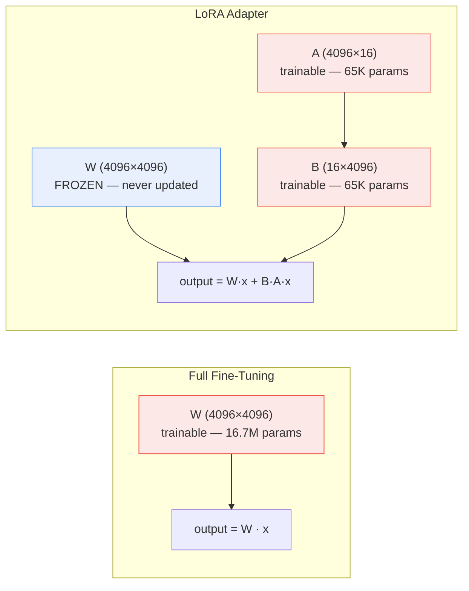
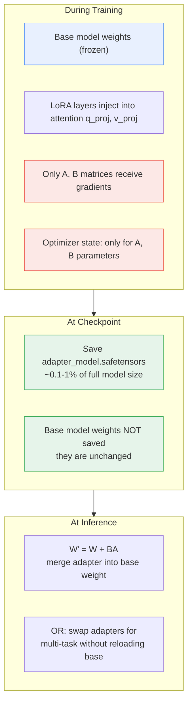

**TL;DR:** When you fine-tune a 7B-parameter model, do you really need to update — and store — all 7 billion weights? No. LoRA (Low-Rank Adaptation) freezes the original model weights entirely and injects tiny trainable low-rank matrices into specific layers, producing an adapter checkpoint that is typically 0.1-1% the size of the full model. Hugging Face's `Trainer` integrates this transparently through PEFT's `PeftAdapterMixin` — when it detects a PEFT model, it saves only adapter weights, skips loading full model weights on checkpoint resume, and reports the correct parameter count. The base model never moves; only the adapter does.

---

## 1. The Engineering Problem

Fine-tuning a large language model means updating its weights so it performs better on a specific task — your company's support tickets, your domain's terminology, your product's style. The naive approach is full fine-tuning: load the entire model, update every parameter during training, and save the complete updated weight file as the new model.

This creates three concrete production problems:

1. **Storage and transfer costs scale linearly with model size.** A 7B-parameter model in FP16 is roughly 14 GB. Every checkpoint during training saves another 14 GB. If you fine-tune for 3 epochs with checkpoints every 500 steps, you are writing hundreds of gigabytes — most of it unchanged weights copied verbatim from the base model.

2. **GPU memory must hold the full optimizer state for every trainable parameter.** AdamW maintains two state tensors per parameter (first and second moment estimates), each the same size as the parameter itself. For a 7B model, that is 7B parameters × 3 copies (weight + m + v) × 4 bytes each ≈ 84 GB of VRAM just for optimizer state — before activations or gradients.

3. **Catastrophic forgetting is a real risk.** When every weight is trainable, the model has the capacity to drift far from its pre-trained knowledge. The more parameters you update, the easier it is to overfit on a small fine-tuning dataset and lose general capabilities.

What is needed is a way to adapt the model's behavior for a specific task while changing as few parameters as possible — ideally a fixed, tiny set that does not scale with the base model's size.

## 2. The Technical Solution

LoRA (Hu et al., 2021) resolves this by exploiting a low-rank decomposition of the weight update. Instead of learning a full ΔW matrix (d × d), it decomposes the update into two small matrices: W + BA, where B is d × r and A is r × d, and r is the LoRA rank (typically 8-64). During forward pass, the original weight W is frozen — it never changes — and only A and B are trained.

The parameter savings are dramatic. For a 4096 × 4096 weight matrix with rank r=16:
- Full fine-tuning: 4096 × 4096 = 16,777,216 trainable parameters
- LoRA: (4096 × 16) + (16 × 4096) = 131,072 trainable parameters — a 128x reduction



Three core truths this diagram isolates:

- **The base model weights (W) are completely frozen during training.** Only the low-rank matrices A and B receive gradients. This means optimizer state, gradients, and weight updates are proportional to r, not to d.
- **At inference time, the adapter can be merged into the base weight** (W' = W + BA), producing a single matrix with no runtime overhead — or kept separate for multi-adapter switching.
- **The rank r is a hyperparameter you control.** Lower rank means fewer parameters and faster training but less adaptation capacity; higher rank approaches full fine-tuning's expressiveness.



## 3. The Clean Example

A minimal LoRA fine-tuning loop — no Trainer, no PEFT framework, just the mechanism isolated:

```python
import torch
from peft import LoraConfig, get_peft_model
from transformers import AutoModelForCausalLM, AutoTokenizer

# Load the base model — all 7B parameters frozen by default
base_model = AutoModelForCausalLM.from_pretrained("meta-llama/Llama-2-7b-hf")

# Configure LoRA: target the attention projection layers with rank 16
lora_config = LoraConfig(
    r=16,                          # rank — the bottleneck dimension
    lora_alpha=32,                 # scaling factor (alpha / r)
    target_modules=["q_proj", "v_proj"],  # which layers get adapters
    lora_dropout=0.05,
    bias="none",
)

# Inject LoRA adapters — only q_proj and v_proj get trainable A, B matrices
model = get_peft_model(base_model, lora_config)

# Check how many parameters are actually trainable
model.print_trainable_parameters()
# trainable params: 4,194,304 || all params: 6,746,804,224 || trainable%: 0.0622

# Training loop proceeds normally — only A, B matrices accumulate gradients
optimizer = torch.optim.AdamW(model.parameters(), lr=2e-5)

for batch in dataloader:
    outputs = model(**batch)
    loss = outputs.loss
    loss.backward()        # gradients only flow through LoRA paths
    optimizer.step()
    optimizer.zero_grad()

# Saving produces ONLY adapter weights — not the 14 GB base model
model.save_pretrained("./my-adapter")
# Output: adapter_model.safetensors (~16 MB) + adapter_config.json
```

The critical observation: `model.print_trainable_parameters()` reports 0.06% trainable — the other 99.94% is frozen. When `save_pretrained` runs, it writes only the adapter tensors. The base model weights exist only on disk from the original download and are never duplicated.

## 4. Production Reality (from the real repo)

Hugging Face's `Trainer` class in `huggingface/transformers` integrates PEFT as a first-class concern — not as a bolted-on afterthought. The integration touches model inspection, checkpoint saving, checkpoint loading, and parameter counting:

```
src/transformers/
├── trainer.py                          — Trainer: training loop, PEFT-aware save/load
├── training_args.py                    — TrainingArguments: use_cache for PEFT
├── integrations/peft.py                — PeftAdapterMixin: load_adapter, add_adapter, set_adapter
└── utils/trainer_utils.py              — _is_peft_model, unwrap_peft_model helpers
```

### Trainer detects PEFT models and inspects the base model's signature

When the Trainer needs to know which columns the model's `forward()` accepts (to strip unused dataset columns), it unwraps the PeftModel wrapper to inspect the underlying base model — because the PeftModel's own signature includes adapter-specific fields that are not part of the dataset:

```python
def _set_signature_columns_if_needed(self) -> None:
    """Populate _signature_columns from the model's forward signature if not already set."""
    if self._signature_columns is None:
        model_to_inspect = self.model
        if _is_peft_model(self.model):
            if hasattr(self.model, "get_base_model"):
                model_to_inspect = self.model.get_base_model()
            else:
                # PeftMixedModel do not provide a get_base_model method
                model_to_inspect = self.model.base_model.model
        signature = inspect.signature(model_to_inspect.forward)
        self._signature_columns = list(signature.parameters.keys())
        self._signature_columns += list(set(["label", "label_ids"] + self.label_names))
```

### Trainer saves only adapter weights on checkpoint

The `_load_from_checkpoint` method distinguishes adapter checkpoints from full model checkpoints by looking for `ADAPTER_WEIGHTS_NAME` (`adapter_model.safetensors`) — and when resuming training, it loads only the adapter via PEFT's `load_adapter` rather than doing a full model weight load:

```python
def _load_from_checkpoint(self, resume_from_checkpoint: str, model: nn.Module | None = None) -> None:
    adapter_weights_file = os.path.join(resume_from_checkpoint, ADAPTER_WEIGHTS_NAME)
    adapter_safe_weights_file = os.path.join(resume_from_checkpoint, ADAPTER_SAFE_WEIGHTS_NAME)
    # ... (FSDP and full-weight checkpoint logic omitted for clarity)

    # if multiple adapters exist, they get saved in sub directories
    adapter_subdirs = (
        [
            folder_name
            for folder_name in os.listdir(resume_from_checkpoint)
            if os.path.isdir(os.path.join(resume_from_checkpoint, folder_name))
            and (
                os.path.isfile(os.path.join(resume_from_checkpoint, folder_name, ADAPTER_WEIGHTS_NAME))
                or os.path.isfile(os.path.join(resume_from_checkpoint, folder_name, ADAPTER_SAFE_WEIGHTS_NAME))
            )
        ]
        if os.path.isdir(resume_from_checkpoint)
        else []
    )

    # ... after other loading paths ...

    elif _is_peft_model(model):
        # If training a model using PEFT, assume that adapter have been saved properly.
        if hasattr(model, "active_adapters") and hasattr(model, "load_adapter"):
            try:
                active_adapters = model.active_adapters
                if len(active_adapters) > 1:
                    logger.warning("Multiple active adapters detected will only consider the first adapter")
                active_adapter = active_adapters[0]
                if adapter_subdirs:
                    for subdir_name in adapter_subdirs:
                        peft_id = os.path.join(resume_from_checkpoint, subdir_name)
                        model.load_adapter(peft_id, subdir_name, is_trainable=(subdir_name == active_adapter))
                    model.set_adapter(active_adapter)
                else:
                    model.load_adapter(resume_from_checkpoint, active_adapter, is_trainable=True)
            except Exception:
                logger.warning(
                    f"Could not load adapter model, make sure to have PEFT >= {MIN_PEFT_VERSION} installed"
                )
```

### DeepSpeed excludes frozen PEFT parameters when saving

Under DeepSpeed ZeRO-3, the Trainer checks whether the save method supports `exclude_frozen_parameters` — and when the model is a PEFT model, it passes `True`, so the frozen base model weights are not written to the checkpoint at all:

```python
elif self.is_deepspeed_enabled:
    accept_exclude_frozen_parameters = "exclude_frozen_parameters" in set(
        inspect.signature(self.model_wrapped.save_checkpoint).parameters.keys()
    )
    if accept_exclude_frozen_parameters and _is_peft_model(self.model):
        self.model_wrapped.save_checkpoint(output_dir, exclude_frozen_parameters=True)
    else:
        self.model_wrapped.save_checkpoint(output_dir)
```

### PeftAdapterMixin handles adapter lifecycle

The `PeftAdapterMixin` class (mixed into `PreTrainedModel`) provides the full adapter lifecycle — loading, switching, merging, and hot-swapping. The `load_adapter` method handles everything from finding the adapter config file on the Hub to loading sharded adapter weights with tensor-parallel support:

```python
def load_adapter(
    self,
    peft_model_id: str | None = None,
    adapter_name: str | None = None,
    peft_config: dict[str, Any] | None = None,
    adapter_state_dict: dict[str, "torch.Tensor"] | None = None,
    low_cpu_mem_usage: bool = False,
    is_trainable: bool = False,
    hotswap: bool | Literal["auto"] = "auto",
    local_files_only: bool = False,
    adapter_kwargs: dict[str, Any] | None = None,
    load_config: Optional["LoadStateDictConfig"] = None,
    **kwargs,
) -> "LoadStateDictInfo":
    adapter_name = adapter_name if adapter_name is not None else "default"
    # ...
    from peft import PeftConfig, inject_adapter_in_model

    if peft_config is None:
        adapter_config_file = find_adapter_config_file(peft_model_id, **load_config.download_kwargs)
        peft_config = PeftConfig.from_pretrained(peft_model_id, **load_config.download_kwargs)

    peft_weight_conversions = build_peft_weight_mapping(weight_conversions, adapter_name, peft_config=peft_config)

    if not hotswap:
        # Create and add fresh new adapters into the model, unless the weights are hotswapped
        inject_adapter_in_model(peft_config, self, adapter_name)

    if peft_config.inference_mode:
        self.eval()
        for module in self.modules():
            if isinstance(module, BaseTunerLayer):
                module.requires_grad_(False)
```

What this reveals that tutorials cannot:

- **`inject_adapter_in_model` is the moment the frozen model gets trainable low-rank matrices injected into specific layers.** It modifies the model in place — the original weights stay frozen, and new small matrices (A, B) are created alongside them.
- **`hotswap=True` replaces an existing adapter's weights in-place without reloading the base model** — critical when using `torch.compile`, because loading a new adapter normally would trigger recompilation. Hotswapping avoids this.
- **`inference_mode` freezes all adapter parameters and calls `model.eval()`** — when loading an adapter for inference only (not training), gradients are disabled on the adapter parameters too, saving memory.

## 5. Review Checklist

- **Is the adapter rank (`r`) appropriate for the task?** Too low (r=1-4) may not capture enough task-specific behavior; too high (r=128+) approaches full fine-tuning's parameter count and memory cost. For most instruction-tuning tasks, r=16-64 is the practical range.

- **Are `target_modules` pointing to the right layers?** The default for most models is attention projections (`q_proj`, `v_proj`). Adding `k_proj`, `o_proj`, and MLP layers (`gate_proj`, `up_proj`, `down_proj`) increases adapter capacity but also increases parameter count — verify that the trainable percentage still makes sense for your use case.

- **Does `lora_alpha` / `r` produce the expected effective learning rate?** LoRA scales the adapter output by `alpha / r`. A common convention is `alpha = 2 * r`, but this interacts with your base learning rate — if you double the rank without adjusting alpha, the effective contribution of each adapter changes.

- **When resuming from a PEFT checkpoint, does the Trainer actually load only adapter weights?** The `_load_from_checkpoint` code explicitly checks for `ADAPTER_WEIGHTS_NAME` and uses `model.load_adapter()` — if this path is not taken (e.g., if the checkpoint was saved with `save_only_model=True` under a framework that did not recognize PEFT), you may end up loading stale or mismatched weights.

- **Under DeepSpeed ZeRO-3, is `exclude_frozen_parameters=True` actually being passed?** The Trainer checks whether the method signature supports it — if your DeepSpeed version predates this parameter, frozen base model weights will be written to the checkpoint unnecessarily.

- **Is `use_cache` disabled during training when using PEFT?** The `TrainingArguments` docstring notes this explicitly: "For training, this is usually not needed apart from some PEFT methods that uses `past_key_values`." Enabling cache during training wastes memory and can cause incorrect gradient computation.

## 6. FAQ

**Q: Why does LoRA only target attention projection layers and not every layer in the model?**
A: The Hu et al. (2021) paper found that the weight update matrices during fine-tuning exhibit low-rank structure — meaning the update can be well-approximated by a product of two small matrices. Attention projections (`q_proj`, `v_proj`) are where the model's "reasoning" lives, so adapting these layers captures most of the task-specific behavior. Adding adapters to every layer increases parameter count without proportional accuracy gains for most tasks.

**Q: Can I merge a LoRA adapter back into the base model weights to get a single standalone model?**
A: Yes — `model.merge_and_unload()` in PEFT computes W' = W + BA for every adapted layer, producing a model with no adapter overhead. This is useful for deployment where you want a single weight file without the PEFT runtime. Note that you cannot unmerge after this operation.

**Q: What happens if I load two different LoRA adapters trained on different tasks?**
A: PEFT supports multi-adapter inference via `model.set_adapter(["adapter_a", "adapter_b"])`. The outputs from both adapters are combined (with configurable alpha weights). This lets you serve multiple tasks from a single base model by swapping adapters, or blend behaviors by running multiple adapters simultaneously.

**Q: Does LoRA have any runtime inference overhead compared to the base model?**
A: When adapters are kept separate (not merged), yes — the forward pass computes W·x + B·A·x instead of just W·x, adding two extra matrix multiplications. For small ranks (r=8-16), this is typically 1-3% latency overhead. When merged into the base weight, there is zero overhead.

**Q: How does the Trainer know whether a model is a PEFT model?**
A: The `_is_peft_model()` utility (imported from `trainer_utils`) checks whether the model has the `_hf_peft_config_loaded` attribute — this flag is set by `PeftAdapterMixin` when any adapter is loaded. If the model is wrapped by PEFT, the Trainer unwraps it via `unwrap_peft_model()` before inspecting forward signatures, counting parameters, or saving checkpoints.

**Q: Can I use LoRA with quantized models (e.g., 4-bit or 8-bit)?**
A: Yes — this is the QLoRA approach (Dettmers et al., 2023). Load the base model in 4-bit with `bitsandbytes` (`load_in_4bit=True`), then apply LoRA adapters as usual. The frozen base model weights are quantized (saving memory), and the trainable adapter matrices remain in FP16/BF16. This allows fine-tuning a 7B model on a single 24 GB GPU — something impossible with full fine-tuning.

---

## Source

- **Concept:** LoRA fine-tuning — why adapter checkpoints are orders of magnitude smaller than full model weights
- **Domain:** genai
- **Repo:** [huggingface/transformers](https://github.com/huggingface/transformers) → [`src/transformers/trainer.py`](https://github.com/huggingface/transformers/blob/main/src/transformers/trainer.py) (PEFT-aware checkpoint save/load, `_set_signature_columns_if_needed`, DeepSpeed frozen-parameter exclusion), [`src/transformers/integrations/peft.py`](https://github.com/huggingface/transformers/blob/main/src/transformers/integrations/peft.py) (`PeftAdapterMixin`, `load_adapter`, `add_adapter`, `set_adapter`, `enable_peft_hotswap`), [`src/transformers/training_args.py`](https://github.com/huggingface/transformers/blob/main/src/transformers/training_args.py) (`use_cache` documentation for PEFT, `neftune_noise_alpha` for PeftModel support)
