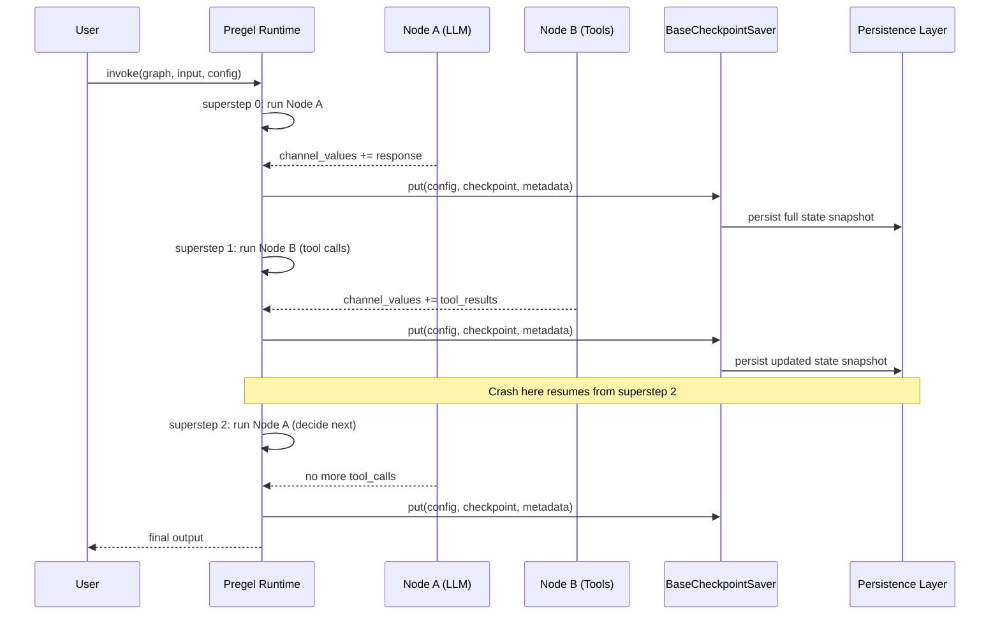

**TL;DR:** Every agent superstep (LLM call, tool execution, conditional branch) must produce a persistent snapshot of the full graph state — not just a final result. LangGraph enforces this via `BaseCheckpointSaver`, which stores a `Checkpoint` TypedDict (channel values, channel versions, per-node version tracking) after every superstep. This means a crash at superstep 47 out of 100 resumes from superstep 47, not from scratch; time-travel debugging works because every intermediate state exists; and human-in-the-loop interrupts can pause mid-graph and resume later because the state is durable. The checkpointer is not an optional feature bolted onto LangGraph — it is the foundation that makes durable agents possible.

---

## 1. The Engineering Problem

Most agent frameworks treat state as ephemeral. You run the agent loop, it produces a final answer, and the intermediate state lives only in memory. This works for demos. It fails in production for four concrete reasons:

1. **No crash recovery.** If your agent process dies after superstep 47 of a 100-step plan, you restart from scratch. The user waits again for 47 LLM calls that already succeeded.
2. **No time-travel debugging.** You cannot inspect what the agent "knew" at superstep 12, because that state was never persisted. Post-mortem analysis of a bad agent decision requires the exact intermediate state, not just the final output.
3. **No human-in-the-loop.** An approval checkpoint ("should the agent execute this API call?") requires the ability to pause mid-execution and resume later. Without persistent state, pause means restart.
4. **No fork/replay.** Debugging an agent often means re-running from a specific point with a different tool or LLM. Without snapshots, "re-run from superstep 20" is impossible because superstep 20's state no longer exists.

The naive approach — save state only at the end — captures nothing. The correct approach is to snapshot after every superstep: every node execution, every conditional branch, every tool call result. LangGraph's `BaseCheckpointSaver` is the contract that makes this work.

## 2. The Technical Solution

LangGraph's Pregel runtime executes a graph as a sequence of supersteps. In each superstep, every node whose input channels have been updated runs once, reads the full shared state, and writes deltas back. The checkpointer hooks into this loop: after every superstep completes, it serializes the full `Checkpoint` — all channel values, all channel versions, and the per-node version tracking that determines which nodes need to run next — and stores it.



The `Checkpoint` TypedDict is the core data structure. It captures the full graph state at a point in time:

```python
# From libs/checkpoint/langgraph/checkpoint/base/__init__.py
class Checkpoint(TypedDict):
    v: int                          # format version (currently 2)
    id: str                         # unique, monotonically increasing
    ts: str                         # ISO 8601 timestamp
    channel_values: dict[str, Any]  # snapshot of all channel values
    channel_versions: ChannelVersions  # version counter per channel
    versions_seen: dict[str, ChannelVersions]  # per-node: which channel versions it saw
    updated_channels: list[str] | None  # channels modified this step
```

The version tracking fields (`channel_versions`, `versions_seen`) are what make the Pregel loop efficient. When a node writes to a channel, that channel's version increments. When a node executes, it records which versions it saw. On the next superstep, only nodes whose input channels have a newer version than what they last saw will execute. This is the mechanism that prevents redundant LLM calls and ensures exactly-once node execution per superstep.

The saver contract itself defines the persistence API. The critical methods are `put` (save a checkpoint after a superstep), `put_writes` (save intermediate writes within a superstep), and `get_tuple` (restore state for resume or replay):

```python
# From libs/checkpoint/langgraph/checkpoint/base/__init__.py
class BaseCheckpointSaver(Generic[V]):
    serde: SerializerProtocol = JsonPlusSerializer()

    def put(
        self,
        config: RunnableConfig,
        checkpoint: Checkpoint,
        metadata: CheckpointMetadata,
        new_versions: ChannelVersions,
    ) -> RunnableConfig:
        """Store a checkpoint with its configuration and metadata."""
        raise NotImplementedError

    def put_writes(
        self,
        config: RunnableConfig,
        writes: Sequence[tuple[str, Any]],
        task_id: str,
        task_path: str = "",
    ) -> None:
        """Store intermediate writes linked to a checkpoint."""
        raise NotImplementedError

    def get_tuple(self, config: RunnableConfig) -> CheckpointTuple | None:
        """Fetch a checkpoint tuple using the given configuration."""
        raise NotImplementedError
```

The `CheckpointMetadata` carries source information (`"input"`, `"loop"`, `"update"`, `"fork"`) that tells you *why* this checkpoint exists — whether it was created by user input, by the Pregel loop, by a manual state update, or by a fork operation:

```python
class CheckpointMetadata(TypedDict, total=False):
    source: Literal["input", "loop", "update", "fork"]
    step: int
    parents: dict[str, str]
    run_id: str
```

Here is how the full checkpoint lifecycle flows through a multi-step agent execution:

```mermaid
flowchart LR
    subgraph Superstep_N["Superstep N"]
        INVOKE["invoke nodes with dirty channels"]
        WRITES["put_writes: save task outputs"]
        CP["put: snapshot full Checkpoint"]
    end
    subgraph Superstep_N1["Superstep N+1"]
        LOAD["get_tuple: load latest checkpoint"]
        DIRTY["compute dirty channels"]
        INVOKE1["invoke nodes with dirty channels"]
        WRITES1["put_writes: save task outputs"]
        CP1["put: snapshot full Checkpoint"]
    end

    CP -->|"persisted"| STORE[("Persistence Store")]
    STORE -->|"loaded"| LOAD

    INVOKE --> WRITES --> CP
    LOAD --> DIRTY --> INVOKE1 --> WRITES1 --> CP1

    classDef storage fill:#e8f5e9,stroke:#4caf50
    class STORE storage
```



The `CheckpointTuple` bundles everything together for retrieval: the config (thread ID + checkpoint ID), the checkpoint itself, metadata, a pointer to the parent checkpoint, and any pending writes that haven't been consolidated yet:

```python
class CheckpointTuple(NamedTuple):
    config: RunnableConfig
    checkpoint: Checkpoint
    metadata: CheckpointMetadata
    parent_config: RunnableConfig | None = None
    pending_writes: list[PendingWrite] | None = None
```

## 3. Clean Example

Here is a minimal example showing how the checkpointer enables crash recovery and time-travel. The key point: you pass the same `thread_id` across invocations, and the checkpointer handles state continuity automatically.

```python
from langgraph.graph import StateGraph, MessagesState
from langgraph.checkpoint.memory import MemorySaver

# Define a simple two-node graph
builder = StateGraph(MessagesState)
builder.add_node("agent", call_llm)
builder.add_node("tools", execute_tools)
builder.add_edge("__start__", "agent")
builder.add_conditional_edges("agent", should_continue)
builder.add_edge("tools", "agent")

# Compile WITH a checkpointer — this enables persistence
checkpointer = MemorySaver()
graph = builder.compile(checkpointer=checkpointer)

# Every invocation shares state via thread_id
config = {"configurable": {"thread_id": "demo-thread"}}

# First invocation — runs supersteps 0, 1, 2, ...
result1 = graph.invoke({"messages": [("user", "search for weather")]}, config)

# If the process crashes here, you can resume:
# Just call invoke again with the SAME config
result2 = graph.invoke({"messages": [("user", "now book a flight")]}, config)
# LangGraph loads the checkpoint from superstep N, not from scratch
```

## 4. Production Reality

The `AsyncSqliteSaver` shows what a real checkpointer implementation looks like. The `setup` method creates two tables: `checkpoints` (one row per snapshot, keyed by thread ID + checkpoint namespace + checkpoint ID) and `writes` (one row per intermediate write, linked to its parent checkpoint):

From `libs/checkpoint-sqlite/langgraph/checkpoint/sqlite/aio.py`:

```python
async def setup(self) -> None:
    """Set up the checkpoint database asynchronously."""
    async with self.lock:
        if self.is_setup:
            return
        await _ensure_connected(self.conn)
        async with self.conn.executescript(
            """
            PRAGMA journal_mode=WAL;
            CREATE TABLE IF NOT EXISTS checkpoints (
                thread_id TEXT NOT NULL,
                checkpoint_ns TEXT NOT NULL DEFAULT '',
                checkpoint_id TEXT NOT NULL,
                parent_checkpoint_id TEXT,
                type TEXT,
                checkpoint BLOB,
                metadata BLOB,
                PRIMARY KEY (thread_id, checkpoint_ns, checkpoint_id)
            );
            CREATE TABLE IF NOT EXISTS writes (
                thread_id TEXT NOT NULL,
                checkpoint_ns TEXT NOT NULL DEFAULT '',
                checkpoint_id TEXT NOT NULL,
                task_id TEXT NOT NULL,
                idx INTEGER NOT NULL,
                channel TEXT NOT NULL,
                type TEXT,
                value BLOB,
                PRIMARY KEY (thread_id, checkpoint_ns, checkpoint_id, task_id, idx)
            );
            """
        ):
            await self.conn.commit()
        self.is_setup = True
```

The `aput` method is where the actual snapshot write happens. It serializes the `Checkpoint` via the `serde` protocol and stores it as a blob with its metadata. The `INSERT OR REPLACE` ensures that re-running a superstep (e.g., after a retry) overwrites the old snapshot rather than creating a duplicate:

```python
async def aput(
    self,
    config: RunnableConfig,
    checkpoint: Checkpoint,
    metadata: CheckpointMetadata,
    new_versions: ChannelVersions,
) -> RunnableConfig:
    await self.setup()
    thread_id = config["configurable"]["thread_id"]
    checkpoint_ns = config["configurable"]["checkpoint_ns"]
    type_, serialized_checkpoint = self.serde.dumps_typed(checkpoint)
    serialized_metadata = json.dumps(
        get_checkpoint_metadata(config, metadata), ensure_ascii=False
    ).encode("utf-8", "ignore")
    async with (
        self.lock,
        self.conn.execute(
            "INSERT OR REPLACE INTO checkpoints "
            "(thread_id, checkpoint_ns, checkpoint_id, "
            "parent_checkpoint_id, type, checkpoint, metadata) "
            "VALUES (?, ?, ?, ?, ?, ?, ?)",
            (
                str(config["configurable"]["thread_id"]),
                checkpoint_ns,
                checkpoint["id"],
                config["configurable"].get("checkpoint_id"),
                type_,
                serialized_checkpoint,
                serialized_metadata,
            ),
        ),
    ):
        await self.conn.commit()
    return {
        "configurable": {
            "thread_id": thread_id,
            "checkpoint_ns": checkpoint_ns,
            "checkpoint_id": checkpoint["id"],
        }
    }
```

The `parent_checkpoint_id` column is what makes the parent chain walkable. When you load a checkpoint, you can traverse backward through parent pointers to reconstruct the full history of a thread — or to find the nearest ancestor snapshot for delta channel reconstruction. The `aget_tuple` method uses this to rebuild the `parent_config` for the `CheckpointTuple`:

```python
if value := await cur.fetchone():
    (
        thread_id,
        checkpoint_id,
        parent_checkpoint_id,
        type,
        checkpoint,
        metadata,
    ) = value
    # ...
    return CheckpointTuple(
        config,
        self.serde.loads_typed((type, checkpoint)),
        cast(
            CheckpointMetadata,
            (json.loads(metadata) if metadata is not None else {}),
        ),
        (
            {
                "configurable": {
                    "thread_id": thread_id,
                    "checkpoint_ns": checkpoint_ns,
                    "checkpoint_id": parent_checkpoint_id,
                }
            }
            if parent_checkpoint_id
            else None
        ),
        [
            (task_id, channel, self.serde.loads_typed((type, value)))
            async for task_id, channel, type, value in cur
        ],
    )
```

For production workloads, SQLite is replaced by `PostgresSaver` — the same contract, the same `Checkpoint` TypedDict, but with Postgres as the backing store for concurrent access, row-level locking, and TTL-based pruning. The `BaseCheckpointSaver` contract is the stable interface; the storage backend is swappable.

## 5. Review Checklist

- **Checkpointing is per-superstep, not per-run.** Every node execution produces a new snapshot. This is what makes crash recovery, time-travel, and human-in-the-loop possible — you can always resume from the last superstep, not just from the start.

- **`channel_versions` and `versions_seen` drive the Pregel loop.** A node only re-executes if its input channels have a newer version than what it last saw. This prevents redundant LLM calls and ensures exactly-once semantics within a superstep.

- **`CheckpointMetadata.source` tells you why a snapshot exists.** `"input"` for user invocations, `"loop"` for Pregel-internal snapshots, `"update"` for manual state mutations, `"fork"` for time-travel copies. This metadata is essential for debugging.

- **The parent chain is a linked list via `parent_checkpoint_id`.** Walking it gives you the full history of a thread. The `get_delta_channel_history` method uses this walk to reconstruct channel state from ancestors.

- **`put_writes` saves intermediate task outputs within a superstep.** If a superstep has multiple tasks (e.g., parallel tool calls), each task's writes are stored separately. The `WRITES_IDX_MAP` reserves negative indices for special writes (errors, interrupts, scheduled tasks) to avoid collisions.

- **The `serde` protocol is pluggable.** `JsonPlusSerializer` is the default, but `EncryptedSerializer` wraps it for at-rest encryption. The `with_allowlist` method constrains msgpack deserialization for tighter security.

- **SQLite is for development; Postgres is for production.** `AsyncSqliteSaver` warns about this in its docstring. The lock serialization and single-writer constraint of SQLite make it unsuitable for concurrent agent workloads.

## 6. FAQ

**Q: What is a "superstep" in LangGraph?**
A: A superstep is one iteration of the Pregel execution loop. In each superstep, every node whose input channels have changed since it last ran executes once, reads the full state, and writes deltas. A checkpointer snapshot is taken after every superstep completes.

**Q: Why snapshot after every superstep instead of at the end?**
A: Because "the end" is not predictable. A human-in-the-loop interrupt pauses mid-graph. A crash happens at an arbitrary point. A fork for debugging needs the exact state at a specific superstep. Only per-superstep snapshots guarantee that any interruption point has a resumable state.

**Q: How does the checkpointer know which channels changed?**
A: The `channel_versions` dict in the `Checkpoint` tracks a monotonically increasing version counter per channel. When a node writes to a channel, that channel's version increments. The `versions_seen` dict tracks which version each node last observed. Nodes with stale versions are marked dirty and re-executed.

**Q: What is `CheckpointMetadata.parent_config` used for?**
A: It points to the parent checkpoint (the one that came before this one in the thread's history). Walking this chain backward lets you reconstruct the full state history of a thread. The `get_delta_channel_history` method uses this walk to find ancestor snapshots and accumulated writes for delta channel reconstruction.

**Q: Can I swap the storage backend without changing my graph?**
A: Yes. The `BaseCheckpointSaver` is the contract. `MemorySaver` stores in a dict (development), `AsyncSqliteSaver` stores in SQLite (prototyping), and `PostgresSaver` stores in Postgres (production). Your graph code does not reference the storage backend — it only interacts with the checkpointer through the saver interface.

**Q: What happens to writes when a superstep has multiple parallel tasks?**
A: Each task gets a unique `task_id`. Its writes are stored separately via `put_writes` with an `idx` counter. The `WRITES_IDX_MAP` reserves indices -1 through -4 for special write types (errors, scheduled tasks, interrupts, resume signals) to avoid collisions with regular channel writes.

---

## Source

This post examines the checkpoint persistence implementation from the [langchain-ai/langgraph](https://github.com/langchain-ai/langgraph) repository. The primary files analyzed:

- [`libs/checkpoint/langgraph/checkpoint/base/__init__.py`](https://github.com/langchain-ai/langgraph/blob/main/libs/checkpoint/langgraph/checkpoint/base/__init__.py) — `BaseCheckpointSaver`, `Checkpoint` TypedDict, `CheckpointMetadata`, `CheckpointTuple`, `create_checkpoint`, `WRITES_IDX_MAP`
- [`libs/checkpoint-sqlite/langgraph/checkpoint/sqlite/aio.py`](https://github.com/langchain-ai/langgraph/blob/main/libs/checkpoint-sqlite/langgraph/checkpoint/sqlite/aio.py) — `AsyncSqliteSaver`, `setup`, `aput`, `aget_tuple`, `put_writes` implementation


