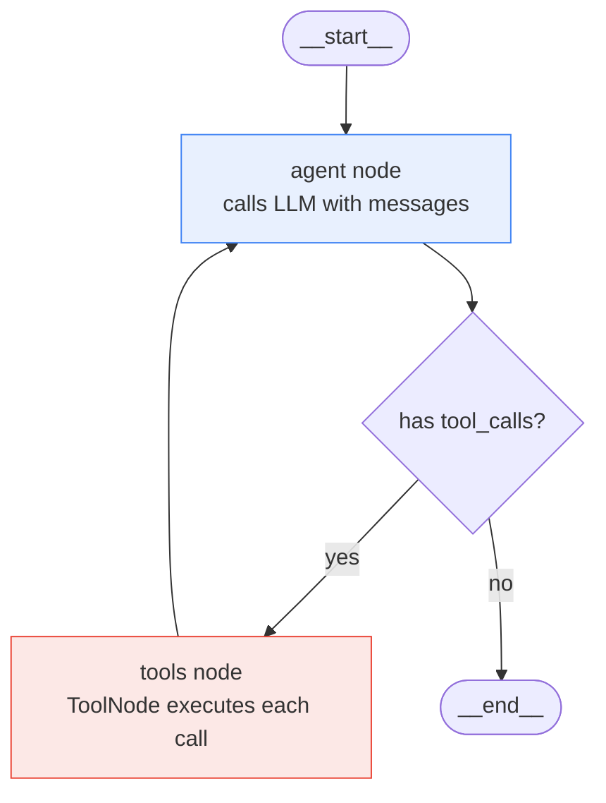
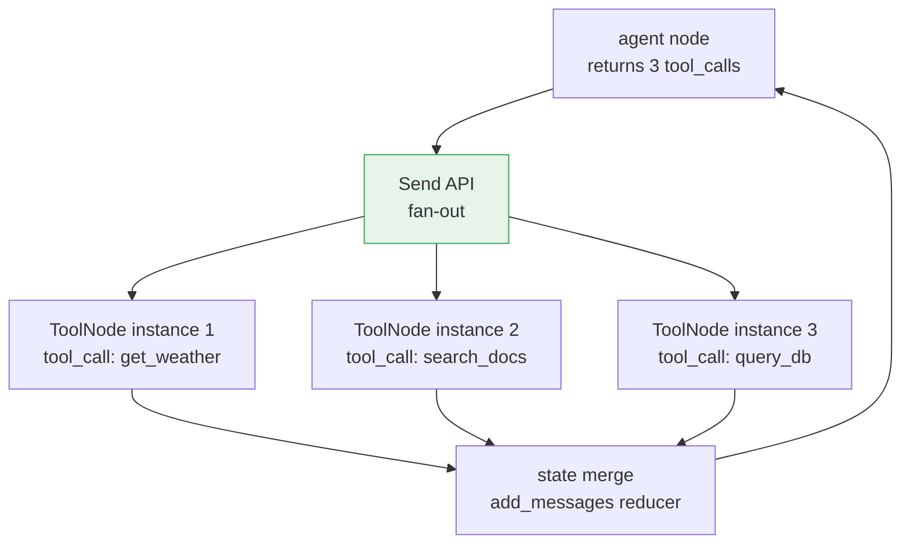

**TL;DR:** A ReAct agent alternates between an LLM deciding which tool to call (Reason + Act) and a runtime executing that tool and feeding the result back (Observe) — but a naive `while True` loop over tool calls has no checkpointing, no parallel tool dispatch, no interrupt-before-approval, and no recovery from mid-loop failures. LangGraph solves this by expressing the exact same loop as a `StateGraph` where the agent node, the tool node, and the conditional "should I keep going?" edge are first-class graph primitives — giving you persistence, human-in-the-loop, streaming, and replay for free, without writing a single loop.

> **In plain English (30 sec):** Code you already write — Map, function, API call, just bigger.

---

## 1. The Engineering Problem

The ReAct pattern (Yao et al., 2022) is deceptively simple: the LLM reasons about a user query, selects a tool, the runtime executes it, the result is appended to the conversation, and the LLM decides whether to call another tool or answer directly. A textbook implementation is a `while` loop:

```python
messages = [user_message]
while True:
    response = llm.invoke(messages)
    if not response.tool_calls:
        return response
    for call in response.tool_calls:
        result = execute_tool(call)
        messages.append(ToolMessage(result, call_id=call["id"]))
```

This works for demos. It fails in production for four concrete reasons:

1. **No persistence.** If the process crashes after the third tool call, you lose everything. There is no checkpoint to resume from.
2. **No parallel dispatch.** The `for call in response.tool_calls` loop executes tools sequentially. When the model requests three tool calls in one turn, you wait for all three serially.
3. **No human-in-the-loop.** There is no structural place to pause before executing a dangerous tool and ask for human approval. You would have to bolt this onto the loop with ad-hoc flags.
4. **No observability.** A `while` loop is opaque to tracing systems. You cannot stream intermediate state, replay a failed run from a specific step, or audit which tool call produced which result.

What is needed is not a better loop but a *graph* — a directed structure where each node is a typed function, each edge is a named transition, and the runtime manages state, checkpointing, and execution policy. That is what `StateGraph` provides.

## 2. The Technical Solution

LangGraph's ReAct agent is a two-node graph with a conditional cycle: an **agent** node that calls the LLM, and a **tools** node that executes tool calls. The agent node returns an `AIMessage`; if it contains `tool_calls`, the graph routes to the tools node, which executes them and routes back. If there are no tool calls, the graph terminates.



The key insight: the **state** is not a local variable — it is a `TypedDict` with a `messages` field that uses a reducer (`add_messages`) to append new messages without overwriting the full list. This means every node reads the full conversation history and writes only its delta, and the graph runtime merges the deltas automatically:

```python
from typing import Annotated, TypedDict
from langchain_core.messages import BaseMessage
from langgraph.graph.message import add_messages

class AgentState(TypedDict):
    messages: Annotated[list[BaseMessage], add_messages]
```

The `add_messages` reducer appends new messages by `id` — if a node returns a message with the same `id` as an existing one, it replaces it instead of duplicating. This is what makes tool-result injection idempotent.

### v2 Parallel Dispatch with Send

In v2 of `create_react_agent`, when the agent node returns multiple tool calls, the graph does not route to a single tools node. Instead, it uses LangGraph's `Send` API to dispatch each tool call as an *independent parallel task*:



Each `Send` carries a `ToolCallWithContext` payload — the tool call dict plus a snapshot of the current state — so each parallel instance has the context it needs without race conditions on shared state. The `add_messages` reducer on the `messages` field handles concurrent appends correctly because messages are identified by `id`, not by list index.

## 3. The Clean Example

The full ReAct loop distilled to its essence — no checkpointing, no streaming, no parallel dispatch. Just the two-node graph with a conditional cycle.

```python
from typing import Annotated, TypedDict
from langchain_core.messages import BaseMessage, AIMessage, ToolMessage
from langchain_core.tools import tool
from langchain_openai import ChatOpenAI
from langgraph.graph import StateGraph, END
from langgraph.graph.message import add_messages

class AgentState(TypedDict):
    messages: Annotated[list[BaseMessage], add_messages]

@tool
def get_weather(city: str) -> str:
    """Return current weather for a city."""
    return f"It's 72F and sunny in {city}"

model = ChatOpenAI(model="gpt-4o").bind_tools([get_weather])

def agent_node(state: AgentState) -> dict:
    response = model.invoke(state["messages"])
    return {"messages": [response]}

def tools_node(state: AgentState) -> dict:
    last_message = state["messages"][-1]
    results = []
    for call in last_message.tool_calls:
        result = get_weather.invoke(call["args"])
        results.append(ToolMessage(content=result, tool_call_id=call["id"]))
    return {"messages": results}

def should_continue(state: AgentState) -> str:
    last_message = state["messages"][-1]
    if isinstance(last_message, AIMessage) and last_message.tool_calls:
        return "tools"
    return END

graph = StateGraph(AgentState)
graph.add_node("agent", agent_node)
graph.add_node("tools", tools_node)
graph.set_entry_point("agent")
graph.add_conditional_edges("agent", should_continue, {"tools": "tools", END: END})
graph.add_edge("tools", "agent")

app = graph.compile()
result = app.invoke({"messages": [("user", "What's the weather in SF?")]})
```

This isolates the exact loop: agent node calls LLM, `should_continue` checks for tool calls, tools node executes and appends `ToolMessage`, graph routes back to agent. The `add_messages` reducer means the state grows by exactly the messages each node produces — no manual list management.

## 4. Production Reality (from the real repo)

Now let's look at how `langchain-ai/langgraph` implements this in production — with the full complexity that a real agent framework requires.

### create_react_agent: The Graph Wiring

From `libs/prebuilt/langgraph/prebuilt/chat_agent_executor.py`:

```python
def create_react_agent(
    model: str | LanguageModelLike | Callable,
    tools: Sequence[BaseTool | Callable | dict[str, Any]] | ToolNode,
    *,
    prompt: Prompt | None = None,
    response_format: StructuredResponseSchema | None = None,
    pre_model_hook: RunnableLike | None = None,
    post_model_hook: RunnableLike | None = None,
    state_schema: StateSchemaType | None = None,
    checkpointer: Checkpointer | None = None,
    interrupt_before: list[str] | None = None,
    interrupt_after: list[str] | None = None,
    version: Literal["v1", "v2"] = "v2",
    ...
) -> CompiledStateGraph:
    """Creates an agent graph that calls tools in a loop until a
    stopping condition is met."""
    # ...
    workflow = StateGraph(
        state_schema=state_schema or AgentState,
        context_schema=context_schema,
    )
    workflow.add_node(
        "agent",
        RunnableCallable(call_model, acall_model),
        input_schema=input_schema,
    )
    workflow.add_node("tools", tool_node)
    workflow.set_entry_point(entrypoint)
    workflow.add_conditional_edges("agent", should_continue, path_map=agent_paths)
    workflow.add_edge("tools", entrypoint)
    return workflow.compile(checkpointer=checkpointer, ...)
```

The entire ReAct loop is expressed as graph topology — not as a Python loop. The `should_continue` function is the conditional edge router:

```python
def should_continue(state: StateSchema) -> str | list[Send]:
    messages = _get_state_value(state, "messages")
    last_message = messages[-1]
    if not isinstance(last_message, AIMessage) or not last_message.tool_calls:
        return END
    else:
        if version == "v1":
            return "tools"
        elif version == "v2":
            return [
                Send("tools", ToolCallWithContext(
                    __type="tool_call_with_context",
                    tool_call=call,
                    state=state,
                ))
                for call in last_message.tool_calls
            ]
```

Key production details:
- **`version="v2"` uses `Send` for parallel dispatch.** Each tool call becomes an independent task. This is not an optimization bolted on later — it is the default graph topology.
- **`pre_model_hook` and `post_model_hook`** let you inject message trimming, guardrails, or human-in-the-loop logic without modifying the agent loop itself. The hooks are graph nodes wired between the core agent and tools nodes.
- **`remaining_steps`** prevents infinite loops. The agent checks `remaining_steps < 2` before calling the model again, and returns a graceful "need more steps" message instead of raising `GraphRecursionError`.

### ToolNode: Parallel Execution with Error Handling

From `libs/prebuilt/langgraph/prebuilt/tool_node.py`:

```python
class ToolNode(RunnableCallable):
    """A node for executing tools in LangGraph workflows.
    Handles parallel execution, error handling, state injection."""
    name: str = "tools"

    def __init__(
        self,
        tools: Sequence[BaseTool | Callable],
        *,
        name: str = "tools",
        handle_tool_errors: bool | str | Callable[..., str]
                    | type[Exception] | tuple[type[Exception], ...]
                    = _default_handle_tool_errors,
        messages_key: str = "messages",
        wrap_tool_call: ToolCallWrapper | None = None,
    ) -> None:
        super().__init__(self._func, self._afunc, name=name, tags=tags, trace=False)
        self._tools_by_name: dict[str, BaseTool] = {}
        self._injected_args: dict[str, _InjectedArgs] = {}
        for tool in tools:
            if not isinstance(tool, BaseTool):
                tool_ = create_tool(cast("type[BaseTool]", tool))
            else:
                tool_ = tool
            self._tools_by_name[tool_.name] = tool_
            self._injected_args[tool_.name] = _get_all_injected_args(tool_)
```

When `ToolNode` receives a `ToolCallWithContext` (from the `Send` API in v2), it extracts the tool call and executes it in isolation:

```python
def _parse_input(self, input):
    if isinstance(input, dict) and (
        input.get("__type") == "tool_call_with_context"
    ):
        input_with_ctx = cast("ToolCallWithContext", input)
        input_type = "tool_calls"
        return [input_with_ctx["tool_call"]], input_type
    # ...
```

The `handle_tool_errors` parameter defaults to `_default_handle_tool_errors`, which catches `ToolInvocationError` (invalid arguments from the LLM) and returns a descriptive error `ToolMessage` — but re-raises tool *execution* errors (bugs in your tool code). This is a deliberate design choice: the LLM gets a chance to fix its own bad arguments, but real runtime errors surface immediately.

### StateGraph: The Runtime Engine

From `libs/langgraph/langgraph/graph/state.py`:

```python
class StateGraph(Generic[StateT, ContextT, InputT, OutputT]):
    """A graph whose nodes communicate by reading and writing
    to a shared state.

    The signature of each node is `State -> Partial<State>`.
    Each state key can optionally be annotated with a reducer
    function that will be used to aggregate the values of that
    key received from multiple nodes."""

    def add_conditional_edges(
        self,
        source: str,
        path: Callable[..., Hashable | Sequence[Hashable]],
        path_map: dict[Hashable, str] | list[str] | None = None,
    ) -> Self:
        """Add a conditional edge from the starting node to any
        number of destination nodes."""
```

What these implementation details reveal that tutorials won't:

- **`State -> Partial<State>` is the node contract.** Every node reads the full state and returns only the keys it wants to update. The `add_messages` reducer handles the merge. This means nodes are fully decoupled — the agent node does not need to know what the tools node will return, and vice versa.
- **`ToolCallWithContext` carries a state snapshot.** When the `Send` API dispatches parallel tool calls, each gets a copy of the current state. This prevents race conditions where two tool nodes read stale or partially-updated state.
- **`_InjectedArgs` is built once at init.** The `ToolNode` inspects each tool's signature at construction time to determine which parameters need state injection (`InjectedState`), store injection (`InjectedStore`), or runtime injection. This avoids per-call reflection overhead.
- **`wrap_tool_call` is middleware, not inheritance.** You can intercept every tool call with a wrapper function without subclassing `ToolNode`. The wrapper receives a `ToolCallRequest` and an `execute` callable — call it for normal execution, skip it for caching, call it multiple times for retry.

## 5. Review Checklist

- **The ReAct loop is a graph, not a `while` loop.** The agent node, tools node, and conditional edge are first-class graph primitives. This gives you checkpointing, streaming, replay, and human-in-the-loop without bolting them onto a loop.

- **`add_messages` is a reducer, not a list append.** It identifies messages by `id` and replaces duplicates. This makes tool-result injection idempotent and concurrent appends safe.

- **v2 uses `Send` for parallel tool dispatch.** Each tool call from a single agent turn runs as an independent `ToolNode` task. If you need sequential execution, use `version="v1"`.

- **`handle_tool_errors` defaults to catching LLM mistakes only.** Tool *execution* errors (bugs in your code) are re-raised. Override this if you want different behavior, but understand the default split.

- **`remaining_steps` prevents infinite loops.** The agent checks remaining steps before each LLM call and returns a graceful message instead of raising `GraphRecursionError` when the budget is exhausted.

- **`pre_model_hook` is where message trimming lives.** If your conversation history exceeds the LLM's context window, trim it in a pre-model hook node — not inside the agent node. This keeps the agent node pure and testable.

## 6. FAQ

**Q: Why not just use a `while` loop with `openai` function calling?**
A: You can, and it works for demos. But a `while` loop gives you zero checkpointing (crash = restart from scratch), zero parallel dispatch (tools run sequentially), zero human-in-the-loop (no structural place to pause), and zero observability (no tracing, no replay). LangGraph's graph topology gives you all four as first-class features because the runtime manages state transitions instead of your loop managing variables.

**Q: What does the `add_messages` reducer actually do?**
A: When a node returns `{"messages": [new_msg]}`, the reducer appends `new_msg` to the existing `messages` list. If `new_msg` has the same `id` as an existing message, it *replaces* that message instead of appending. This makes tool-result injection idempotent — if the same `ToolMessage` is returned twice (e.g., after a replay), the state does not grow.

**Q: How does `Send` work for parallel tool calls?**
A: In v2, `should_continue` returns a list of `Send("tools", ToolCallWithContext(...))` objects — one per tool call. The LangGraph runtime creates a separate task for each `Send`, each with its own `ToolNode` invocation. Each task reads a state snapshot from the `ToolCallWithContext` payload, executes its tool, and writes its `ToolMessage` back. The `add_messages` reducer merges all results.

**Q: What is `ToolCallWithContext` and why is it needed?**
A: When `Send` dispatches parallel tool calls, each needs the current state (for `InjectedState` tools) without racing on shared state. `ToolCallWithContext` bundles the tool call dict with a state snapshot, so each parallel `ToolNode` instance has its own consistent view.

**Q: Can I add human-in-the-loop approval before tool execution?**
A: Yes — pass `interrupt_before=["tools"]` to `create_react_agent`. The graph will pause after the agent node selects tools but before the tools node executes them. A human can review the pending tool calls and approve, modify, or reject them via the LangGraph Platform API or Agent Inbox.

**Q: Why does `handle_tool_errors` re-raise execution errors but catch invocation errors?**
A: An invocation error means the LLM produced bad arguments (misspelled parameter, wrong type). The LLM can fix this if you send it the error message. An execution error means your tool code crashed (network timeout, bug). Surfacing this immediately lets you debug it, whereas sending it back to the LLM would waste tokens on a problem it cannot fix.

---

## Source

This post examines the ReAct agent implementation from the [langchain-ai/langgraph](https://github.com/langchain-ai/langgraph) repository. The primary files analyzed:

- [`libs/prebuilt/langgraph/prebuilt/chat_agent_executor.py`](https://github.com/langchain-ai/langgraph/blob/main/libs/prebuilt/langgraph/prebuilt/chat_agent_executor.py) — `create_react_agent`, `should_continue`, graph wiring, parallel dispatch via `Send`
- [`libs/prebuilt/langgraph/prebuilt/tool_node.py`](https://github.com/langchain-ai/langgraph/blob/main/libs/prebuilt/langgraph/prebuilt/tool_node.py) — `ToolNode`, `ToolCallWithContext`, `_InjectedArgs`, error handling, `wrap_tool_call` middleware
- [`libs/langgraph/langgraph/graph/state.py`](https://github.com/langchain-ai/langgraph/blob/main/libs/langgraph/langgraph/graph/state.py) — `StateGraph`, `add_conditional_edges`, `add_node`, `compile` with checkpointer support


