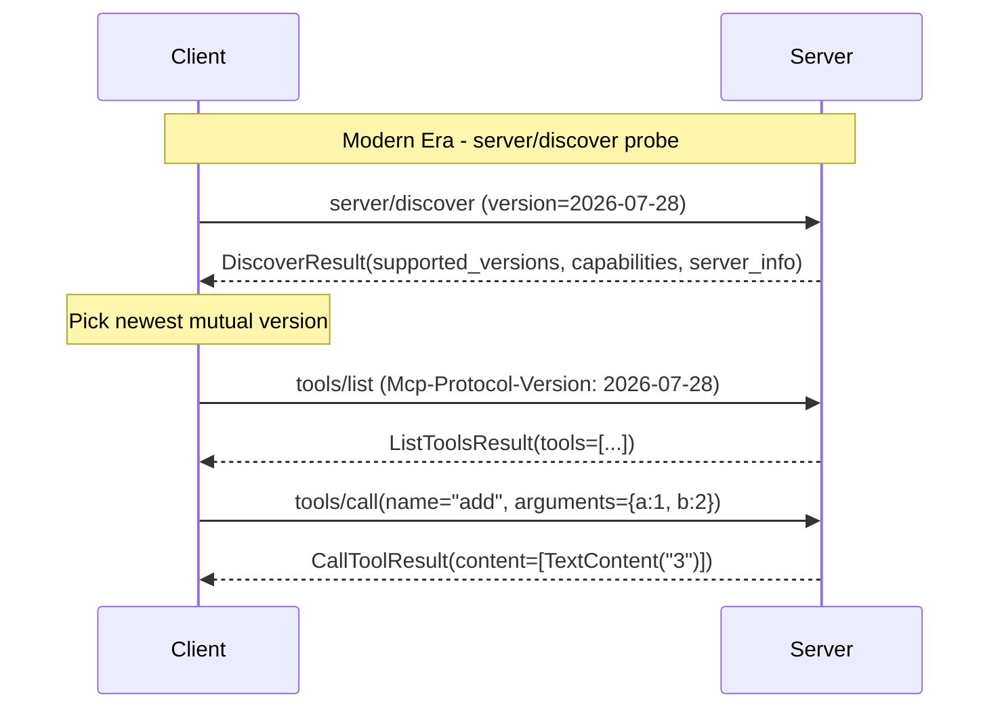

> **In plain English (30 sec):** Code you already write — Map, function, API call, just bigger.


**Why can't an LLM just call a function on a remote server and get an answer back?**

Because neither side knows what the other supports until they talk. An LLM host might support streaming, structured tool outputs, or subscription-based resource watching. A tool server might expose ten capabilities or two. Without an explicit negotiation phase, the client either over-requests (gets errors) or under-requests (misses features). MCP solves this with a structured handshake that negotiates protocol version, exchanges capability advertisements, and locks the connection to a shared understanding before any tool call is made.

## TL;DR

MCP is not a function-call format. It is a *protocol* with a mandatory initialization handshake, capability advertisement, and version negotiation. The official Python SDK (`modelcontextprotocol/python-sdk`) implements a dual-era server that serves both the legacy handshake path and the modern per-request-envelope era, with the first successful era-distinctive message locking the connection. Understanding the handshake is prerequisite to building any production MCP server or client.

## The Engineering Problem

When you expose a Python function over HTTP and let an LLM call it, you get a fragile ad-hoc integration. There are three concrete failure modes:

1. **Version skew.** The client sends a `tools/call` request with an argument shape the server's 2026 parser does not recognize. The server returns a cryptic validation error; the LLM retries with the same bad shape.

2. **Capability mismatch.** The server supports `subscriptions/listen` for real-time resource change notifications, but the client does not know that and falls back to polling. The client also never discovers that the server exposes a `prompts/list` endpoint.

3. **Feature negotiation blindness.** The server supports structured tool outputs with JSON Schema validation, but the client treats every response as unstructured text. The client sends `resources/subscribe` (deprecated in 2026-07-28) and gets a warning instead of an error, masking a real wiring problem.

A bare function definition (`def add(a, b)`) tells you nothing about any of these. MCP's handshake exists to solve all three simultaneously.

## The MCP Handshake

MCP defines two eras of connection setup. The first era-distinctive message to succeed locks the connection into that era for its lifetime.

### Legacy Handshake Era

The client sends `initialize` with its protocol version, capabilities, and client info. The server responds with its own version, capabilities, and server info. The client then sends `notifications/initialized` to confirm. This is a three-message sequence: request, response, notification.

### Modern Era (2026-07-28+)

The client sends `server/discover` with the proposed protocol version embedded in `_meta`. The server responds with a `DiscoverResult` listing all versions it supports, its capabilities, server info, and optional instructions. The client picks the newest mutually supported version and stamps every subsequent request with that version in both `_meta` and an `Mcp-Protocol-Version` HTTP header.

### Capability Advertisement

Both eras exchange `ServerCapabilities` and `ClientCapabilities`. The server's capabilities are derived from which handler methods were registered at construction time. If `on_list_tools` is non-None, the server advertises `tools`. If `on_list_resources` is non-None, it advertises `resources`. The client advertises what callbacks it supports (sampling, elicitation, roots).



## Clean Example

A minimal MCP server that exposes one tool, wired up with the official SDK:

```python
# server.py — a minimal MCP tool server
import asyncio
import mcp.server.stdio as stdio
from mcp.server.lowlevel.server import Server
from mcp import types


async def handle_list_tools(ctx, params):
    """Advertise the 'add' tool with typed parameters."""
    return types.ListToolsResult(
        tools=[
            types.Tool(
                name="add",
                description="Add two integers and return the sum.",
                inputSchema={
                    "type": "object",
                    "properties": {
                        "a": {"type": "integer"},
                        "b": {"type": "integer"},
                    },
                    "required": ["a", "b"],
                },
            )
        ]
    )


async def handle_call_tool(ctx, params):
    """Execute the 'add' tool — validated against inputSchema before reaching here."""
    if params.name == "add":
        result = params.arguments["a"] + params.arguments["b"]
        return types.CallToolResult(
            content=[types.TextContent(type="text", text=str(result))]
        )
    return types.CallToolResult(
        content=[types.TextContent(type="text", text="unknown tool")],
        isError=True,
    )


async def main():
    server = Server(
        "math-tools",
        on_list_tools=handle_list_tools,
        on_call_tool=handle_call_tool,
    )
    init_options = server.create_initialization_options()

    async with stdio.stdio_server() as (read_stream, write_stream):
        await server.run(read_stream, write_stream, init_options)


if __name__ == "__main__":
    asyncio.run(main())
```

The server registers exactly two handler callbacks. The SDK's `Server.__init__` stores them in `_request_handlers` as `HandlerEntry` objects, each pairing a method string with a Pydantic params model for validation:

```python
# From mcp/server/lowlevel/server.py — handler registration internals
_spec_requests = [
    ("ping", types.RequestParams, on_ping),
    ("server/discover", types.RequestParams, self._handle_discover),
    ("prompts/list", types.PaginatedRequestParams, on_list_prompts),
    ("resources/list", types.PaginatedRequestParams, on_list_resources),
    ("tools/list", types.PaginatedRequestParams, on_list_tools),
    ("tools/call", types.CallToolRequestParams, on_call_tool),
    # ... more methods ...
]
self._request_handlers.update(
    {m: HandlerEntry(pt, h) for m, pt, h in _spec_requests if h is not None}
)
```

`HandlerEntry` is a frozen dataclass that pairs each handler with the Pydantic model used to validate incoming params. The runner validates `_meta`, builds a `ServerRequestContext`, and invokes the handler — the handler never sees raw dicts.

## Production Reality

The real SDK does several things a toy example hides. Here is what `server.py` actually looks like in the `modelcontextprotocol/python-sdk` repository, verbatim:

```python
# From src/mcp/server/lowlevel/server.py — Server.run()
async def run(
    self,
    read_stream: ReadStream[SessionMessage | Exception],
    write_stream: WriteStream[SessionMessage],
    initialization_options: InitializationOptions,
    raise_exceptions: bool = False,
) -> None:
    """Serve a single connection over the given streams until the read side closes.

    Thin wrapper over serve_dual_era_loop: enters the server lifespan,
    then drives the loop, serving the legacy handshake era and the modern
    per-request-envelope era (the first era-distinctive message to succeed
    locks the connection). Transports with their own lifespan owner (the
    streamable-HTTP manager) call serve_loop directly instead.
    """
    async with self.lifespan(self) as lifespan_context:
        await serve_dual_era_loop(
            self,
            read_stream,
            write_stream,
            lifespan_state=lifespan_context,
            init_options=initialization_options,
            raise_exceptions=raise_exceptions,
        )
```

The key phrase is *dual-era loop*. The server does not force clients into one version of the protocol. It listens for the first era-distinctive message — `initialize` (legacy) or `server/discover` (modern) — and that message locks the connection. Both paths are served by the same `Server` instance.

### Capability Derivation

`get_capabilities()` reads `_request_handlers` at call time to derive what the server advertises. This is not a static config file — it is derived from registered handlers:

```python
# From src/mcp/server/lowlevel/server.py — get_capabilities()
if protocol_version in MODERN_PROTOCOL_VERSIONS:
    listen_served = "subscriptions/listen" in self._request_handlers
    prompts_changed = tools_changed = resources_changed = subscribe = listen_served
else:
    prompts_changed = notification_options.prompts_changed
    tools_changed = notification_options.tools_changed
    resources_changed = notification_options.resources_changed
    subscribe = "resources/subscribe" in self._request_handlers

if "prompts/list" in self._request_handlers:
    prompts_capability = types.PromptsCapability(list_changed=prompts_changed)

if "resources/list" in self._request_handlers:
    resources_capability = types.ResourcesCapability(
        subscribe=subscribe,
        list_changed=resources_changed,
    )

if "tools/list" in self._request_handlers:
    tools_capability = types.ToolsCapability(list_changed=tools_changed)
```

Notice the version-aware branching. At modern protocol versions, `listChanged` flags are derived from whether `subscriptions/listen` is served — not from a `NotificationOptions` flag. This is the SDK enforcing that 2026-07-28+ clients use the subscription stream for change notifications, not deprecated push notifications.

### The initialize Method Is Reserved

You cannot register a handler for `initialize`:

```python
def add_request_handler(self, method, params_type, handler):
    if method == "initialize":
        raise ValueError(
            "'initialize' is handled by the server runner and cannot be overridden; "
            "use Server.middleware to observe or wrap initialization"
        )
    self._request_handlers[method] = HandlerEntry(params_type, handler)
```

The handshake is owned by the runner, not by user code. If you need to observe or wrap initialization, you use the `Server.middleware` list (which defaults to `OpenTelemetryMiddleware`).

### Client-Side Negotiation

On the client side, `ClientSession.discover()` sends `server/discover` at the latest modern version. If the server rejects it with `UNSUPPORTED_PROTOCOL_VERSION` (-32022), the client intersects the server's `supported_versions` with its own `MODERN_PROTOCOL_VERSIONS` and retries once at the highest mutual version:

```python
# From src/mcp/client/session.py — ClientSession.discover()
async def discover(self) -> types.DiscoverResult:
    try:
        raw = await self.send_discover(LATEST_MODERN_VERSION)
    except MCPError as e:
        if e.code != UNSUPPORTED_PROTOCOL_VERSION:
            raise
        data = types.UnsupportedProtocolVersionErrorData.model_validate(e.error.data)
        mutual = [v for v in MODERN_PROTOCOL_VERSIONS if v in data.supported]
        if not mutual:
            raise
        raw = await self.send_discover(mutual[-1])

    result = types.DiscoverResult.model_validate(raw)
    self.adopt(result)
    return result
```

After `adopt()`, the client stamps every subsequent request with the negotiated version in both the `_meta` envelope and the `Mcp-Protocol-Version` header.

## Review Checklist

- [ ] Does your server register handlers only for the methods it actually supports? Unregistered methods are silently absent from capability advertisement — which is correct, but a typo in a method name silently does nothing.
- [ ] Are you calling `create_initialization_options()` before `server.run()`? The server needs the `InitializationOptions` to respond to `initialize` or `server/discover`.
- [ ] If your server is behind Streamable HTTP, have you set `transport_security` with DNS rebinding protection for localhost? The SDK auto-enables this for `127.0.0.1` and `localhost`, but custom hosts need explicit configuration.
- [ ] Are you using deprecated capabilities (`on_set_logging_level`, `on_roots_list_changed`, `on_progress`)? These emit `MCPDeprecationWarning` at construction time in v2. The 2026-07-28 spec removes them.
- [ ] Does your client call `discover()` before `call_tool()`? Without negotiation, the client defaults to `"2025-11-25"` protocol version, which may not support features your server offers.

## FAQ

**Q: What is the difference between `initialize` and `server/discover`?**
A: `initialize` is the legacy three-message handshake (request, response, notification). `server/discover` is the modern single-request probe that returns all supported versions, capabilities, and server info in one response. The first successful call locks the connection era.

**Q: Can I skip the handshake?**
A: No. The SDK's `ServerRunner` and `ClientSession` both expect the handshake to complete before processing any tool/resource/prompt requests. Skipping it means no capability information is exchanged, and the server cannot determine which features the client supports.

**Q: What happens if the client and server support no common protocol version?**
A: `ClientSession.discover()` raises a `RuntimeError` if the intersection of `MODERN_PROTOCOL_VERSIONS` and the server's `supported_versions` is empty. The caller must fall back to the legacy `initialize()` path or abort.

**Q: Why is `initialize` a reserved handler?**
A: Because the handshake is a transport-level concern, not an application-level concern. The runner must validate the protocol version, build the session state, and mark the connection as initialized before any user-defined handler runs. Allowing user code to override `initialize` would break that invariant.

**Q: Do I need to handle `server/discover` manually?**
A: Not unless you want to customize the server info or capabilities response. The SDK provides a default `_handle_discover` that auto-derives capabilities from registered handlers. Replace it via `add_request_handler("server/discover", ...)` only if you need custom behavior.

## Source

- **Repository:** [modelcontextprotocol/python-sdk](https://github.com/modelcontextprotocol/python-sdk)
- **Key files:** `src/mcp/server/lowlevel/server.py`, `src/mcp/client/session.py`
- **MCP specification:** [spec.modelcontextprotocol.io](https://modelcontextprotocol.io/specification/latest)


