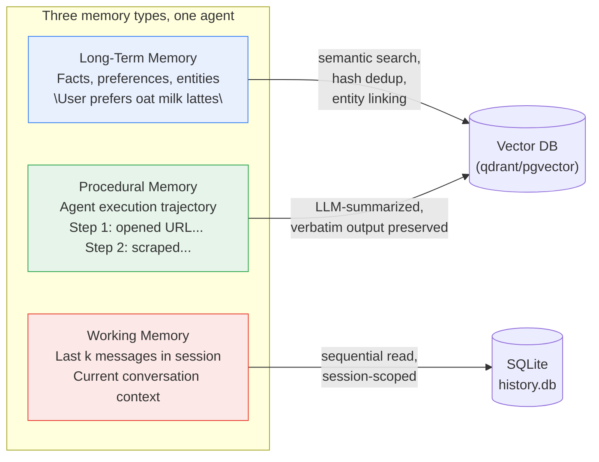
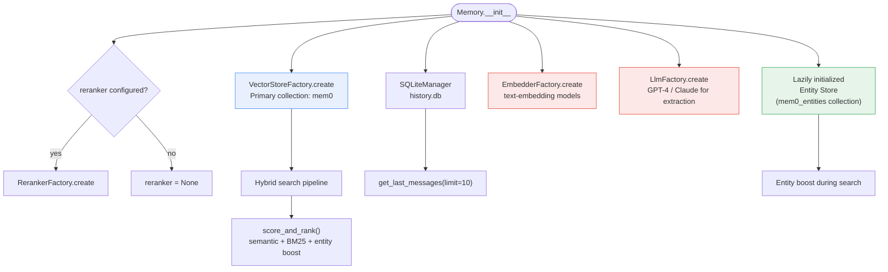
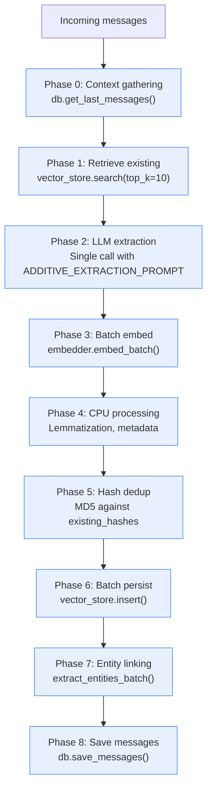

**TL;DR:** A single `Memory` class in mem0 silently manages three fundamentally different memory types — long-term semantic facts (vector DB + embeddings), short-term working context (SQLite message history), and procedural execution summaries (LLM-generated trajectory logs) — each requiring a different storage backend, retrieval strategy, and lifecycle policy. Mixing them into one store breaks because long-term facts need semantic search and deduplication, working memory needs fast sequential reads of the last *k* messages, and procedural memory needs verbatim trajectory preservation that resists summarization.

---

## 1. The Engineering Problem

When an AI agent remembers things, it is not remembering *one kind of thing*. Cognitive science identifies at least three distinct memory subsystems, and building a production agent that conflates them into a single database table is the most common architecture mistake in the mem0 issue tracker:



Each type has a fundamentally different lifecycle:

- **Long-term facts** accumulate, get updated when contradictory, and are searched by semantic similarity. They need embeddings, deduplication via MD5 hashing, and a scoring pipeline that blends BM25 keyword hits with cosine similarity.
- **Working memory** is session-scoped and write-ahead. It stores raw messages in insertion order and is read as a bounded tail (last *k* messages) to resolve pronouns and context in the current conversation. It never gets semantically searched.
- **Procedural memory** is an LLM-generated summary of an agent's execution trajectory — every URL opened, every API response, every error. It lives in the same vector store as long-term facts but is tagged with `memory_type: "procedural_memory"` and uses a completely different extraction prompt that demands verbatim output preservation.

If you store all three in the same vector collection with the same retrieval parameters, long-term facts get drowned out by verbose procedural summaries during search, working memory context is lost after session boundaries, and entity linking fails because procedural memories reference agent actions, not user entities.

## 2. The Technical Solution

mem0 solves this by using three distinct storage mechanisms orchestrated by a single `Memory` class constructor:



The critical design decision is in `Memory.__init__` — the constructor creates *two* vector store instances (primary + entity) plus a separate SQLite database, each with different query patterns:

- **Primary vector store** (`self.vector_store`): Holds long-term facts and procedural memories. Queried via hybrid semantic + BM25 search with entity boosting.
- **Entity store** (`self.entity_store`): A *separate collection in the same vector store backend* that maps entity names to the memory IDs they appear in. Initialized lazily on first use.
- **SQLite database** (`self.db`): Holds raw message history for working memory retrieval. `get_last_messages(session_scope, limit=10)` returns the last *k* messages for a given session — fast, sequential, no embeddings involved.

The `add()` method's 8-phase batch pipeline shows how these backends interact during a single memory insertion:



The key insight: **working memory is read in Phase 0** (to give the LLM recent context for extraction) and **written in Phase 8** (raw messages saved for future sessions), but **long-term facts** are processed through the LLM extraction, embedding, and dedup pipeline in Phases 1-6. They are stored in completely different backends with different schemas.

## 3. The Clean Example

A minimal example showing all three memory types in action — long-term facts, working context, and procedural memory:

```python
from mem0 import Memory

# Three storage backends initialized automatically:
#   1. Vector DB (qdrant/pgvector) -> long-term facts + procedural memory
#   2. SQLite (history.db) -> working memory (raw message history)
#   3. Entity collection (lazy) -> entity-to-memory linking

m = Memory()

# --- Long-term semantic memory ---
# LLM extracts facts, embeds them, deduplicates via MD5 hash
m.add(
    [{"role": "user", "content": "I switched from almond milk to oat milk lattes"}],
    user_id="alice",
)
# Stored in vector DB with: embedding, hash, created_at, text_lemmatized

results = m.search("What does Alice drink?", filters={"user_id": "alice"})
# Hybrid search: semantic cosine + BM25 keyword + entity boost

# --- Working memory (automatic) ---
# Every add() also saves raw messages to SQLite via db.save_messages()
# on the next call, db.get_last_messages(session_scope, limit=10)
# returns the last 10 messages for LLM context — no embeddings involved

m.add(
    [{"role": "user", "content": "Can you also remember I like oat milk in coffee?"}],
    user_id="alice",
)
# Phase 0 reads last 10 messages from SQLite for context
# Phase 8 saves new messages to SQLite

# --- Procedural memory ---
# LLM generates a verbatim execution trajectory summary
m.add(
    [
        {"role": "assistant", "content": "Opened URL https://example.com"},
        {"role": "assistant", "content": "Scraped page data: {title: 'Test'}"},
    ],
    agent_id="research-agent",
    memory_type="procedural_memory",
)
# Stored in same vector DB but tagged with memory_type: "procedural_memory"
# Uses PROCEDURAL_MEMORY_SYSTEM_PROMPT for verbatim extraction
```

The three backends serve different read patterns:

- **Semantic search** (`m.search()`) hits the vector DB with hybrid scoring — it never touches SQLite.
- **Working memory** is read implicitly by `add()` via `db.get_last_messages()` — it never goes through embeddings.
- **Procedural memory** is stored in the vector DB but uses a different extraction prompt that preserves every output verbatim rather than compressing to facts.

## 4. Production Reality (from the real repo)

Now let's look at how `mem0ai/mem0` implements this in production — with the exact code that wires the three backends together.

### Memory.__init__: Three Backends, One Constructor

From `mem0/memory/main.py`:

```python
class Memory(MemoryBase):
    def __init__(self, config: MemoryConfig = MemoryConfig()):
        self.config = config

        self.embedding_model = EmbedderFactory.create(
            self.config.embedder.provider,
            self.config.embedder.config,
            self.config.vector_store.config,
        )
        # Backend 1: Vector store for long-term facts + procedural memory
        self.vector_store = VectorStoreFactory.create(
            self.config.vector_store.provider, self.config.vector_store.config
        )
        self.llm = LlmFactory.create(self.config.llm.provider, self.config.llm.config)
        # Backend 2: SQLite for working memory (raw message history)
        self.db = SQLiteManager(self.config.history_db_path)
        self.collection_name = self.config.vector_store.config.collection_name

        # Optional reranker for search result refinement
        self.reranker = None
        if config.reranker:
            self.reranker = RerankerFactory.create(
                config.reranker.provider,
                config.reranker.config
            )

        # Backend 3: Entity store (lazy — initialized on first entity operation)
        self._entity_store = None
```

What these implementation details reveal:

- **SQLite is not a fallback — it is the working memory backend.** `db.get_last_messages(session_scope, limit=10)` is called in Phase 0 of every `add()` to provide the LLM with recent conversation context. It is fast, session-scoped, and never goes through embeddings.
- **The entity store is a separate collection, not a table.** It lives in the same vector store provider (Qdrant, pgvector, etc.) but uses a different collection name (`mem0_entities`), initialized lazily to avoid startup overhead when entity linking is never used.
- **The reranker is optional and post-hoc.** It re-ranks the hybrid-scored results but does not participate in the scoring pipeline itself. If it fails, the original order is preserved.

### _search_vector_store: Hybrid Scoring Pipeline

From `mem0/memory/main.py`:

```python
def _search_vector_store(self, query, filters, limit, threshold=0.1, explain=False, show_expired=False):
    # Step 1: Preprocess query
    query_lemmatized = lemmatize_for_bm25(query)
    query_entities = extract_entities(query)

    # Step 2: Embed query
    embeddings = self.embedding_model.embed(query, "search")

    # Step 3: Semantic search (over-fetch for scoring pool)
    internal_limit = max(limit * 4, 60)
    semantic_results = self.vector_store.search(
        query=query, vectors=embeddings, top_k=internal_limit, filters=filters
    )

    # Step 4: Keyword search (if store supports it)
    keyword_results = self.vector_store.keyword_search(
        query=query_lemmatized, top_k=internal_limit, filters=filters
    )

    # Step 5: Compute BM25 scores from keyword results
    bm25_scores = {}
    if keyword_results is not None:
        midpoint, steepness = get_bm25_params(query, lemmatized=query_lemmatized)
        for mem in keyword_results:
            mem_id = str(mem.id) if hasattr(mem, 'id') else str(mem.get('id', ''))
            raw_score = mem.score if hasattr(mem, 'score') else mem.get('score', 0)
            if raw_score and raw_score > 0:
                bm25_scores[mem_id] = normalize_bm25(raw_score, midpoint, steepness)

    # Step 6: Compute entity boosts
    entity_boosts = {}
    if query_entities:
        entity_boosts = self._compute_entity_boosts(query_entities, filters)

    # Step 7-8: Score and rank
    scored_results = score_and_rank(
        semantic_results=candidates,
        bm25_scores=bm25_scores,
        entity_boosts=entity_boosts,
        threshold=threshold,
        top_k=limit,
        explain=explain,
    )
```

What these implementation details reveal:

- **Over-fetch by 4x.** `internal_limit = max(limit * 4, 60)` retrieves far more candidates than needed. This is because the hybrid scoring pipeline can *promote* a low-ranked semantic result that has strong BM25 or entity-boost signals, so the final top-k may not be the semantic top-k.
- **BM25 normalization is query-length-adaptive.** `get_bm25_params()` selects sigmoid parameters based on term count — short queries (<=3 terms) use `midpoint=5.0, steepness=0.7` while long queries (15+ terms) use `midpoint=12.0, steepness=0.5`. This prevents long queries from saturating at 1.0.
- **Entity boosts are capped at 0.5 weight.** `ENTITY_BOOST_WEIGHT = 0.5` in `scoring.py` ensures entity matches boost but never dominate the combined score. The divisor `max_possible` adapts: semantic-only = 1.0, semantic + BM25 = 2.0, all three = 2.5.

### score_and_rank: The Additive Scoring Formula

From `mem0/utils/scoring.py`:

```python
ENTITY_BOOST_WEIGHT = 0.5

def score_and_rank(
    semantic_results, bm25_scores, entity_boosts,
    threshold, top_k, explain=False,
):
    has_bm25 = bool(bm25_scores)
    has_entity = bool(entity_boosts)

    max_possible = 1.0
    if has_bm25:
        max_possible += 1.0
    if has_entity:
        max_possible += ENTITY_BOOST_WEIGHT

    scored = []
    for result in semantic_results:
        mem_id = result.get("id")
        semantic_score = result.get("score") or 0.0
        if semantic_score < threshold:
            continue

        bm25_score = bm25_scores.get(str(mem_id), 0.0)
        entity_boost = entity_boosts.get(str(mem_id), 0.0)

        raw_combined = semantic_score + bm25_score + entity_boost
        combined = min(raw_combined / max_possible, 1.0)

        scored.append({
            "id": str(mem_id),
            "score": combined,
            "payload": result.get("payload"),
        })

    scored.sort(key=lambda x: x["score"], reverse=True)
    return scored[:top_k]
```

What this reveals:

- **Threshold gates before combining.** A memory with semantic score 0.05 is rejected even if its BM25 score is 1.0 — the threshold is a hard floor on the semantic signal. This prevents keyword-only matches from polluting results when the embedding model says the memory is irrelevant.
- **The divisor normalizes to [0, 1].** By dividing by `max_possible`, the final score is always between 0 and 1 regardless of how many signals are active. This makes the threshold behavior consistent across vector stores that do and do not support keyword search.

### _create_procedural_memory: Verbatim Trajectory Preservation

From `mem0/memory/main.py`:

```python
def _create_procedural_memory(self, messages, metadata=None, prompt=None):
    parsed_messages = [
        {"role": "system", "content": prompt or PROCEDURAL_MEMORY_SYSTEM_PROMPT},
        *messages,
        {
            "role": "user",
            "content": "Create procedural memory of the above conversation.",
        },
    ]

    procedural_memory = self.llm.generate_response(messages=parsed_messages)
    procedural_memory = remove_code_blocks(procedural_memory)

    metadata = {**metadata, "memory_type": MemoryType.PROCEDURAL.value}
    embeddings = self.embedding_model.embed(procedural_memory, memory_action="add")
    memory_id = self._create_memory(
        procedural_memory, {procedural_memory: embeddings}, metadata=metadata
    )
    return {"results": [{"id": memory_id, "memory": procedural_memory, "event": "ADD"}]}
```

What this reveals:

- **Procedural memory bypasses the 8-phase pipeline entirely.** It goes directly to `self.llm.generate_response()` with the `PROCEDURAL_MEMORY_SYSTEM_PROMPT` — no dedup, no entity linking, no hash comparison. This is deliberate: execution trajectories are unique and should never be deduplicated.
- **The prompt demands verbatim output preservation.** `PROCEDURAL_MEMORY_SYSTEM_PROMPT` instructs the LLM to record "every output produced by the agent" as-is — HTML snippets, JSON responses, error messages exactly as received. This is fundamentally different from the `ADDITIVE_EXTRACTION_PROMPT` used for long-term facts, which compresses conversations into 15-80 word factual statements.
- **Tagged with `memory_type: "procedural_memory"` in metadata.** This lets the search pipeline optionally filter or weight procedural memories differently, though in the OSS version they coexist in the same collection as long-term facts.

## 5. Review Checklist

- **Three backends, one class.** `Memory.__init__` creates a vector store (long-term + procedural), a SQLite database (working memory), and a lazy entity store. Each serves a different access pattern.

- **Working memory is read in Phase 0, written in Phase 8.** `db.get_last_messages(session_scope, limit=10)` provides recent context to the LLM extraction call. Raw messages are saved at the end. No embeddings are involved.

- **Long-term facts go through an 8-phase pipeline.** LLM extraction, batch embedding, MD5 dedup, entity linking, and hybrid scoring. Each phase has fallback handling for partial failures.

- **Procedural memory bypasses the pipeline.** It uses a separate prompt (`PROCEDURAL_MEMORY_SYSTEM_PROMPT`) that demands verbatim trajectory preservation — every URL, every API response, every error message. No dedup, no entity linking.

- **Hybrid search over-fetches by 4x.** `internal_limit = max(limit * 4, 60)` because the additive scoring pipeline (semantic + BM25 + entity boost) can promote low-ranked semantic results.

- **Threshold is a hard semantic floor.** A memory below the threshold is excluded even if BM25 or entity signals are strong. This prevents keyword-only pollution.

- **Entity store is a separate collection.** Same vector store provider, different collection name (`mem0_entities`). Initialized lazily. Entity boosts are capped at 0.5 weight in the final score.

## 6. FAQ

**Q: Why not just put everything in one vector collection with a `type` field?**
A: You can, and mem0 does for long-term and procedural memory. But working memory (raw message history) does not belong in a vector store at all — it is read sequentially by session scope and time order, not by semantic similarity. SQLite handles this with `get_last_messages(session_scope, limit=10)`, which is an O(1) tail read, not an embedding-based search.

**Q: Why is the entity store a separate collection and not just metadata on each memory?**
A: Entity linking needs to go in *both directions* — from memory to entities (already in the payload) and from entity to memories (for boost computation during search). A separate collection lets `_compute_entity_boosts()` search for "all memories mentioning 'Alice'" without scanning every memory's metadata. The entity store holds `linked_memory_ids` as an array on each entity, enabling O(1) lookup per entity match.

**Q: What happens if the vector store does not support keyword search?**
A: `_search_vector_store()` checks `getattr(type(self.vector_store), "keyword_search", None)` at init and logs a warning. During search, `keyword_search()` returns `None`, BM25 scores stay empty, and the scoring formula divides by 1.0 instead of 2.0 — pure semantic search. No crash, no fallback needed.

**Q: Why does procedural memory bypass the 8-phase pipeline?**
A: Procedural memories are unique execution trajectories — two runs of the same agent produce different step-by-step outputs. Deduplicating them would destroy valuable state information. The `PROCEDURAL_MEMORY_SYSTEM_PROMPT` also demands verbatim output preservation, which conflicts with the `ADDITIVE_EXTRACTION_PROMPT`'s instruction to compress to 15-80 word factual statements.

**Q: How does `score_and_rank` handle vector stores that do not support keyword search?**
A: `bm25_scores` stays empty, `has_bm25` is False, `max_possible` = 1.0 (semantic only) or 1.5 (semantic + entity). The formula gracefully degrades to `combined = semantic_score + entity_boost` without any special-casing in the scoring loop.

**Q: What is `text_lemmatized` in the metadata and why does it matter?**
A: When a memory is inserted, its text is lemmatized via `lemmatize_for_bm25()` and stored in metadata as `text_lemmatized`. When a search query comes in, it is also lemmatized before BM25 matching. This ensures that "running" matches "run" and "cats" matches "cat" — standard information retrieval behavior that pure embedding search does not provide.

---

## Source

This post examines the memory management implementation from the [mem0ai/mem0](https://github.com/mem0ai/mem0) repository. The primary files analyzed:

- [`mem0/memory/main.py`](https://github.com/mem0ai/mem0/blob/main/mem0/memory/main.py) — `Memory` class, `__init__` (three-backend wiring), `add()` (8-phase pipeline), `_search_vector_store()` (hybrid scoring), `_create_procedural_memory()` (verbatim trajectory extraction)
- [`mem0/configs/base.py`](https://github.com/mem0ai/mem0/blob/main/mem0/configs/base.py) — `MemoryConfig`, `MemoryItem` schema
- [`mem0/utils/scoring.py`](https://github.com/mem0ai/mem0/blob/main/mem0/utils/scoring.py) — `score_and_rank()` (additive scoring formula), `normalize_bm25()` (sigmoid normalization), `ENTITY_BOOST_WEIGHT`
- [`mem0/configs/prompts.py`](https://github.com/mem0ai/mem0/blob/main/mem0/configs/prompts.py) — `ADDITIVE_EXTRACTION_PROMPT` (long-term fact extraction), `PROCEDURAL_MEMORY_SYSTEM_PROMPT` (verbatim trajectory extraction), `DEFAULT_UPDATE_MEMORY_PROMPT` (memory update decisions)
