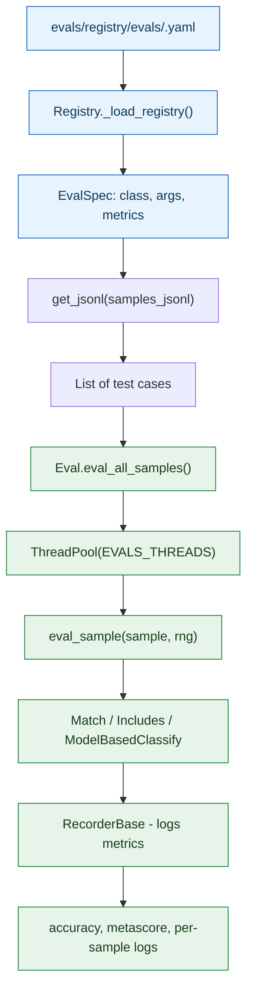
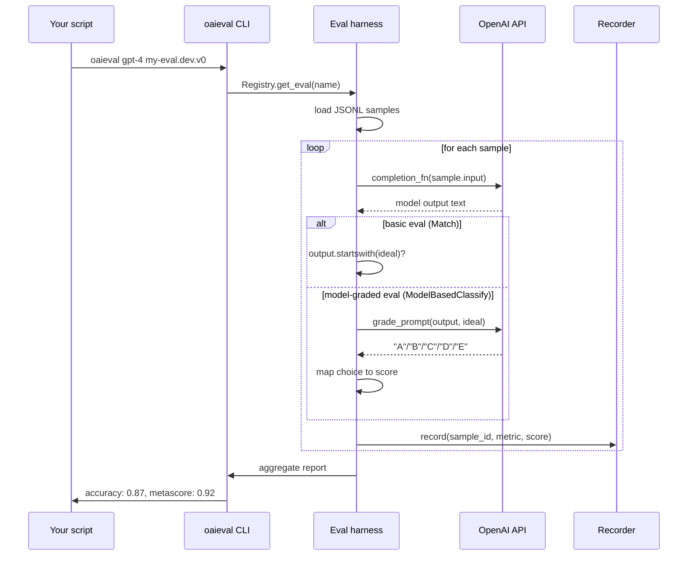

**TL;DR:** Does a single accuracy score tell you whether your LLM is safe, factually grounded, and stylistically appropriate? No — it tells you the average across a batch, hiding exactly which categories fail and why. OpenAI's `openai/evals` framework replaces the "one number" approach with a **registry of named evals**, each backed by a JSONL dataset, a scoring template, and a version identifier — so you can run `oaieval gpt-4 my-eval.dev.v0`, see accuracy per eval, compare across model versions, and use a separate model to grade open-ended responses when a simple string match won't do.

## 1. The Engineering Problem

Evaluating an LLM is not like evaluating a classifier. A classifier's output is a discrete label, and a confusion matrix tells you exactly which class is leaking. An LLM produces free-form text — sometimes correct but phrased differently, sometimes partially right, sometimes confidently wrong in a way that superficially resembles correctness. A single accuracy score collapses all of these failure modes into one number, making it impossible to answer the question that actually matters: **which capability broke when I changed the prompt, fine-tuned the model, or switched from GPT-3.5 to GPT-4?**

The problem gets worse when you have multiple dimensions to test simultaneously. You need to verify factual accuracy, check for over-refusals, measure style compliance, and audit safety — all on the same model update. Without a structured way to name, group, and version these tests, the evaluation process devolves into ad-hoc scripts that nobody maintains and nobody trusts. What's needed is a system that treats LLM evaluation as a **test suite with a registry** — named, versioned, composable test cases with clear pass/fail criteria, not a single aggregate metric.

---

## 2. The Technical Solution

The framework separates the *what* (test data + scoring logic) from the *how* (the eval harness that runs it). Each eval is a YAML entry in the registry pointing to a JSONL dataset and a template class. The registry loads these entries, instantiates the right class, and feeds data through it — all via configuration, no custom code required:



**Registry layer** — YAML files in `evals/registry/evals/` define each eval by name, pointing to a class (e.g., `evals.elsuite.basic.match:Match`) and a dataset path. The naming convention `<eval_name>.<split>.<version>` groups comparable evals and tracks changes over time. The `Registry` class walks a list of directories, loads every `.yaml` file, and builds an in-memory lookup table — `get_eval(name)` resolves an eval name to a full `EvalSpec` with class path and arguments.

**Harness layer** — `Eval.eval_all_samples()` shuffles samples (deterministically, with a fixed seed), distributes them across a thread pool, and calls `eval_sample()` on each one. Every sample gets its own `random.Random` instance seeded by its sample ID, ensuring reproducibility. The recorder collects per-sample metrics and aggregates them into a final report.

**Grading layer** — for simple tasks, `Match` checks if the model output starts with any of the reference answers. For open-ended tasks, `ModelBasedClassify` sends the model's output to a *separate* grading prompt that asks another model (or the same model) to classify it against a rubric — the `fact.yaml` prompt, for example, asks the grader to classify a submitted answer as a subset, superset, or contradiction of the expert answer:



The model-graded path is what makes this framework genuinely different from a unit test runner: it acknowledges that some LLM qualities (factual consistency, helpfulness, tone) cannot be reduced to string matching, and uses a structured prompt to get a *model's judgment* on whether the output meets criteria — then maps that judgment to numeric scores via `choice_scores`.

---

## 3. The clean example (concept in isolation)

```python
# Registering a new eval: all you need is a YAML entry and a JSONL file.
# No Python code required for basic or model-graded evals.

# Step 1: evals/registry/evals/my_qa_eval.yaml
# my_qa_eval:
#   id: my_qa_eval.dev.v0
#   description: Does the model answer factual questions correctly?
#   metrics: [accuracy]
#
# my_qa_eval.dev.v0:
#   class: evals.elsuite.basic.match:Match
#   args:
#     samples_jsonl: my_qa_eval/samples.jsonl

# Step 2: evals/registry/data/my_qa_eval/samples.jsonl
# {"input": [{"role": "user", "content": "What is the capital of France?"}], "ideal": ["Paris"]}
# {"input": [{"role": "user", "content": "What is 2 + 2?"}], "ideal": ["4"]}

# Step 3: run it
# $ oaieval gpt-4 my_qa_eval.dev.v0
```

```yaml
# For open-ended responses where string matching fails,
# use a model-graded eval with a rubric prompt.
#
# evals/registry/modelgraded/my_rubric.yaml
my_rubric:
  prompt: |-
    You are evaluating a submitted answer against an expert answer.
    [BEGIN DATA]
    ************
    [Question]: {input}
    ************
    [Expert]: {ideal}
    ************
    [Submission]: {completion}
    ************
    [END DATA]
    Does the submission agree with the expert?
    (A) Yes, fully consistent
    (B) Partially consistent
    (C) No, contradicts the expert
  choice_strings: ABC
  choice_scores:
    A: 1.0
    B: 0.5
    C: 0.0
  input_outputs:
    input: completion
```

---

## 4. Production reality (from `openai/evals`)

The `Eval` base class — the harness every eval runs through. Shuffles samples deterministically, distributes across a thread pool, and seeds each sample's RNG from its unique ID for reproducibility:

```python
# evals/eval.py — the base Eval class
class Eval(abc.ABC):
    def __init__(
        self,
        completion_fns: list[Union[CompletionFn, Solver]],
        eval_registry_path: Path,
        seed: int = 20220722,
        name: str = "no_name_eval.default",
        registry: Optional[Registry] = None,
        samples_jsonl: Optional[str] = None,
    ):
        splits = name.split(".")
        if len(splits) < 2:
            raise ValueError(
                f"Eval name must at least have <base_eval>.<split>. Got name {name}"
            )
        self.completion_fns = [
            maybe_wrap_with_compl_fn(fn) for fn in completion_fns
        ]
        self.eval_registry_path = eval_registry_path
        self.seed = seed
        self.name = name
        self.registry = registry or Registry()
        self.samples_jsonl = samples_jsonl

    @abc.abstractmethod
    def eval_sample(self, sample: Any, rng: random.Random):
        raise NotImplementedError()

    def eval_all_samples(self, recorder, samples, show_progress=True, **_kwargs):
        work_items = _index_samples(samples)
        threads = int(os.environ.get("EVALS_THREADS", "10"))

        def eval_sample(args):
            sample, idx = args
            base_name, split = self.name.split(".")[0:2]
            sample_id = f"{base_name}.{split}.{idx}"
            with recorder.as_default_recorder(sample_id):
                seed = f"{sample_id}:{self.seed}".encode("utf-8")
                rng = random.Random(seed)
                return idx, self.eval_sample(sample, rng)

        with ThreadPool(threads) as pool:
            iter = pool.imap_unordered(eval_sample, work_items)
            idx_and_result = list(tqdm(iter, total=len(work_items)))
        return [r for _, r in sorted(idx_and_result)]
```

The `Registry` — loads YAML files from multiple directories, resolves eval names to specs, and handles aliases. Every entry gets a `key`, `group`, and `registry_path` injected automatically:

```python
# evals/registry.py — the Registry that loads YAML eval definitions
class Registry:
    def __init__(self, registry_paths=DEFAULT_PATHS):
        self._registry_paths = [
            Path(p) if isinstance(p, str) else p for p in registry_paths
        ]

    def _load_registry(self, registry_paths, resource_type):
        registry = {}
        for registry_path in registry_paths:
            for name, path, spec in self._load_resources(
                registry_path, resource_type
            ):
                assert name not in registry, (
                    f"duplicate entry: {name} from {path}"
                )
                spec["key"] = name
                spec["group"] = str(
                    os.path.basename(path).split(".")[0]
                )
                spec["registry_path"] = registry_path
                if "class" in spec:
                    spec["cls"] = spec["class"]
                    del spec["class"]
                registry[name] = spec
        return registry

    def get_eval(self, name):
        return self._dereference(
            name, self._evals, "eval", EvalSpec
        )
```

The `fact.yaml` model-graded prompt — asks a grader model to classify a submitted answer against an expert answer on a five-point scale, turning a subjective judgment into a discrete, scoreable choice:

```yaml
# evals/registry/modelgraded/fact.yaml
fact:
  prompt: |-
    You are comparing a submitted answer to an expert answer
    on a given question. Here is the data:
    [BEGIN DATA]
    ************
    [Question]: {input}
    ************
    [Expert]: {ideal}
    ************
    [Submission]: {completion}
    ************
    [END DATA]

    Compare the factual content of the submitted answer with
    the expert answer. Ignore any differences in style, grammar,
    or punctuation.
    The submitted answer may either be a subset or superset of
    the expert answer, or it may conflict with it. Determine
    which case applies. Answer the question by selecting one of
    the following options:
    (A) The submitted answer is a subset of the expert answer
        and is fully consistent with it.
    (B) The submitted answer is a superset of the expert answer
        and is fully consistent with it.
    (C) The submitted answer contains all the same details as
        the expert answer.
    (D) There is a disagreement between the submitted answer
        and the expert answer.
    (E) The answers differ, but these differences don't matter
        from the perspective of factuality.
  choice_strings: ABCDE
  input_outputs:
    input: completion
```

What this reveals that a "just test it manually" approach misses:

- **`_index_samples` uses a fixed seed (`SHUFFLE_SEED = 123`)** — every run evaluates the same samples in the same order, making results reproducible across runs. Without this, you cannot tell whether a score change is a real regression or just different shuffling.
- **`eval_sample` gets its own `random.Random` seeded by `f"{sample_id}:{self.seed}"`** — samples that involve stochastic prompting (e.g., chain-of-thought with temperature > 0) produce identical results on re-run, isolating model quality from randomness.
- **The Registry enforces naming convention `<base_eval>.<split>.<version>`** — you cannot accidentally overwrite an existing eval, and `get_evals(["my_eval.*"])` with glob patterns lets you run all splits of an eval in one command.
- **`fact.yaml`'s five-point scale (A through E) is the core of model-graded evaluation** — it turns "does this answer agree with the expert?" from a binary yes/no into a gradient that captures subset, superset, contradiction, and irrelevant-difference cases, each mapped to a numeric score via `choice_scores`.

---

## 5. Review checklist

- When creating a new eval, confirm the YAML entry follows `<eval_name>.<split>.<version>` naming — the Registry uses dots as separators, and the split is how you group dev/val/test variants of the same capability.
- If using `Match` or `Includes`, verify your JSONL's `ideal` field contains all acceptable answer variants — the model may phrase a correct answer differently (e.g., "4" vs "four"), and `Match` only checks `startswith`, not semantic equivalence.
- For model-graded evals, always include a meta-eval with human-labeled `choice` keys in your dataset — this lets you measure `metascore/` accuracy to verify the grading prompt itself is reliable before trusting its scores on unlabeled data.
- Set `EVALS_THREADS` to control parallelism (default 10) — higher values speed up large evals but may hit API rate limits; monitor for 429 errors and reduce if needed.
- When bumping an eval's version, keep the old version in the registry so prior results remain reproducible — never mutate an existing version's YAML entry after its first run.

---

## 6. FAQ

**Q: Why not just use a Python pytest with string assertions instead of a whole registry?**
A: A pytest works for deterministic, single-output tasks. But LLM evaluation requires: (1) running the same eval across multiple models with identical data and scoring, (2) model-graded scoring where a second model judges the output against a rubric, and (3) reproducible shuffling and per-sample seeding. The Registry + Eval harness provides all three out of the box, with YAML as the configuration layer so non-engineers can contribute evals without writing Python.

**Q: What's the difference between `Match`, `Includes`, and `FuzzyMatch`?**
A: `Match` checks if the model's output *starts with* any reference answer (`a.startswith(b)`). `Includes` checks if any reference answer *appears anywhere* in the output (`b in a`). `FuzzyMatch` checks if either string contains the other in either direction (`a in b or b in a`). Choose based on how strict your task is — `Match` for exact-first-token tasks (multiple choice), `Includes` for tasks where the answer may appear in a longer response.

**Q: How does model-graded evaluation avoid circular reasoning if the same model grades itself?**
A: It can — and this is a real risk. The framework does not require the grading model to be the same as the evaluated model; in production, use a stronger or orthogonal model as the grader. Each model-graded eval should also include a **meta-eval** (a labeled dataset where you know the correct grade) to measure `metascore/` accuracy — if the meta-eval scores below ~0.9, the grading prompt needs refinement before you trust its judgments on real data.

**Q: Can I run an eval on a model that isn't an OpenAI API model?**
A: Yes. The `CompletionFn` protocol is an abstraction — you can implement it for any model (local, self-hosted, or third-party API) and pass it as a custom completion function. The eval harness and scoring logic are model-agnostic; only the built-in `make_completion_fn` helper has OpenAI-specific defaults.

**Q: What happens if the model outputs something that doesn't match any choice in a model-graded eval?**
A: Any choice string not in `choice_strings` is mapped to `"__invalid__"` and scored as 0 via `choice_scores`. The recorder logs this as a separate metric, so you can see exactly how often the model failed to produce a parseable grade — which is itself a signal about prompt quality or model capability.

---

## Source

- **Concept:** LLM evaluation — registry-based test cases, parallel harness, and model-graded scoring
- **Domain:** genai
- **Repo:** [openai/evals](https://github.com/openai/evals) → [`evals/eval.py`](https://github.com/openai/evals/blob/main/evals/eval.py) (the `Eval` base class and `eval_all_samples` harness), [`evals/registry.py`](https://github.com/openai/evals/blob/main/evals/registry.py) (the `Registry` that loads YAML eval definitions and resolves names to specs), [`evals/registry/modelgraded/fact.yaml`](https://github.com/openai/evals/blob/main/evals/registry/modelgraded/fact.yaml) (the model-graded factual-consistency rubric) — OpenAI's official framework for evaluating LLMs, with a public registry of evals and templates for basic and model-graded scoring.


