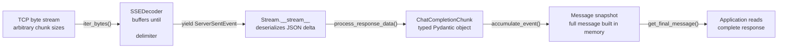
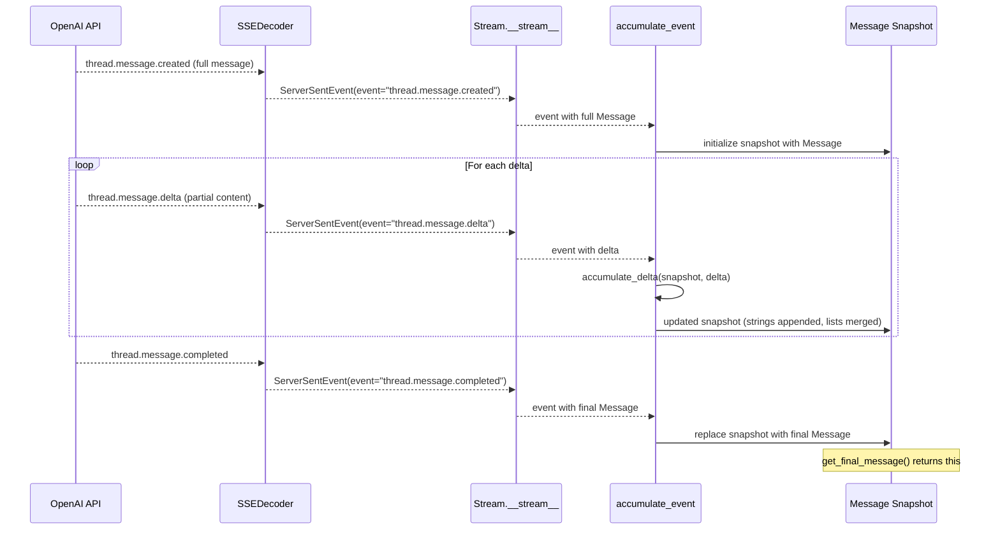

**TL;DR:** Streaming from the OpenAI API sends tokens one at a time over Server-Sent Events, but the wire protocol delivers raw bytes that arrive in arbitrary chunk sizes -- a single HTTP chunk might contain half an SSE event, multiple events, or a fragment that spans two events. The SDK's `SSEDecoder` must buffer bytes until it sees the double-newline delimiter (`\n\n`) that marks a complete SSE frame, only then deserializing the JSON payload into a `ChatCompletionChunk`. Each chunk carries a *delta* (a partial token or tool-call fragment), not a complete message. The SDK's `Stream.__stream__` method feeds these deltas into `process_response_data`, which Pydantic-parses them into typed objects. For the Assistants API, a separate `accumulate_event` function merges each delta into an in-memory snapshot so that by the time the stream ends, you have a full `Message` object -- deltas were never the final product; the accumulated snapshot was. Understanding this two-layer buffering (protocol-level chunking in `SSEDecoder`, semantic-level accumulation in `Stream.__stream__`) is what separates "I can stream text" from "I can build reliable streaming applications."

> **In plain English (30 sec):** Code you already write — Map, function, API call, just bigger.

## 1. The Engineering Problem

When you call `client.chat.completions.create(stream=True)`, you expect tokens to appear one by one. And they do -- in the UI. But under the hood, three layers of buffering stand between the TCP byte stream and the string you print.

**The HTTP layer delivers arbitrary chunks.** `httpx` reads the response body in chunks determined by TCP congestion, server flush timing, and OS buffer sizes. A single `iter_bytes()` yield might contain 3 bytes of an SSE event, or it might contain four complete events concatenated together. The SDK cannot assume one HTTP chunk equals one SSE event.

**The SSE protocol requires delimiter-based framing.** Each SSE event is terminated by a blank line (`\n\n`). If an HTTP chunk splits an event mid-payload, the decoder must hold those bytes in a buffer until the delimiter arrives. The [SSE specification](https://html.spec.whatwg.org/multipage/server-sent-events.html#event-stream-interpretation) defines this buffering explicitly -- the decoder is a state machine, not a pass-through.

**The semantic layer accumulates deltas into objects.** Each deserialized SSE event carries a *delta* -- a fragment of a tool call's JSON arguments, a few characters of text, or a usage counter. Your application does not consume deltas directly (except for token-by-token rendering). Instead, the SDK merges each delta into an accumulated snapshot, producing a complete typed object (`ChatCompletionChunk`, `Message`, `RunStep`) at the end of the stream.

The engineering problem is not "how do I open an SSE connection" -- it is "how do I ensure that every layer of buffering is correct so that a partial byte at the network level does not produce a malformed object at the application level."



The diagram reads left to right: bytes arrive, get buffered into SSE frames, get deserialized into chunk objects, get accumulated into snapshots, and only then does the application see a complete message. The title of this post -- "accumulate into a full message before the client renders" -- describes exactly this pipeline.

## 2. The Technical Solution

### 2.1 Protocol-Level Buffering: `SSEDecoder._iter_chunks`

The first layer of buffering lives in `SSEDecoder._iter_chunks`. This method receives raw bytes from `httpx.Response.iter_bytes()` and reassembles them into complete SSE frames. It is the boundary between the network and the application:

```python
# openai/openai-python: src/openai/_streaming.py
def _iter_chunks(self, iterator: Iterator[bytes]) -> Iterator[bytes]:
    """Given an iterator that yields raw binary data, iterate over it
    and yield individual SSE chunks"""
    data = b""
    for chunk in iterator:
        for line in chunk.splitlines(keepends=True):
            data += line
            if data.endswith((b"\r\r", b"\n\n", b"\r\n\r\n")):
                yield data
                data = b""
    if data:
        yield data
```

This is a classic stream-reassembly state machine. It accumulates bytes into `data` and yields a complete frame whenever it sees a double-newline terminator (`\n\n`, `\r\r`, or `\r\n\r\n`). Note the critical detail: `splitlines(keepends=True)` splits on every line break but preserves the delimiter, so each `line` is a complete line including its newline. The `data += line` concatenation builds the frame incrementally, and the `endswith` check identifies when a blank line (the SSE event terminator) has arrived.

If the iterator is exhausted before a terminator is found (`if data: yield data`), the remaining bytes are yielded as a final incomplete frame -- the decoder is resilient to truncated streams.

### 2.2 Line-Level Decoding: `SSEDecoder.decode`

After `_iter_chunks` yields a complete frame, `iter_bytes` splits it into lines and feeds each line to `decode`. This is the SSE field parser:

```python
# openai/openai-python: src/openai/_streaming.py
def decode(self, line: str) -> ServerSentEvent | None:
    if not line:
        if not self._event and not self._data and not self._last_event_id and self._retry is None:
            return None
        sse = ServerSentEvent(
            event=self._event,
            data="\n".join(self._data),
            id=self._last_event_id,
            retry=self._retry,
        )
        self._event = None
        self._data = []
        self._retry = None
        return sse

    if line.startswith(":"):
        return None

    fieldname, _, value = line.partition(":")
    if value.startswith(" "):
        value = value[1:]

    if fieldname == "event":
        self._event = value
    elif fieldname == "data":
        self._data.append(value)
    elif fieldname == "id":
        if "\0" in value:
            pass
        else:
            self._last_event_id = value
    elif fieldname == "retry":
        try:
            self._retry = int(value)
        except (TypeError, ValueError):
            pass

    return None
```

An empty line (`not line`) triggers event emission -- the accumulated `_event` and `_data` fields are joined into a `ServerSentEvent` and returned. Lines starting with `:` are SSE comments (ignored). All other lines are field assignments (`event:`, `data:`, `id:`, `retry:`). The `"\n".join(self._data)` is important: multi-line data fields (where multiple `data:` lines belong to one event) are joined with newlines, preserving the JSON payload intact.

### 2.3 Semantic Accumulation: `Stream.__stream__`

Once `ServerSentEvent` objects are yielded by the decoder, `Stream.__stream__` deserializes each one and feeds it to the client's response processor. This is the bridge between SSE protocol objects and typed Pydantic models:

```python
# openai/openai-python: src/openai/_streaming.py
def __stream__(self) -> Iterator[_T]:
    cast_to = cast(Any, self._cast_to)
    response = self.response
    process_data = self._client._process_response_data
    iterator = self._iter_events()

    try:
        for sse in iterator:
            if sse.data.startswith("[DONE]"):
                break

            if sse.event and sse.event.startswith("thread."):
                data = sse.json()

                if sse.event == "error" and is_mapping(data) and data.get("error"):
                    message = None
                    error = data.get("error")
                    if is_mapping(error):
                        message = error.get("message")
                    if not message or not isinstance(message, str):
                        message = "An error occurred during streaming"
                    raise APIError(
                        message=message,
                        request=self.response.request,
                        body=data["error"],
                    )

                yield process_data(
                    data={"data": data, "event": sse.event},
                    cast_to=cast_to,
                    response=response,
                )
            else:
                data = sse.json()
                if is_mapping(data) and data.get("error"):
                    message = None
                    error = data.get("error")
                    if is_mapping(error):
                        message = error.get("message")
                    if not message or not isinstance(message, str):
                        message = "An error occurred during streaming"
                    raise APIError(
                        message=message,
                        request=self.response.request,
                        body=data["error"],
                    )

                yield process_data(
                    data={"data": data, "event": sse.event}
                    if self._options is not None
                    and self._options.synthesize_event_and_data
                    else data,
                    cast_to=cast_to,
                    response=response,
                )
    finally:
        response.close()
```

Two critical behaviors here: (1) the `[DONE]` sentinel -- a string, not JSON -- terminates the stream without error, and (2) the `finally: response.close()` ensures the HTTP connection is released even if the consumer stops iterating early or an exception is raised. This prevents connection leaks, which are a common production failure mode with streaming APIs.

### 2.4 Assistants API: `accumulate_event` and `accumulate_delta`

For the Assistants API (threads, runs, tool calls), the SDK goes beyond per-chunk deserialization. It maintains a growing `Message` snapshot by merging each delta into it using `accumulate_event` and `accumulate_delta`:



The `accumulate_delta` function handles the merge semantics. Strings are concatenated, numbers are summed, dictionaries are merged recursively, and lists (like `tool_calls`) are indexed by position:

```python
# openai/openai-python: src/openai/lib/streaming/_assistants.py
def accumulate_delta(acc: dict[object, object], delta: dict[object, object]) -> dict[object, object]:
    for key, delta_value in delta.items():
        if key not in acc:
            acc[key] = delta_value
            continue

        acc_value = acc[key]
        if acc_value is None:
            acc[key] = delta_value
            continue

        if key == "index" or key == "type":
            acc[key] = delta_value
            continue

        if isinstance(acc_value, str) and isinstance(delta_value, str):
            acc_value += delta_value
        elif isinstance(acc_value, (int, float)) and isinstance(delta_value, (int, float)):
            acc_value += delta_value
        elif is_dict(acc_value) and is_dict(delta_value):
            acc_value = accumulate_delta(acc_value, delta_value)
        elif is_list(acc_value) and is_list(delta_value):
            if all(isinstance(x, (str, int, float)) for x in acc_value):
                acc_value.extend(delta_value)
                continue

            for delta_entry in delta_value:
                if not is_dict(delta_entry):
                    raise TypeError(f"Unexpected list delta entry is not a dictionary: {delta_entry}")

                try:
                    index = delta_entry["index"]
                except KeyError as exc:
                    raise RuntimeError(f"Expected list delta entry to have an `index` key; {delta_entry}") from exc

                if not isinstance(index, int):
                    raise TypeError(f"Unexpected, list delta entry `index` value is not an integer; {index}")

                try:
                    acc_entry = acc_value[index]
                except IndexError:
                    acc_value.insert(index, delta_entry)
                else:
                    if not is_dict(acc_entry):
                        raise TypeError("not handled yet")

                    acc_value[index] = accumulate_delta(acc_entry, delta_entry)

        acc[key] = acc_value

    return acc
```

The `index` and `type` fields are *overwritten*, not accumulated -- they are discriminators that identify which content block or tool call a delta belongs to. Without this, a tool call at index 0 would have its `index` field corrupted by a later delta. The list accumulation logic handles the common case (simple lists extended in-place) and the complex case (lists of objects merged by `index` key) separately.

## 3. Clean Example

Streaming a chat completion with token-by-token rendering and final snapshot access:

```python
from openai import OpenAI

client = OpenAI()

# Basic streaming -- tokens arrive as ChatCompletionChunk objects
stream = client.chat.completions.create(
    model="gpt-4o",
    messages=[{"role": "user", "content": "Explain SSE buffering in 3 sentences."}],
    stream=True,
    stream_options={"include_usage": True},
)

collected_tokens = []
for chunk in stream:
    # Each chunk is a ChatCompletionChunk -- a delta, not a full message
    if chunk.choices and chunk.choices[0].delta.content:
        token = chunk.choices[0].delta.content
        collected_tokens.append(token)
        print(token, end="", flush=True)  # token-by-token rendering

print()  # final newline after stream completes

# The accumulated tokens form the complete response
full_response = "".join(collected_tokens)

# Usage data arrives only in the last chunk (when stream_options.include_usage=True)
if stream.get_final_message():
    print(f"\nTokens used: {stream.get_final_message().usage}")
```

For the Assistants API, the accumulation is explicit -- you get a full `Message` object with accumulated content:

```python
from openai import OpenAI
from openai.lib.streaming.assistants import AssistantEventHandler

client = OpenAI()

class MyHandler(AssistantEventHandler):
    def on_text_delta(self, delta, snapshot):
        # snapshot.text.value is the accumulated text so far
        print(delta.value, end="", flush=True)

    def on_message_done(self, message):
        # message.content is the complete, accumulated message
        print(f"\nFinal message ID: {message.id}")

# The stream manager handles the lifecycle
with client.beta.threads.create_and_run_stream(
    thread={"messages": [{"role": "user", "content": "Write a haiku about buffers."}]},
    assistant_id="asst_...",
    event_handler=MyHandler(),
) as stream:
    stream.until_done()
```

In both cases, the tokens render incrementally (the user sees them appear one by one), but the SDK maintains the accumulated state internally so that `get_final_message()` or the `on_message_done` callback yields a complete object.

## 4. Production Reality

Here is how the OpenAI Python SDK handles streaming internally, verbatim from `openai/openai-python`.

### 4.1 The `ChatCompletionChunk` Type

Every chunk yielded by the stream is a `ChatCompletionChunk` -- a Pydantic model with the same `id` and `model` for the entire stream, but a `delta` (not `message`) in each choice:

```python
# openai/openai-python: src/openai/types/chat/chat_completion_chunk.py
class ChatCompletionChunk(BaseModel):
    """Represents a streamed chunk of a chat completion response returned
    by the model, based on the provided input."""

    id: str
    """A unique identifier for the chat completion. Each chunk has the same ID."""

    choices: List[Choice]
    """A list of chat completion choices."""

    created: int
    """The Unix timestamp (in seconds) of when the chat completion was created.
    Each chunk has the same timestamp."""

    model: str
    """The model to generate the completion."""

    object: Literal["chat.completion.chunk"]
    """The object type, which is always "chat.completion.chunk"."""

    usage: Optional[CompletionUsage] = None
    """An optional field that will only be present when you set
    stream_options: {"include_usage": true} in your request. When present,
    it contains a null value except for the last chunk which contains the
    token usage statistics for the entire request."""


class Choice(BaseModel):
    delta: ChoiceDelta
    """A chat completion delta generated by streamed model responses."""

    finish_reason: Optional[Literal["stop", "length", "tool_calls", "content_filter", "function_call"]] = None
    """The reason the model stopped generating tokens."""

    index: int
    """The index of the choice in the list of choices."""


class ChoiceDelta(BaseModel):
    """A chat completion delta generated by streamed model responses."""

    content: Optional[str] = None
    """The contents of the chunk message."""

    role: Optional[Literal["developer", "system", "user", "assistant", "tool"]] = None
    """The role of the author of this message."""

    tool_calls: Optional[List[ChoiceDeltaToolCall]] = None
```

The `delta` field (not `message`) is the structural signal that this is a fragment. The `usage` field is `None` for every chunk except the last when `stream_options.include_usage` is `True` -- this is the only place the SDK reports token consumption for the entire request.

### 4.2 The Stream Lifecycle

The `Stream` class wraps `httpx.Response` and manages the SSE decoder, iteration, and connection cleanup:

```python
# openai/openai-python: src/openai/_streaming.py
class Stream(Generic[_T]):
    """Provides the core interface to iterate over a synchronous stream response."""

    response: httpx.Response
    _options: Optional[FinalRequestOptions] = None
    _decoder: SSEBytesDecoder

    def __init__(
        self,
        *,
        cast_to: type[_T],
        response: httpx.Response,
        client: OpenAI,
        options: Optional[FinalRequestOptions] = None,
    ) -> None:
        self.response = response
        self._cast_to = cast_to
        self._client = client
        self._options = options
        self._decoder = client._make_sse_decoder()
        self._iterator = self.__stream__()

    def __next__(self) -> _T:
        return self._iterator.__next__()

    def __iter__(self) -> Iterator[_T]:
        for item in self._iterator:
            yield item

    def _iter_events(self) -> Iterator[ServerSentEvent]:
        yield from self._decoder.iter_bytes(self.response.iter_bytes())
```

The decoder is created once per stream via `client._make_sse_decoder()` (which returns an `SSEDecoder()` by default). The `_iter_events` method chains `response.iter_bytes()` into `decoder.iter_bytes()`, producing `ServerSentEvent` objects that `__stream__` then deserializes. The `finally: response.close()` in `__stream__` ensures the connection is released even if iteration is interrupted.

### 4.3 The `ServerSentEvent` Data Class

Each decoded SSE event becomes a `ServerSentEvent` -- a simple data holder with properties for `event`, `data`, `id`, and `retry`:

```python
# openai/openai-python: src/openai/_streaming.py
class ServerSentEvent:
    def __init__(
        self,
        *,
        event: str | None = None,
        data: str | None = None,
        id: str | None = None,
        retry: int | None = None,
    ) -> None:
        if data is None:
            data = ""

        self._id = id
        self._data = data
        self._event = event or None
        self._retry = retry

    @property
    def event(self) -> str | None:
        return self._event

    @property
    def data(self) -> str:
        return self._data

    def json(self) -> Any:
        return json.loads(self.data)
```

The `json()` method is what `__stream__` calls to parse the data payload. Note that `data` defaults to `""` (empty string), not `None` -- this means `sse.data.startswith("[DONE]")` in `__stream__` will not raise an exception even for events with no data field.

## 5. Review Checklist

- [ ] Understand the three layers: HTTP chunking, SSE framing, and semantic accumulation -- a bug in any one layer produces incorrect output
- [ ] The `SSEDecoder._iter_chunks` buffer is reset to `b""` after each `yield` -- if you extend it, ensure the state machine invariant holds
- [ ] The `[DONE]` sentinel is a plain string, not JSON -- `sse.data.startswith("[DONE]")` is the correct check, not `json.loads()`
- [ ] `stream_options={"include_usage": True}` is required to get token usage in streaming mode -- without it, usage data is silently absent
- [ ] The `finally: response.close()` in `Stream.__stream__` prevents connection leaks -- never wrap streaming iteration in a way that bypasses this
- [ ] `accumulate_delta` overwrites `index` and `type` fields rather than merging them -- these are discriminators, not data
- [ ] For the Assistants API, `get_final_message()` calls `until_done()` which consumes the entire stream -- do not call it if you are only interested in token-by-token rendering
- [ ] The `SSEDecoder.decode` method joins multi-line `data:` fields with `"\n".join(self._data)` -- JSON payloads that span multiple SSE data lines are preserved intact

## 6. FAQ

**Q: Why does the SDK buffer bytes instead of processing each HTTP chunk immediately?**
A: Because SSE events are delimited by blank lines (`\n\n`), and an HTTP chunk can split an event mid-payload. The `SSEDecoder._iter_chunks` method accumulates bytes into a buffer and only yields a complete frame when it sees the delimiter. Processing partial frames would produce malformed JSON that `sse.json()` cannot parse.

**Q: What happens if the stream is interrupted mid-response?**
A: The `finally: response.close()` in `Stream.__stream__` ensures the HTTP connection is released. The accumulated snapshot (for Assistants API) or collected tokens (for chat completions) will be whatever was received before the interruption -- the SDK does not retry on stream interruption because the server's generation state is not resumable.

**Q: Why is the `usage` field `None` for most chunks?**
A: OpenAI's API only sends token usage statistics in the final chunk when `stream_options: {"include_usage": true}` is set. For all intermediate chunks, `usage` is `None`. This is a deliberate design choice to minimize per-chunk payload size.

**Q: Can I access the raw SSE events instead of typed Pydantic objects?**
A: Yes. Use the raw response API: `client.chat.completions.with_raw_response.create(stream=True)` gives you access to `response.iter_lines()` for the raw SSE text, or `response.stream` for the raw bytes. The SSEDecoder is bypassed in this path.

**Q: How does the SDK handle tool call arguments that arrive across multiple chunks?**
A: Tool call arguments are JSON strings that arrive incrementally. The SDK's `ChoiceDeltaToolCall.function.arguments` field accumulates string fragments via `accumulate_delta`'s string concatenation logic (`acc_value += delta_value`). By the time `tool_calls` in the final `ChatCompletionChunk` has `finish_reason: "tool_calls"`, the arguments string is complete and can be parsed with `json.loads()`.

**Q: Is there a difference between `Stream` (sync) and `AsyncStream` (async)?**
A: Structurally, no. `AsyncStream` uses `async for` and `aiter_bytes` instead of `for` and `iter_bytes`, but the SSEDecoder, buffering logic, and accumulation semantics are identical. The `_iter_chunks` buffer state machine runs the same way in both paths.

## 7. Source

- [`openai/openai-python` -- `src/openai/_streaming.py`](https://github.com/openai/openai-python/blob/main/src/openai/_streaming.py) -- `Stream`, `AsyncStream`, `SSEDecoder`, `ServerSentEvent`, and the SSE byte-reassembly state machine
- [`openai/openai-python` -- `src/openai/lib/streaming/_assistants.py`](https://github.com/openai/openai-python/blob/main/src/openai/lib/streaming/_assistants.py) -- `accumulate_event`, `accumulate_delta`, and the `AssistantEventHandler` snapshot accumulation
- [`openai/openai-python` -- `src/openai/types/chat/chat_completion_chunk.py`](https://github.com/openai/openai-python/blob/main/src/openai/types/chat/chat_completion_chunk.py) -- `ChatCompletionChunk`, `Choice`, and `ChoiceDelta` types
- [`openai/openai-python` -- `src/openai/_base_client.py`](https://github.com/openai/openai-python/blob/main/src/openai/_base_client.py) -- `SyncAPIClient._make_sse_decoder` and the stream lifecycle management


