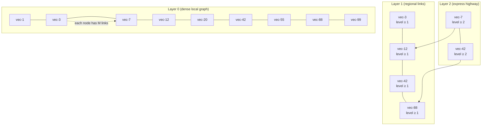
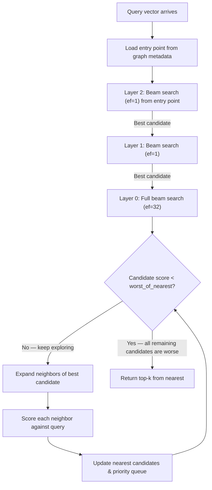

**TL;DR:** When your vector collection grows beyond ~10k points, brute-force cosine search becomes linearly slower with every new embedding — HNSW solves this by organizing vectors into a layered navigable graph that achieves logarithmic-time approximate nearest neighbor search with sub-millisecond latency.

---

## The Engineering Problem

Every genAI pipeline ends up in the same place: you have a growing collection of vector embeddings (from documents, images, audio — doesn't matter) and a user query that needs to find the *k* closest vectors in the collection.

The naive approach is brute-force: compute the cosine similarity (or dot product, or L2 distance) between your query vector and *every single vector* in the collection, sort by score, return the top *k*.

This works fine at small scale. But the math is relentless:

| Collection Size | Brute-Force Latency (1536-dim) | Per-query Cost |
|----------------|-------------------------------|----------------|
| 10,000         | ~5ms                          | Acceptable     |
| 100,000        | ~50ms                         | Noticeable     |
| 1,000,000      | ~500ms                        | Unacceptable   |
| 100,000,000    | ~50s                          | Unusable       |

At a million vectors, every RAG query takes half a second just for similarity search — before any generation happens. At a hundred million, you're waiting nearly a minute per query. For real-time applications (chatbots, search, recommendations), this is a non-starter.

The fundamental issue is that brute-force is **O(n·d)** per query — linear in the number of vectors and the dimensionality. You can't batch your way out of it, you can't shard your way out of it (you still need to check all partitions). You need a fundamentally different data structure.

**Approximate** Nearest Neighbor (ANN) search trades a small, bounded accuracy loss for dramatic speedup. Instead of checking every vector, you navigate a structure that *routes* you toward the right neighborhood. The question is: which structure?

---

## The Technical Solution: HNSW

Hierarchical Navigable Small World (HNSW) is a graph-based ANN index. The core insight: build a multi-layer graph where each layer is a "small world" network, and the top layers act as a **highway system** that lets you skip massive swaths of the search space before diving into fine-grained detail.

### Layered Graph Structure

HNSW assigns each vector to a random maximum layer. Most vectors live only on layer 0. A few reach layer 1, fewer still reach layer 2, and so on — following a geometric distribution. Higher layers have fewer nodes but longer-range links.



### The Search Algorithm

Search starts at the highest layer's entry point and descends layer by layer. At each layer, a greedy beam search (with beam width `ef`) finds the nearest neighbor, which becomes the entry point for the layer below.



The critical optimization: upper layers use `ef=1` (greedy single-path descent). Only layer 0 uses a wider beam. This means the traversal cost at upper layers is negligible — you're doing a handful of distance computations to "zoom into" the right region.

---

## The Clean Example

Here's the HNSW search logic distilled to its essence — no mmap, no concurrency, no compression formats. Just the algorithm.

### SearchContext: The Priority Queue Core

```rust
use common::fixed_length_priority_queue::FixedLengthPriorityQueue;
use common::types::{ScoreType, ScoredPointOffset};
use std::collections::BinaryHeap;

pub struct SearchContext {
    /// Bounded max-heap of nearest points found so far
    pub nearest: FixedLengthPriorityQueue<ScoredPointOffset>,
    /// Max-heap of candidates left to explore
    pub candidates: BinaryHeap<ScoredPointOffset>,
}

impl SearchContext {
    pub fn new(ef: usize) -> Self {
        SearchContext {
            nearest: FixedLengthPriorityQueue::new(ef),
            candidates: BinaryHeap::new(),
        }
    }

    /// Score of the worst point currently in `nearest` — used as early-exit threshold
    pub fn lower_bound(&self) -> ScoreType {
        match self.nearest.top() {
            None => ScoreType::min_value(),
            Some(worst_of_the_best) => worst_of_the_best.score,
        }
    }

    /// Accept a scored point: if it's close enough to enter nearest, also
    /// schedule it as a candidate for further expansion
    pub fn process_candidate(&mut self, score_point: ScoredPointOffset) {
        let was_added = match self.nearest.push(score_point) {
            None => true,
            Some(removed) => removed.idx != score_point.idx,
        };
        if was_added {
            self.candidates.push(score_point);
        }
    }
}
```

The two data structures do all the work: `nearest` is a bounded priority queue (max size = `ef`) that tracks the best points seen. `candidates` is an unbounded max-heap of points whose neighbors we haven't explored yet. The `lower_bound` method enables early termination — once the best candidate scores worse than the worst point in `nearest`, we're done.

### Single-Layer Beam Search

```rust
fn search_on_level(
    level_entry: ScoredPointOffset,
    level: usize,
    ef: usize,
    graph: &GraphLayers,
    points_scorer: &mut FilteredScorer,
) -> FixedLengthPriorityQueue<ScoredPointOffset> {
    let mut visited = VisitedList::new();
    visited.mark(level_entry.idx);

    let mut ctx = SearchContext::new(ef);
    ctx.process_candidate(level_entry);

    while let Some(candidate) = ctx.candidates.pop() {
        // Early termination: all remaining candidates are worse
        if candidate.score < ctx.lower_bound() {
            break;
        }

        // Expand neighbors of the best unexplored candidate
        for link in graph.links(candidate.idx, level) {
            if !visited.is_marked(link) {
                visited.mark(link);
                let scored = ScoredPointOffset {
                    idx: link,
                    score: points_scorer.score(link),
                };
                ctx.process_candidate(scored);
            }
        }
    }

    ctx.nearest
}
```

This is the beating heart of HNSW. Pop the best candidate, score its neighbors, push anything that improves the result back into the queue. The visited list prevents redundant scoring. The `lower_bound` check terminates early.

---

## Production Reality

Now let's look at how [qdrant/qdrant](https://github.com/qdrant/qdrant) implements this in production — with the full complexity that a real vector database requires.

### Full Search Entry Point

From `lib/segment/src/index/hnsw_index/graph_layers.rs`:

```rust
/// Object contains links between nodes for HNSW search
///
/// Assume all scores are similarities. Larger score = closer points
impl GraphLayers {
    pub fn search(
        &self,
        top: usize,
        ef: usize,
        algorithm: SearchAlgorithm,
        // Holds the query scorer + filter context
        mut points_scorer: FilteredScorer,
        // User-defined entry points (e.g. payload-filtered)
        custom_entry_points: Option<&[PointOffsetType]>,
        is_stopped: &AtomicBool,
    ) -> CancellableResult<Vec<ScoredPointOffset>> {
        // Step 1: Resolve the highest-level entry point
        let Some(entry_point) = self.get_entry_point(
            points_scorer.filters(),
            custom_entry_points,
        ) else {
            return Ok(Vec::default());
        };

        // Step 2: Greedy descent from entry level to layer 0
        //   Uses ef=1 at each upper layer — just follow the closest
        let zero_level_entry = self.search_entry(
            entry_point.point_id,
            entry_point.level,
            0,
            &mut points_scorer,
            is_stopped,
        )?;

        // Step 3: Full beam search on layer 0
        let ef = max(ef, top);
        let nearest = match algorithm {
            SearchAlgorithm::Hnsw => {
                self.search_on_level(
                    zero_level_entry, 0, ef,
                    &mut points_scorer, is_stopped,
                )
            }
            SearchAlgorithm::Acorn => {
                self.search_on_level_acorn(
                    zero_level_entry, 0, ef,
                    &mut points_scorer, is_stopped,
                )
            }
        }?;

        // Step 4: Trim to top-k and return sorted
        Ok(nearest.into_iter_sorted().take(top).collect_vec())
    }
}
```

Key production details:
- **Cancellation support** via `&AtomicBool` — long searches can be interrupted mid-traversal
- **Pluggable algorithms** — Hnsw or Acorn (a 2-hop variant for better recall with deleted vectors)
- **Custom entry points** — when you have a pre-filtered subset, you can start from its best point instead of the global one

### Layer 0 Beam Search with Visited Pool

From `lib/segment/src/index/hnsw_index/graph_layers.rs`:

```rust
/// Beam search for closest points within a single graph layer.
fn search_on_level(
    &self,
    level_entry: ScoredPointOffset,
    level: usize,
    ef: usize,
    points_scorer: &mut FilteredScorer,
    is_stopped: &AtomicBool,
) -> CancellableResult<FixedLengthPriorityQueue<ScoredPointOffset>> {
    // Reuse a visited list from a pool to avoid allocation
    let mut visited_list = self.get_visited_list_from_pool();
    visited_list.check_and_update_visited(level_entry.idx);

    let mut search_context = SearchContext::new(ef);
    search_context.process_candidate(level_entry);

    let limit = self.get_m(level);
    let mut points_ids: Vec<PointOffsetType> = Vec::with_capacity(2 * limit);

    while let Some(candidate) = search_context.candidates.pop() {
        check_process_stopped(is_stopped)?;

        // Early exit: remaining candidates can't improve results
        if candidate.score < search_context.lower_bound() {
            break;
        }

        // Collect unvisited neighbors into batch buffer
        points_ids.clear();
        self.for_each_link(candidate.idx, level, |link| {
            if !visited_list.check(link) {
                points_ids.push(link);
            }
        });

        // Score batch and update search context
        points_scorer
            .score_points(&mut points_ids, limit)
            .for_each(|score_point| {
                search_context.process_candidate(score_point);
                visited_list.check_and_update_visited(score_point.idx);
            });
    }

    Ok(search_context.nearest)
}
```

Production details visible here:
- **VisitedList pool** (`get_visited_list_from_pool`) — avoids allocating a fresh `Vec<bool>` for every query. The pool reuses memory across concurrent searches.
- **Batch scoring** (`score_points`) — instead of scoring neighbors one by one, collect them into `points_ids` and score in a single pass. This enables SIMD vectorization and cache-friendly memory access patterns.
- **Cancellable iteration** — `check_process_stopped` is called every loop iteration so that admin-triggered stops don't block.

### Greedy Entry Point Descent

```rust
/// Greedy searches for entry point of level `target_level`.
/// Beam size is 1 — just follow the best neighbor.
fn search_entry(
    &self,
    entry_point: PointOffsetType,
    top_level: usize,
    target_level: usize,
    points_scorer: &mut FilteredScorer,
    is_stopped: &AtomicBool,
) -> CancellableResult<ScoredPointOffset> {
    let mut links_buffer = Vec::new();
    let mut result = None;
    let mut level_entry = entry_point;

    // Descend from top_level down to target_level
    for level in rev_range(top_level, target_level) {
        check_process_stopped(is_stopped)?;
        let search_result = self.search_entry_on_level(
            level_entry,
            level,
            points_scorer,
            &mut links_buffer,
        );
        level_entry = search_result.idx;
        result = Some(search_result);
    }

    if let Some(result) = result {
        Ok(result)
    } else {
        // No levels traversed — return entry point with its score
        Ok(ScoredPointOffset {
            idx: entry_point,
            score: points_scorer.score_point(entry_point),
        })
    }
}

/// Simplified version of `search_on_level` that uses beam size of 1.
fn search_entry_on_level(
    &self,
    entry_point: PointOffsetType,
    level: usize,
    points_scorer: &mut FilteredScorer,
    links: &mut Vec<PointOffsetType>,
) -> ScoredPointOffset {
    let limit = self.get_m(level);
    links.clear();
    links.reserve(2 * self.get_m(0));

    let mut changed = true;
    let mut current_point = ScoredPointOffset {
        idx: entry_point,
        score: points_scorer.score_point(entry_point),
    };

    while changed {
        changed = false;
        links.clear();
        self.for_each_link(current_point.idx, level, |link| {
            links.push(link);
        });

        points_scorer.score_points(links, limit)
            .for_each(|score_point| {
                if score_point.score > current_point.score {
                    changed = true;
                    current_point = score_point;
                }
            });
    }
    current_point
}
```

This is the "highway" part of HNSW. On each upper layer, only the single best neighbor is followed — no beam, no priority queue. The `links_buffer` is reused across levels to avoid repeated allocations. The `while changed` loop converges in a handful of iterations because upper layers have long-range links that quickly get you to the right neighborhood.

### Graph Construction: Linking New Points

From `lib/segment/src/index/hnsw_index/graph_layers_builder.rs`:

```rust
pub fn link_new_point(
    &self,
    point_id: PointOffsetType,
    mut points_scorer: FilteredScorer,
) {
    let level = self.get_point_level(point_id);

    // Check if there is a suitable entry point
    //   - entry point level is higher or equal
    //   - it satisfies filters
    let entry_point_opt = self
        .entry_points
        .lock()
        .get_entry_point(|point_id| {
            points_scorer.filters().check_vector(point_id)
        });

    if let Some(entry_point) = entry_point_opt {
        let mut level_entry = if entry_point.level > level {
            // Entry point is higher — find closest on same level
            // Greedy search with beam=1
            self.search_entry(
                entry_point.point_id,
                entry_point.level,
                level,
                &mut points_scorer,
                &AtomicBool::new(false),
            ).unwrap()
        } else {
            ScoredPointOffset {
                idx: entry_point.point_id,
                score: points_scorer.score_internal(
                    point_id, entry_point.point_id,
                ),
            }
        };

        // Link from the common level down to layer 0
        let linking_level = min(level, entry_point.level);
        for curr_level in (0..=linking_level).rev() {
            level_entry = self.link_new_point_on_level(
                point_id,
                curr_level,
                &mut points_scorer,
                level_entry,
            );
        }
    }

    // Mark point as ready for search
    self.ready_list.set_aliased(point_id as usize, true);

    // Update entry points if this point is the new highest-level
    self.entry_points.lock().new_point(
        point_id, level,
        |point_id| points_scorer.filters().check_vector(point_id),
    );
}
```

Construction mirrors search: find the entry point, descend to the new point's level, then link at each level by finding the nearest neighbors and inserting bidirectional edges with a heuristic that prunes low-quality links.

### Entry Point Management

From `lib/segment/src/index/hnsw_index/entry_points.rs`:

```rust
pub fn new_point<F>(
    &mut self,
    new_point: PointOffsetType,
    level: usize,
    checker: F,
) -> Option<EntryPoint>
where
    F: Fn(PointOffsetType) -> bool,
{
    // 3 cases:
    // 1. Existing entry is same or higher level — register as extra, keep existing
    // 2. New point is higher — swap it in, demote old to extra
    // 3. No entry points exist yet — create the first one
    for i in 0..self.entry_points.len() {
        let candidate = &self.entry_points[i];
        if !checker(candidate.point_id) {
            continue;
        }
        return if candidate.level >= level {
            self.extra_entry_points.push(EntryPoint {
                point_id: new_point, level,
            });
            Some(candidate.clone())
        } else {
            let entry = self.entry_points[i].clone();
            self.entry_points[i] = EntryPoint {
                point_id: new_point, level,
            };
            self.extra_entry_points.push(entry.clone());
            Some(entry)
        };
    }
    // No entry points found — create the first one
    let new_entry = EntryPoint {
        point_id: new_point, level,
    };
    self.entry_points.push(new_entry);
    None
}
```

The entry point is the "root" of the hierarchy. Qdrant maintains a small set of high-level entry points (the primary one plus a fallback pool of `extra_entry_points`) so that even with deletions, there's always a valid starting node for search descent.

---

## Review Checklist

- **O(n·d) brute-force is the problem.** When your vector collection passes ~10k points, per-query latency scales linearly. HNSW reduces this to roughly O(log(n)·d) by navigating a graph instead of scanning.

- **The layered structure is a highway system.** Upper layers have fewer nodes and longer-range links. Search descends greedily (beam=1) through upper layers, then switches to a wider beam (ef) at layer 0 for local precision.

- **Visited lists prevent redundant scoring.** Every point is scored at most once per layer. Qdrant pools these lists across queries to avoid allocation overhead.

- **Bidirectional links + pruning heuristics.** Links are inserted in both directions, but a heuristic prunes weak connections to keep the graph navigable. Without this, the graph degenerates into a clique.

---

## FAQ

**Q: What's the difference between `ef` and `ef_construct`?**
A: `ef_construct` controls beam width during *indexing* — higher values produce a better graph but slower builds. `ef` controls beam width during *query time* — higher values improve recall but cost more distance computations. A typical production setup uses `ef_construct=128` for builds and `ef=32..128` for queries, tuned to your recall/latency budget.

**Q: What does the `M` parameter do?**
A: `M` is the maximum number of links per node per layer (and `M0 = 2*M` at layer 0). Higher `M` means denser graphs with better recall but more memory and slower construction. Qdrant uses `HnswM` to manage this, with layer 0 getting double the links because it's the most traversed.

**Q: How does HNSW handle deletions?**
A: Qdrant marks vectors as deleted and lazily cleans up links during segment consolidation. The Acorn algorithm (`SearchAlgorithm::Acorn`) provides better recall on graphs with deletions by doing 2-hop neighbor exploration to route around dead nodes.

**Q: Why does Qdrant have compressed graph link formats?**
A: The `links.bin` file stores all graph edges. For large collections, this file can be hundreds of megabytes. The compressed format (`links_compressed.bin`) reduces memory footprint significantly, and the `CompressedWithVectors` variant stores vectors inline in the link structure for cache-friendly access during traversal.

**Q: Can I use filtered search with HNSW?**
A: Yes. Qdrant supports payload filters on HNSW search. When a filter is active, the `FilteredScorer` skips vectors that don't match, and `custom_entry_points` can seed the traversal from the highest-level point that passes the filter — avoiding wasted computation at upper layers.

---

## Source

This post examines the HNSW implementation from the [qdrant/qdrant](https://github.com/qdrant/qdrant) repository (Rust). The primary files analyzed:

- [`lib/segment/src/index/hnsw_index/graph_layers.rs`](https://github.com/qdrant/qdrant/blob/master/lib/segment/src/index/hnsw_index/graph_layers.rs) — Search algorithms (`search`, `search_on_level`, `search_entry`)
- [`lib/segment/src/index/hnsw_index/graph_layers_builder.rs`](https://github.com/qdrant/qdrant/blob/master/lib/segment/src/index/hnsw_index/graph_layers_builder.rs) — Graph construction (`link_new_point`, `link_with_heuristic`)
- [`lib/segment/src/index/hnsw_index/search_context.rs`](https://github.com/qdrant/qdrant/blob/master/lib/segment/src/index/hnsw_index/search_context.rs) — `SearchContext` priority queue core
- [`lib/segment/src/index/hnsw_index/entry_points.rs`](https://github.com/qdrant/qdrant/blob/master/lib/segment/src/index/hnsw_index/entry_points.rs) — Entry point management and fallback pools
