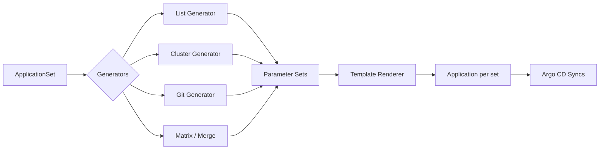
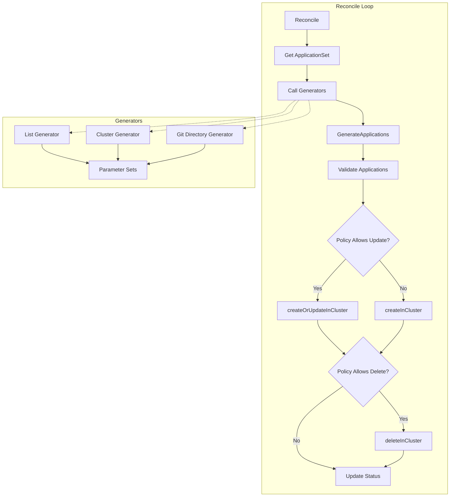

## TL;DR

Argo CD ApplicationSets let you define a single YAML resource that automatically generates multiple `Application` resources based on dynamic parameters—clusters, directories, Git repos, or cluster generator lists. Instead of managing 50 individual Application manifests, you write one ApplicationSet and let the controller do the rest. The generator expands parameters, renders templates, and reconciles Applications with full ownership and lifecycle management.

---

## The Engineering Problem

Managing multi-cluster GitOps at scale creates a combinatorial explosion of `Application` resources. If you deploy `microservices × clusters × environments`, the number of manifests grows quadratically:

| Component | Clusters | Environments | Applications |
|-----------|----------|--------------|--------------|
| frontend  | 3        | 2            | 6            |
| backend   | 3        | 2            | 6            |
| worker    | 3        | 2            | 6            |
| **Total** |          |              | **18**       |

Add a fourth microservice or a new staging environment, and you're editing 18+ files. Each `Application` must carry:
- Correct `destination.server` or `destination.name`
- Environment-specific Helm values
- Proper labels and annotations for RBAC
- Owner references back to a managing resource

Manual drift is inevitable. Deleting an environment means hunting down every Application that targets it. Adding a cluster means creating N new manifests by hand. The App-of-Apps pattern (parent Application deploying child Applications) partially solves this but introduces its own complexity: the parent must render templated children, and reconciliation failures cascade.

---

## Technical Solution

ApplicationSets solve this by separating **parameter generation** from **Application rendering**. The ApplicationSet controller:

1. Runs one or more **generators** to produce parameter lists
2. Renders a **template** for each parameter set
3. Creates/updates/deletes `Application` resources with owner references



The controller itself (`applicationset_controller.go`) orchestrates this loop:

```go
// applicationset/controllers/applicationset_controller.go
// ApplicationSetReconciler reconciles a ApplicationSet object
type ApplicationSetReconciler struct {
    client.Client
    Scheme               *runtime.Scheme
    Recorder             record.EventRecorder
    Generators           map[string]generators.Generator
    ArgoDB               db.ArgoDB
    KubeClientset        kubernetes.Interface
    Policy               argov1alpha1.ApplicationsSyncPolicy
    EnablePolicyOverride bool
    utils.Renderer
    ArgoCDNamespace              string
    ApplicationSetNamespaces     []string
    EnableProgressiveSyncs       bool
    SCMRootCAPath                string
    GlobalPreservedAnnotations   []string
    GlobalPreservedLabels        []string
    Metrics                      *metrics.ApplicationsetMetrics
    MaxResourcesStatusCount      int
    ClusterInformer              *settings.ClusterInformer
    ConcurrentApplicationUpdates int
    ProgressiveSyncManager       *progressivesync.Manager
}
```

During reconciliation, the controller calls `template.GenerateApplications` to expand generators into concrete `Application` objects, then uses `createOrUpdateInCluster` to apply them:

```go
// From applicationset/controllers/applicationset_controller.go
// desiredApplications is the main list of all expected Applications from all generators
generatedApplications, applicationSetReason, err := template.GenerateApplications(
    logCtx, applicationSetInfo, r.Generators, r.Renderer, r.Client)

// ...

// createOrUpdateInCluster will create / update application resources in the cluster.
// - For new applications, it will call create
// - For existing application, it will call update
// The function also adds owner reference to all applications, and uses it to delete them.
func (r *ApplicationSetReconciler) createOrUpdateInCluster(
    ctx context.Context, logCtx *log.Entry,
    applicationSet argov1alpha1.ApplicationSet,
    desiredApplications []argov1alpha1.Application) error {

    diffConfig, err := utils.BuildIgnoreDiffConfig(
        applicationSet.Spec.IgnoreApplicationDifferences,
        normalizers.IgnoreNormalizerOpts{})
    // ...

    g, ctx := errgroup.WithContext(ctx)
    concurrency := r.concurrency()
    g.SetLimit(concurrency)

    for _, generatedApp := range desiredApplications {
        generatedApp.Spec = *argoutil.NormalizeApplicationSpec(&generatedApp.Spec)
        g.Go(func() error {
            found := &argov1alpha1.Application{
                ObjectMeta: metav1.ObjectMeta{
                    Name:      generatedApp.Name,
                    Namespace: generatedApp.Namespace,
                },
            }

            action, err := utils.CreateOrUpdate(ctx, appLog, r.Client,
                diffConfig, found, func() error {
                    found.Spec = generatedApp.Spec
                    // Preserve specially treated argo cd annotations:
                    // https://github.com/argoproj/argo-cd/issues/10500
                    preservedAnnotations = append(preservedAnnotations,
                        defaultPreservedAnnotations...)
                    // ...
                    return controllerutil.SetControllerReference(
                        &applicationSet, found, r.Scheme)
                })
            // ...
        })
    }
    return firstAppError(appErrors)
}
```

The lifecycle diagram shows how generators feed into reconciliation:



---

## Clean Example

Deploy a three-tier application across two clusters using a single ApplicationSet:


```yaml
apiVersion: argoproj.io/v1alpha1
kind: ApplicationSet
metadata:
  name: web-stack
  namespace: argocd
spec:
  generators:
    # Cartesian product: 3 components × 2 clusters
    - matrix:
        generators:
          # Components list
          - list:
              elements:
                - component: frontend
                  path: apps/frontend
                  values:
                    replicaCount: "2"
                - component: api
                  path: apps/api
                  values:
                    replicaCount: "3"
                - component: worker
                  path: apps/worker
                  values:
                    replicaCount: "1"
          # Target clusters
          - list:
              elements:
                - cluster: staging
                  url: https://staging.example.com
                  env: staging
                - cluster: production
                  url: https://prod.example.com
                  env: production
  template:
    metadata:
      name: "{{component}}-{{cluster}}"
      labels:
        component: "{{component}}"
        environment: "{{env}}"
    spec:
      project: default
      source:
        repoURL: https://github.com/myorg/apps.git
        targetRevision: HEAD
        path: "{{path}}"
        helm:
          values: |
            replicaCount: {{values.replicaCount}}
            environment: {{env}}
      destination:
        server: "{{url}}"
        namespace: "{{component}}"
      syncPolicy:
        automated:
          prune: true
          selfHeal: true
        syncOptions:
          - CreateNamespace=true
```


This generates **6 Applications**: `frontend-staging`, `frontend-production`, `api-staging`, `api-production`, `worker-staging`, `worker-production`. Add a new cluster to the list, and the controller creates 3 more Applications automatically.

---

## Production Reality

The ApplicationSet controller handles several production concerns that aren't obvious from the spec.

### Progressive Syncs

When `EnableProgressiveSyncs` is true and a `RollingSync` strategy is configured, the controller can roll out Applications in stages rather than all at once:

```go
// From applicationset/controllers/applicationset_controller.go
if r.EnableProgressiveSyncs {
    if !progressivesync.IsRollingSyncStrategy(&applicationSetInfo) &&
        len(applicationSetInfo.Status.ApplicationStatus) > 0 {
        // If an appset was previously syncing with a `RollingSync` strategy but
        // it has switched to the default strategy, clean up the progressive sync
        // application statuses
        logCtx.Infof("Removing %v unnecessary AppStatus entries from ApplicationSet %v",
            len(applicationSetInfo.Status.ApplicationStatus), applicationSetInfo.Name)
        err := r.SetAppSetApplicationStatus(ctx, logCtx, &applicationSetInfo,
            []argov1alpha1.ApplicationSetApplicationStatus{})
    } else if progressivesync.IsRollingSyncStrategy(&applicationSetInfo) {
        // before starting progressive sync, checks if steps
        if progressivesync.IsStepsEmpty(&applicationSetInfo) {
            _ = r.setApplicationSetStatusCondition(ctx, &applicationSetInfo,
                []argov1alpha1.ApplicationSetCondition{
                    {
                        Type:    argov1alpha1.ApplicationSetConditionErrorOccurred,
                        Message: "No steps defined for rollout",
                        Reason:  argov1alpha1.ApplicationSetReasonApplicationSetRolloutError,
                        Status:  argov1alpha1.ApplicationSetConditionStatusTrue,
                    },
                }, parametersGenerated)
            return ctrl.Result{RequeueAfter: ReconcileRequeueOnValidationError}, nil
        }
        appSyncMap, err = r.ProgressiveSyncManager.PerformProgressiveSyncs(
            ctx, logCtx, applicationSetInfo, currentApplications, generatedApplications)
    }
}
```

### Deletion Handling

When an ApplicationSet is deleted, the controller respects sync policies and handles reverse deletion ordering for progressive syncs:

```go
// From applicationset/controllers/applicationset_controller.go
// Do not attempt to further reconcile the ApplicationSet if it is being deleted.
if applicationSetInfo.DeletionTimestamp != nil {
    appsetName := applicationSetInfo.Name
    deleteAllowed := utils.DefaultPolicy(applicationSetInfo.Spec.SyncPolicy,
        r.Policy, r.EnablePolicyOverride).AllowDelete()
    if !deleteAllowed {
        if err := r.removeOwnerReferencesOnDeleteAppSet(
            ctx, applicationSetInfo); err != nil {
            return ctrl.Result{}, err
        }
    }
    if progressivesync.IsDeletionOrderReversed(&applicationSetInfo) {
        currentApplications, err := r.getCurrentApplications(
            ctx, applicationSetInfo)
        requeueTime, err := r.ProgressiveSyncManager.PerformReverseDeletion(
            ctx, logCtx, applicationSetInfo, currentApplications)
        if requeueTime > 0 {
            return ctrl.Result{RequeueAfter: requeueTime}, err
        }
    }
    controllerutil.RemoveFinalizer(&applicationSetInfo,
        argov1alpha1.ResourcesFinalizerName)
    if err := r.Update(ctx, &applicationSetInfo); err != nil {
        return ctrl.Result{}, err
    }
    return ctrl.Result{}, nil
}
```

### Deterministic Error Reporting

The controller uses `firstAppError` to return a predictable error when multiple Applications fail concurrently:

```go
// From applicationset/controllers/applicationset_controller.go
// firstAppError returns the error associated with the lexicographically smallest
// application name in the provided map. This gives a deterministic result when
// multiple goroutines may have recorded errors concurrently, matching the behavior
// of the original sequential loop where the first application in iteration order
// would determine the returned error.
func firstAppError(appErrors map[string]error) error {
    if len(appErrors) == 0 {
        return nil
    }
    names := make([]string, 0, len(appErrors))
    for name := range appErrors {
        names = append(names, name)
    }
    sort.Strings(names)
    return appErrors[names[0]]
}
```

### Preserved Annotations and Labels

Certain annotations and labels survive Application updates to prevent conflicts with user workflows:

```go
// From applicationset/controllers/applicationset_controller.go
var defaultPreservedFinalizers = []string{
    argov1alpha1.PreDeleteFinalizerName,
    argov1alpha1.PostDeleteFinalizerName,
}

var defaultPreservedAnnotations = []string{
    NotifiedAnnotationKey,
    argov1alpha1.AnnotationKeyRefresh,
    argov1alpha1.AnnotationKeyHydrate,
}
```

---

## Review Checklist

Before deploying ApplicationSets to production, verify:

- [ ] **Generator scope is correct** — List/Cluster/Git generators produce the expected parameter count
- [ ] **Template naming is unique** — `metadata.name` uses generator values to avoid collisions
- [ ] **Sync policy matches intent** — `automated.prune` and `automated.selfHeal` are deliberate
- [ ] **Destination clusters exist** — The target `server` or `name` resolves to a registered cluster
- [ ] **Projects are created** — Each generated Application references an existing `AppProject`
- [ ] **Progressive syncs tested** — If using `RollingSync`, verify step ordering and health checks
- [ ] **Deletion policy configured** — Set `syncPolicy` to control whether Applications are deleted on ApplicationSet removal
- [ ] **Owner references intact** — Applications have `controllerutil.SetControllerReference` set for garbage collection

---

## FAQ

**Q: What's the difference between App-of-Apps and ApplicationSets?**

App-of-Apps uses a parent `Application` whose Helm chart or Kustomize base renders child `Application` manifests. ApplicationSets use a dedicated controller that generates `Application` resources from parameter lists. ApplicationSets are more composable—you can combine generators (matrix, merge) without writing templates.

**Q: Can I use multiple generators in one ApplicationSet?**

Yes. The `matrix` generator computes the Cartesian product of two generators. The `merge` generator combines results from two generators by matching keys. You can nest list, cluster, Git, and matrix/merge generators.

**Q: What happens when a generator returns zero results?**

No Applications are created. Existing Applications owned by the ApplicationSet are deleted if `syncPolicy` allows deletion.

**Q: Does the controller re-reconcile when a generator's source changes?**

Yes. Generators like `Git` and `Cluster` have requeue intervals. The controller also watches cluster secrets and re-reconciles when they change.

**Q: Can I preserve labels/annotations across updates?**

Yes. Use `spec.template.metadata.labels` and `spec.template.metadata.annotations` in the ApplicationSet. Additionally, Argo CD preserves certain annotations (e.g., `notified.notifications.argoproj.io`) and supports `spec.preservedFields` for custom preservation.

---

## Source

- **Repository:** [`argoproj/argo-cd`](https://github.com/argoproj/argo-cd)
- **Controller:** [`applicationset/controllers/applicationset_controller.go`](https://github.com/argoproj/argo-cd/blob/master/applicationset/controllers/applicationset_controller.go)
- **Types:** [`pkg/apis/application/v1alpha1/types.go`](https://github.com/argoproj/argo-cd/blob/master/pkg/apis/application/v1alpha1/types.go)


