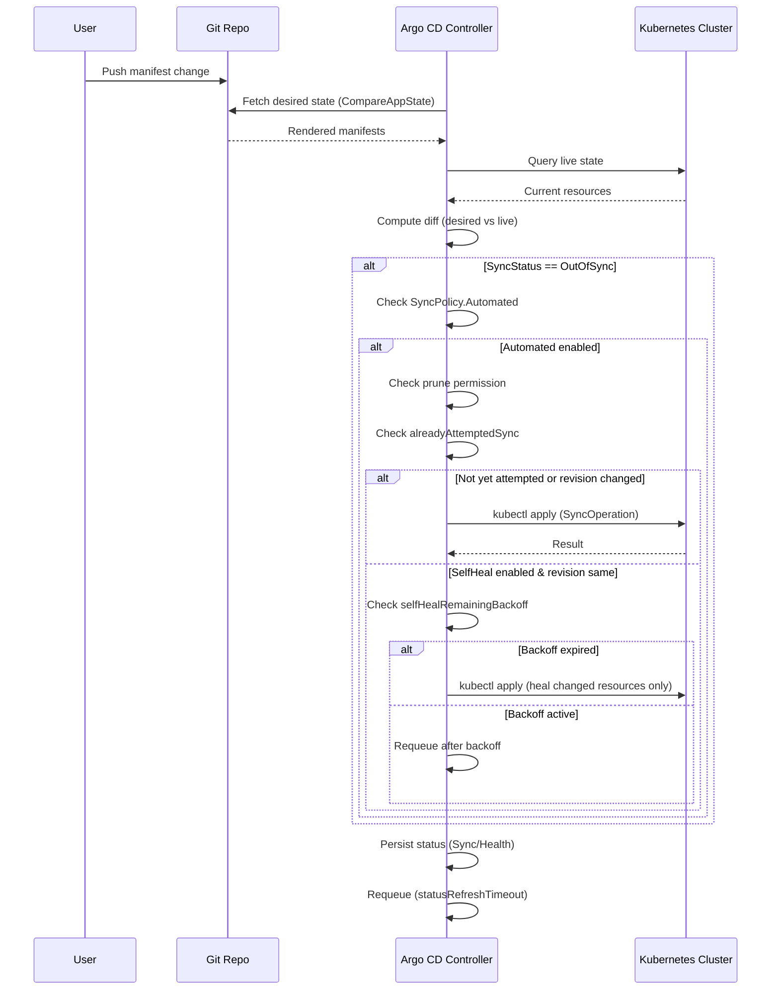

**TL;DR:** Argo CD's auto-sync uses a reconciliation loop that compares desired state against live state, decides whether to sync based on status and revision changes, and gates self-heal with exponential backoff to prevent infinite sync loops.

## The Engineering Problem

Manual `kubectl apply` is a fire-and-forget operation. You push manifests to a cluster, and then reality drifts.

An operator scales a Deployment. A CronJob creates an orphaned ConfigMap. Someone patches a Service with `kubectl edit` at 2 AM. None of these changes are recorded in Git. The cluster's actual state silently diverges from what you declared, and nobody notices until an incident.

The core issues:

- **No continuous verification.** `kubectl apply` checks once. Drift can happen seconds later.
- **No automatic rollback.** If a manual change breaks production, nothing reverts it.
- **No resource pruning.** Deleted manifests in Git leave orphaned resources running in the cluster.
- **No backoff strategy.** If a sync fails repeatedly, naive automation would retry forever, creating a thundering herd against the API server.

GitOps promises "what's in Git is what's running," but without a controller that continuously reconciles desired vs. live state, that promise is aspirational at best.

## The Technical Solution

Argo CD solves this with a reconciliation loop in the application controller. The controller watches the Application CRD, computes a diff between the desired state (from Git/Helm/Kustomize) and the live state (from the Kubernetes API), and decides whether to sync, self-heal, or do nothing.



The key insight: auto-sync doesn't just blindly apply. It runs through a chain of guards — status checks, prune permission checks, revision comparison, and backoff timers — before issuing a single `kubectl apply`.

## The Clean Example

Here's a minimal Application CRD that enables auto-sync, pruning, and self-heal:

```yaml
apiVersion: argoproj.io/v1alpha1
kind: Application
metadata:
  name: my-app
  namespace: argocd
spec:
  project: default
  source:
    repoURL: https://github.com/org/infra.git
    targetRevision: HEAD
    path: apps/my-app
  destination:
    server: https://kubernetes.default.svc
    namespace: production
  syncPolicy:
    automated:
      prune: true       # Delete resources removed from Git
      selfHeal: true    # Revert manual cluster changes
    syncOptions:
      - CreateNamespace=true
    retry:
      limit: 5
      backoff:
        duration: "5s"
        factor: 2
        maxDuration: "3m"
```

This gives you three behaviors:

1. **Auto-sync** — When Git HEAD changes and the app is OutOfSync, the controller automatically applies.
2. **Pruning** — Resources removed from Git are deleted from the cluster.
3. **Self-heal** — If someone manually patches a resource (e.g., scales a Deployment), the controller reverts it to the declared state.

## Production Reality

The clean example hides a web of safety checks. Here's what actually happens inside `argoproj/argo-cd`'s application controller.

### The autoSync guard chain

The `autoSync` function in `controller/appcontroller.go` is the entry point. Every check must pass before a sync operation is created:

```go
// controller/appcontroller.go — autoSync guard chain
// Source: https://github.com/argoproj/argo-cd/blob/master/controller/appcontroller.go

// Guard 1: Is automated sync even enabled?
if app.Spec.SyncPolicy == nil || !app.Spec.SyncPolicy.IsAutomatedSyncEnabled() {
    return nil, 0
}

// Guard 2: Is another operation already running?
if app.Operation != nil {
    logCtx.Infof("Skipping auto-sync: another operation is in progress")
    return nil, 0
}

// Guard 3: Is the app being deleted?
if app.DeletionTimestamp != nil && !app.DeletionTimestamp.IsZero() {
    logCtx.Infof("Skipping auto-sync: deletion in progress")
    return nil, 0
}

// Guard 4: Is the app actually OutOfSync?
if syncStatus.Status != appv1.SyncStatusCodeOutOfSync {
    logCtx.Infof("Skipping auto-sync: application status is %s", syncStatus.Status)
    return nil, 0
}

// Guard 5: If pruning is disabled, are we ONLY pruning?
if !app.Spec.SyncPolicy.Automated.GetPrune() {
    requirePruneOnly := true
    for _, r := range resources {
        if r.Status != appv1.SyncStatusCodeSynced && !r.RequiresPruning {
            requirePruneOnly = false
            break
        }
    }
    if requirePruneOnly {
        logCtx.Infof("Skipping auto-sync: need to prune extra resources only but automated prune is disabled")
        return nil, 0
    }
}
```

These five guards prevent: double-sync, deletion-time conflicts, unnecessary syncs when already synced, and prune-only actions when prune is disabled.

### The infinite-loop breaker

After the guards, `autoSync` checks whether this exact sync was already attempted. This is the critical anti-thrash mechanism:

```go
// Guard 6: Was this exact sync already attempted?
alreadyAttempted, lastAttemptedRevisions, lastAttemptedPhase := alreadyAttemptedSync(app, desiredRevisions, shouldCompareRevisions)
if alreadyAttempted {
    if !lastAttemptedPhase.Successful() {
        // Previous attempt failed — don't retry immediately
        message := fmt.Sprintf("Failed last sync attempt to %s: %s", lastAttemptedRevisions, app.Status.OperationState.Message)
        return &appv1.ApplicationCondition{Type: appv1.ApplicationConditionSyncError, Message: message}, 0
    }
    if !app.Spec.SyncPolicy.Automated.GetSelfHeal() {
        // Sync was already successful and self-heal is off — nothing to do
        logCtx.Infof("Skipping auto-sync: most recent sync already to %s", desiredRevisions)
        return nil, 0
    }
```

If the sync was already attempted and succeeded, and self-heal is **disabled**, the controller stops. No infinite loop. If self-heal **is** enabled, it proceeds to the backoff check.

### Self-heal backoff

Self-heal only triggers when the **revision hasn't changed** — meaning the drift is in the cluster, not in Git. The controller uses exponential backoff to avoid hammering the API server:

```go
// Self-heal backoff: only heal changed resources, not a full sync
if app.Spec.SyncPolicy.Automated.GetSelfHeal() {
    // Preserve attempt count across retries
    op.Sync.SelfHealAttemptsCount = app.Status.OperationState.Operation.Sync.SelfHealAttemptsCount

    if remainingTime := ctrl.selfHealRemainingBackoff(app, int(op.Sync.SelfHealAttemptsCount)); remainingTime > 0 {
        logCtx.Infof("Skipping auto-sync: already attempted sync to %s with timeout %v (retrying in %v)",
            lastAttemptedRevisions, ctrl.selfHealTimeout, remainingTime)
        ctrl.requestAppRefresh(app.QualifiedName(), CompareWithLatest.Pointer(), &remainingTime)
        return nil, 0
    }

    op.Sync.SelfHealAttemptsCount++
    // Only sync the specific resources that drifted, not everything
    for _, resource := range resources {
        if resource.Status != appv1.SyncStatusCodeSynced {
            op.Sync.Resources = append(op.Sync.Resources, appv1.SyncOperationResource{
                Kind:  resource.Kind,
                Group: resource.Group,
                Name:  resource.Name,
            })
        }
    }
}
```

The `selfHealRemainingBackoff` function computes how long to wait based on `selfHealTimeout` and the `selfHealBackoff` strategy (exponential with configurable factor, duration, and max):

```go
// controller/appcontroller.go — selfHealRemainingBackoff
func (ctrl *ApplicationController) selfHealRemainingBackoff(app *appv1.Application, selfHealAttemptsCount int) time.Duration {
    if app.Status.OperationState == nil {
        return time.Duration(0)
    }

    var timeSinceOperation *time.Duration
    if app.Status.OperationState.FinishedAt != nil {
        timeSinceOperation = new(time.Since(app.Status.OperationState.FinishedAt.Time))
    }

    var retryAfter time.Duration
    if ctrl.selfHealBackoff == nil {
        if timeSinceOperation == nil {
            retryAfter = ctrl.selfHealTimeout
        } else {
            retryAfter = ctrl.selfHealTimeout - *timeSinceOperation
        }
    } else {
        backOff := *ctrl.selfHealBackoff
        backOff.Steps = selfHealAttemptsCount
        var delay time.Duration
        steps := backOff.Steps
        for range steps {
            delay = backOff.Step()
        }
        if timeSinceOperation == nil {
            retryAfter = delay
        } else {
            retryAfter = delay - *timeSinceOperation
        }
    }
    return retryAfter
}
```

### The wipe-out guard

Before executing, one final safety check: if prune is enabled and **every** resource would be deleted, the controller blocks the sync to prevent accidental cluster wipeouts:

```go
// Guard 7: Don't wipe the cluster
if app.Spec.SyncPolicy.Automated.GetPrune() && !app.Spec.SyncPolicy.Automated.GetAllowEmpty() {
    bAllNeedPrune := true
    for _, r := range resources {
        if !r.RequiresPruning {
            bAllNeedPrune = false
        }
    }
    if bAllNeedPrune {
        message := fmt.Sprintf("Skipping sync attempt to %s: auto-sync will wipe out all resources", desiredRevisions)
        logCtx.Warn(message)
        return &appv1.ApplicationCondition{Type: appv1.ApplicationConditionSyncError, Message: message}, 0
    }
}
```

### The type definitions

These are the actual types that drive the behavior from `pkg/apis/application/v1alpha1/types.go`:

```go
// pkg/apis/application/v1alpha1/types.go
// Source: https://github.com/argoproj/argo-cd/blob/master/pkg/apis/application/v1alpha1/types.go

// SyncPolicy controls when a sync will be performed in response to updates in git
type SyncPolicy struct {
    Automated                *SyncPolicyAutomated     `json:"automated,omitempty"`
    SyncOptions              SyncOptions              `json:"syncOptions,omitempty"`
    Retry                    *RetryStrategy           `json:"retry,omitempty"`
    ManagedNamespaceMetadata *ManagedNamespaceMetadata `json:"managedNamespaceMetadata,omitempty"`
}

// SyncPolicyAutomated controls the behavior of an automated sync
type SyncPolicyAutomated struct {
    Prune      *bool `json:"prune,omitempty"`      // Delete resources removed from Git
    SelfHeal   *bool `json:"selfHeal,omitempty"`   // Revert manual cluster changes
    AllowEmpty *bool `json:"allowEmpty,omitempty"` // Allow zero live resources
    Enabled    *bool `json:"enabled,omitempty"`    // Explicitly control automated sync
}
```

Note the `*bool` pointers: `nil` defaults to `false` via `GetPrune()` and `GetSelfHeal()` helper methods, making the policy opt-in per behavior.

## Review Checklist

- [ ] Is `syncPolicy.automated` set on every production Application?
- [ ] Is `prune: true` enabled? If not, are you prepared to clean up orphaned resources manually?
- [ ] Is `selfHeal: true` enabled for critical workloads where drift is unacceptable?
- [ ] Is `allowEmpty` set to `true` only when intentional? The wipe-out guard blocks syncs that would delete everything.
- [ ] Is the `retry.limit` set? Default is 5 with exponential backoff.
- [ ] Are you using `ignoreDifferences` to let specific fields drift safely (e.g., HPA-managed replica counts)?
- [ ] Are sync windows configured to prevent auto-sync during maintenance windows?
- [ ] Is `selfHealTimeout` tuned? Default is a simple timeout; consider configuring `selfHealBackoff` with exponential factor for high-frequency apps.

## FAQ

**Q: What happens if auto-sync fails?**
A: The controller sets an `ApplicationConditionSyncError` condition and retries according to the configured `retry` strategy with exponential backoff (factor, duration, maxDuration).

**Q: Does self-heal sync everything or just the drifted resources?**
A: Just the drifted resources. When self-heal triggers, it appends only the OutOfSync resources to `op.Sync.Resources`, not a full sync of the entire application.

**Q: Can I disable self-heal but keep auto-sync?**
A: Yes. Set `selfHeal: false` (or omit it). The controller will auto-sync on Git changes but won't revert manual cluster modifications.

**Q: Why does auto-sync skip when pruning is disabled and only pruning is needed?**
A: Because `prune: false` means you explicitly chose not to delete resources. The controller respects that by not syncing when the only action would be deletion.

**Q: What prevents an infinite sync loop?**
A: The `alreadyAttemptedSync` check. If the same revision was already synced successfully and self-heal is off, the controller stops. With self-heal on, it uses exponential backoff (`selfHealTimeout` / `selfHealBackoff`) with attempt counting.

## Source

This post is based on the following files from the [`argoproj/argo-cd`](https://github.com/argoproj/argo-cd) repository:

- [`controller/appcontroller.go`](https://github.com/argoproj/argo-cd/blob/master/controller/appcontroller.go) — The main application controller with `autoSync`, `selfHealRemainingBackoff`, and the reconciliation loop (`processAppRefreshQueueItem`)
- [`pkg/apis/application/v1alpha1/types.go`](https://github.com/argoproj/argo-cd/blob/master/pkg/apis/application/v1alpha1/types.go) — The CRD types including `SyncPolicy`, `SyncPolicyAutomated`, `SyncOperation`, and `SelfHealAttemptsCount`
