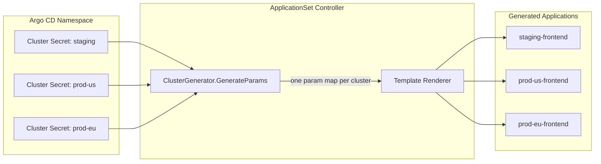

**TL;DR:** Does the cluster generator actually *read* cluster Secrets at runtime, or does it just use a static list you paste in? It reads them live — every time the ApplicationSet controller reconciles, `ClusterGenerator.GenerateParams` queries the Kubernetes API for Secrets labeled `argocd.argoproj.io/secret-type: cluster`, extracts `name`, `server`, `project`, and metadata from each, and emits one parameter map per matching cluster. Register a new cluster in Argo CD and the next reconciliation cycle automatically creates the corresponding `Application` — zero manifest edits required.

> **In plain English (30 sec):** Code you already write — Map, function, API call, just bigger.

## 1. The Engineering Problem

Multi-cluster deployments create an N×M management burden: every application needs a separate `Application` manifest for every cluster it targets. The problem compounds when clusters come and go dynamically.

| Application | Staging | Production-US | Production-EU | Total |
|-------------|---------|---------------|---------------|-------|
| frontend    | 1       | 1             | 1             | 3     |
| api         | 1       | 1             | 1             | 3     |
| worker      | 1       | 1             | 1             | 3     |
| **Total**   |         |               |               | **9** |

Add a new production region, and every application needs a new manifest. Register a new cluster with Argo CD, and nothing happens automatically — someone must remember to create the matching `Application` resources by hand. Worse, deleting a cluster leaves orphaned `Application` objects pointing at a server that no longer exists, which Argo CD will try (and fail) to sync against.

The core tension: Argo CD already *knows* which clusters exist — they're registered as Secrets in the Argo CD namespace. But that knowledge doesn't automatically translate into deployment targets.

## 2. The Technical Solution

The cluster generator bridges this gap by treating Argo CD's own cluster registry as a live data source. On every reconciliation, it queries for Secrets with the `argocd.argoproj.io/secret-type: cluster` label and emits one parameter map per cluster. A label selector narrows the scope, and a template turns each parameter map into a full `Application` resource.



The generator is one of nine available generators in the ApplicationSet spec. It runs alongside list, git, matrix, merge, and others — each producing parameter maps, all feeding into the same template renderer.

### How label selectors narrow scope

Without a selector, the generator targets every registered cluster — including the local `in-cluster`. A `matchLabels` selector filters to only those Secrets carrying specific labels, which also implicitly excludes the local cluster (since it has no Secret by default):

```yaml
generators:
  - clusters:
      selector:
        matchLabels:
          environment: production
```

This means only clusters whose Secret carries `environment: production` produce parameter maps. A new staging cluster won't generate an `Application` until someone adds the right label to its Secret.

### Flat mode: one Application listing all clusters

Normally, the generator produces N Applications — one per cluster. With `flatList: true`, it collapses everything into a single parameter map where `clusters` is an array of all matching cluster objects. This is useful when an application itself handles multi-cluster logic internally (e.g., a service mesh control plane or an observability collector):

```mermaid
flowchart TD
    subgraph Standard["Standard Mode: 1 Application per cluster"]
        S1[Cluster: staging] --> SA[staging-app]
        S2[Cluster: prod-us] --> SB[prod-us-app]
        S3[Cluster: prod-eu] --> SC[prod-eu-app]
    end

    subgraph Flat["flatList Mode: 1 Application with cluster array"]
        F1[Cluster: staging] --> FA[flat-app]
        F2[Cluster: prod-us] --> FA
        F3[Cluster: prod-eu] --> FA
        FA --> |clusters: [staging, prod-us, prod-eu]| FB[Application with embedded cluster list]
    end
```

## 3. Clean Example

Deploy a web stack across all production-labeled clusters:


```yaml
apiVersion: argoproj.io/v1alpha1
kind: ApplicationSet
metadata:
  name: web-stack-multi-cluster
  namespace: argocd
spec:
  goTemplate: true
  goTemplateOptions: ["missingkey=error"]
  generators:
    - clusters:
        selector:
          matchLabels:
            environment: production
        values:
          revision: stable
    - list:
        elements:
          - component: frontend
            path: apps/frontend
          - component: api
            path: apps/api
  strategy:
    type: RollingSync
    rollingSync:
      steps:
        - matchExpressions:
            - key: app
              operator: In
              values:
                - frontend
          maxUpdate: 100%
        - matchExpressions:
            - key: app
              operator: In
              values:
                - api
          maxUpdate: 1
  template:
    metadata:
      name: '{{.name}}-{{.component}}'
      labels:
        app: '{{.component}}'
        cluster: '{{.name}}'
    spec:
      project: default
      source:
        repoURL: https://github.com/myorg/apps.git
        targetRevision: '{{.values.revision}}'
        path: '{{.path}}'
      destination:
        server: '{{.server}}'
        namespace: '{{.component}}'
      syncPolicy:
        automated:
          prune: true
          selfHeal: true
        syncOptions:
          - CreateNamespace=true
```


With three production clusters registered, this generates six Applications: `prod-us-frontend`, `prod-eu-frontend`, `prod-in-frontend`, `prod-us-api`, `prod-eu-api`, `prod-in-api`. Register a fourth cluster labeled `environment: production` and the next reconciliation creates two more automatically.

## 4. Production Reality

The real `ClusterGenerator` source handles several details that don't surface in the spec.

### Parameter extraction from Secrets

The generator reads cluster identity directly from the Secret's `data` fields, not from any Argo CD API abstraction — `name`, `server`, and `project` are plain string reads:

```go
// From applicationset/generators/cluster.go
func (g *ClusterGenerator) getClusterParameters(cluster corev1.Secret, appSet *argoappsetv1alpha1.ApplicationSet) map[string]any {
    params := map[string]any{}

    params["name"] = string(cluster.Data["name"])
    params["nameNormalized"] = utils.SanitizeName(string(cluster.Data["name"]))
    params["server"] = string(cluster.Data["server"])

    project, ok := cluster.Data["project"]
    if ok {
        params["project"] = string(project)
    } else {
        params["project"] = ""
    }

    if appSet.Spec.GoTemplate {
        meta := map[string]any{}
        if len(cluster.Annotations) > 0 {
            meta["annotations"] = cluster.Annotations
        }
        if len(cluster.Labels) > 0 {
            meta["labels"] = cluster.Labels
        }
        params["metadata"] = meta
    } else {
        for key, value := range cluster.Annotations {
            params["metadata.annotations."+key] = value
        }
        for key, value := range cluster.Labels {
            params["metadata.labels."+key] = value
        }
    }
    return params
}
```

The `nameNormalized` parameter exists because Kubernetes resource names have strict character rules. A cluster named `my_cluster` would produce an invalid Application name `my_cluster-app` — `nameNormalized` sanitizes it to `my-cluster-app`.

### How cluster discovery actually works

The generator doesn't call an Argo CD API. It queries the Kubernetes API directly for Secrets in the Argo CD namespace, using a label selector that always includes `argocd.argoproj.io/secret-type: cluster`:

```go
// From applicationset/generators/cluster.go
func (g *ClusterGenerator) getSecretsByClusterName(log *log.Entry, appSetGenerator *argoappsetv1alpha1.ApplicationSetGenerator) (map[string]corev1.Secret, error) {
    clusterSecretList := &corev1.SecretList{}

    selector := metav1.AddLabelToSelector(&appSetGenerator.Clusters.Selector, common.LabelKeySecretType, common.LabelValueSecretTypeCluster)
    secretSelector, err := metav1.LabelSelectorAsSelector(selector)
    if err != nil {
        return nil, fmt.Errorf("error converting label selector: %w", err)
    }

    if err := g.List(context.Background(), clusterSecretList, client.InNamespace(g.namespace), client.MatchingLabelsSelector{Selector: secretSelector}); err != nil {
        return nil, err
    }

    res := map[string]corev1.Secret{}
    for _, cluster := range clusterSecretList.Items {
        clusterName := string(cluster.Data["name"])
        res[clusterName] = cluster
    }
    return res, nil
}
```

The user's `selector` is merged with the hardcoded `argocd.argoproj.io/secret-type: cluster` label — you can never accidentally query non-cluster Secrets. The result is deduplicated by cluster name, so if somehow two Secrets reference the same cluster, only one parameter set is emitted.

### Local cluster handling

The local `in-cluster` doesn't have a Secret by default, so the generator adds it as a fallback — but only when no label selector is in use:

```go
// From applicationset/generators/cluster.go — inside GenerateParams()
ignoreLocalClusters := len(appSetGenerator.Clusters.Selector.MatchExpressions) > 0 || len(appSetGenerator.Clusters.Selector.MatchLabels) > 0

// ... after processing all cluster secrets ...

if !ignoreLocalClusters && !utils.SecretsContainInClusterCredentials(secretsList) {
    params := map[string]any{}
    params["name"] = argoappsetv1alpha1.KubernetesInClusterName
    params["nameNormalized"] = argoappsetv1alpha1.KubernetesInClusterName
    params["server"] = argoappsetv1alpha1.KubernetesInternalAPIServerAddr
    params["project"] = ""
    paramHolder.append(params)
}
```

This means a bare `generators: [{clusters: {}}]` targets all clusters *including* local. Any `selector` automatically excludes the local cluster because it has no labeled Secret to match against. If you want both local and remote with a selector, you must explicitly create a Secret for the local cluster.

### Flat mode consolidation

The `paramHolder` collects parameter maps and, when `flatList` is true, wraps them into a single map with a `clusters` key:

```go
// From applicationset/generators/cluster.go
func (p *paramHolder) consolidate() []map[string]any {
    if p.isFlatMode {
        p.params = []map[string]any{
            {"clusters": p.params},
        }
    }
    return p.params
}
```

This is the difference between generating one Application per cluster and generating one Application that knows about all of them — the template receives `{{range .clusters}}` instead of `{{.name}}`.

### No automatic requeue

The generator explicitly returns `NoRequeueAfter`, relying on a separate event handler to trigger re-reconciliation when cluster Secrets change:

```go
// From applicationset/generators/cluster.go
func (g *ClusterGenerator) GetRequeueAfter(_ *argoappsetv1alpha1.ApplicationSetGenerator) time.Duration {
    return NoRequeueAfter
}
```

This means the cluster generator is purely reactive — it does not poll. When someone registers a new cluster (creating a new Secret), the `clusterSecretEventHandler` in the controller requeues the ApplicationSet, which triggers a fresh `GenerateParams` call that picks up the new cluster automatically.

## 5. Review Checklist

- [ ] **Cluster Secrets exist and are labeled** — Every target cluster must have a Secret in the Argo CD namespace with `argocd.argoproj.io/secret-type: cluster`
- [ ] **Label selectors match intentionally** — A `selector` excludes the local `in-cluster` by default; verify this is the desired behavior
- [ ] **Template uses `nameNormalized` where needed** — If cluster names contain underscores or special characters, `{{.nameNormalized}}` produces valid Kubernetes resource names
- [ ] **`values` field is templated correctly** — Custom values from `generators.clusters.values` are accessed as `{{.values.key}}`, not `{{.key}}`
- [ ] **`flatList` vs standard mode is deliberate** — Standard mode generates N Applications; `flatList` generates one Application with an embedded cluster array
- [ ] **Sync policy handles cluster removal** — When a cluster Secret is deleted, the generator stops producing parameters for it; verify the Application is cleaned up (not just orphaned)
- [ ] **Go template mode is consistent** — Mixed usage of `goTemplate: true` and old-style `{{name}}` templating in the same ApplicationSet produces errors
- [ ] **Progressive syncs tested** — If using `RollingSync` with cluster generator output, verify step ordering against cluster names which are now dynamic

## 6. FAQ

**Q: Does the cluster generator detect new clusters in real time?**

A: Not on a timer — the generator returns `NoRequeueAfter` and relies entirely on the `clusterSecretEventHandler` to trigger re-reconciliation when Secrets change. A newly registered cluster is picked up within seconds of its Secret being created, not on any polling interval.

**Q: Can I target only remote clusters and exclude `in-cluster`?**

A: Yes. Any `selector` with `matchLabels` or `matchExpressions` automatically excludes the local cluster because the local cluster has no Secret with the `argocd.argoproj.io/secret-type` label. Without a selector, the local cluster is included as a fallback.

**Q: What happens if two cluster Secrets have the same `name` field?**

A: The generator deduplicates by cluster name — `getSecretsByClusterName` returns a map keyed on `name`, so the second Secret silently overwrites the first. Ensure cluster names are unique across Secrets.

**Q: Can I use cluster metadata (labels, annotations) in the Application template?**

A: Yes. With `goTemplate: true`, cluster labels and annotations are available under `.metadata.labels` and `.metadata.annotations` — they come directly from the cluster Secret's Kubernetes metadata, not from the `data` fields.

**Q: How does `flatList` interact with multiple cluster generators?**

A: Each `flatList` cluster generator produces its own single Application — they don't merge. If you have two cluster generators with different selectors and both set `flatList: true`, you get two Applications, each with its own embedded cluster list.

---

## Source

- **Repository:** [`argoproj/argo-cd`](https://github.com/argoproj/argo-cd)
- **Generator:** [`applicationset/generators/cluster.go`](https://github.com/argoproj/argo-cd/blob/master/applicationset/generators/cluster.go) — `ClusterGenerator.GenerateParams`, `getClusterParameters`, `getSecretsByClusterName`
- **Docs:** [`docs/operator-manual/applicationset/Generators-Cluster.md`](https://github.com/argoproj/argo-cd/blob/master/docs/operator-manual/applicationset/Generators-Cluster.md) — label selectors, `flatList` mode, `values` interpolation


