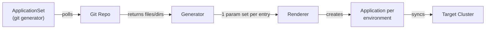
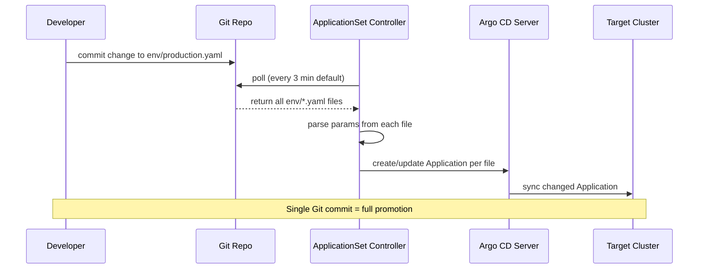

## TL;DR

Argo CD's Git generator reads files or directories from a Git repository and produces an `Application` per entry automatically. Environment promotion becomes a Git commit—edit a version file in `env/`, push, and Argo CD reconciles the changed environment. No scripts, no CI runs, no manual approvals outside Git.

---

## Engineering Problem

When you have dev, staging, and production clusters, you need a repeatable way to promote a new application version from one environment to the next. The common failures:

1. **Script-driven promotion** — A CI pipeline bumps a version file, applies a Kustomize overlay, or runs `kubectl set image`. Each step is invisible outside the pipeline log.
2. **Drift between environments** — Someone edits production directly. Nobody knows until the next deploy breaks.
3. **No audit trail** — Who promoted v1.2.3 to prod? The CI badge says "green." The Git log says nothing.
4. **Boilerplate proliferation** — One `Application` manifest per environment × per service. Copy-paste errors multiply.

The core question: how do you make environment promotion a **Git operation** with a built-in audit trail, instead of a script that lives outside version control?

---

## Technical Solution

### How the Git Generator Works

The Git generator polls a repository, reads a file or enumerates directories, and emits one parameter set per entry. Argo CD then renders an `Application` from those parameters.



**What the source does** — `git.go:GenerateParams` branches on the generator type:

```go
// applicationset/generators/git.go — GenerateParams entry point
switch {
case len(appSetGenerator.Git.Directories) != 0:
    res, err = g.generateParamsForGitDirectories(appSetGenerator, noRevisionCache, sourceIntegrity, appSet.Spec.GoTemplate, project, appSet.Spec.GoTemplateOptions)
case len(appSetGenerator.Git.Files) != 0:
    res, err = g.generateParamsForGitFiles(appSetGenerator, noRevisionCache, sourceIntegrity, appSet.Spec.GoTemplate, project, appSet.Spec.GoTemplateOptions)
default:
    return nil, ErrEmptyAppSetGenerator
}
```

Either you point at **directories** (one subdir = one environment) or at **files** (one YAML file = one environment).

### Environment Promotion via File-Based Generator

The promotion workflow relies on a file-based generator. Each file in a directory describes one environment's desired state.



**What the source does** — `git.go:generateParamsForGitFiles` reads files matching include/exclude patterns and parses each as YAML:

```go
// applicationset/generators/git.go — file-based generator core loop
for _, includePattern := range includePatterns {
    retrievedFiles, err := g.repos.GetFiles(
        context.TODO(),
        appSetGenerator.Git.RepoURL,
        appSetGenerator.Git.Revision,
        project,
        includePattern,
        noRevisionCache,
        sourceIntegrity,
    )
    if err != nil {
        return nil, err
    }
    maps.Copy(fileContentMap, retrievedFiles)
}

// Now remove files matching any exclude pattern
for _, excludePattern := range excludePatterns {
    matchingFiles, err := g.repos.GetFiles(
        context.TODO(),
        appSetGenerator.Git.RepoURL,
        appSetGenerator.Git.Revision,
        project,
        excludePattern,
        noRevisionCache,
        sourceIntegrity,
    )
    // ... delete matched entries from fileContentMap
}
```

Each file is then parsed into a parameter map that feeds the `Application` template.

---

## Clean Example

### Repository Layout

```
gitops-infra/
├── applicationset.yaml
└── envs/
    ├── dev.yaml
    ├── staging.yaml
    └── production.yaml
```

### Environment Files

One file per environment. Changing `tag` in `production.yaml` promotes the version.

```yaml
# envs/dev.yaml
cluster: dev-cluster
namespace: myapp-dev
image: myapp
tag: v1.2.3-rc1
replicas: 1
```

```yaml
# envs/staging.yaml
cluster: staging-cluster
namespace: myapp-staging
image: myapp
tag: v1.2.3-rc1
replicas: 2
```

```yaml
# envs/production.yaml
cluster: prod-cluster
namespace: myapp-prod
image: myapp
tag: v1.2.2
replicas: 5
```

### ApplicationSet Manifest

```yaml
apiVersion: argoproj.io/v1alpha1
kind: ApplicationSet
metadata:
  name: myapp
  namespace: argocd
spec:
  goTemplate: true
  generators:
    - git:
        repoURL: https://github.com/myorg/gitops-infra.git
        revision: main
        files:
          - path: envs/*.yaml
  template:
    metadata:
      name: 'myapp-{{.cluster}}'
    spec:
      project: default
      source:
        repoURL: https://github.com/myorg/myapp.git
        targetRevision: '{{.tag}}'
        path: charts/myapp
      destination:
        server: 'https://{{.cluster}}.internal'
        namespace: '{{.namespace}}'
      syncPolicy:
        automated:
          prune: true
          selfHeal: true
```

### Promotion Workflow

Promote v1.2.3 to production — one file edit, one commit:

```bash
# Edit the production environment file
sed -i 's/tag: v1.2.2/tag: v1.2.3/' envs/production.yaml

# Commit and push — Argo CD picks up the change
git add envs/production.yaml
git commit -m "promote myapp v1.2.3 to production"
git push origin main
```

Argo CD's ApplicationSet controller polls the repo, detects the changed `production.yaml`, and syncs only the `myapp-prod` Application. No scripts. No CI trigger. No manual `kubectl`.

---

## Production Reality

### Requeue Interval

The generator doesn't use a Webhook. It polls. The default requeue interval is 3 minutes, configurable per ApplicationSet:

```go
// applicationset/generators/git.go — requeue behavior
func (g *GitGenerator) GetRequeueAfter(appSetGenerator *argoprojiov1alpha1.ApplicationSetGenerator) time.Duration {
    if appSetGenerator.Git.RequeueAfterSeconds != nil {
        return time.Duration(*appSetGenerator.Git.RequeueAfterSeconds) * time.Second
    }

    return getDefaultRequeueAfter()
}
```

Set `requeueAfterSeconds` to lower values if you need faster detection, or rely on the default 3-minute window.

### Path Parameter Injections

The generator automatically injects path-derived parameters — `path`, `path.basename`, `path.filename`, `path.segments` — so you can reference them in the Application template without writing any custom logic:

```go
// applicationset/generators/git.go — automatic path params for Go templates
paramPath := map[string]any{}
paramPath["path"] = path.Dir(filePath)
paramPath["basename"] = path.Base(paramPath["path"].(string))
paramPath["filename"] = path.Base(filePath)
paramPath["basenameNormalized"] = utils.SanitizeName(path.Base(paramPath["path"].(string)))
paramPath["filenameNormalized"] = utils.SanitizeName(path.Base(paramPath["filename"].(string)))
paramPath["segments"] = strings.Split(paramPath["path"].(string), "/")
```

This means for a file at `envs/production.yaml`, you get `path.basename` = `envs` and `path.filename` = `production.yaml` — useful when building dynamic destination names or notification titles.

### Directory-Based Alternative

If you prefer one directory per environment (each containing a full Kustomize overlay or Helm values file), use the directory generator instead:

```yaml
generators:
  - git:
      repoURL: https://github.com/myorg/gitops-infra.git
      revision: main
      directories:
        - path: envs/*
```

Each subdirectory under `envs/` becomes one `Application`. The source code path is `generateParamsForGitDirectories` → `filterApps` → `generateParamsFromApps`, which uses the same `path.*` parameter injection.

---

## Review Checklist

- [ ] ApplicationSet uses `git` generator (not `list`) for environment discovery
- [ ] Environment files are under a dedicated directory (`envs/`, `environments/`, `clusters/`)
- [ ] `goTemplate: true` is set for structured parameter access
- [ ] Each environment file contains all required params: cluster, namespace, image, tag
- [ ] `syncPolicy.automated` is enabled with `selfHeal: true` to prevent drift
- [ ] Promotion = edit file + commit + push (no CI pipeline required for the promotion itself)
- [ ] `requeueAfterSeconds` is reviewed — default 3 minutes is fine for most teams
- [ ] Exclude patterns are set if any files in the glob path should not generate Applications

---

## FAQ

**Q: What triggers Argo CD to re-read the Git repo?**
A: The ApplicationSet controller polls at a default interval of 3 minutes (`getDefaultRequeueAfter()`). You can override this with `requeueAfterSeconds` in the generator spec.

**Q: Can I use a Webhook for faster detection?**
A: The ApplicationSet controller itself doesn't use Webhooks for the Git generator. Argo CD's main repo-server can be triggered by a Webhook, but ApplicationSet reconciliation runs on its own polling loop. For faster promotion, lower `requeueAfterSeconds`.

**Q: What happens if two environment files have the same name?**
A: The generator uses `maps.Copy` which overwrites duplicate keys. Ensure each file path is unique under the glob pattern.

**Q: Does the directory generator work the same way?**
A: Yes. The directory generator enumerates subdirectories instead of files. Each subdirectory becomes one parameter set. The `path.*` parameters are injected identically.

**Q: Can I mix Git and List generators?**
A: Yes. ApplicationSet supports multiple generators. When multiple are specified, the cross-product of all parameter sets is generated.

---

## Source

- **Repository:** [argoproj/argo-cd](https://github.com/argoproj/argo-cd)
- **File:** [`applicationset/generators/git.go`](https://github.com/argoproj/argo-cd/blob/master/applicationset/generators/git.go)
- **File:** [`applicationset/generators/list.go`](https://github.com/argoproj/argo-cd/blob/master/applicationset/generators/list.go)
