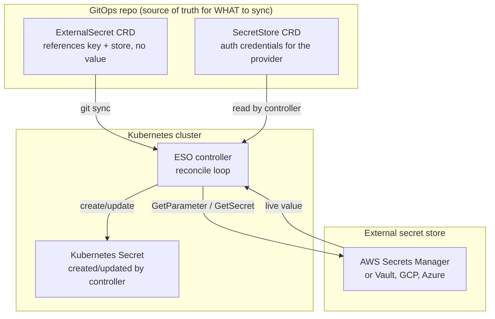
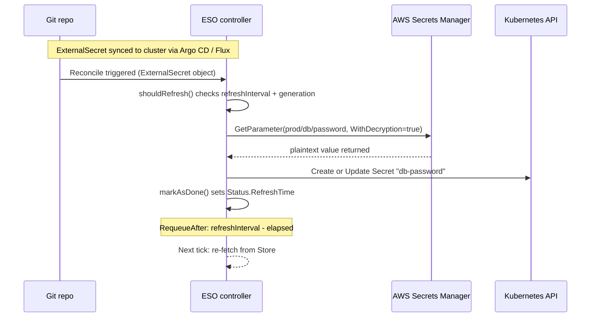

**TL;DR:** If your GitOps repo needs database passwords, API keys, or TLS certs, where do those values actually live? Encrypting them into the repo (SealedSecrets) still means ciphertext sits in git history forever. External Secrets Operator takes a different path: never store the value in git at all, just a reference to an external store, and let the operator's reconcile loop fetch the live value on a periodic refresh interval — the secret's real home stays outside git entirely.

> **In plain English (30 sec):** Env file outside code — same image, different config.

**Real repo:** [`external-secrets/external-secrets`](https://github.com/external-secrets/external-secrets)

## 1. The Engineering Problem

A GitOps workflow wants every piece of cluster state declared in git — deployments, configmaps, services, and secrets alike. But a Kubernetes `Secret`'s `data` field is base64-encoded plaintext, not encrypted. Committing a raw `Secret` manifest to a GitOps repo commits the actual credential value permanently into git history, visible to anyone with repo read access, CI logs, or any fork — even if the file is deleted later, git doesn't forget.

The two traditional fixes each have structural limitations: SealedSecrets encrypts the value client-side into ciphertext safe to commit, but that ciphertext still sits in git forever and can only be decrypted inside the cluster. More importantly, the moment your team already operates an external secret store — AWS Secrets Manager, GCP Secret Manager, Vault, Azure Key Vault — duplicating those values into encrypted blobs in git creates two sources of truth for the same credential, and rotating the value in the store doesn't automatically propagate to the sealed blob in the repo. What you actually need is a mechanism that never puts the value in git in the first place, and that keeps the cluster's `Secret` objects synchronized with whatever external store the team already trusts.

## 2. The Technical Solution

External Secrets Operator (ESO) introduces two CRDs that separate the *reference* from the *value*. An `ExternalSecret` in git describes *which* key to fetch from *which* external store. A `SecretStore` (or `ClusterSecretStore`) holds the credentials needed to authenticate against that store. The operator's controller continuously reconciles: it reads the `ExternalSecret`, authenticates to the referenced store, fetches the live value, and creates or updates a real Kubernetes `Secret` in the target namespace. The plaintext never touches git — it lives in the external store, and the cluster `Secret` is a live projection of that store's current state.



Three core truths this diagram shows:

- **The ExternalSecret contains zero secret material.** It's purely declarative metadata — which store, which key, what refresh interval — safe to commit because there's nothing to leak.
- **The controller is the only component that ever holds the plaintext.** Authentication to the external store is scoped to the controller's service account, not distributed across git collaborators.
- **Rotation is automatic on the refresh interval.** When a value rotates in the external store, the next reconcile tick pulls the new value into the cluster `Secret` — no git commit required.



This sequence shows the ongoing loop, not a one-shot fetch. The `RequeueAfter` duration is computed directly from `Spec.RefreshInterval` minus the time elapsed since the last `Status.RefreshTime` — a credential rotated in the store propagates to the cluster within one refresh window, not instantly.

## 3. The clean example (concept in isolation)

```yaml
# SecretStore: tells the controller HOW to authenticate to AWS Secrets Manager
apiVersion: external-secrets.io/v1
kind: SecretStore
metadata:
  name: aws-secrets-manager
  namespace: prod
spec:
  provider:
    aws:
      service: SecretsManager
      region: us-east-1
      auth:
        jwt:
          # ServiceAccount with IRSA annotation — no static credentials
          serviceAccountRef:
            name: eso-sa

---
# ExternalSecret: tells the controller WHAT to fetch — no value, just a reference
apiVersion: external-secrets.io/v1
kind: ExternalSecret
metadata:
  name: db-password
  namespace: prod
spec:
  # How often to re-fetch from the external store
  refreshInterval: 1h

  # Which store to authenticate against
  secretStoreRef:
    name: aws-secrets-manager
    kind: SecretStore

  # What Kubernetes Secret to create or update
  target:
    name: db-password
    creationPolicy: Owner

  # Which keys to pull — remoteRef.key is a lookup path, not a value
  data:
    - secretKey: password
      remoteRef:
        key: prod/database/password
```

The `ExternalSecret` is safe to commit for a simple reason: `remoteRef.key: prod/database/password` is a path, not a credential. The actual plaintext lives in AWS Secrets Manager and only reaches the cluster when the controller fetches it.

## 4. Production reality (from the real repo)

```
external-secrets/
└── pkg/
    └── controllers/externalsecret/
        └── externalsecret_controller.go    — Reconcile loop, refresh logic, Secret lifecycle
└── providers/v1/
    └── aws/
        └── parameterstore/
            └── parameterstore.go           — AWS SSM Parameter Store provider implementation
```

The reconcile loop's refresh decision is explicit and periodic — `getRequeueResult` computes the exact time until the next fetch, not a fixed timer:

```go
// pkg/controllers/externalsecret/externalsecret_controller.go
func (r *Reconciler) getRequeueResult(externalSecret *esv1.ExternalSecret) ctrl.Result {
    // default to the global requeue interval
    refreshInterval := r.RequeueInterval
    if externalSecret.Spec.RefreshInterval != nil {
        refreshInterval = externalSecret.Spec.RefreshInterval.Duration
    }

    // if the refresh interval is <= 0, no recurring sync
    if refreshInterval <= 0 {
        return ctrl.Result{}
    }

    // if last refresh time not set, requeue after full interval
    if externalSecret.Status.RefreshTime.IsZero() {
        return ctrl.Result{RequeueAfter: refreshInterval}
    }

    timeSinceLastRefresh := time.Since(externalSecret.Status.RefreshTime.Time)

    // if time remaining, requeue after the remaining window
    if timeSinceLastRefresh < refreshInterval {
        return ctrl.Result{RequeueAfter: refreshInterval - timeSinceLastRefresh}
    }

    // interval elapsed, requeue immediately
    return ctrl.Result{Requeue: true}
}
```

The `shouldRefresh` function adds a second gate: even if the interval has elapsed, a `RefreshPolicy` of `CreatedOnce` skips re-fetching after the first successful sync, while `OnChange` only re-fetches when the `ExternalSecret` resource itself has been modified (generation changed), not on a timer:

```go
// pkg/controllers/externalsecret/externalsecret_controller.go
func shouldRefresh(es *esv1.ExternalSecret) bool {
    switch es.Spec.RefreshPolicy {
    case esv1.RefreshPolicyCreatedOnce:
        if es.Status.SyncedResourceVersion == "" || es.Status.RefreshTime.IsZero() {
            return true
        }
        return false

    case esv1.RefreshPolicyOnChange:
        if es.Status.SyncedResourceVersion == "" || es.Status.RefreshTime.IsZero() {
            return true
        }
        return es.Status.SyncedResourceVersion != ctrlutil.GetResourceVersion(es.ObjectMeta)

    default:
        return shouldRefreshPeriodic(es)
    }
}
```

The AWS Parameter Store provider demonstrates how the controller actually fetches values — `GetParameter` with `WithDecryption: true` ensures SecureString values are returned decrypted, and `gjson` property extraction lets the `ExternalSecret` pull a single key from a JSON blob stored as one parameter:

```go
// providers/v1/aws/parameterstore/parameterstore.go
func (pm *ParameterStore) GetSecret(ctx context.Context, ref esv1.ExternalSecretDataRemoteRef) ([]byte, error) {
    out, err := pm.getParameterValue(ctx, ref)
    // ...
    if ref.Property == "" {
        if out.Parameter.Value != nil {
            return []byte(*out.Parameter.Value), nil
        }
        return nil, fmt.Errorf("parameter value is nil for key: %s", ref.Key)
    }
    // gjson extracts a nested key from JSON stored as a single parameter
    val := gjson.Get(*out.Parameter.Value, ref.Property)
    if !val.Exists() {
        return nil, fmt.Errorf("key %s does not exist in secret %s", ref.Property, ref.Key)
    }
    return []byte(val.String()), nil
}
```

What this teaches that a hello-world can't:

- **`refreshInterval` is a precise latency characteristic, not an implementation detail.** `getRequeueResult` computes `refreshInterval - timeSinceLastRefresh`, meaning a credential rotated at minute 59 of a 60-minute window propagates within 1 minute, not 60. Teams designing around credential revocation SLAs need to understand this exact timing, not just "it refreshes periodically."
- **`RefreshPolicy` is a three-way design choice with real operational consequences.** `CreatedOnce` means a rotated credential in the store will *never* propagate unless the `ExternalSecret` object itself changes — this is correct for one-time bootstrap secrets but dangerous for database passwords. `OnChange` ties refresh to `ExternalSecret` generation changes, not the store. `Periodic` is the only policy that actually watches for store-side rotations on a timer.
- **The provider pattern separates concerns cleanly.** `parameterstore.go` implements `esv1.SecretsClient` — `GetSecret`, `GetSecretMap`, `PushSecret` — and the controller calls it without knowing whether the backend is AWS SSM, Vault, or GCP Secret Manager. Adding a new store means implementing this interface, not modifying the controller.
- **`WithDecryption: true` is always set.** The provider never returns an encrypted `SecureString` value — decryption happens server-side in the AWS API call, so the plaintext arrives already decrypted at the controller, which then writes it to the Kubernetes `Secret`. There's no client-side decryption logic in ESO for AWS.

## 5. Review checklist

- **Does the `ExternalSecret`'s `refreshInterval` match the credential's rotation SLA?** A `refreshInterval: 24h` on a credential that needs same-hour revocation means up to 24 hours of stale access — the interval directly bounds the propagation latency.
- **Is `CreationPolicy` intentionally set?** `Owner` (default) means the controller manages the `Secret`'s lifecycle including deletion; `Merge` or `Orphan` means the `Secret` survives an `ExternalSecret` deletion — verify the choice matches whether this credential should outlive its reference.
- **Does anything in the cluster still apply raw `Secret` manifests directly?** ESO's guarantee only holds if it's the sole path secrets enter the cluster — a stray `kubectl create secret` or an unmigrated raw `Secret` manifest defeats the entire design.
- **Is the `SecretStore`'s auth method (IRSA/workload identity/service account) scoped to only the specific secrets needed?** A `SecretStore` using broad `secretsmanager:GetSecretValue` on `Resource: *` gives the controller access to every secret in the account, not just the ones referenced by `ExternalSecret` objects in that namespace.

## 6. FAQ

**Q: If the external store (AWS Secrets Manager) is temporarily unreachable, what happens to the existing Kubernetes Secret?**
A: It stays as-is. The controller's `Reconcile` returns an error on fetch failure, which triggers a requeue with exponential backoff — the existing `Secret` object isn't deleted or reverted. The `ExternalSecret` status shows a `SecretSynced=False` condition with the error message. Once the store becomes reachable again, the next successful reconcile updates the `Secret` to the current value.

**Q: Can ESO push secrets *back* to the external store from Kubernetes?**
A: Yes — the `PushSecret` CRD and the `PushSecret` method on providers (visible in `parameterstore.go`'s `PushSecret` function) support writing a Kubernetes `Secret`'s value into the external store. This is a deliberate design choice for teams that want git to be the source of truth for *which* values should exist in the store, with the store as the runtime projection.

**Q: Why does `parameterstore.go` use `gjson` to extract nested properties?**
A: AWS SSM Parameter Store stores each parameter as a single string. When a team stores a JSON blob (e.g., `{"host": "...", "port": "5432", "password": "..."}`) as one parameter, `gjson` lets the `ExternalSecret`'s `remoteRef.property` field extract just `password` from that blob — avoiding the need for three separate parameters for one logical credential.

**Q: What's the difference between `SecretStore` and `ClusterSecretStore`?**
A: `SecretStore` is namespace-scoped — the auth credentials it references (service accounts, IRSA roles) are resolved within that namespace. `ClusterSecretStore` is cluster-wide and requires the controller flag `--enable-cluster-store` to be enabled, because it grants the controller access to secrets across all namespaces. A `ClusterSecretStore` using an IAM role with broad permissions is a real blast-radius consideration.

---

## Source

- **Concept:** External Secrets Operator — bridging GitOps repos to external secret stores without storing plaintext in git
- **Domain:** gitops
- **Repo:** [external-secrets/external-secrets](https://github.com/external-secrets/external-secrets) → [`pkg/controllers/externalsecret/externalsecret_controller.go`](https://github.com/external-secrets/external-secrets/blob/main/pkg/controllers/externalsecret/externalsecret_controller.go) — the reconcile loop, refresh logic, and Secret lifecycle management; [`providers/v1/aws/parameterstore/parameterstore.go`](https://github.com/external-secrets/external-secrets/blob/main/providers/v1/aws/parameterstore/parameterstore.go) — AWS SSM Parameter Store provider with GetSecret, PushSecret, and gjson property extraction


