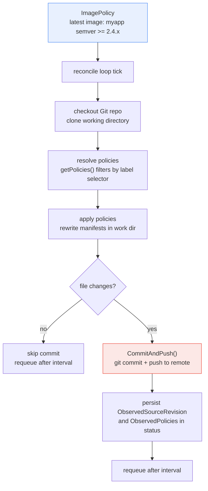
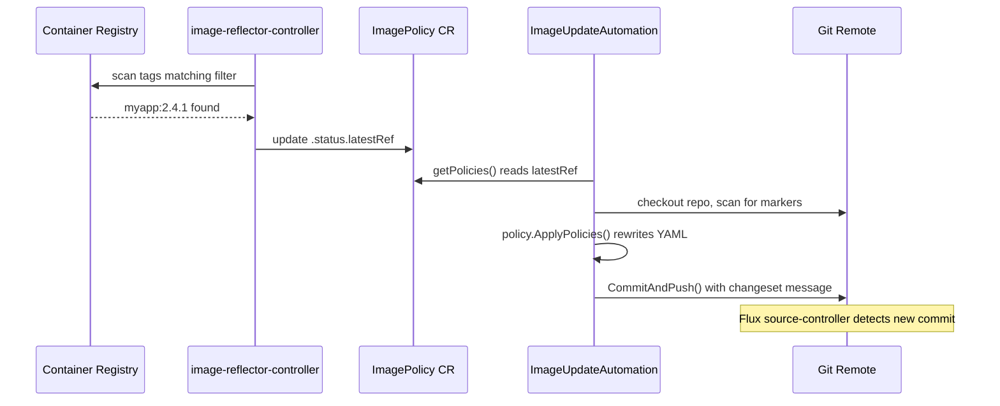

**TL;DR:** When a new container image tag appears in your registry, who updates the Deployment manifest? If the answer is "a developer runs `kubectl set image`" or "a CI pipeline opens a PR," you have a manual step in the middle of your GitOps loop — the cluster's desired state is no longer derived purely from Git. Flux's `ImageUpdateAutomation` closes this gap: it watches `ImagePolicy` objects for the latest image matching a filter, rewrites the YAML manifests in a Git repository, and pushes the commit. The reconciliation loop then picks up the change like any other Git commit. No `kubectl`, no CI step, no human in the loop.

---

## 1. The Engineering Problem

In a mature GitOps setup, every change to cluster state flows through a Git commit: someone edits a Deployment manifest, pushes to `main`, and the reconciliation controller (Flux or Argo CD) applies it. This is clean, auditable, and reversible.

But container image updates break this model. A new version of your application gets built and pushed to a registry — say `myapp:2.4.1` replaces `myapp:2.4.0` — and now the Deployment manifest in Git is stale. Someone has to update the `image:` field and commit. In practice this happens one of three ways, all of which are problems:

1. **Manual `kubectl set image`** — works instantly but bypasses Git entirely. The cluster's live state diverges from what Git says should be there. The next reconciliation overwrites your change, or worse, nobody notices the drift.
2. **CI pipeline opens a PR** — better, because the change goes through Git, but now you have a bot creating PRs that someone has to review and merge, adding latency and toil for what is a mechanical, low-risk substitution.
3. **Renovate / Dependabot for container tags** — these tools can update Docker base images and lock files, but they weren't designed to rewrite Kubernetes manifests in place across multiple services, and they don't integrate with Flux's reconciliation model.

What's missing is a mechanism that lives *inside* the GitOps reconciliation loop itself — something that watches the registry for new tags, rewrites the manifest, commits, and pushes, all without leaving the Git-as-source-of-truth contract.

## 2. The Technical Solution

Flux solves this with a two-resource design: **`ImagePolicy`** defines *which* image and *which tag* to track (semver range, alphabetical, or numerical ordering), and **`ImageUpdateAutomation`** defines *where* in the Git repo to rewrite manifests and *how* to push the result. The two are decoupled — one automation can serve multiple policies, and policies can be shared across environments.

The reconciler's loop has four phases: **checkout**, **scan**, **rewrite**, and **push**.



The critical insight is that `ImageUpdateAutomation` doesn't just watch the registry — it watches *ImagePolicy objects* for status changes. When the image-reflector-controller detects a new tag matching a policy's filter, it updates the `ImagePolicy`'s `.status.latestRef`. The automation's reconciler picks this up, checks out the Git repo, applies the policy's rewrite rules to the manifests, and pushes if anything changed. If nothing changed (same image as last time), it short-circuits — no empty commits.



### How the Reconciler Decides Whether to Commit

The reconciler's core loop is a carefully orchestrated sequence of checks, each of which can short-circuit the entire reconciliation. Here's the decision tree from the real controller:

```go
// From fluxcd/image-automation-controller/internal/controller/
// imageupdateautomation_controller.go — the reconcile() method

// Phase 1: Has anything actually changed?
// If policies haven't changed and the Git repo hasn't advanced,
// there's nothing to do — skip the full sync entirely.
if !syncNeeded && obj.Status.ObservedSourceRevision != "" {
    checkoutOpts = append(checkoutOpts,
        source.WithCheckoutOptionLastObserved(obj.Status.ObservedSourceRevision))
}

// Phase 2: Is the checkout a concrete commit or a "nothing changed" marker?
// A partial (non-concrete) commit means the remote hasn't advanced.
if !git.IsConcreteCommit(*commit) {
    result, retErr = ctrl.Result{RequeueAfter: obj.GetRequeueAfter()}, nil
    return
}

// Phase 3: Apply policies — this is where YAML rewriting happens.
policyResult, err := policy.ApplyPolicies(ctx, sm.WorkDirectory(), obj, policies)

// Phase 4: If no files were modified, skip the commit.
if len(policyResult.FileChanges) == 0 {
    obj.Status.ObservedSourceRevision = commit.String()
    obj.Status.ObservedPolicies = observedPolicies
    result, retErr = ctrl.Result{RequeueAfter: obj.GetRequeueAfter()}, nil
    return
}

// Phase 5: Only now — commit and push.
pushResult, err = sm.CommitAndPush(ctx, obj, policyResult, pushCfg...)
```

This is not a "check registry, update YAML, push" naively — it's a multi-gate pipeline where each phase can bail out early. The `syncNeeded` flag, the concrete-commit check, and the file-changes check together ensure that the controller never creates an empty commit and never rewrites manifests that don't need rewriting.

### The Marker System — How It Knows What to Rewrite

Flux doesn't use `yq` or regex to find image references. Instead, it scans the Git repo for **marker comments** embedded in the YAML manifests. A developer places a comment like `# image: myapp` above the `image:` field, and the automation uses that marker to locate and replace the tag:

```yaml
# image: myapp
image: myregistry.io/myapp:2.3.7
replicas: 3
```

When the policy resolves `myapp` to `2.4.1`, the automation rewrites only the tag portion of the line following the marker, preserving the registry path and any other YAML structure. This is precise — it won't accidentally modify an unrelated `image:` field in the same file.

### The Push Mechanism

The `CommitAndPush` method handles Git authentication, commit message templating, branch selection, and optional refspec/push configuration — all sourced from the `ImageUpdateAutomation` spec:

```go
// From the controller — push configuration is built from the automation spec.
pushCfg := []source.PushConfig{}

// Force-push is only enabled when the checkout and push branches differ.
if r.features[features.GitForcePushBranch] && sm.SwitchBranch() {
    pushCfg = append(pushCfg, source.WithPushConfigForce())
}

// Any user-specified push options (e.g. for SSH or token auth).
if obj.Spec.GitSpec.Push != nil && obj.Spec.GitSpec.Push.Options != nil {
    pushCfg = append(pushCfg, source.WithPushConfigOptions(obj.Spec.GitSpec.Push.Options))
}

pushResult, err = sm.CommitAndPush(ctx, obj, policyResult, pushCfg...)

// On success, persist the new revision so the next reconcile can skip if nothing changes.
if pushResult != nil {
    obj.Status.ObservedSourceRevision = pushResult.Commit().String()
    obj.Status.LastPushCommit = pushResult.Commit().Hash.String()
    obj.Status.LastPushTime = pushResult.Time()
}
```

The commit message is templated — the automation spec includes a `commitTemplate` field that supports Go template syntax, so you can embed the policy name, image reference, and tag into the commit message for auditability.

## 3. Clean Example (concept in isolation)

Here's the minimal setup: one `ImagePolicy` that tracks the latest semver tag for `myapp`, and one `ImageUpdateAutomation` that rewrites manifests in `clusters/production/` and pushes to `main`.


```yaml
# ImagePolicy — tells Flux "the latest image matching this filter is X"
apiVersion: image.toolkit.fluxcd.io/v1
kind: ImagePolicy
metadata:
  name: myapp
  namespace: flux-system
spec:
  imageRepositoryRef:
    name: myapp
  policy:
    semver:
      range: ">=2.4.0"
---
# ImageUpdateAutomation — tells Flux "when a policy changes, rewrite these files and push"
apiVersion: image.toolkit.fluxcd.io/v1beta2
kind: ImageUpdateAutomation
metadata:
  name: flux-system
  namespace: flux-system
spec:
  interval: 5m
  sourceRef:
    kind: GitRepository
    name: flux-system
  git:
    checkout:
      ref:
        branch: main
    commit:
      author: fluxbot
      messageTemplate: " Automated image update: {{range .Updated.Images}}{{println .}}{{end}}"
    push:
      branch: main
  update:
    path: ./clusters/production
    strategy: Setters
---
# The manifest being rewritten — the marker comment is the key
# image: myapp
apiVersion: apps/v1
kind: Deployment
metadata:
  name: myapp
spec:
  template:
    spec:
      containers:
        - name: myapp
          image: myregistry.io/myapp:2.4.0  # <-- Flux rewrites this tag
```


When `myapp:2.4.1` appears in the registry, the policy updates, the automation detects the change, rewrites the tag from `2.4.0` to `2.4.1`, commits with the templated message, and pushes. The source-controller picks up the new commit, and the deployment rolls forward.

## 4. Production Reality (from the real repo)

```
fluxcd/image-automation-controller/
└── internal/controller/
    └── imageupdateautomation_controller.go   — the full reconciler
```

The controller's `SetupWithManager` wires up three watches — on `ImageUpdateAutomation` objects, on `GitRepository` objects (so a Git push triggers re-evaluation), and on `ImagePolicy` objects (so a new image tag triggers re-evaluation). The watches are filtered by predicates so that irrelevant changes don't cause unnecessary reconciliation ticks:

```go
// From the controller — the three-way watch setup
return ctrl.NewControllerManagedBy(mgr).
    For(&imagev1.ImageUpdateAutomation{}, builder.WithPredicates(
        predicate.Or(predicate.GenerationChangedPredicate{},
            predicates.ReconcileRequestedPredicate{}))).
    Watches(
        &sourcev1.GitRepository{},
        handler.EnqueueRequestsFromMapFunc(r.automationsForGitRepo),
        builder.WithPredicates(sourceConfigChangePredicate{}),
    ).
    Watches(
        &reflectorv1.ImagePolicy{},
        handler.EnqueueRequestsFromMapFunc(r.automationsForImagePolicy),
        builder.WithPredicates(latestImageChangePredicate{}),
    ).
    WithOptions(controller.Options{
        RateLimiter: opts.RateLimiter,
    }).
    Complete(r)
```

The `automationsForGitRepo` and `automationsForImagePolicy` mapper functions look up all `ImageUpdateAutomation` objects that reference a given `GitRepository` or share a namespace with a given `ImagePolicy`, and enqueue reconcile requests for each. This is what makes the reactive loop work — the automation doesn't poll the registry, it reacts to state changes in the policy.

Policy resolution uses a label selector, so a single automation can serve multiple policies across a namespace — you don't need one automation per service:

```go
// From the controller — policies are filtered by label selector, then
// only those with a concrete .status.latestRef are returned.
func getPolicies(ctx context.Context, kclient client.Client,
    namespace string, selector *metav1.LabelSelector,
) ([]reflectorv1.ImagePolicy, error) {
    policySelector := labels.Everything()
    if selector != nil {
        var err error
        if policySelector, err = metav1.LabelSelectorAsSelector(selector); err != nil {
            return nil, fmt.Errorf("%w: %w", errParsePolicySelector, err)
        }
    }

    var policies reflectorv1.ImagePolicyList
    if err := kclient.List(ctx, &policies, &client.ListOptions{
        Namespace: namespace, LabelSelector: policySelector,
    }); err != nil {
        return nil, fmt.Errorf("failed to list policies: %w", err)
    }

    readyPolicies := []reflectorv1.ImagePolicy{}
    for _, policy := range policies.Items {
        if policy.Status.LatestRef == nil {
            continue  // skip policies with no resolved image yet
        }
        readyPolicies = append(readyPolicies, policy)
    }
    return readyPolicies, nil
}
```

What this teaches that a hello-world can't:

- **The controller distinguishes between "no change" and "change" at multiple levels** — the `syncNeeded` flag, the `IsConcreteCommit` check, and the `len(policyResult.FileChanges) == 0` check are three independent short-circuit gates. This isn't defensive coding; it's what prevents the controller from creating empty commits when the registry hasn't changed but the reconcile interval has elapsed.
- **The `latestImageChangePredicate` on the ImagePolicy watch means the automation only re-reconciles when the resolved image actually changes** — not on any status update, not on metadata changes, not on annotations. This is why Flux doesn't thrash with unnecessary reconciliation loops even when dozens of policies are being reflected.
- **The commit message template is a Go template, not a static string** — `{{range .Updated.Images}}{{println .}}{{end}}` iterates over all images that were updated in a single reconciliation, so a batch update to five services produces one commit with five image references in the message, not five separate commits.

## 5. Review Checklist

- **Does every `image:` field in your manifests have a `# image: <name>` marker comment?** Without the marker, the automation can't find the field to rewrite — it will silently skip the manifest, and you'll have a policy that resolves correctly but never actually updates anything.
- **Is the `update.path` scoped narrowly enough?** A path of `./` means the automation scans the entire repo for markers on every tick. For large monorepos, scope it to `./clusters/production` or `./apps/myapp` to keep reconciliation fast.
- **Does your `commitTemplate` include the image tag for auditability?** A generic message like "automated update" makes `git bisect` useless. Include `{{range .Updated.Images}}{{println .}}{{end}}` so each commit's message tells you exactly what changed.
- **Is the automation's `interval` aligned with your registry's tag cadence?** If you push new tags every 10 minutes but the automation polls every 1 hour, you'll have up to 50 minutes of unnecessary staleness. Set the interval to something shorter than your expected minimum time between image updates.
- **Are you using `strategy: Setters` (the only production-ready strategy) rather than `strategy: Setters` with custom templates?** Flux's image update strategies have evolved — `Setters` uses marker comments, which is the recommended approach. Earlier strategies like `Json` or `Yaml` are less precise and more fragile.

## 6. FAQ

**Q: What happens if two automations try to push to the same branch at the same time?**
A: The second push will fail because the remote has advanced since the automation checked out the source. Flux handles this gracefully — the reconciler returns an error, which triggers a requeue with backoff. On the next tick, it checks out the now-updated branch (with the first automation's commit) and re-applies its policies. No data is lost; the two automations simply take turns.

**Q: Can I use this with Argo CD instead of Flux's source-controller?**
A: The `ImageUpdateAutomation` is part of Flux's ecosystem — it pushes to a Git repo, and whatever controller is watching that repo picks up the change. If Argo CD is watching the same repo and branch, it will sync the updated manifests. The automation doesn't depend on Flux's source-controller for the sync; it only depends on a Git remote to push to. That said, the marker system (`# image: myapp`) is Flux-specific, so you'd need to use Flux for the automation piece even if you use Argo CD for sync.

**Q: How does this handle rollbacks?**
A: Because every image update is a Git commit, rollback is a `git revert` (or `flux suspend` + manual manifest edit + push). The automation's next tick will see the reverted manifest, detect that the image reference matches what the policy already resolved, and skip the commit — it won't re-update a manifest that already has the correct image.

**Q: What if the Git push fails due to branch protection rules?**
A: The controller's `CommitAndPush` returns an error, the reconciliation fails, and the object gets a `Ready=False` condition with reason `GitOperationFailed`. The controller retries on its next interval. In practice, you'd configure the automation to push to a branch that doesn't have protection rules, or use a dedicated bot account with push permissions.

**Q: Can the automation update Helm values files, not just raw YAML?**
A: Yes, if you use `strategy: Setters` with marker comments in your Helm values files (e.g. in a `values.yaml` that's committed to Git and rendered by Flux's Kustomization). The automation doesn't distinguish between raw YAML and Helm values — it just looks for markers and rewrites the following line.

---

## Source

- **Concept:** Progressive delivery via GitOps-driven image automation
- **Domain:** gitops
- **Repo:** [fluxcd/image-automation-controller](https://github.com/fluxcd/image-automation-controller) → [`internal/controller/imageupdateautomation_controller.go`](https://github.com/fluxcd/image-automation-controller/blob/main/internal/controller/imageupdateautomation_controller.go) — the reconciler that watches ImagePolicy changes, rewrites manifests, and pushes commits
- **Also:** [fluxcd/flux2](https://github.com/fluxcd/flux2) → [`pkg/manifestgen/kustomization/kustomization.go`](https://github.com/fluxcd/flux2/blob/main/pkg/manifestgen/kustomization/kustomization.go) — the kustomization generation and build logic that the source-controller uses to construct working directories for the automation's checkout


