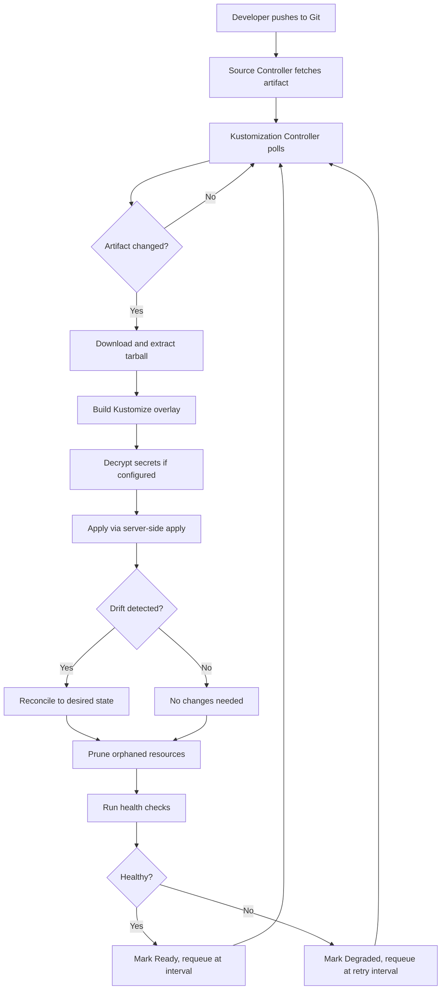
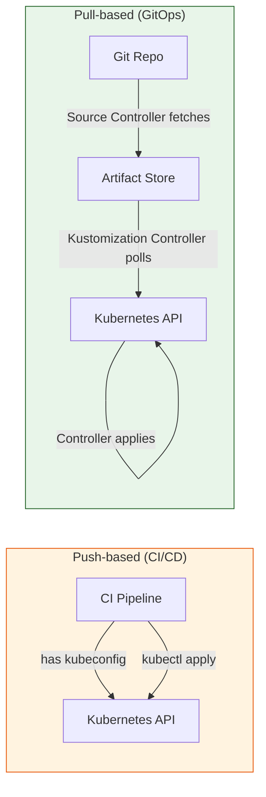

**TL;DR:** In a push-based CI/CD pipeline, your CI runner needs cluster credentials and runs `kubectl apply` from outside. In Flux's pull-based model, an in-cluster controller polls Git on a fixed interval, fetches the artifact, builds the Kustomize overlay, applies with server-side apply, prunes orphans, and runs health checks — all without any external system holding a kubeconfig. Git is the only source of truth, and the controller is the only thing touching the cluster.

> **In plain English (30 sec):** Code you already write — Map, function, API call, just bigger.

## The Engineering Problem

Push-based CI/CD requires your pipeline to reach into the cluster. The moment a GitHub Action or Jenkins job runs `kubectl apply -f manifests/`, several things become true:

- **The CI runner holds cluster credentials.** A compromised pipeline, a leaked secret, or an over-permissioned service account gives an attacker direct API server access.
- **There is no continuous verification.** `kubectl apply` is a one-shot operation. A developer patches a Deployment with `kubectl edit` at 2 AM, and nothing reverts it. The cluster silently drifts from what Git declared.
- **There is no automatic pruning.** Delete a manifest from Git, and the corresponding resource keeps running in the cluster. An orphaned ConfigMap or a forgotten Service persists indefinitely.
- **There is no built-in health gating.** The CI pipeline applies, gets a zero exit code, and moves on. It never checks whether the Deployment actually rolled out, whether the pods are healthy, or whether the new revision is receiving traffic.
- **Multi-cluster is a credential distribution problem.** Every target cluster needs its own kubeconfig in the CI system, rotated, audited, and scoped. The more clusters, the larger the attack surface.

The core issue: the system that decides *what* should run (the CI pipeline) is also the system that *makes* it run. There is no separation of concerns, and Git is an input to a process, not the source of truth that the cluster continuously reconciles against.

## The Technical Solution

Flux solves this by reversing the direction. Instead of the pipeline pushing to the cluster, a controller *inside* the cluster pulls from Git. The `KustomizationReconciler` in `fluxcd/kustomize-controller` runs a reconciliation loop that:

1. **Fetches** the source artifact (from a GitRepository, OCIRepository, or Bucket source controller)
2. **Builds** the Kustomize overlay into raw Kubernetes manifests
3. **Applies** using server-side apply (SSA) with a known field manager
4. **Prunes** resources that exist in the cluster but not in the new manifest set
5. **Health-checks** the applied resources before marking the reconciliation as successful

The CI pipeline's only job is to push to Git. The controller does everything else.



The key architectural difference: there are **two separate controllers** in the chain. The **Source Controller** handles authentication to Git, fetches the repository, and stores the artifact. The **Kustomization Controller** consumes that artifact — it never talks to Git directly. This separation means the Kustomization CRD doesn't need Git credentials at all; it just references the source by name.

### Push vs Pull: The trust boundary



In the push model, the trust boundary is the CI system — whoever controls the pipeline controls the cluster. In the pull model, the trust boundary is the cluster itself. The controller only accepts changes from the artifact, and the artifact only comes from the Source Controller, which only fetches from repositories the Kustomization is explicitly configured to reference.

## The Clean Example

Here's a minimal Flux setup: a Kustomization CRD that watches a Git repository path, reconciles every 5 minutes, and prunes resources removed from Git.

```yaml
apiVersion: kustomize.toolkit.fluxcd.io/v1
kind: Kustomization
metadata:
  name: production-app
  namespace: flux-system
spec:
  interval: 5m
  path: ./clusters/production
  prune: true
  sourceRef:
    kind: GitRepository
    name: infrastructure
  healthChecks:
    - apiVersion: apps/v1
      kind: Deployment
      name: my-app
      namespace: production
  timeout: 3m
```

And the GitRepository that points to your repo:

```yaml
apiVersion: source.toolkit.fluxcd.io/v1
kind: GitRepository
metadata:
  name: infrastructure
  namespace: flux-system
spec:
  interval: 1m
  url: https://github.com/org/infrastructure
  ref:
    branch: main
  secretRef:
    name: git-credentials
```

That's it. No CI pipeline. No `kubectl`. No kubeconfig outside the cluster. The Source Controller polls Git every minute; the Kustomization Controller reconciles every 5 minutes. When someone pushes a change to `./clusters/production`, the next poll picks it up and applies it.

## Production Reality

The clean example hides a web of safety checks, inventory tracking, and staged apply logic. Here's what actually happens inside `fluxcd/kustomize-controller`'s reconciliation loop.

### The full reconcile entry point

The `Reconcile` method is the entry point. Every Kustomization object goes through this function on every tick. Notice the sequence: get the object, check for deletion, check for suspension, resolve the source, check dependencies, then reconcile.

```go
// internal/controller/kustomization_controller.go — Reconcile entry point
// Source: https://github.com/fluxcd/kustomize-controller

func (r *KustomizationReconciler) Reconcile(ctx context.Context, req ctrl.Request) (result ctrl.Result, retErr error) {
	log := ctrl.LoggerFrom(ctx)
	reconcileStart := time.Now()

	obj := &kustomizev1.Kustomization{}
	if err := r.Get(ctx, req.NamespacedName, obj); err != nil {
		return ctrl.Result{}, client.IgnoreNotFound(err)
	}

	// Initialize the runtime patcher with the current version of the object.
	patcher := patch.NewSerialPatcher(obj, r.Client)

	// Finalise the reconciliation and report the results.
	defer func() {
		if err := r.finalizeStatus(ctx, obj, patcher); err != nil {
			retErr = kerrors.NewAggregate([]error{retErr, err})
		}
		r.Metrics.RecordDuration(ctx, obj, reconcileStart)
		if conditions.IsReady(obj) {
			msg := fmt.Sprintf("Reconciliation finished in %s, next run in %s",
				time.Since(reconcileStart).String(),
				obj.Spec.Interval.Duration.String())
			log.Info(msg, "revision", obj.Status.LastAttemptedRevision)
		}
	}()

	// Prune managed resources if the object is under deletion.
	if !obj.ObjectMeta.DeletionTimestamp.IsZero() {
		return r.finalize(ctx, obj)
	}

	// Add finalizer first if it doesn't exist to avoid the race condition
	// between init and delete.
	if !controllerutil.ContainsFinalizer(obj, kustomizev1.KustomizationFinalizer) {
		controllerutil.AddFinalizer(obj, kustomizev1.KustomizationFinalizer)
		return ctrl.Result{Requeue: true}, nil
	}

	// Skip reconciliation if the object is suspended.
	if obj.Spec.Suspend {
		log.Info("Reconciliation is suspended for this object")
		return ctrl.Result{}, nil
	}
	// ... source resolution, dependency checks, then r.reconcile()
}
```

The `defer` block is doing important work: it always patches the status back to the API server, records Prometheus metrics, and logs the reconciliation duration. The finalizer ensures the controller can clean up managed resources when the Kustomization CRD is deleted.

### The reconcile core: fetch, build, apply, prune, health-check

The inner `reconcile` method is where the actual work happens. It downloads the artifact, builds the Kustomize overlay, applies with SSA, prunes orphans, and runs health checks — all in sequence.

```go
// internal/controller/kustomization_controller.go — reconcile inner loop
func (r *KustomizationReconciler) reconcile(
	ctx context.Context,
	obj *kustomizev1.Kustomization,
	src sourcev1.Source,
	patcher *patch.SerialPatcher,
	statusReader func(apimeta.RESTMapper) engine.StatusReader) error {

	revision := src.GetArtifact().Revision

	// Step 1: Download artifact and extract to tmp dir
	fetcher := fetch.New(
		fetch.WithRetries(r.ArtifactFetchRetries),
		fetch.WithMaxDownloadSize(tar.UnlimitedUntarSize),
		fetch.WithUntar(tar.WithMaxUntarSize(tar.UnlimitedUntarSize)),
	)
	if err = fetcher.Fetch(src.GetArtifact().URL, src.GetArtifact().Digest, tmpDir); err != nil {
		conditions.MarkFalse(obj, meta.ReadyCondition, meta.ArtifactFailedReason, "%s", err)
		return err
	}

	// Step 2: Build the Kustomize overlay (decrypt, substitute variables)
	resources, err := r.build(ctx, obj, unstructured.Unstructured{Object: k}, tmpDir, dirPath)

	// Step 3: Apply via server-side apply
	resourceManager := ssa.NewResourceManager(kubeClient, statusPoller, ssa.Owner{
		Field: r.ControllerName,
		Group: kustomizev1.GroupVersion.Group,
	})
	drifted, changeSet, err := r.apply(ctx, resourceManager, obj, revision, originRevision, objects)

	// Step 4: Create inventory and detect stale resources
	newInventory := inventory.New()
	inventory.AddChangeSet(newInventory, changeSet)
	staleObjects, err := inventory.Diff(oldInventory, newInventory)

	// Step 5: Prune resources not in the new manifest set
	if _, survivors, err := r.prune(ctx, resourceManager, obj, revision, originRevision, staleObjects); err != nil {
		inventory.Merge(obj.Status.Inventory, survivors)
		return err
	}

	// Step 6: Health check applied resources
	isNewRevision := !src.GetArtifact().HasRevision(obj.Status.LastAppliedRevision)
	r.checkHealth(ctx, resourceManager, patcher, obj, revision, originRevision,
		isNewRevision, drifted, changeSet, extractJobsWithTTL(objects))

	// Step 7: Mark as ready
	conditions.MarkTrue(obj, meta.ReadyCondition, meta.ReconciliationSucceededReason,
		"Applied revision: %s", revision)
	return nil
}
```

The inventory is critical: it's a snapshot of every resource the controller has applied. On the next reconcile, the controller diffs the old inventory against the new one to find stale resources — those that were in the old set but not the new set. Those get pruned. This is how `prune: true` actually works: it's not comparing Git to cluster, it's comparing *this revision's applied set* against *the previous revision's applied set*.

### The apply method: server-side apply with field manager control

Flux uses server-side apply (SSA), not `kubectl apply`. This is a fundamental difference — SSA uses server-side field ownership to resolve conflicts, whereas client-side apply uses `last-applied-configuration` annotations that are notoriously fragile.

```go
// internal/controller/kustomization_controller.go — apply via SSA
func (r *KustomizationReconciler) apply(ctx context.Context,
	manager *ssa.ResourceManager,
	obj *kustomizev1.Kustomization,
	revision string,
	originRevision string,
	objects []*unstructured.Unstructured) (bool, *ssa.ChangeSet, error) {

	applyOpts := ssa.DefaultApplyOptions()
	applyOpts.Force = obj.Spec.Force
	applyOpts.ExclusionSelector = map[string]string{
		fmt.Sprintf("%s/reconcile", kustomizev1.GroupVersion.Group): kustomizev1.DisabledValue,
		fmt.Sprintf("%s/ssa", kustomizev1.GroupVersion.Group):       kustomizev1.IgnoreValue,
	}

	fieldManagers := []ssa.FieldManager{
		// Undo changes made with kubectl apply --server-side --force-conflicts
		{Name: "kubectl", OperationType: metav1.ManagedFieldsOperationApply},
		// Undo changes made with kubectl apply
		{Name: "kubectl", OperationType: metav1.ManagedFieldsOperationUpdate},
		{Name: "before-first-apply", OperationType: metav1.ManagedFieldsOperationUpdate},
		{Name: r.ControllerName, OperationType: metav1.ManagedFieldsOperationUpdate},
	}

	applyOpts.Cleanup = ssa.ApplyCleanupOptions{
		Annotations: []string{corev1.LastAppliedConfigAnnotation},
		FieldManagers: fieldManagers,
	}

	// Server-side apply all objects in stages
	changeSet, err := manager.ApplyAllStaged(ctx, objects, applyOpts)
	return applyLog != "", resultSet, nil
}
```

The `fieldManagers` list is telling Flux to take ownership away from `kubectl` and from any previous field managers. This means if someone manually ran `kubectl apply` to change a Deployment, Flux's next reconcile will overwrite those changes with the Git-declared state. The `ExclusionSelector` allows individual resources to opt out of reconciliation entirely via annotations.

### The kustomization manifest generator

Before the controller can build a Kustomize overlay, it sometimes needs to generate a `kustomization.yaml` if one doesn't exist. The `Generate` function in `pkg/manifestgen/kustomization` scans a directory for Kubernetes manifests and creates the file automatically.

```go
// pkg/manifestgen/kustomization/kustomization.go — auto-generate kustomization.yaml
// Source: https://github.com/fluxcd/flux2

func Generate(options Options) (*manifestgen.Manifest, error) {
	kfile := filepath.Join(options.TargetPath, konfig.DefaultKustomizationFileName())
	abskfile := filepath.Join(options.BaseDir, kfile)

	// Scan directory for Kubernetes manifests
	scan := func(base string) ([]string, error) {
		var paths []string
		pvd := provider.NewDefaultDepProvider()
		rf := pvd.GetResourceFactory()
		err := options.FileSystem.Walk(base, func(path string, info os.FileInfo, err error) error {
			if info.IsDir() {
				// If sub-directory has existing Kustomization, add as resource, skip descent
				for _, kfilename := range konfig.RecognizedKustomizationFileNames() {
					if options.FileSystem.Exists(filepath.Join(path, kfilename)) {
						paths = append(paths, path)
						return filepath.SkipDir
					}
				}
				return nil
			}
			fContents, err := options.FileSystem.ReadFile(path)
			if err != nil {
				return err
			}
			if _, err := rf.SliceFromBytes(fContents); err != nil {
				return nil // Not a valid Kubernetes manifest, skip
			}
			paths = append(paths, path)
			return nil
		})
		return paths, err
	}

	// Build the Kustomization type with discovered resources
	kus := kustypes.Kustomization{
		TypeMeta: kustypes.TypeMeta{
			APIVersion: kustypes.KustomizationVersion,
			Kind:       kustypes.KustomizationKind,
		},
	}
	kus.Resources = resources
	kd, err := yaml.Marshal(kus)

	return &manifestgen.Manifest{
		Path:    kfile,
		Content: string(kd),
	}, nil
}
```

This is used by the `flux create kustomization` CLI command — not by the controller itself at runtime. The controller expects a `kustomization.yaml` (or equivalent) to already exist in the artifact. The generator is a convenience for bootstrapping.

### The build function with secure file system

The `Build` function uses a secure file system restriction to prevent path traversal attacks when loading remote bases or referenced files.

```go
// pkg/manifestgen/kustomization/kustomization.go — secure build
func BuildWithRoot(root, base string) ([]byte, error) {
	kustomizeBuildMutex.Lock()
	defer kustomizeBuildMutex.Unlock()

	fs, err := filesys.MakeFsOnDiskSecureBuild(root)
	if err != nil {
		return nil, err
	}

	var kfile string
	for _, f := range konfig.RecognizedKustomizationFileNames() {
		if kf := filepath.Join(base, f); fs.Exists(kf) {
			kfile = kf
			break
		}
	}
	if kfile == "" {
		return nil, fmt.Errorf("%s not found", konfig.DefaultKustomizationFileName())
	}

	buildOptions := &krusty.Options{
		LoadRestrictions: kustypes.LoadRestrictionsNone,
		PluginConfig:     kustypes.DisabledPluginConfig(),
	}

	k := krusty.MakeKustomizer(buildOptions)
	m, err := k.Run(fs, base)
	if err != nil {
		return nil, err
	}

	resources, err := m.AsYaml()
	return resources, nil
}
```

The `kustomizeBuildMutex` serializes builds to work around a concurrent map read/write bug in upstream kustomize (`kubernetes-sigs/kustomize#3659`). The `LoadRestrictionsNone` setting allows remote bases, but `MakeFsOnDiskSecureBuild(root)` restricts the file system to the artifact root — preventing a malicious `kustomization.yaml` from reading files outside the extracted tarball.

## Review Checklist

- [ ] Is `prune: true` enabled on every production Kustomization? Without it, deleted manifests leave orphaned resources running.
- [ ] Is `interval` set to a reasonable value? Too frequent wastes resources; too slow delays drift detection. 5m is a common starting point.
- [ ] Is `healthChecks` configured for critical workloads? Without it, Flux marks the reconciliation as successful as soon as SSA succeeds, regardless of whether pods are actually running.
- [ ] Is `timeout` set? The default is the controller's global timeout. Per-resource overrides ensure long rollouts don't prematurely fail health checks.
- [ ] Are `dependsOn` chains used for ordering across Kustomizations? This is Flux's equivalent of sync waves — ensure prerequisite Kustomizations are ready before dependent ones reconcile.
- [ ] Is `suspend: false` on every production Kustomization? Suspended Kustomizations stop reconciling — useful for maintenance, dangerous if forgotten.
- [ ] Is `force: false` unless you have a specific reason? Force overwrites conflicts from other field managers, which can mask real issues.
- [ ] Are `spec.ignore` rules used to safely let specific fields drift (e.g., HPA-managed replica counts, annotations added by other controllers)?
- [ ] Is the Kustomization's `serviceAccountName` set for impersonation instead of using a cluster-admin kubeconfig?
- [ ] Is `deletionPolicy` configured? The default is `Delete` — consider `WaitForTermination` for stateful workloads that need graceful shutdown.

## FAQ

**Q: What happens if the Source Controller can't reach Git?**
A: The Kustomization Controller will see no new artifact and requeue at `DependencyRequeueInterval`. The last successfully applied revision continues running. No changes are made to the cluster until a valid artifact is available.

**Q: Does Flux detect drift caused by manual `kubectl` changes?**
A: Yes. On every reconciliation, Flux runs server-side apply against all resources in the manifest set. If someone manually changed a Deployment's replica count, SSA will revert it to the Git-declared value. The change is logged in the controller's events.

**Q: What's the difference between `prune` and the inventory diff?**
A: `prune: true` enables garbage collection. The inventory tracks every resource Flux has applied. On the next reconcile, Flux diffs the old inventory against the new one. Resources in the old set but not the new set are candidates for deletion — but only if `prune: true`.

**Q: Can Flux reconcile multiple clusters from one Git repo?**
A: Yes. Each cluster runs its own Flux controllers. You point each cluster's Kustomization CRD at a different path in the same repo (e.g., `./clusters/production` vs `./clusters/staging`). Each cluster pulls independently.

**Q: Why server-side apply instead of client-side `kubectl apply`?**
A: SSA uses server-side field ownership to resolve conflicts. Client-side apply uses a `kubectl.kubernetes.io/last-applied-configuration` annotation that breaks when multiple controllers manage the same resource. SSA lets Flux own only the fields it declares, leaving other field managers' contributions intact.

**Q: What happens if a Kustomization's dependencies aren't ready?**
A: Flux checks `dependsOn` before reconciling. If any dependency's `Ready` condition is false or its observed generation doesn't match, Flux requeues at `DependencyRequeueInterval` without touching the cluster. CEL expressions can also be used for custom readiness criteria via `readyExpr`.

## Source

This post is based on the following files from the [`fluxcd/flux2`](https://github.com/fluxcd/flux2) and [`fluxcd/kustomize-controller`](https://github.com/fluxcd/kustomize-controller) repositories:

- [`kustomization_controller.go`](https://github.com/fluxcd/kustomize-controller/blob/main/internal/controller/kustomization_controller.go) — The main reconciliation loop with `Reconcile`, `reconcile`, `apply`, `prune`, `checkHealth`, and `checkDependencies`
- [`kustomization.go`](https://github.com/fluxcd/flux2/blob/main/pkg/manifestgen/kustomization/kustomization.go) — The manifest generator with `Generate` and `BuildWithRoot` for Kustomize overlay construction


