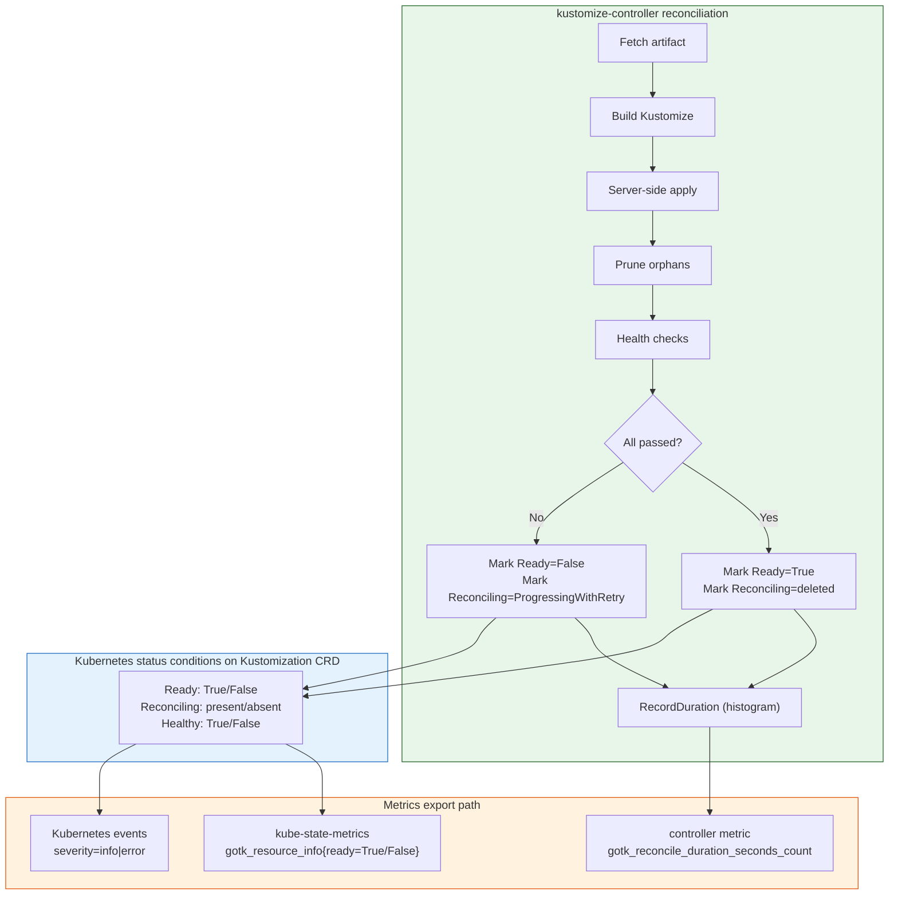
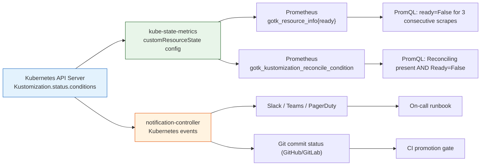

**TL;DR:** Did Flux break your drift alerts in v2.6? Not exactly — but it removed the shortcut. `gotk_reconcile_condition` no longer exists as a controller-emitted metric, and `gotk_reconcile_duration_seconds_count` no longer carries a `result` label. If your Prometheus alerts counted "error reconciliations" by filtering on that label, they now fire on nothing. The actual signal was never in the controller's metric output — it's in the Kubernetes status conditions on the Kustomization object itself, which kube-state-metrics can surface as `gotk_resource_info` with the `ready` label, or more precisely via custom `customResourceState` config that reads `status.conditions`.

## The Engineering Problem

When Flux v2.6 shipped, several teams discovered their Grafana dashboards and PagerDuty alerts went silent. The old PromQL pattern was straightforward:

```promql
sum(rate(gotk_reconcile_duration_seconds_count{
  kind=~"Kustomization|HelmRelease",
  result!="success"
}[5m]))
```

This query counted reconciliation cycles that didn't succeed. It worked because older Flux versions attached a `result` label (or exposed `gotk_reconcile_condition` with a `type=Ready, status=True|False` label set). After v2.6, two things changed:

1. **`gotk_reconcile_condition` was removed from the controller's metric output.** The gauge still exists in the `fluxcd/pkg/runtime/metrics` library's `Recorder` struct, but the controllers no longer call `RecordCondition` during the reconciliation loop. The only method called in the `defer` block is `RecordDuration`.

2. **`gotk_reconcile_duration_seconds_count` has no `result` label.** It only carries `kind`, `name`, and `namespace`. You can count *how many* reconciliations happened per resource, but not whether they succeeded or failed.

The consequence: a Kustomization that has been in a `Ready=False` state for hours — its drift never corrected, its health checks failing — looks identical to a perfectly healthy Kustomization in the duration metric. Both emit the same counter increment with the same labels. Error counts can't distinguish the two.

This is not a bug. Flux's reconciliation result is a multi-dimensional status condition (`Ready`, `Reconciling`, `Healthy`, `Stalled`), not a binary success/failure flag. A single metric with a `result` label was always a lossy compression of that signal.

## The Technical Solution

Flux records the reconciliation outcome as Kubernetes status conditions on the Kustomization CRD, not as Prometheus gauge updates. The three conditions that matter for drift alerting are:

- **`Ready`** — transitions to `True` with reason `ReconciliationSucceeded` only after apply, prune, and health checks all pass. Transitions to `False` with reasons like `HealthCheckFailed`, `ReconciliationFailed`, or `BuildFailed`.
- **`Reconciling`** — present while a reconcile is in progress (reason `Progressing`), deleted when the reconcile completes successfully. If the reconcile fails, it stays with reason `ProgressingWithRetry`.
- **`Healthy`** — set only when `spec.healthChecks` or `spec.wait` is configured. Transitions to `True` when all referenced resources pass health checks; `False` on timeout or failure.

The correct drift signal is the transition, not the count. An alert that fires when `Ready` goes from `True` to `False` catches drift. An alert that fires on error *counts* catches nothing after v2.6.



The key insight: the controller writes conditions to the Kubernetes API server. Those conditions are the source of truth. Two independent consumers can read them — kube-state-metrics (for Prometheus) and the notification controller (for alert routing) — but neither depends on the controller emitting a Prometheus gauge directly.

### The recorder that used to emit the gauge

The `gotk_reconcile_condition` gauge is still defined in `fluxcd/pkg/runtime/metrics`. It records each condition type/status pair as a 0-or-1 gauge:

```go
// pkg/runtime/metrics/recorder.go — condition gauge definition
// Source: https://github.com/fluxcd/pkg

type Recorder struct {
	conditionGauge    *prometheus.GaugeVec
	suspendGauge      *prometheus.GaugeVec
	durationHistogram *prometheus.HistogramVec
}

func NewRecorder() *Recorder {
	return &Recorder{
		conditionGauge: prometheus.NewGaugeVec(
			prometheus.GaugeOpts{
				Name: "gotk_reconcile_condition",
				Help: "The current condition status of a GitOps Toolkit resource reconciliation.",
			},
			[]string{"kind", "name", "namespace", "type", "status"},
		),
		suspendGauge: prometheus.NewGaugeVec(
			prometheus.GaugeOpts{
				Name: "gotk_suspend_status",
				Help: "The current suspend status of a GitOps Toolkit resource.",
			},
			[]string{"kind", "name", "namespace"},
		),
		durationHistogram: prometheus.NewHistogramVec(
			prometheus.HistogramOpts{
				Name:    "gotk_reconcile_duration_seconds",
				Help:    "The duration in seconds of a GitOps Toolkit resource reconciliation.",
				Buckets: prometheus.ExponentialBucketsRange(10e-3, 1800, 10),
			},
			[]string{"kind", "name", "namespace"},
		),
	}
}

func (r *Recorder) RecordCondition(ref corev1.ObjectReference, condition metav1.Condition) {
	for _, status := range []metav1.ConditionStatus{
		metav1.ConditionTrue,
		metav1.ConditionFalse,
		metav1.ConditionUnknown,
	} {
		var value float64
		if status == condition.Status {
			value = 1
		}
		r.conditionGauge.WithLabelValues(
			ref.Kind, ref.Name, ref.Namespace,
			condition.Type, string(status),
		).Set(value)
	}
}
```

The gauge supports five labels — `kind`, `name`, `namespace`, `type` (which condition), and `status` (True/False/Unknown). A healthy Kustomization would set `gotk_reconcile_condition{kind="Kustomization", type="Ready", status="True"}` to `1` and the `False` and `Unknown` variants to `0`. A drifted resource would flip those values. This is exactly the signal drift alerting needs — but the controllers stopped calling `RecordCondition` in the reconcile loop. Only `RecordDuration` is called from the deferred function:

```go
// kustomization_controller.go — defer block in Reconcile()
// Source: https://github.com/fluxcd/kustomize-controller

defer func() {
	if err := r.finalizeStatus(ctx, obj, patcher); err != nil {
		retErr = kerrors.NewAggregate([]error{retErr, err})
	}
	r.Metrics.RecordDuration(ctx, obj, reconcileStart)
	if conditions.IsReady(obj) {
		msg := fmt.Sprintf("Reconciliation finished in %s, next run in %s",
			time.Since(reconcileStart).String(),
			obj.Spec.Interval.Duration.String())
		log.Info(msg, "revision", obj.Status.LastAttemptedRevision)
		r.event(obj, obj.Status.LastAppliedRevision, ...)
	}
}()
```

No `RecordCondition` call. The condition gauge is registered but never populated at runtime. The histogram gets a single observation per reconcile. That's all the controller emits.

### The two replacement paths

Since the controller no longer writes the condition gauge, drift alerting needs to read conditions from a different source. There are two paths, and production setups should use both:



**Path 1: kube-state-metrics custom resource state.** KSM reads the Kustomization object from the API server and exports the `ready` field from `status.conditions`. This is the standard approach documented in `fluxcd/flux2-monitoring-example`.

**Path 2: notification-controller event routing.** Flux controllers emit Kubernetes events with severity `error` on any reconciliation failure. The notification controller forwards these to Slack, PagerDuty, GitHub commit status, and others. This gives you alerting without Prometheus at all — but it's event-driven, not queryable, and you can't build a historical dashboard from events alone.

## The Clean Example

A minimal kube-state-metrics configuration that surfaces the `ready` condition for Kustomizations:

```yaml
# kube-state-metrics customResourceState config
# Source: fluxcd/flux2-monitoring-example/monitoring/configs/kube-state-metrics-config.yaml
customResourceState:
  config:
    spec:
      resources:
        - groupVersionKind:
            group: kustomize.toolkit.fluxcd.io
            version: "v1"
            kind: Kustomization
          metricNamePrefix: gotk
          metrics:
            - name: "resource_info"
              help: "The current state of a GitOps Toolkit resource."
              each:
                type: Info
                info:
                  labelsFromPath:
                    name: [metadata, name]
              labelsFromPath:
                exported_namespace: [metadata, namespace]
                suspended: [spec, suspend]
                ready: [status, conditions, "[type=Ready]", status]
                reconciling: [status, conditions, "[type=Reconciling]", status]
```

This produces the metric:

```
gotk_resource_info{customresource_kind="Kustomization", exported_namespace="production", name="my-app", ready="True", reconciling="Unknown", suspended="false"} 1
```

A PromQL alert that catches drift — `ready` stuck on `False` for more than 15 minutes:


```yaml
# prometheus-rule for drift detection
groups:
  - name: flux-drift
    rules:
      - alert: FluxKustomizationNotReady
        expr: |
          gotk_resource_info{
            customresource_kind="Kustomization",
            ready="False"
          } == 1
        for: 15m
        labels:
          severity: warning
        annotations:
          summary: "Kustomization {{ $labels.name }} in {{ $labels.exported_namespace }} is not ready"
          description: >
            Flux Kustomization {{ $labels.name }} has been in Ready=False
            state for more than 15 minutes. Check controller logs for the
            specific failure reason.
      - alert: FluxReconciliationStuck
        expr: |
          gotk_resource_info{
            customresource_kind="Kustomization",
            reconciling="True",
            ready="False"
          } == 1
        for: 30m
        labels:
          severity: critical
        annotations:
          summary: "Flux reconciliation retries stuck for {{ $labels.name }}"
          description: >
            Kustomization {{ $labels.name }} has been in Reconciling=True
            with Ready=False for 30 minutes. The controller is retrying
            but failing. Likely causes: broken manifest, missing source
            artifact, or health check timeout.
```


The `for: 15m` and `for: 30m` durations are deliberate. Flux reconciles on a fixed interval (typically 5m), and a single failed reconcile followed by a successful one on the next tick is usually a transient issue (API server hiccup, temporary network partition). Alerting on a single `False` sample creates noise. Alerting on three or six consecutive `False` samples (15m / 5m interval, or 30m / 5m interval) catches persistent drift.

### Adding more condition detail for runbooks

For deeper runbook integration, extend the KSM config to surface the condition reason and message:

```yaml
# Extended KSM config with condition message for runbook correlation
customResourceState:
  config:
    spec:
      resources:
        - groupVersionKind:
            group: kustomize.toolkit.fluxcd.io
            version: "v1"
            kind: Kustomization
          metricNamePrefix: gotk
          metrics:
            - name: "resource_info"
              help: "The current state of a GitOps Toolkit resource."
              each:
                type: Info
                info:
                  labelsFromPath:
                    name: [metadata, name]
              labelsFromPath:
                exported_namespace: [metadata, namespace]
                ready: [status, conditions, "[type=Ready]", status]
                ready_reason: [status, conditions, "[type=Ready]", reason]
                reconciling: [status, conditions, "[type=Reconciling]", status]
                last_applied_revision: [status, lastAppliedRevision]
                last_attempted_revision: [status, lastAttemptedRevision]
```

This adds `ready_reason` (values like `ReconciliationSucceeded`, `HealthCheckFailed`, `BuildFailed`), `last_applied_revision`, and `last_attempted_revision` as labels. The `ready_reason` label lets you route alerts to different PagerDuty services — a `BuildFailed` reason routes to the platform team (broken manifest), while a `HealthCheckFailed` reason routes to the application team (pods not becoming ready).

## Production Reality

The clean Prometheus alerts above assume you're running kube-state-metrics with a `customResourceState` config. In production, there are additional layers — the controller's own event emission, the inventory tracking system, and the health check pipeline — that affect what you actually observe.

### How the controller writes conditions during reconciliation

The `KustomizationReconciler` updates conditions at multiple points during a single reconcile. Here's the sequence from the real source:

```go
// kustomization_controller.go — condition updates during reconcile()
// Source: https://github.com/fluxcd/kustomize-controller

func (r *KustomizationReconciler) reconcile(...) error {
	// Step 1: Mark as progressing before fetch
	conditions.MarkUnknown(obj, meta.ReadyCondition, meta.ProgressingReason,
		"%s", "Reconciliation in progress")
	conditions.MarkReconciling(obj, meta.ProgressingReason, "%s", progressingMsg)

	// Step 2: After build, update message with revision
	progressingMsg = fmt.Sprintf("Building manifests for revision %s...", revision)
	conditions.MarkReconciling(obj, meta.ProgressingReason, "%s", progressingMsg)

	// Step 3: Before drift detection
	progressingMsg = fmt.Sprintf("Detecting drift for revision %s...", revision)
	conditions.MarkReconciling(obj, meta.ProgressingReason, "%s", progressingMsg)

	// Step 4: After successful apply + health checks
	conditions.MarkTrue(obj, meta.ReadyCondition, meta.ReconciliationSucceededReason,
		"Applied revision: %s", revision)
	obj.Status.History.Upsert(checksum, time.Now(), time.Since(reconcileStart),
		meta.ReconciliationSucceededReason, historyMeta)

	// Step 5: finalizeStatus removes Reconciling on success
	if conditions.IsTrue(obj, meta.ReadyCondition) {
		conditions.Delete(obj, meta.ReconcilingCondition)
		obj.Status.ObservedGeneration = obj.Generation
	}
}
```

Notice: at no point does this code call `r.Metrics.RecordCondition(...)`. The conditions are written to the Kubernetes API server via `patcher.Patch(ctx, obj, ...)` in `finalizeStatus`. Prometheus never sees them unless something else reads the API server.

### The finalizeStatus logic that determines the final condition

```go
// kustomization_controller.go — finalizeStatus
// Source: https://github.com/fluxcd/kustomize-controller

func (r *KustomizationReconciler) finalizeStatus(ctx context.Context,
	obj *kustomizev1.Kustomization,
	patcher *patch.SerialPatcher) error {

	if v, ok := meta.ReconcileAnnotationValue(obj.GetAnnotations()); ok {
		obj.Status.LastHandledReconcileAt = v
	}

	// On success: delete the Reconciling condition entirely
	if conditions.IsTrue(obj, meta.ReadyCondition) {
		conditions.Delete(obj, meta.ReconcilingCondition)
		obj.Status.ObservedGeneration = obj.Generation
	}

	// On failure: flip Reconciling reason to ProgressingWithRetry
	if conditions.IsFalse(obj, meta.ReadyCondition) &&
		conditions.Has(obj, meta.ReconcilingCondition) {
		rc := conditions.Get(obj, meta.ReconcilingCondition)
		rc.Reason = meta.ProgressingWithRetryReason
		conditions.Set(obj, rc)
	}

	return r.patch(ctx, obj, patcher)
}
```

This is where the drift signal lives in the Kubernetes object:

| State | `Ready` | `Reconciling` | Meaning |
|-------|---------|---------------|---------|
| Healthy | `True` | Deleted | Last reconcile succeeded, no drift |
| Drift detected, retrying | `False` | `True` (reason: `ProgressingWithRetry`) | Apply or health check failed, controller will retry |
| Suspended | N/A | N/A | `spec.suspend: true` — no reconcile at all |

### The history tracking that the duration metric misses

The controller also records reconciliation history on the object itself:

```go
// kustomization_controller.go — history upsert on success
obj.Status.History.Upsert(checksum,
	time.Now(),
	time.Since(reconcileStart),
	meta.ReconciliationSucceededReason,
	historyMeta)

// kustomization_controller.go — history upsert on failure
obj.Status.History.Upsert(checksum, time.Now(), time.Since(reconcileStart),
	meta.ReconciliationFailedReason, historyMeta)
```

Each entry in `status.history` has a `checksum` (content hash of the built manifests), a `reason` (`ReconciliationSucceeded` or `ReconciliationFailed`), and a `duration`. This is a richer audit trail than any Prometheus metric — but it's only visible via `kubectl get kustomization -o json` or via KSM's custom resource state config. The duration histogram only tells you how long the last reconcile took, not whether it succeeded.

## Review Checklist

- [ ] Is `gotk_resource_info` with a `ready` label being exported by kube-state-metrics? Without it, Prometheus has no Flux condition data after v2.6.
- [ ] Is the KSM `customResourceState` config present in the monitoring stack? The default kube-state-metrics install does not include Flux CRD metrics — you need the explicit config from `fluxcd/flux2-monitoring-example`.
- [ ] Are drift alerts using `for:` durations that match your reconciliation interval? Alerting on a single `False` scrape creates noise; three to six intervals is typical.
- [ ] Is `ready_reason` included as a KSM label for runbook routing? Without it, every drift alert looks the same — you can't distinguish build failures from health check timeouts.
- [ ] Is the notification controller configured for at least one provider (Slack, GitHub commit status)? Events provide the fastest drift signal (immediate), while Prometheus provides historical trending.
- [ ] Are `spec.healthChecks` or `spec.wait` configured on production Kustomizations? Without them, Flux marks the reconciliation as successful after SSA succeeds, even if pods crash-loop — the `Healthy` condition is never set.
- [ ] Is `lastAttemptedRevision` vs `lastAppliedRevision` monitored? If they diverge, the controller attempted a reconciliation but it didn't succeed — a silent indicator of persistent drift.
- [ ] Are `spec.ignore` rules documented and reviewed? Fields excluded from drift detection via `spec.ignore` won't trigger condition transitions, which means alerts won't fire for those fields either.

## FAQ

**Q: Why did Flux remove `gotk_reconcile_condition` from the controller's metrics output?**
A: The Flux maintainers moved the condition signal to where it belongs — the Kubernetes API server, as status conditions on the CRD. Controller-emitted Prometheus gauges for conditions created a coupling between the controller's internal state machine and external monitoring. Reading conditions from the API server (via kube-state-metrics) decouples them and works for any consumer, not just Prometheus.

**Q: Can I still use `gotk_reconcile_duration_seconds_count` for anything?**
A: Yes — it tells you *how often* a Kustomization reconciles, which is useful for capacity planning and detecting controller stalls. If a Kustomization's reconcile count stops increasing but `interval` says it should, the controller queue is backed or the object is suspended.

**Q: What's the difference between `Reconciling=True` and `Ready=False`?**
A: `Ready=False` means the last completed reconciliation failed or the resource is unhealthy. `Reconciling=True` means a reconciliation is actively in progress right now. A resource can be `Ready=False` with `Reconciling` deleted (the last reconcile finished, it failed, and the next one hasn't started yet). A resource that is `Ready=False` AND `Reconciling=True` (reason `ProgressingWithRetry`) is currently being retried.

**Q: How do I detect drift without Prometheus at all?**
A: Use Flux's notification controller. Configure an `Alert` resource with `severity: error` and a `Provider` pointing to Slack or a webhook. The controller will forward Kubernetes events from the kustomize-controller. A drift detection event will show up as an `error` severity event with the diff in the event message.

**Q: Does `gotk_resource_info` update in real time?**
A: It updates on every kube-state-metrics scrape cycle (default 30s to 1m), which reads from the API server. The condition on the Kustomization object updates at the end of each reconciliation cycle (every `spec.interval`). So there are two latencies: the reconcile interval (how often the condition changes) and the KSM scrape interval (how often Prometheus sees the change).

**Q: What about HelmRelease drift alerts — same approach?**
A: Yes. HelmRelease has the same `Ready`, `Reconciling`, and `Healthy` conditions. The KSM `customResourceState` config needs a separate entry for `helm.toolkit.fluxcd.io/v2 HelmRelease`, but the metric structure and alert logic are identical.

## Source

This post is based on the following files from the [`fluxcd/kustomize-controller`](https://github.com/fluxcd/kustomize-controller) and [`fluxcd/pkg`](https://github.com/fluxcd/pkg) repositories:

- [`kustomization_controller.go`](https://github.com/fluxcd/kustomize-controller/blob/main/internal/controller/kustomization_controller.go) — The main reconciliation loop with `Reconcile`, `reconcile`, `finalizeStatus`, condition updates, and the `RecordDuration` call in the deferred function
- [`recorder.go`](https://github.com/fluxcd/pkg/blob/main/runtime/metrics/recorder.go) — The `gotk_reconcile_condition` gauge definition and `RecordCondition` method in `fluxcd/pkg/runtime/metrics`
- [`kustomization_types.go`](https://github.com/fluxcd/kustomize-controller/blob/main/api/v1/kustomization_types.go) — The `KustomizationStatus` struct with `Conditions`, `History`, `LastAppliedRevision`, and `LastAttemptedRevision`
- [Flux Prometheus metrics docs](https://fluxcd.io/flux/monitoring/metrics/) — Official documentation for controller and resource metrics, including kube-state-metrics `gotk_resource_info` configuration
- [Flux alerts docs](https://fluxcd.io/flux/monitoring/alerts/) — Notification controller event routing, severity levels, and commit status providers
- [Discussion #5653](https://github.com/fluxcd/flux2/discussions/5653) — Community report confirming `gotk_reconcile_condition` removal and `result` label absence in Flux v2.6


