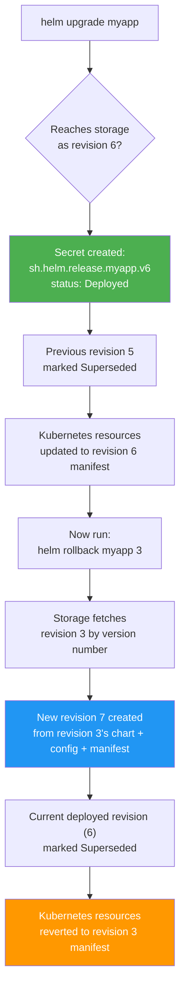
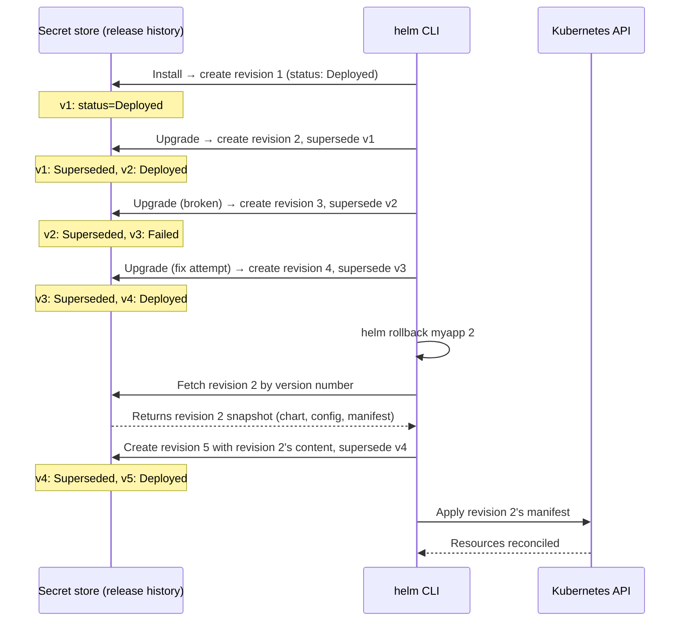

**TL;DR:** Does `helm rollback myapp 3` restore "the last known good state," or something more specific? It restores the exact manifest, chart, and config from revision 3 and nothing else — Helm's release history is an append-only ledger where every upgrade, rollback, and failed attempt gets its own numbered entry, and the CLI reads that entry by version number, not by a heuristic about what succeeded.
> **In plain English (30 sec):** Think of this like concepts you already use, but in a production system at scale.


## 1. The Engineering Problem

A Helm-managed release accumulates changes over time — `helm upgrade` bumps the chart, merges new values, re-renders templates, and applies the diff to the cluster. After several upgrades, something breaks: a bad values merge, a chart regression, a template misrender. The natural reaction is "roll it back," but what does that actually mean?

The naive mental model is "restore the last known good version." But Helm doesn't track a binary "good/bad" flag per revision. Every state change — every upgrade, every rollback, every failed attempt — writes a new entry to the release history. Revision 1 is the initial install, revision 2 is the first upgrade, revision 3 might be a failed upgrade that got superseded, revision 4 is the rollback that actually deployed. There's no single "good one" — there's a numbered ledger, and `helm rollback` reads from it by number.

If you don't understand this, you'll run `helm rollback myapp` (omitting the revision number) expecting it to pick the last successful state, and instead get whatever `currentVersion - 1` happens to be — which might be the broken upgrade you're trying to escape, marked `Superseded` rather than `Failed` because it did technically complete before the next one started.

## 2. The Technical Solution

Helm stores release history as a sequence of **revisions**, each one a complete snapshot of the release at a point in time. The storage backend (Kubernetes Secrets by default) holds one Secret per revision, labeled with `owner: helm`, `name: <release>`, and `version: <revision>`. Every mutation — install, upgrade, rollback, even a failed upgrade — creates or updates exactly one Secret with a new revision number.

The core rules:

- **Revisions are monotonically incrementing integers.** An upgrade to revision 5 always produces revision 6, regardless of whether revision 5 succeeded, failed, or was itself a rollback.
- **Status transitions are recorded, not cleaned up.** A failed upgrade doesn't get deleted — it gets marked `Failed` and a new entry (the rollback) is appended. A successful upgrade doesn't overwrite the previous one — the previous entry is marked `Superseded` and a new `Deployed` entry is created.
- **`helm rollback` reads by version number, not by status.** It fetches revision N from the store, copies that revision's chart, config, and manifest into a *new* revision (N+1 of the current), and applies that manifest to the cluster.



Two core truths this diagram shows:

- **Every rollback is itself a new upgrade — it creates a new revision.** `helm rollback myapp 3` when the current revision is 6 produces revision 7, not a rewind of revision 6. The history ledger grows, never shrinks (until `MaxHistory` pruning kicks in).
- **The rollback reads revision 3's snapshot literally.** It copies revision 3's chart reference, values config, and rendered manifest into the new revision. There's no re-rendering, no diffing against current state — the rollback replays a frozen snapshot.

The second diagram shows the state machine a release object transitions through during this sequence:



What this reveals that the "restore last good version" mental model misses:

- **Revision 3 was `Failed`, but it was still stored.** Helm doesn't delete failed releases — they sit in history and can be inspected with `helm history`. A failed release is a real entry, not an error to be cleaned away.
- **The "last good version" (revision 2) had to be fetched by number.** There's no `helm rollback myapp --last-good` flag. You either specify the number, or you get `currentVersion - 1` as a default, which in this case would be revision 4 (the "fix attempt" that is itself now superseded by the rollback).
- **Revision 5 carries revision 2's content, not a pointer to revision 2.** The snapshot is copied, not referenced. Even if revision 2 were later pruned by `MaxHistory`, revision 5 would still contain its full manifest.

## 3. The clean example (concept in isolation)

```go
// Minimal example: installing, upgrading, then rolling back a release.
// Shows the version-number mechanics, not the full Helm SDK surface.

package main

import (
    "fmt"
    "helm.sh/helm/v3/pkg/action"
    "helm.sh/helm/v3/pkg/release"
)

func upgradeRelease(cfg *action.Configuration, name string) error {
    up := action.NewUpgrade(cfg)
    up.Version = 0  // auto-increment

    // Run produces a new revision; lastRelease.Version + 1 becomes the new Version
    res, err := up.Run(name, myChart, myValues)
    if err != nil {
        return err
    }
    fmt.Printf("Upgraded to revision %d (status: %s)\n", res.Version, res.Info.Status)
    return nil
}

func rollbackRelease(cfg *action.Configuration, name string, targetRevision int) error {
    rb := action.NewRollback(cfg)
    rb.Version = targetRevision  // the exact revision number to restore

    // This creates a NEW revision whose content is copied from targetRevision
    return rb.Run(name)
}

// After: install → rev 1, upgrade → rev 2, upgrade (fail) → rev 3,
//        upgrade (fix) → rev 4, rollback to 2 → rev 5
// helm history myapp shows all 5 entries with their statuses.
```

The key insight: `rb.Version = targetRevision` is a raw integer, not a "last known good" query. The rollback action fetches that exact revision from the store and copies it into a new one.

## 4. Production reality (from the real repo)

```
helm/helm/pkg/
├── action/
│   ├── upgrade.go     — prepareUpgrade(), performUpgrade(), failRelease()
│   └── rollback.go    — prepareRollback(), performRollback()
└── storage/driver/
    └── secrets.go     — Create(), Update(), Get(), List() — the Secret-based release store
```

### How upgrades increment the revision number

In `upgrade.go`, `prepareUpgrade()` computes the new revision by reading the last release's version and adding one — a plain integer increment with no conditional logic:

```go
// Increment revision count. This is passed to templates, and also stored on
// the release object.
revision := lastRelease.Version + 1

options := common.ReleaseOptions{
    Name:      name,
    Namespace: currentRelease.Namespace,
    Revision:  revision,
    IsUpgrade: true,
}
```

The `upgradedRelease` struct is then built with this revision, and its initial status is `PendingUpgrade` — not `Deployed` yet. Only after `performUpgrade()` successfully applies all resources does the status flip:

```go
upgradedRelease := &release.Release{
    Name:      name,
    Namespace: currentRelease.Namespace,
    Chart:     chart,
    Config:    vals,
    Info: &release.Info{
        FirstDeployed: currentRelease.Info.FirstDeployed,
        LastDeployed:  Timestamper(),
        Status:        rcommon.StatusPendingUpgrade,
        Description:   "Preparing upgrade",
    },
    Version:     revision,
    Manifest:    manifestDoc.String(),
    // ...
}
```

### How rollback reads by version number

In `rollback.go`, `prepareRollback()` resolves the target revision — if `r.Version == 0`, it defaults to `currentRelease.Version - 1`; otherwise it uses the exact number provided. It then fetches that revision from the history:

```go
previousVersion := r.Version
if r.Version == 0 {
    previousVersion = currentRelease.Version - 1
}

historyReleases, err := r.cfg.Releases.History(name)
// ...verify previousVersion exists in history...

previousReleasei, err := r.cfg.Releases.Get(name, previousVersion)
previousRelease, err := releaserToV1Release(previousReleasei)
```

The target release is built by copying the previous release's snapshot literally — chart, config, manifest, hooks — and assigning a new version number:

```go
targetRelease := &release.Release{
    Name:      name,
    Namespace: currentRelease.Namespace,
    Chart:     previousRelease.Chart,
    Config:    previousRelease.Config,
    Info: &release.Info{
        FirstDeployed:    currentRelease.Info.FirstDeployed,
        LastDeployed:     time.Now(),
        Status:           common.StatusPendingRollback,
        Notes:            previousRelease.Info.Notes,
        RollbackRevision: previousVersion,
        Description:      fmt.Sprintf("Rollback to %d", previousVersion),
    },
    Version:  currentRelease.Version + 1,
    Manifest: previousRelease.Manifest,
    Hooks:    previousRelease.Hooks,
}
```

### How `RollbackOnFailure` works inside upgrades

When `RollbackOnFailure` is set on an `Upgrade` action, the `failRelease()` method in `upgrade.go` doesn't just mark the release as `Failed` — it searches the full history for the most recent `Superseded` or `Deployed` entry (i.e., the last release that actually succeeded) and triggers a rollback to that specific revision:

```go
filteredHistory := releaseutil.FilterFunc(func(r *release.Release) bool {
    return r.Info.Status == rcommon.StatusSuperseded ||
           r.Info.Status == rcommon.StatusDeployed
}).Filter(fullHistoryV1)

releaseutil.Reverse(filteredHistory, releaseutil.SortByRevision)

rollin := NewRollback(u.cfg)
rollin.Version = filteredHistory[0].Version
// ...copy wait/hook/force settings from the upgrade...
if rollErr := rollin.Run(rel.Name); rollErr != nil {
    return rel, fmt.Errorf("an error occurred while rolling back...")
}
```

### How the release store persists revisions as Kubernetes Secrets

In `secrets.go`, each release revision is stored as a Kubernetes Secret with type `helm.sh/release.v1`. The Secret's name is the release name, and labels encode the version number, status, and owner:

```go
func newSecretsObject(key string, rls *rspb.Release, lbs labels) (*v1.Secret, error) {
    const owner = "helm"

    s, err := encodeRelease(rls)
    if err != nil {
        return nil, err
    }

    lbs.set("name", rls.Name)
    lbs.set("owner", owner)
    lbs.set("status", rls.Info.Status.String())
    lbs.set("version", strconv.Itoa(rls.Version))

    return &v1.Secret{
        ObjectMeta: metav1.ObjectMeta{
            Name:   key,
            Labels: lbs.toMap(),
        },
        Type: "helm.sh/release.v1",
        Data: map[string][]byte{"release": []byte(s)},
    }, nil
}
```

The `List()` method fetches all secrets with `owner: helm`, decodes each one, and returns them — this is how `helm history` reconstructs the full revision ledger.

What this teaches that a hello-world can't:

- **The revision number is a plain `int` in the release struct, not an auto-generated UUID or hash.** This is why `helm rollback myapp 3` works as a lookup key — it's a direct index into the Secret store, not a content-addressed reference.
- **`newSecretsObject` sets both `createdAt` and `modifiedAt` labels on the Secret.** `createdAt` is set on `Create()`, `modifiedAt` on `Update()` — so you can distinguish "this release was created at time X" from "this release's status was last changed at time Y" by inspecting the Secret's labels directly.
- **The `RollbackRevision` field in `Info` records which revision was rolled back *to*, not which revision *performed* the rollback.** A rollback to revision 2 creates revision 5 with `RollbackRevision: 2` — the field is a breadcrumb back to the source, not a record of the operation itself.
- **`FailRelease`'s `RollbackOnFailure` path searches for `Superseded || Deployed` entries, not just `Deployed`.** This means a release that was itself a rollback (marked `Deployed`) can serve as the rollback target for a subsequent failed upgrade — the chain isn't limited to "original installs only."

## 5. Review checklist

- **Does `helm rollback myapp` (no revision number) actually restore what you think it does?** It defaults to `currentVersion - 1`, which might be the broken upgrade you're trying to escape if that upgrade was marked `Superseded` rather than `Failed`. Always pass an explicit revision number when the intent is to restore a known-good state, and use `helm history myapp` first to confirm which revision number corresponds to the state you want.
- **Is `MaxHistory` set on your Helm storage configuration?** The release history grows without bound until `MaxHistory` pruning kicks in during the next upgrade. If you're relying on rolling back to an old revision during an incident, verify that the revision you need hasn't already been pruned — once deleted by `MaxHistory`, it's gone from the Secret store.
- **When using `RollbackOnFailure` in CI/CD, does the filtered history actually contain a `Superseded` or `Deployed` entry?** If every previous release in the history is `Failed` (e.g., a brand-new release where the first upgrade failed), `RollbackOnFailure` will fail with "unable to find a previously successful release" — it can't roll back to a state that never existed.
- **Are your release labels (`owner: helm`, `name: <release>`, `version: <N>`) intact on the Secrets?** The `List()` and `Query()` methods in `secrets.go` filter by these labels — if someone manually edits or removes them (e.g. during a cluster migration), Helm loses visibility into the release history for that release.

## 6. FAQ

**Q: If I run `helm rollback myapp 3` when the current revision is 7, what happens to revisions 4, 5, and 6?**
A: Nothing — they remain in the Secret store unchanged. Revision 7 gets marked `Superseded` and a new revision 8 is created containing revision 3's snapshot. The old entries are only pruned if `MaxHistory` is set and the total count exceeds it, in which case the *oldest* revisions are deleted, not the ones between the rollback source and current.

**Q: Can `helm rollback` re-render the chart from the original template, or does it use the stored manifest directly?**
A: It uses the stored manifest directly — `prepareRollback()` copies `previousRelease.Manifest` (the already-rendered YAML) into the new release without re-rendering. This means a rollback restores the exact Kubernetes objects that existed at revision N, including any template rendering quirks or values that were current at that time.

**Q: What's the difference between `Superseded` and `Failed` in the release history?**
A: `Superseded` means a later release was successfully created on top of this one — the release was live at some point but has been replaced. `Failed` means the release's apply step encountered an error (pre-upgrade hooks failed, resources couldn't be built, etc.) and it was never the active `Deployed` release. Both are historical entries; `Superseded` indicates a release that was once live, `Failed` indicates one that never was.

**Q: How does `helm history` reconstruct the list from Kubernetes Secrets?**
A: `hist.Run(name)` calls `Releases.History(name)`, which calls `driver.Secrets.List()` with a filter for `owner: helm` and `name: <release>`. The driver lists all Secrets matching those labels, base64-decodes and decompresses each one's `release` data field, and returns them as release objects. The CLI then sorts by version number for display.

**Q: Does `helm rollback` work if the target revision's chart is no longer in the local cache?**
A: Yes — the rollback doesn't re-render from the chart, it applies the stored manifest directly. The chart reference is copied into the new release for metadata purposes, but the actual Kubernetes objects applied to the cluster come from `previousRelease.Manifest`, not from re-processing `previousRelease.Chart`.

---

## Source

- **Concept:** Release history, revision tracking, and rollback mechanics in Helm
- **Domain:** gitops
- **Repo:** [helm/helm](https://github.com/helm/helm) → [`pkg/action/upgrade.go`](https://github.com/helm/helm/blob/main/pkg/action/upgrade.go) — upgrade flow with revision incrementing and `RollbackOnFailure`; [`pkg/action/rollback.go`](https://github.com/helm/helm/blob/main/pkg/action/rollback.go) — rollback flow reading by version number; [`pkg/storage/driver/secrets.go`](https://github.com/helm/helm/blob/main/pkg/storage/driver/secrets.go) — Secret-based release storage backend


