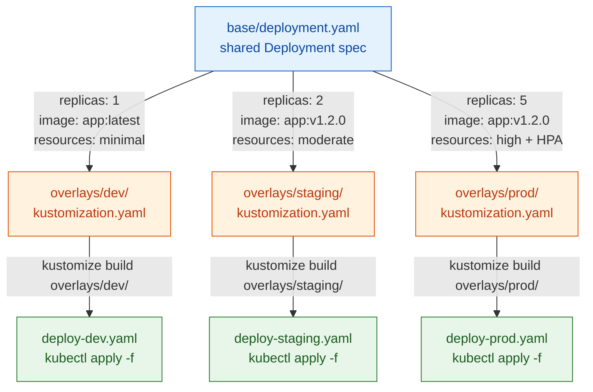
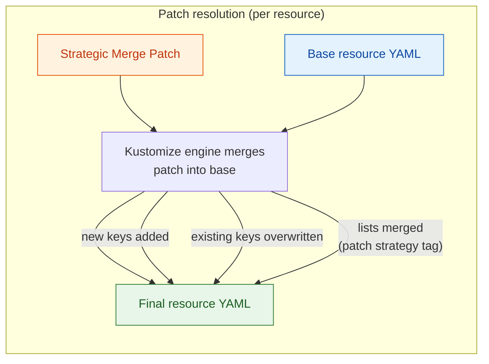

**TL;DR:** Why do Kustomize overlays produce cleaner environment diffs than Helm template conditionals? Because Kustomize treats the base manifest as immutable YAML and applies strategic merge patches on top — no Go template syntax, no `{{ if .Values.env }}` sprawl — so the diff between `dev` and `prod` is a small patch file instead of a whole re-rendered manifest.

**Real repo:** [`kubernetes-sigs/kustomize`](https://github.com/kubernetes-sigs/kustomize)

## 1. The Engineering Problem: templating an entire manifest tree to change three values

Helm's approach to multi-environment config is to re-render the *entire* template tree with different `values.yaml` inputs. This works when environments differ by a handful of scalars — but in practice, environments diverge in subtler ways: dev gets a `ConfigMap` that prod does not, staging adds an extra container to a `Deployment` spec, production hardens `securityContext` fields while dev leaves them permissive. Each divergence pushes you toward more `{{ if }}` / `{{ else }}` blocks inside the template, turning what should be a three-line patch into a conditional labyrinth that is hard to read, hard to diff, and hard to trust during review.

The core issue: **templates are not diffs.** A Helm template describes the *complete* desired state for every environment simultaneously, with runtime conditionals selecting which branches to render. A merge patch describes only the *difference* between a known base and the desired overlay. When your goal is "same deployment, different resource limits and an extra sidecar," a patch is the naturally aligned abstraction — and a template is an encoding mismatch.

---

## 2. The Technical Solution: overlays as a directed graph of patches over a shared base

Kustomize models the problem as a directed acyclic graph (DAG) of overlays, each applying patches and resource generators on top of a base. The base is plain, unparameterized YAML — no template syntax, no values file. Each overlay declares only the *diffs* it needs.



The critical design property: **each overlay file is tiny because it only describes what changes.** A prod overlay that tightens resource limits, adds an `HPA`, and injects a sidecar does not re-specify the base container ports, labels, or service definition — those flow through unchanged.

When the base changes (a new label, a rotated `ConfigMap` key), every overlay inherits it automatically. No template re-render, no `values.yaml` merge conflict. The overlay's patch is still "base + my diff."



Kustomize's `PatchTransformerPlugin` (from `api/internal/builtins/PatchTransformer.go`) enforces a key invariant: **a single patch entry must parse as *either* a strategic merge patch *or* a JSON 6902 patch, never both ambiguously.** If a patch byte slice qualifies as both, the engine rejects it:

```go
// api/internal/builtins/PatchTransformer.go
patchesSM, errSM := h.ResmapFactory().RF().SliceFromBytes([]byte(p.patchText))
patchesJson, errJson := jsonPatchFromBytes([]byte(p.patchText))

if ((errSM == nil && errJson == nil) ||
    (patchesSM != nil && patchesJson != nil)) &&
    (len(patchesSM) > 0 && len(patchesJson) > 0) {
    return fmt.Errorf(
        "illegally qualifies as both an SM and JSON patch: %s",
        p.patchSource)
}
```

This is not a style preference — it prevents a silently wrong merge when a YAML document could be interpreted as either patch format. The engine forces an unambiguous choice at authoring time.

---

## 3. The Clean Example (concept in isolation)

A base `Deployment` — plain YAML, zero template syntax:

```yaml
# base/deployment.yaml
apiVersion: apps/v1
kind: Deployment
metadata:
  name: web-app
  labels:
    app: web-app
spec:
  replicas: 2
  selector:
    matchLabels:
      app: web-app
  template:
    metadata:
      labels:
        app: web-app
    spec:
      containers:
        - name: app
          image: my-org/web-app:latest
          ports:
            - containerPort: 8080
          resources:
            requests:
              cpu: 100m
              memory: 128Mi
            limits:
              cpu: 250m
              memory: 256Mi
```

A production overlay that tightens resources and adds an HPA — note: it does not repeat labels, ports, or selector:

```yaml
# overlays/prod/kustomization.yaml
apiVersion: kustomize.config.k8s.io/v1beta1
kind: Kustomization
resources:
  - ../../base
patches:
  - path: deployment-patch.yaml
  - path: hpa.yaml
```

```yaml
# overlays/prod/deployment-patch.yaml
apiVersion: apps/v1
kind: Deployment
metadata:
  name: web-app
spec:
  replicas: 5
  template:
    spec:
      containers:
        - name: app
          resources:
            requests:
              cpu: 500m
              memory: 512Mi
            limits:
              cpu: "1"
              memory: 1Gi
```

```yaml
# overlays/prod/hpa.yaml
apiVersion: autoscaling/v2
kind: HorizontalPodAutoscaler
metadata:
  name: web-app
spec:
  scaleTargetRef:
    apiVersion: apps/v1
    kind: Deployment
    name: web-app
  minReplicas: 5
  maxReplicas: 20
  metrics:
    - type: Resource
      resource:
        name: cpu
        target:
          type: Utilization
          averageUtilization: 70
```

The dev overlay is the same structure, but with a different resource patch and an extra environment variable:

```yaml
# overlays/dev/kustomization.yaml
apiVersion: kustomize.config.k8s.io/v1beta1
kind: Kustomization
resources:
  - ../../base
patches:
  - path: deployment-patch.yaml
```

```yaml
# overlays/dev/deployment-patch.yaml
apiVersion: apps/v1
kind: Deployment
metadata:
  name: web-app
spec:
  replicas: 1
  template:
    spec:
      containers:
        - name: app
          env:
            - name: LOG_LEVEL
              value: debug
          resources:
            requests:
              cpu: 50m
              memory: 64Mi
            limits:
              cpu: 100m
              memory: 128Mi
```

Compare this to the Helm equivalent: a single `deployment.yaml` template with `{{ if eq .Values.env "prod" }}replicas: 5{{ else }}replicas: 1{{ end }}`, `{{ .Values.resources }}`, and so on. The Kustomize version has no conditionals because there is nothing to condition on — each overlay is its own complete, declarative patch set. The `git diff` between `overlays/dev/` and `overlays/prod/` shows exactly what differs, not a template that obscures the answer.

---

## 4. Production Reality (from `kubernetes-sigs/kustomize`)

The `Kustomizer.Run` method in `api/krusty/kustomizer.go` is the entry point — it loads a kustomization.yaml, walks the DAG of bases and overlays, applies transformers (patches, labels, namespacing), and returns a `ResMap` of final resources. Note the explicit sort-order pass: Kustomize *deliberately* controls resource output order (Namespaces before Deployments, etc.) so `kubectl apply` processes dependencies correctly.

```go
// api/krusty/kustomizer.go
func (b *Kustomizer) Run(
	fSys filesys.FileSystem, path string) (resmap.ResMap, error) {
	resmapFactory := resmap.NewFactory(b.depProvider.GetResourceFactory())
	lr := fLdr.RestrictionNone
	if b.options.LoadRestrictions == types.LoadRestrictionsRootOnly {
		lr = fLdr.RestrictionRootOnly
	}
	ldr, err := fLdr.NewLoader(lr, path, fSys)
	if err != nil {
		return nil, err
	}
	defer ldr.Cleanup()
	kt := target.NewKustTarget(
		ldr,
		b.depProvider.GetFieldValidator(),
		resmapFactory,
		pLdr.NewLoader(b.options.PluginConfig, resmapFactory, filesys.MakeFsOnDisk()),
	)
	err = kt.Load()
	if err != nil {
		return nil, err
	}
	var bytes []byte
	if openApiPath, exists := kt.Kustomization().OpenAPI["path"]; exists {
		bytes, err = ldr.Load(openApiPath)
		if err != nil {
			return nil, err
		}
	}
	err = openapi.SetSchema(kt.Kustomization().OpenAPI, bytes, true)
	if err != nil {
		return nil, err
	}
	var m resmap.ResMap
	m, err = kt.MakeCustomizedResMap()
	if err != nil {
		return nil, err
	}
	err = b.applySortOrder(m, kt)
	if err != nil {
		return nil, err
	}
	// ... label transformer, annotation cleanup omitted for brevity
	m.RemoveBuildAnnotations()
	return m, nil
}
```

What this reveals about the real architecture:

- **`target.NewKustTarget` constructs the entire overlay graph from a single root path** — it recursively loads every `resources:` reference, building a `ResMap` that represents all base and overlay inputs before any transformations run. Patches are not applied lazily; the full graph is resolved first, then transformed in order.
- **`openapi.SetSchema` is called *after* `kt.Load()` but *before* `MakeCustomizedResMap()`** — this means Kustomize uses OpenAPI schema validation to understand which fields are lists (merge strategy) vs. maps (replace strategy) during patch application. The strategic merge patch format depends on the schema to decide how to merge `containers:` (a list that merges by `name`) vs. `labels:` (a map that replaces by key). Without this step, patches would have no way to distinguish between the two.
- **`applySortOrder` is a separate, explicit pass after all transformations** — the build command's `--reorder` flag (deprecated in favor of the `sortOptions` field in `kustomization.yaml`) controls whether output resources follow legacy Kubernetes apply order or respect the depth-first input order. This is a production-critical detail: applying a `Deployment` before its `Namespace` exists causes a transient error in `kubectl apply -f -`. The sort order prevents that.

The `Kustomization` struct in `api/types/kustomization.go` reveals the full operator surface:

```go
// api/types/kustomization.go
type Kustomization struct {
	TypeMeta `json:",inline" yaml:",inline"`
	MetaData *ObjectMeta `json:"metadata,omitempty" yaml:"metadata,omitempty"`

	OpenAPI map[string]string `json:"openapi,omitempty" yaml:"openapi,omitempty"`
	NamePrefix string `json:"namePrefix,omitempty" yaml:"namePrefix,omitempty"`
	NameSuffix string `json:"nameSuffix,omitempty" yaml:"nameSuffix,omitempty"`
	Namespace  string `json:"namespace,omitempty" yaml:"namespace,omitempty"`

	Labels           []Label           `json:"labels,omitempty" yaml:"labels,omitempty"`
	CommonAnnotations map[string]string `json:"commonAnnotations,omitempty" yaml:"commonAnnotations,omitempty"`
	Patches          []Patch           `json:"patches,omitempty" yaml:"patches,omitempty"`
	Images           []Image           `json:"images,omitempty" yaml:"images,omitempty"`
	Replacements     []ReplacementField `json:"replacements,omitempty" yaml:"replacements,omitempty"`
	Replicas         []Replica         `json:"replicas,omitempty" yaml:"replicas,omitempty"`

	Resources   []string `json:"resources,omitempty" yaml:"resources,omitempty"`
	Components  []string `json:"components,omitempty" yaml:"components,omitempty"`
	Crds        []string `json:"crds,omitempty" yaml:"crds,omitempty"`

	ConfigMapGenerator []ConfigMapArgs `json:"configMapGenerator,omitempty" yaml:"configMapGenerator,omitempty"`
	SecretGenerator    []SecretArgs    `json:"secretGenerator,omitempty" yaml:"secretGenerator,omitempty"`
	HelmGlobals        *HelmGlobals    `json:"helmGlobals,omitempty" yaml:"helmGlobals,omitempty"`
	HelmCharts         []HelmChart     `json:"helmCharts,omitempty" yaml:"helmCharts,omitempty"`

	SortOptions    *SortOptions    `json:"sortOptions,omitempty" yaml:"sortOptions,omitempty"`
	GeneratorOptions *GeneratorOptions `json:"generatorOptions,omitempty" yaml:"generatorOptions,omitempty"`
	Configurations []string        `json:"configurations,omitempty" yaml:"configurations,omitempty"`
	BuildMetadata  []string        `json:"buildMetadata,omitempty" yaml:"buildMetadata,omitempty"`
}
```

Notable: **Kustomize itself supports `HelmCharts` and `HelmGlobals` as a first-class Kustomization field** — this is not "Kustomize vs. Helm" in an absolute sense. Kustomize can *inflate* Helm charts as part of its build, treating rendered chart output as input to its own patch pipeline. The architectural distinction is that Helm's `{{ }}` templates are resolved at `helm template` time (before Kustomize sees the YAML), while Kustomize's patches are resolved at `kustomize build` time (after the base YAML is already pure Kubernetes resources). You get Helm's chart ecosystem *and* Kustomize's diff-friendly overlay model in a single pipeline when you use the `helmCharts` field.

---

## 5. Review Checklist

- **Does the overlay only declare what differs from the base?** If your overlay repeats `selector.matchLabels` or `containerPort` from the base, the patch is too broad — strip it back to the delta.
- **Can you `kustomize build overlays/dev/ | kubectl diff -f -` cleanly?** The diff against live cluster state should show only the intentional changes. If you see unrelated resources, your overlay has implicit ordering dependencies.
- **Is the base free of `{{ }}` template syntax?** If the base itself contains Helm conditionals, you are mixing paradigms. Use the `helmCharts` field to inflate the chart first, then patch the output.
- **Does the overlay's `kustomization.yaml` list patches explicitly?** Inline patches (`patch: |`) are fine for small diffs; file patches (`path:`) are better for anything over five lines because they show cleanly in `git diff --stat`.
- **Are resource output orders correct?** Run `kustomize build` and verify `Namespace` appears before `Deployment`, `CRD` before `CustomResource`. If not, add a `sortOptions` field.

---

## FAQ

**Why not just use Helm values files instead of patches?**
Helm values files are parameter inputs to a template engine — they only work within the bounds of what the template author anticipated. If a template does not expose a `securityContext` knob, you cannot change it without forking the chart. Kustomize patches operate on the *rendered YAML directly*, so you can modify any field in any resource regardless of whether the upstream chart author thought to expose it.

**Can Kustomize and Helm coexist in the same pipeline?**
Yes. The `helmCharts` field in `kustomization.yaml` tells Kustomize to inflate a Helm chart at build time, then feed the rendered YAML into the patch pipeline. This gives you Helm's chart registry and packaging model with Kustomize's overlay model for environment differentiation.

**What happens when a base resource is deleted upstream?**
The overlay's `resources:` reference will fail at `kustomize build` time with a clear error. This is a hard failure, not a silent misconfiguration — which is exactly what you want in a GitOps pipeline.

**Is there a performance cost to the overlay DAG vs. Helm's flat values merge?**
For any realistic cluster (under a few thousand resources), no. Kustomize's `ResMap` is an in-memory graph; the transform passes are O(n) in resource count. The overhead is dominated by the YAML parse, not the patch application.

---

## Source

- **Concept:** Strategic merge patches and overlay-based environment configuration
- **Domain:** gitops
- **Repo:** [kubernetes-sigs/kustomize](https://github.com/kubernetes-sigs/kustomize) → [`kustomize/commands/build/build.go`](https://github.com/kubernetes-sigs/kustomize/blob/master/kustomize/commands/build/build.go) — the `kustomize build` CLI entry point that wires flags into the `Kustomizer` engine.
- **Repo:** [kubernetes-sigs/kustomize](https://github.com/kubernetes-sigs/kustomize) → [`api/krusty/kustomizer.go`](https://github.com/kubernetes-sigs/kustomize/blob/master/api/krusty/kustomizer.go) — the core `Kustomizer.Run` method that walks the overlay DAG, applies transformers, and produces the final `ResMap`.
- **Repo:** [kubernetes-sigs/kustomize](https://github.com/kubernetes-sigs/kustomize) → [`api/types/kustomization.go`](https://github.com/kubernetes-sigs/kustomize/blob/master/api/types/kustomization.go) — the `Kustomization` struct that defines the full operator surface including `HelmCharts`, `Patches`, and `SortOptions`.
- **Repo:** [kubernetes-sigs/kustomize](https://github.com/kubernetes-sigs/kustomize) → [`api/internal/builtins/PatchTransformer.go`](https://github.com/kubernetes-sigs/kustomize/blob/master/api/internal/builtins/PatchTransformer.go) — the `PatchTransformerPlugin` that enforces unambiguous patch format detection and applies strategic merge or JSON 6902 patches.


