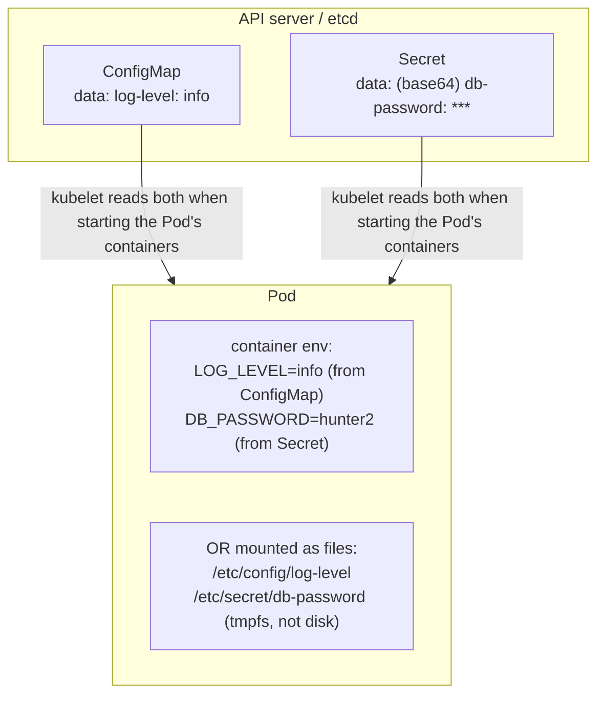
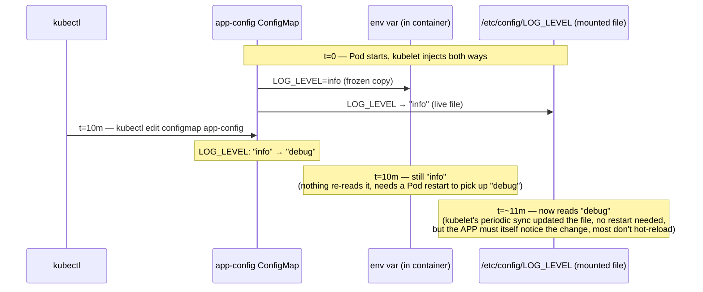

## 1. The Engineering Problem: config baked into the image

The obvious way to configure a container is to bake the config into the image at build time — an `ENV` line in the Dockerfile, a config file `COPY`'d into the layer, maybe a database password passed as a build arg.

Three things break immediately in a real deployment:

- **Every environment needs its own image.** Staging's database URL differs from prod's. If config lives in the image, you either rebuild per-environment (slow, and now your "tested" artifact isn't what ships) or template the Dockerfile (fragile).
- **A one-line config change forces a full rebuild + redeploy.** Rotating a feature flag or tweaking a timeout shouldn't require CI to rebuild and re-push a multi-hundred-MB image.
- **Credentials in an image are effectively public within your org.** Image layers are cached, pulled by anyone with registry access, and often pushed to shared CI caches. A password baked into a layer is a password baked into every place that image has ever been pulled — `docker history` will show it even if a later layer "removes" the file.

You need config and secrets to be **data**, injected into a container at *runtime*, independent of the image that was built.

---

## 2. The Technical Solution: ConfigMap and Secret

Kubernetes stores configuration as its own API objects — **ConfigMap** for ordinary config, **Secret** for sensitive data — separate from any Pod. The kubelet injects their contents into a container either as environment variables or as files, at Pod start.

**Macro view — where the kubelet injects each object:**



**Zoom in — the same ConfigMap edit, two different outcomes over time**
(this is the part a static diagram can't show: env injection and volume
mounts don't just differ in mechanism, they diverge in *when* a change
actually lands):



Three things to hold onto:

1. **A Secret is not encrypted by default — it's base64-*encoded*.** Verified against the current Kubernetes docs: unless the cluster admin configures `--encryption-provider-config` on the API server with a real provider (`aescbc`, `aesgcm`, `secretbox`), Secret data sits in etcd as plain base64, decodable by anyone with etcd access. "It's a Secret so it's encrypted" is a common and wrong assumption — the object type controls *handling conventions* (RBAC defaults, not printed in `kubectl get -o wide`, mounted via tmpfs), not encryption at rest.
2. **Env-var injection and volume-mount injection behave completely differently on update.** A value injected via `env.valueFrom.configMapKeyRef` is read **once**, at container start, and frozen — editing the ConfigMap does nothing to a running container until it's restarted. A value delivered via a **mounted volume**, by contrast, is kept in sync by the kubelet on its periodic sync interval — the file on disk *does* update, though your application still has to notice the file changed (most apps don't hot-reload config automatically).
3. **`immutable: true`** (added in Kubernetes v1.19) tells the API server this ConfigMap/Secret will never change again. It's a real production lever: the kubelet stops watching it for updates (less load on the API server at scale), and it protects against an accidental `kubectl edit` in prod. The common pairing is a name suffixed with a content hash (e.g. `app-config-a1b2c3`) plus a new Deployment rollout on every change — updating config becomes a deploy, not a live mutation.

---

## 3. The clean example (the concept in isolation)

```yaml
apiVersion: v1
kind: ConfigMap
metadata:
  name: app-config
immutable: true                # this version of the config never changes in place
data:
  LOG_LEVEL: "info"
  retry-policy.json: |
    { "maxAttempts": 3, "backoffMs": 200 }
---
apiVersion: v1
kind: Secret
metadata:
  name: app-db-credentials
type: Opaque
stringData:                    # stringData: write plaintext here; the API server
  DB_PASSWORD: "hunter2"       # base64-encodes it into .data on write — you never
                                # hand-encode a Secret in a real manifest.
---
apiVersion: apps/v1
kind: Deployment
metadata:
  name: report-generator
spec:
  replicas: 1
  selector:
    matchLabels: { app: report-generator }
  template:
    metadata:
      labels: { app: report-generator }
    spec:
      containers:
      - name: app
        image: mycompany/report-app:v1
        env:
        - name: LOG_LEVEL
          valueFrom:
            configMapKeyRef:  { name: app-config, key: LOG_LEVEL }   # frozen at start
        - name: DB_PASSWORD
          valueFrom:
            secretKeyRef:     { name: app-db-credentials, key: DB_PASSWORD }
        volumeMounts:
        - name: retry-policy
          mountPath: /etc/config           # kept in sync by the kubelet on change
      volumes:
      - name: retry-policy
        configMap:
          name: app-config
          items:
          - key: retry-policy.json
            path: retry-policy.json
```

Now the same two mechanisms as they're actually used to run Prometheus's stack.

---

## 4. Production reality (from the real repo)

`microservices-demo` — the repo used in the last two lessons — turns out to define **zero** ConfigMap or Secret objects anywhere in its manifests; every one of its 11 services takes its config purely from hardcoded env values. That's a real, notable fact about that repo, but it means it can't teach this concept. Rotating to `prometheus-operator/kube-prometheus`, which uses both heavily, gives a much better real example.

### 4a. A real Secret — Alertmanager's routing config

```yaml
apiVersion: v1
kind: Secret
metadata:
  labels:
    app.kubernetes.io/component: alert-router
    app.kubernetes.io/instance: main
    app.kubernetes.io/name: alertmanager
    app.kubernetes.io/part-of: kube-prometheus
    app.kubernetes.io/version: 0.33.1
  name: alertmanager-main        # naming convention, not a coincidence — see below
  namespace: monitoring
stringData:
  alertmanager.yaml: |-
    "global":
      "resolve_timeout": "5m"
    "inhibit_rules":
    - "equal": ["namespace", "alertname"]
      "source_matchers": ["severity = critical"]
      "target_matchers": ["severity =~ warning|info"]
    "receivers":
    - "name": "Default"
    - "name": "Watchdog"
    - "name": "Critical"
    - "name": "null"
    "route":
      "group_by": ["namespace"]
      "group_interval": "5m"
      "group_wait": "30s"
      "receiver": "Default"
      "repeat_interval": "12h"
      "routes":
      - "matchers": ["alertname = Watchdog"]
        "receiver": "Watchdog"
      - "matchers": ["severity = critical"]
        "receiver": "Critical"
type: Opaque
```

Nothing in this repo's YAML explicitly wires this Secret to Alertmanager — and that's the point worth naming. The `Alertmanager` custom resource here is named `main`, and the **prometheus-operator convention** (verified against its own docs) is: a Secret named `alertmanager-<name>` with a key literally called `alertmanager.yaml` is auto-discovered and mounted as that Alertmanager's config. Convention-over-configuration, enforced by the operator's own reconcile loop rather than an explicit reference in either object.

### 4b. A real ConfigMap — and how a Deployment actually consumes it

```yaml
apiVersion: v1
kind: ConfigMap
metadata:
  name: adapter-config
  namespace: monitoring
data:
  config.yaml: |-
    "resourceRules":
      "cpu":
        "containerLabel": "container"
        "containerQuery": |
          sum by (<<.GroupBy>>) (
            irate (
                container_cpu_usage_seconds_total{<<.LabelMatchers>>,container!="",pod!=""}[120s]
            )
          )
        "resources":
          "overrides":
            "namespace": { "resource": "namespace" }
            "pod":       { "resource": "pod" }
      "window": "5m"
```

Consumed here, in `prometheus-adapter`'s Deployment (probe/resource fields trimmed — covered in earlier lessons):

```yaml
        args:
        - --config=/etc/adapter/config.yaml   # <-- reads the mounted file, not an env var
        - --secure-port=6443
        volumeMounts:
        - mountPath: /etc/adapter
          name: config
      volumes:
      - configMap:
          name: adapter-config    # <-- this ConfigMap becomes a directory of files
        name: config
```

**What this teaches that a hello-world can't:**

- **`stringData` in a real Secret is genuinely legible.** This is the actual Alertmanager routing tree production Prometheus deploys run — not a redacted stand-in. It shows why Secrets are the wrong *and* right tool here simultaneously: this data isn't a password, but it's operational config the team doesn't want casually world-readable via `kubectl get configmap -o yaml`, so it goes in a Secret purely for that RBAC/visibility distinction, not for "encryption."
- **Cross-object wiring is sometimes a naming convention, not a field.** `alertmanager-main` isn't referenced by name anywhere in the `Alertmanager` CR — the prometheus-operator's own controller looks for that exact name pattern. Debugging "why isn't my config picked up" here means knowing the convention, not just reading the YAML in front of you.
- **`--config=/etc/adapter/config.yaml` is the volume-mount path, on purpose.** prometheus-adapter needs a full multi-hundred-line YAML document with Go template syntax inside it (`<<.GroupBy>>`) — that's structurally impossible to pass as a single environment variable. Large or structured config is the practical reason ConfigMaps support volume mounting at all, not just env injection.
- **The ConfigMap becomes a *directory*.** Mounting `adapter-config` at `/etc/adapter` doesn't create one file magically named after the ConfigMap — it creates `/etc/adapter/config.yaml`, one file per key in `data`. Multi-key ConfigMaps mount as multiple files automatically.

---

## Source

- **Concept:** Kubernetes `ConfigMap` and `Secret` — externalized configuration and credentials
- **Domain:** kubernetes
- **Repo:** [prometheus-operator/kube-prometheus](https://github.com/prometheus-operator/kube-prometheus) → [`manifests/alertmanager-secret.yaml`](https://github.com/prometheus-operator/kube-prometheus/blob/main/manifests/alertmanager-secret.yaml), [`manifests/prometheusAdapter-configMap.yaml`](https://github.com/prometheus-operator/kube-prometheus/blob/main/manifests/prometheusAdapter-configMap.yaml), [`manifests/prometheusAdapter-deployment.yaml`](https://github.com/prometheus-operator/kube-prometheus/blob/main/manifests/prometheusAdapter-deployment.yaml) — the production Prometheus + Alertmanager + Grafana monitoring stack (falling back from `microservices-demo`, which defines no ConfigMap/Secret objects at all)
