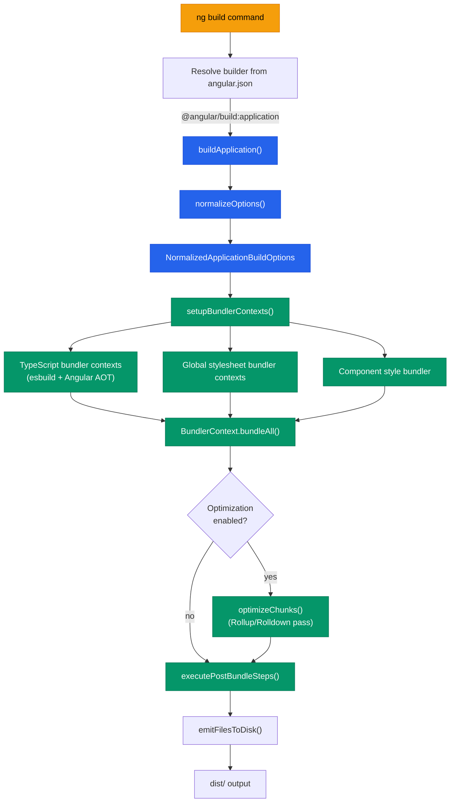
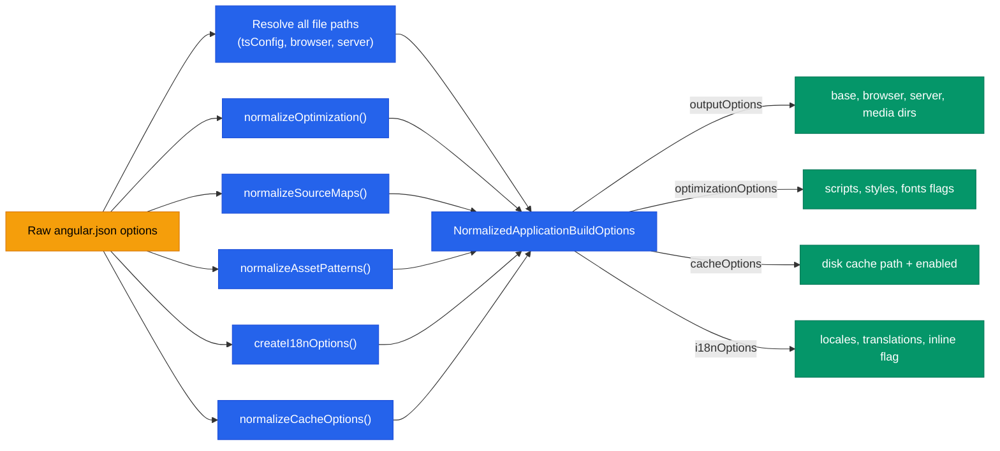

**TL;DR:** When you run `ng build`, you never touch webpack or esbuild directly — the Angular CLI maps your command to a builder registered in `angular.json`, which normalizes your raw options into a fully resolved build configuration, sets up bundler contexts for TypeScript compilation and global stylesheets, and orchestrates the entire pipeline through a chain of internal functions you never see. The builder is the invisible contract between your CLI command and the actual bundler.

## 1. The Engineering Problem

Every Angular application needs a build step. Your TypeScript, HTML templates, component styles, global stylesheets, polyfills, and assets all need to be compiled, bundled, tree-shaken, and emitted as a set of optimized JavaScript, CSS, and HTML files ready for deployment. This is a non-trivial pipeline with dozens of configurable knobs: AOT vs JIT compilation, source maps, output hashing, bundle budgets, SSR entry points, i18n translation inlining, service worker generation, and more.

The naive approach would require every Angular developer to configure webpack (or esbuild, or Rollup) from scratch — writing loaders for `.component.html` files, plugin chains for Angular's AOT compiler, configuration for code-splitting along lazy routes, and asset copy logic. This is hundreds of lines of build tooling configuration that has nothing to do with application logic. Worse, it would fragment the ecosystem: every project would have a subtly different build pipeline, making it nearly impossible for the Angular team to ship consistent performance optimizations or security fixes.

The core engineering problem is this: **how do you expose a powerful, configurable build system through a simple CLI command while keeping the underlying tooling completely abstracted away?**

Angular's answer is the **Architect builder system** — a plugin architecture where `angular.json` maps CLI commands to builder packages, each of which implements a standard interface. When you run `ng build`, the CLI does not run webpack. It resolves a builder, feeds it your options, and lets the builder handle everything else.

## 2. The Technical Solution

The builder system has three layers. First, the CLI resolves which builder to use by reading your project's `angular.json`. Second, the builder normalizes your raw options — resolving paths, merging defaults, validating constraints — into a single internal options object. Third, the builder executes the actual build by setting up esbuild bundler contexts, running the Angular AOT compiler, and emitting output files to disk.

The first diagram shows how `ng build` flows from the CLI through the builder resolution into the actual build pipeline:



The second diagram shows what happens inside `normalizeOptions()` — the function that turns your `angular.json` values into a fully resolved internal configuration object:



The key insight is that the builder does not just pass your options through — it **transforms** them. A string `"true"` for `optimization` becomes `{ scripts: true, styles: { minify: true, inlineCritical: true }, fonts: { inline: true } }`. A relative path like `"src/main.ts"` becomes an absolute path resolved against the workspace root. A missing `outputPath` becomes `dist/<projectName>/browser`. Every one of these normalizations happens inside the builder, invisible to the developer.

## 3. Clean Example

Here is a minimal `angular.json` that uses the application builder:

```json
{
  "$schema": "./node_modules/@angular/cli/lib/config/schema.json",
  "version": 1,
  "projects": {
    "my-app": {
      "projectType": "application",
      "root": "",
      "sourceRoot": "src",
      "prefix": "app",
      "architect": {
        "build": {
          "builder": "@angular/build:application",
          "options": {
            "outputPath": "dist/my-app",
            "index": "src/index.html",
            "browser": "src/main.ts",
            "tsConfig": "tsconfig.app.json",
            "assets": [
              { "glob": "**/*", "input": "public" }
            ],
            "styles": ["src/styles.css"],
            "scripts": []
          },
          "configurations": {
            "production": {
              "budgets": [
                { "type": "initial", "maximumWarning": "500kB", "maximumError": "1MB" }
              ],
              "outputHashing": "all"
            },
            "development": {
              "optimization": false,
              "extractLicenses": false,
              "sourceMap": true
            }
          },
          "defaultConfiguration": "production"
        }
      }
    }
  }
}
```

When you run `ng build --configuration=development`, the builder reads these options, calls `normalizeOptions()`, and produces a fully resolved configuration. The `"optimization": false` you specified becomes `{ scripts: false, styles: false, fonts: false }` — the builder expanded the boolean into the full optimization shape. The `"sourceMap": true` becomes `{ scripts: true, styles: true, hidden: false, vendor: false, sourcesContent: true }`. The path `"src/main.ts"` becomes an absolute path resolved against the workspace root. You never wrote any of these details; the builder's schema and normalizer filled them in.

## 4. Production Reality

The actual builder implementation in `@angular/build` reveals the full pipeline. Here is the entry point that the Architect system calls when you run `ng build`:

```typescript
// File: packages/angular/build/src/builders/application/index.ts

export async function* buildApplicationInternal(
  options: ApplicationBuilderInternalOptions,
  context: BuilderContext & { signal?: AbortSignal },
  extensions?: ApplicationBuilderExtensions,
): AsyncIterable<Result> {
  const { workspaceRoot, logger, target } = context;

  // Check Angular version.
  assertCompatibleAngularVersion(workspaceRoot);

  // Purge old build disk cache.
  await purgeStaleBuildCache(context);

  // Determine project name from builder context target
  const projectName = target?.project;
  if (!projectName) {
    context.logger.error(`The 'application' builder requires a target to be specified.`);
    yield { kind: ResultKind.Failure, errors: [] };
    return;
  }

  const normalizedOptions = await normalizeOptions(context, projectName, options, extensions);

  yield* runEsBuildBuildAction(
    async (rebuildState) => {
      const startTime = process.hrtime.bigint();
      const result = await executeBuild(normalizedOptions, context, rebuildState);

      const buildTime = Number(process.hrtime.bigint() - startTime) / 10 ** 9;
      const hasError = result.errors.length > 0;
      result.addLog(
        `Application bundle generation ${hasError ? 'failed' : 'complete'}.` +
          ` [${buildTime.toFixed(3)} seconds] - ${new Date().toISOString()}\n`,
      );

      return result;
    },
    { watch: normalizedOptions.watch, /* ... other options */ },
  );
}

const builder: Builder<ApplicationBuilderOptions> = createBuilder(buildApplication);
export default builder;
```

Notice the flow: the builder validates the Angular version, purges stale caches, normalizes all options, then delegates to `runEsBuildBuildAction()` which handles the watch loop, file watching, and incremental rebuilds. The `executeBuild()` function (called inside the action) does the actual esbuild bundling, AOT compilation, optimization, budget checking, and output emission.

Here is how `normalizeOptions()` resolves just the output path — showing the depth of transformation applied to a single option:

```typescript
// File: packages/angular/build/src/builders/application/options.ts

const outputPath = options.outputPath ?? path.join(workspaceRoot, 'dist', projectName);
const outputOptions: NormalizedOutputOptions = {
  browser: 'browser',
  server: 'server',
  media: 'media',
  ...(typeof outputPath === 'string' ? undefined : outputPath),
  base: normalizeDirectoryPath(
    path.resolve(workspaceRoot, typeof outputPath === 'string' ? outputPath : outputPath.base),
  ),
  clean: options.deleteOutputPath ?? true,
  ignoreServer:
    ((ssrOptions === undefined || serverEntryPoint === undefined) &&
      options.outputMode === undefined) ||
    options.outputMode === OutputMode.Static,
};
```

A plain string `"dist/my-app"` becomes `{ base: "/abs/path/dist/my-app/", browser: "browser", server: "server", media: "media", clean: true, ignoreServer: true }`. The `ignoreServer` flag is computed from whether SSR is enabled — something you might never think about, but the builder handles automatically.

And here is the `executeBuild()` function showing the actual bundling pipeline:

```typescript
// File: packages/angular/build/src/builders/application/execute-build.ts

export async function executeBuild(
  options: NormalizedApplicationBuildOptions,
  context: BuilderContext,
  rebuildState?: RebuildState,
): Promise<ExecutionResult> {
  const browsers = getSupportedBrowsers(projectRoot, context.logger);

  if (i18nOptions.shouldInline) {
    await loadActiveTranslations(context, i18nOptions);
  }

  // Reuse rebuild state or create new bundle contexts
  if (rebuildState) {
    bundlerContexts = rebuildState.rebuildContexts;
    componentStyleBundler = rebuildState.componentStyleBundler;
    codeBundleCache = rebuildState.codeBundleCache;

    const allFileChanges = rebuildState.fileChanges.all;
    bundlingResult = await BundlerContext.bundleAll(bundlerContexts.otherContexts, allFileChanges);
    // ... TypeScript context rebundling ...
  } else {
    const target = transformSupportedBrowsersToTargets(browsers);
    codeBundleCache = new SourceFileCache(cacheOptions.enabled ? cacheOptions.path : undefined);
    componentStyleBundler = createComponentStyleBundler(options, target);
    const angularCompilation = await createAngularCompilation(!!options.jit, !options.serverEntryPoint);
    bundlerContexts = setupBundlerContexts(options, target, codeBundleCache,
      componentStyleBundler, angularCompilation, templateUpdates);
    bundlingResult = await BundlerContext.bundleAll([
      ...bundlerContexts.typescriptContexts,
      ...bundlerContexts.otherContexts,
    ]);
  }

  // Optimize chunks if enabled and threshold is met
  if (options.optimizationOptions.scripts) {
    const lazyChunksCount = Object.keys(metafile.outputs).filter(
      (path) => path.endsWith('.js') && !initialFiles.has(path),
    ).length;

    if (!options.serverEntryPoint && lazyChunksCount >= optimizeChunksThreshold) {
      const { optimizeChunks } = await import('./chunk-optimizer');
      bundlingResult = await optimizeChunks(bundlingResult, sourcemapConfig);
    }
  }

  // ... budget checking, license extraction, asset copying, i18n inlining ...
  return executionResult;
}
```

On initial builds, the function creates fresh `BundlerContext` instances — one for TypeScript compilation (wired to the Angular AOT compiler), one for global stylesheets, and one for component styles. On incremental rebuilds (watch mode), it reuses the previous contexts and only re-bundles files that changed. The `SourceFileCache` persists TypeScript analysis across rebuilds, and the `optimizeChunks` pass (using Rollup/Rolldown) only runs when the number of lazy chunks exceeds a configured threshold — avoiding unnecessary overhead for small projects.

## 5. Review Checklist

- [ ] The builder is registered in `angular.json` under `architect.build.builder` — the string `@angular/build:application` maps to the `buildApplication` function exported from the builder's `index.ts`.
- [ ] `normalizeOptions()` transforms every raw option into a fully resolved internal form — paths become absolute, booleans become option objects, missing values get defaults.
- [ ] `executeBuild()` creates separate `BundlerContext` instances for TypeScript, global styles, and component styles — each context can be independently invalidated and re-bundled during incremental rebuilds.
- [ ] The `SourceFileCache` persists across rebuilds in watch mode, avoiding redundant TypeScript type-checking.
- [ ] Chunk optimization (Rollup/Rolldown) is gated behind a lazy-chunk threshold — small projects skip it entirely.
- [ ] Budget checking, license extraction, CommonJS warnings, and asset copying all happen after bundling inside the same `executeBuild()` function — they are post-bundle analysis steps, not bundler configuration.

## 6. FAQ

**Q: Why does `angular.json` have a `builder` field instead of just listing webpack plugins?**
A: The builder is a higher-level abstraction. It encapsulates the entire build tool (webpack in older versions, esbuild now) plus Angular-specific compilation steps, asset handling, optimization, and output management. Changing the underlying tool (as Angular did from webpack to esbuild) requires zero changes to your `angular.json` — only the builder package changes.

**Q: Can I write my own custom builder?**
A: Yes. Implement a function matching the `Builder` interface from `@angular-devkit/architect`, register it in `angular.json` with a `builder` path pointing to your package, and Architect will call it the same way it calls the built-in builders. However, for most applications the built-in `@angular/build:application` builder covers all use cases.

**Q: What is the difference between `@angular/build` and `@angular-devkit/build-angular`?**
A: `@angular/build` contains the esbuild-based build system (the `application` builder) introduced as stable in Angular v17. `@angular-devkit/build-angular` contains the legacy webpack-based builders and also provides compatibility aliases for the newer esbuild builders. New projects use `@angular/build` directly.

**Q: Why does the builder check `assertCompatibleAngularVersion()` before doing anything?**
A: The builder is tightly coupled to the Angular compiler version. Running a builder from Angular v19 against an Angular v17 project (or vice versa) would produce silent compilation errors or incorrect output. The version check is a hard guard against mismatched toolchain versions.

**Q: What happens to my options during `normalizeOptions()` that I should know about?**
A: The most impactful transformations: relative paths become absolute (resolved against workspace root), `optimization: true` expands to `{ scripts: true, styles: { minify: true, inlineCritical: true }, fonts: { inline: true } }`, missing `outputPath` defaults to `dist/<projectName>/browser`, and the `aot` flag controls whether the Angular compiler runs in AOT or JIT mode (defaulting to `true`). Understanding these transformations helps when debugging unexpected build behavior.

## Source

This post is based on the source code of the Angular CLI and build system:

- [`packages/angular/build/src/builders/application/index.ts`](https://github.com/angular/angular-cli/blob/main/packages/angular/build/src/builders/application/index.ts) — Builder entry point, `buildApplication()` and `buildApplicationInternal()` functions, and the `createBuilder()` export that Architect calls.
- [`packages/angular/build/src/builders/application/options.ts`](https://github.com/angular/angular-cli/blob/main/packages/angular/build/src/builders/application/options.ts) — `normalizeOptions()` function that transforms raw `angular.json` values into `NormalizedApplicationBuildOptions`.
- [`packages/angular/build/src/builders/application/execute-build.ts`](https://github.com/angular/angular-cli/blob/main/packages/angular/build/src/builders/application/execute-build.ts) — `executeBuild()` function containing the esbuild bundling pipeline, chunk optimization, budget checking, and output emission.
- [`packages/angular/build/src/builders/application/build-action.ts`](https://github.com/angular/angular-cli/blob/main/packages/angular/build/src/builders/application/build-action.ts) — `runEsBuildBuildAction()` handling the watch loop, file watching, and incremental rebuild state management.
- [`packages/angular/build/src/builders/application/schema.json`](https://github.com/angular/angular-cli/blob/main/packages/angular/build/src/builders/application/schema.json) — JSON Schema defining all builder options and their types, defaults, and validation constraints.


